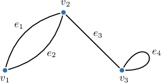
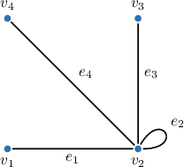
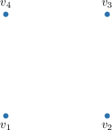
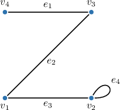
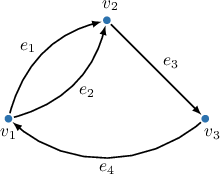
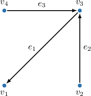

# Incidence Matrices

Source: https://www.mathacademy.com/topics/1673?courseId=109
Topic ID: 1673

## Prerequisites

- [The Degree of a Vertex](./954-the-degree-of-a-vertex.md)
- [Index Notation for Matrices](../../../high-school/integrated-math-honors/lessons/integrated-math-iii-honors/1167-index-notation-for-matrices.md)

## Lesson

### Introduction

In a simple undirected graph $G=(V,E)$ with $m$ vertices $v_1, v_2, \ldots, v_m$ and $n$ edges $e_1, e_2, \ldots, e_n,$ the **incidence matrix** $B$ is an $m \times n$ matrix (table), where the entry at the intersection of the $i$th row and the $j$th column equals:

- $1,$ if the vertex $v_i$ is incident to the edge $e_j;$

- $0,$ otherwise.

In multigraphs, each loop contributes $2$ to the corresponding entry since the edge is incident to the vertex twice.

As we know, graphs can be represented graphically in various equally valid ways. In contrast, once we have fixed orderings of the vertices and of the edges, the incidence matrix of a graph is unique.

Consider the graph below.

Let's examine the vertices $v_1,v_2,$ and $v_3$ of the graph to determine the entries of the incidence matrix.

- The vertex $v_1$ is incident to the edges $e_1$ and $e_2.$ Hence, we write $1$ in the $1$st and $2$nd columns of the $1$st row, and $0$ in the other columns.

- The vertex $v_2$ is incident to the edges $e_1, e_2,$ and $e_3.$ Hence, we write $1$ in the $1$st, $2$nd, and $3$rd columns of the $2$nd row, and $0$ in the $4$th column.

- The vertex $v_3$ is incident to the edge $e_3$ and also to the loop formed by $e_4.$ Hence, we write $1$ in the $3$rd column of the $3$rd row, $2$ in the $4$th column to indicate the loop, and $0$ in the other columns.

The incidence matrix is completed. Using regular matrix notation, we can write it as follows:

$$

\begin{aligned}1 & 1 & 0 & 0 \\ 1 & 1 & 1 & 0 \\ 0 & 0 & 1 & 2\end{aligned}

$$

Notice that in the incidence matrix of an undirected graph, the sum of each column is always equal to $2,$ and the sum of each row is always equal to the degree of the corresponding vertex.

### Example: Building the Incidence Matrix of a Graph

#### Question

Fill in the missing values in the incidence matrix of the above graph:

#### Explanation

Given fixed orders of vertices $v_1, v_2, \ldots, v_m$ and edges $e_1, e_2, \ldots, e_n$ in an undirected graph, the ** of the graph is a $m \times n$-matrix (table), where the entry at the intersection of the $i$th row and the $j$th column.

- equals $1,$ if the vertex $v_i$ is incident on $e_j,$ and

- equals $0,$ otherwise.

In multigraphs, each loop contributes $2$ to the corresponding entry since the edge is incident to the vertex twice.

Let's examine the edges of our graph.

- The edge $e_1$ is incident on vertices $v_1$ to $v_2.$ So, we write $1$ in the $1$st and $2$nd rows of $e_1$-column.

- The edge $e_2$ is a loop, it is incident on vertex $v_2$ only. So, we write $2$ in the $2$nd row of $e_2$-column.

- The edge $e_3$ is incident on vertices $v_2$ to $v_3.$ So, we write $1$ in the $2$nd and $3$rd rows of $e_3$-column.

- The edge $e_4$ is incident on vertices $v_2$ to $v_4.$ So, we write $1$ in the $2$nd and $4$th rows of $e_4$-column.

All the other cells in the matrix must be filled with zeros. Therefore, we have the following incidence matrix:

### Example: Identifying a Graph Given Its Incidence Matrix

#### Question

$$

\begin{aligned}0 & 1 & 1 & 0 \\ 0 & 0 & 1 & 2 \\ 1 & 1 & 0 & 0 \\ 1 & 0 & 0 & 0\end{aligned}

$$

The graph with vertices $v_1,$ $v_2,$ $v_3,v_4$ and edges $e_1,$ $e_2,$ $e_3,$ has the incidence matrix $B,$ shown above. Draw the graph with the given incidence matrix.

#### Explanation

Given fixed orders of vertices $v_1, v_2, \ldots, v_m$ and edges $e_1, e_2, \ldots, e_n$ in an undirected graph, the ** of the graph is a $m \times n$-matrix (table), where the entry at the intersection of the $i$th row and the $j$th column.

- equals $1,$ if the vertex $v_i$ is incident on $e_j,$ and

- equals $0,$ otherwise.

In multigraphs, each loop contributes $2$ to the corresponding entry since the edge is incident to the vertex twice.

First, we draw our vertices on the plane using the positions provided in the multiple-choice options.

Now, let's examine the incidence matrix column by column.

- In the $1$st column corresponding the edge $e_1,$ we have $1$'s in the $3$rd row and the $4$th row. This means that the edge $e_1$ is incident on vertices $v_3$ and $v_4,$ i.e., the edge $e_1$ connects $v_3$ and $v_4.$

- In the $2$nd column corresponding the edge $e_2,$ we have $1$'s in the $1$st row and the $3$rd row. This means that the edge $e_2$ is incident on vertices $v_1$ and $v_3,$ i.e., the edge $e_3$ connects $v_1$ and $v_3.$

- In the $3$rd column corresponding the edge $e_3,$ we have $1$'s in the $1$st row and the $2$nd row. This means that the edge $e_3$ is incident on vertices $v_1$ and $v_2,$ i.e., the edge $e_3$ connects $v_1$ and $v_2.$

- In the $4$th column corresponding the edge $e_4,$ we have $2.$ This means that the edge $e_4$ is a loop in $v_2.$

The resulting graph is shown below.

### Incidence Matrices of Directed Graphs

In a simple directed graph $G=(V,E)$ with $m$ vertices $v_1, v_2, \ldots, v_m$ and $n$ edges $e_1, e_2, \ldots, e_n,$ the **incidence matrix** $B$ is an $m \times n$ matrix, where the entry at the intersection of the $i$th row and the $j$th column equals:

- $-1,$ if the edge $e_j$ starts from the vertex $v_i$ (outgoing edge);

- $1,$ if the edge $e_j$ ends at the vertex $v_i$ (incoming edge);

- $0,$ otherwise ($e_j$ is not incident to $v_i$).

For example, consider the graph below.

Let's examine the vertices $v_1,v_2,$ and $v_3$ of the graph to determine the entries of the incidence matrix.

- For the vertex $v_1,$ there are two outgoing edges, $e_1$ and $e_2.$ Hence, we write $-1$ in the $1$st and $2$nd columns of the $1$st row. Next, there is an incoming edge, $e_4$, so we write $1$ in the $4$th. Finally, we write $0$ in the remaining $3$rd column.

- For the vertex $v_2$ there is an outgoing edge, $e_3$, and two incoming edges, $e_1$ and $e_2.$ Hence, we write $-1$ in the $3$rd column, $1$ in the $1$st and $2$nd columns, and $0$ in the remaining $4$th column.

- For the vertex $v_3$ there is an outgoing edge, $e_4$, and an incoming edge, $e_3.$ Hence, we write $-1$ in the $4$th column, $1$ in the $3$rd column, and $0$ in the remaining $1$st and $2$nd columns.

The incidence matrix is completed. We can also write this in regular matrix notation as follows:

$$

\begin{aligned}−1 & −1 & 0 & 1 \\ 1 & 1 & −1 & 0 \\ 0 & 0 & 1 & −1\end{aligned}

$$

Notice that in the incidence matrix of a simple directed graph, the sum of each column is always equal to $0.$

### Example: Building the Incidence Matrix of a Simple Direct Graph

#### Question

$$

\begin{aligned}1 & 0 & 0 \\ 0 & −1 & 0 \\ −1 & 1 & 1 \\ 0 & 0 & −1\end{aligned}

$$

The directed graph with vertices $v_1,$ $v_2,$ $v_3,v_4$ and edges $e_1,$ $e_2,$ $e_3,$ has the incidence matrix $B,$ shown above. Draw the graph with the given incidence matrix.

#### Explanation

Given fixed orders of vertices $v_1, v_2, \ldots, v_m$ and edges $e_1, e_2, \ldots, e_n$ in a simple directed graph, the ** of the graph is a $m \times n$-matrix (table), where the entry at the intersection of the $i$th row and the $j$th column equals

- $-1,$ if the edge $e_j$ starts from the vertex $v_i$ (outgoing edge);

- $1,$ if the edge $e_j$ ends at the vertex $v_i$ (incoming edge);

- $0,$ otherwise ($e_j$ is not incident to $v_i$).

First, we draw our vertices on the plane using the positions provided in the multiple-choice options.

Now, let's examine the incidence matrix column by column.

- In the $1$st column corresponding the edge $e_1,$ we have $-1$ in the $3$rd row and $1$ in the $1$st row. This means that the edge $e_1$ starts from the vertex $v_3$ and ends at $v_1,$ i.e., $e_1 = v_4 \to v_1.$

- In the $2$nd column corresponding the edge $e_2,$ we have $-1$ in the $2$nd row and $1$ in the $3$rd row. This means that the edge $e_2$ starts from the vertex $v_2$ and ends at $v_3,$ i.e., $e_2 = v_2 \to v_3.$

- In the $3$rd column corresponding the edge $e_3,$ we have $-1$ in the $4$th row and $1$ in the $3$rd row. This means that the edge $e_3$ starts from the vertex $v_4$ and ends at $v_3,$ i.e., $e_3 = v_4 \to v_3.$

The resulting graph is shown below.

