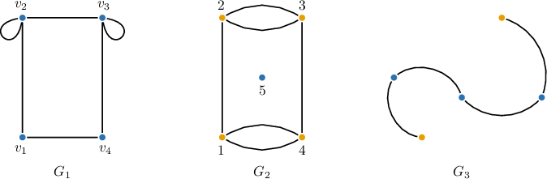

# The Handshaking Lemma

Source: https://www.mathacademy.com/topics/1684?courseId=109
Topic ID: 1684

## Prerequisites

- [The Degree of a Vertex](./954-the-degree-of-a-vertex.md)
- [Proof by Contradiction](../methods-of-proof/3414-proof-by-contradiction.md)

## Lesson

### Introduction

Recall that, in an undirected graph $G=(V,E),$ the sum of the degrees of all vertices is equal to twice the number of edges, or

$$

\sum_{v \in V} \deg(v) = 2 |E|.

$$

The **Handshaking Lemma** is a consequence of the degree sum formula. It states that, in an undirected graph, the number of vertices with odd degree is always even.

For example, consider the following graphs below:

- The graph $G_1$ has no vertices with odd degree (recall that $0$ is an even number).

- The graph $G_2$ has $4$ vertices with degree $3$.

- The graph $G_3$ has $2$ vertices with degree $1$.

To prove this lemma, recall that, by the degree sum formula, the sum of all vertex degrees is twice the number of edges and is, therefore, even. Thus, all vertices with odd degree must contribute an even total degree, which is only possible if their number is even.

The Handshaking Lemma gets its name from a simple analogy: Imagine a party where people shake hands with each other. Each handshake involves two people, meaning the total number of handshakes is always even because every handshake contributes $1$ to each participant's handshake count.

### Example: Applying the Handshaking Lemma

#### Question

Which of the following graphs do **** exist according to the handshaking lemma?

1. A graph with four vertices of degree $9$ and the remaining vertices of degree $10.$

2. A graph with seven vertices of degree $7$ and the remaining vertices of degree $8.$

3. A graph with three vertices of degree $6$ and the remaining vertices of degree $2.$

#### Explanation

The handshaking lemma states that the number of vertices with odd degrees must be even in a finite undirected graph.

With that in mind, let's examine our graphs:

- Graph I can exist according to the handshaking lemma because it has an even number (four) of vertices with odd degrees.

- Graph II can **** exist according to the handshaking lemma because it has an odd number (seven) of vertices with odd degrees.

- Graph III can exist according to the handshaking lemma because it has an even number (zero) of vertices with odd degrees.

Therefore, the correct answer is "II only."

### Example: Applying the Handshaking Lemma to Situations Given in Context

#### Question

In a book club, each member meets with exactly one other member to discuss a book. The club leader reports that, during a certain period of time, $1$ member met with $9$ others, while the remaining members each met with $8$ others. Explain why the report contains an error.

#### Explanation

First, we describe the given problem in terms of graph theory.

Let's consider a graph in which each vertex represents a club member, and each edge represents a two-member meeting.

Thus, two members are connected by an edge if and only if they meet to discuss a book.

The handshaking lemma states that, in a finite undirected graph, the number of vertices with odd degrees must be even. So, we proceed as follows:

We are told that our graph must contain an odd number (namely, $1$) of vertices with an odd degree of $9.$ However, this contradicts the handshaking lemma, which states that the number of vertices of odd degree must be even.

Therefore, the situation described in the report is impossible.

### Example: Proving the Handshaking Lemma

#### Question

Let $G$ be a graph in which all vertices have even degrees, except for three vertices with degrees $7,$ $9,$ and $11.$ Prove that such a graph cannot exist using a contradiction argument.

#### Explanation

We'll use proof by contradiction, assuming that such a graph can exist.

Suppose that graph $G$ with these properties exists, and let $V$ and $E$ be the corresponding sets of vertices and edges. Then, according to the degree sum formula for graphs, we have

$$

\displaystyle \sum_{v \in V} \deg(v) = \boxed{\color{black}2} \cdot \big| \boxed{\color{black}E} \big|.

$$

The idea is to reach a contradiction. First, we'll show that the left-hand side of the above expression is odd by considering the sum under the sigma notation and analyzing the rest of the expression separately.

Let the vertices $v_7,$ $v_9,$ and $v_{11}$ have degrees $7,$ $9,$ and $11,$ respectively, and let $W$ be the set of all vertices in $V$ with even degrees. Now, we can expand the left-hand side as

$$

\displaystyle \sum_{v \in V} \deg(v) = \sum_{v \in W} \deg(v) + \deg(v_7) + \deg(v_9) + \deg(v_{11}).

$$

Notice that

$$

\displaystyle \sum_{v \in W} \deg(v)

$$

must be even because the sum of even numbers is even.

Now, we examine the second part of the sum on the right-hand side and draw a conclusion about the entire expression.

Since $\deg(v_7) + \deg(v_9) + \deg(v_{11}) = \boxed{\color{black}27},$ adding this to the even sum $\displaystyle\sum\limits_{v \in W} \deg(v)$ results in an odd total for the left-hand side.

Next, we deduce that the other side of the formula is even.

On the other hand, the right-hand side of our degree sum formula is even as it is a multiple of $2.$

We have thus obtained a contradiction: an even number must equal an odd number, which is impossible. Hence, we conclude the following:

Therefore, the graph described above cannot exist.

The full proof is given below:

Suppose that graph $G$ with these properties exists, and let $V$ and $E$ be the corresponding sets of vertices and edges. Then, according to the degree sum formula for graphs, we have

$$

\displaystyle \sum_{v \in V} \deg(v) = \boxed{\color{black}2} \cdot \big| \boxed{\color{black}E} \big|.

$$

Let the vertices $v_7,$ $v_9,$ and $v_{11}$ have degrees $7,$ $9,$ and $11,$ respectively, and let $W$ be the set of all vertices in $V$ with even degrees. Now, we can expand the left-hand side as

$$

\displaystyle \sum_{v \in V} \deg(v) = \sum_{v \in W} \deg(v) + \deg(v_7) + \deg(v_9) + \deg(v_{11}).

$$

Notice that

$$

\displaystyle \sum_{v \in W} \deg(v)

$$

must be even because the sum of even numbers is even.

Since $\deg(v_7) + \deg(v_9) + \deg(v_{11}) = \boxed{\color{black}27},$ the complete expression on the left-hand side must be odd because the sum of an even number and an odd number is odd.

On the other hand, the right-hand side of our degree sum formula is even as it is a multiple of $2.$

Therefore, the graph described above cannot exist.
