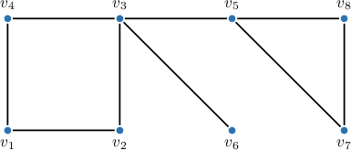
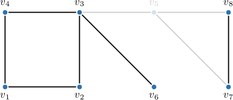
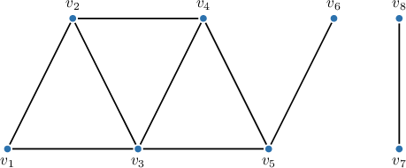
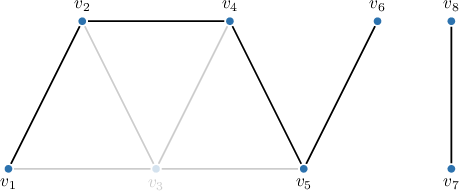
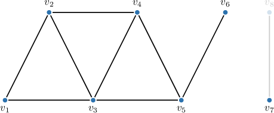
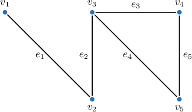
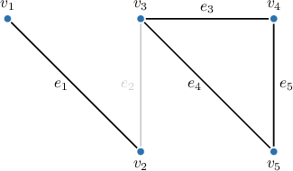
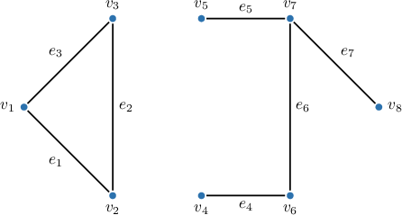
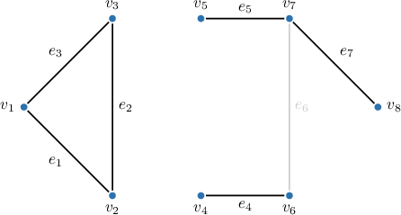

# Cut Vertices and Cut Edges

Source: https://www.mathacademy.com/topics/1695?courseId=109
Topic ID: 1695

## Prerequisites

- [Connected Graphs](./2756-connected-graphs.md)

## Lesson

### Introduction

A vertex is called a **cut vertex** (or *articulation point*) if its removal from the graph, along with its incident edges, increases the number of connected components.

A graph $G$ with a vertex $v$ removed is denoted by $G-v.$

For example, consider the graph below, which has one component.

This graph has two cut vertices, $v_3$ and $v_5.$

Indeed, removing $v_3$ results in the following graph with three components: $\{v_1, v_2, v_4\}, \{v_6\},$ and $\{v_5, v_7, v_8\}.$

Similarly, removing $v_5$ results in the following graph with two components: $\{v_1, v_2, v_3, v_4, v_6\}$ and $\{v_7, v_8\}.$

No other vertex removal increases the number of connected components. Therefore, the only cut vertices are $v_3$ and $v_5.$

### Example: Identifying Cut Vertices in a Graph

#### Question

In the above graph, which of the following are cut vertices?

1. Vertex $v_3$

2. Vertex $v_5$

3. Vertex $v_8$

#### Explanation

A vertex $v$ is called a ** (or an **) of a graph $G$ if removing this vertex, along with its incident edges, increases the number of connected components. The graph with vertex $v$ removed is denoted by $G-v.$

First, notice that our graph has two connected components.

Next, we examine the vertices of the graph one by one.

- Vertex $v_3$ is not a cut vertex since $G - v_3$ has the same number of connected components as the initial graph.

- Vertex $v_5$ is a cut vertex. Removing this vertex from the graph, along with its incident edges, increases the number of connected components. The graph $G - v_5$ has three connected components.

- Vertex $v_8$ is not a cut vertex since $G - v_8$ has the same number of connected components as the initial graph.

Therefore, the correct answer is "II only."

### Cut Edges

An edge is called a **cut edge** if its removal from the graph increases the number of connected components.

A graph $G$ with an edge $e$ removed is denoted by $G-e.$

For example, consider the graph below, which has one component.

This graph has two cut edges, $e_1$ and $e_2.$

Indeed, removing $e_1$ results in the following graph with two components: $\{v_1\}$ and $\{v_2, v_3, v_4, v_5\}.$

Similarly, removing $e_2$ results in the following graph with two components: $\{v_1, v_2\}$ and $\{v_3, v_4, v_5\}.$

No other edge removal increases the number of components. Therefore, the only cut edges are $e_1$ and $e_2.$

### Example: Identifying Cut Edges in a Graph

#### Question

In the above graph, which of the following are cut edges?

1. Edge $e_2$

2. Edge $e_6$

3. Edge $e_7$

#### Explanation

An edge $e$ is called a ** (or a **) of a graph $G$ if removing this edge from the graph increases the number of connected components. The graph with removed edge $e$ is denoted by $G-e.$

First, notice that our graph has two connected components.

Next, we examine the edges in question one by one.

- Edge $e_2$ is not a cut edge because the graph $G-e_2$ has the same number of connected components as $G.$

- Edge $e_6$ is a cut edge because removing it from the graph increases the number of connected components. The graph $G - e_6$ has three connected components.

- Edge $e_7$ is a cut edge because removing it from the graph increases the number of connected components. The graph $G - e_7$ has three connected components.

Therefore, the correct answer is "II and III only."
