# Counting Trees

Source: https://www.mathacademy.com/topics/1714?courseId=109
Topic ID: 1714

## Prerequisites

- [Ordering Objects](../../../high-school/traditional/lessons/geometry/775-ordering-objects.md)
- [Trees and Forests](./1284-trees-and-forests.md)

## Lesson

### Introduction

Recall that two graphs $G=(V_G,E_G)$ and $H=(V_H,E_H)$ are *isomorphic* if there exists a bijection $f: V_G \to V_H$ such that

$$

(u,v) \in E_G \qquad\Leftrightarrow\qquad \left(f(u),f(v)\right) \in E_H.

$$

Put plainly, $G$ and $H$ are isomorphic if relabeling the vertices and edges of $H$ gives the same graph as $G.$

Two isomorphic graphs share all structural properties, including vertex degrees, cycles, connectivity, and others. The isomorphism of trees is defined in the same way as for all graphs.

For example, consider the two trees below.

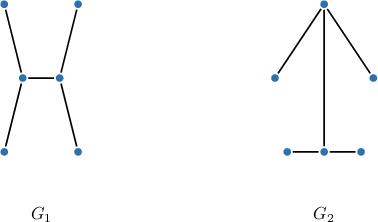

To demonstrate that these two trees are isomorphic, $G_1 \cong G_2,$ we label the vertices as shown below.

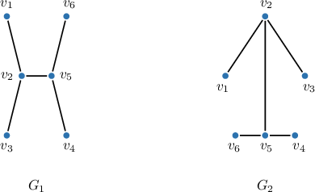

### Example: Identifying Isomorphic Trees

#### Question

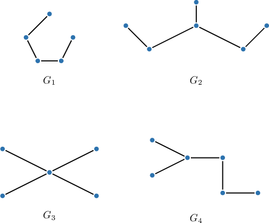

Which of the trees above are isomorphic?

#### Explanation

Recall that two graphs $G=(V_G,E_G)$ and $H=(V_H,E_H)$ are **** if there exists a bijection $f: V_G \to V_H$ such that

$$

(u,v) \in E_G \qquad\Leftrightarrow\qquad (f(u),f(v)) \in E_H.

$$

If two graphs are isomorphic, their properties, e.g., the degrees of the vertices, cycles, connectivity, etc., are identical.

Let's write down the degrees of the vertices of each tree (in ascending order):

- The degrees of the vertices in $G_1$ are the following:

- The degrees of the vertices in $G_2$ are the following:

- The degrees of the vertices in $G_3$ are the following:

- The degrees of the vertices in $G_4$ are the following:

Only $G_2$ and $G_4$ have the same collection of degrees. So, they are the only two that could be isomorphic. However, notice that the vertices of degree $2$ are not adjacent in $G_2$ (see below on the left).

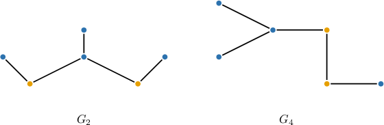

On the other hand, the vertices of degree $2$ are adjacent in $G_4$ (see above on the right). Thus, $G_2$ and $G_4$ are not isomorphic.

Therefore, the correct answer is "None of the trees are isomorphic to each other."

### Counting Unlabeled and Labeled Trees

An **unlabeled graph** is a graph in which vertices are indistinguishable, and only the structure (connections) matter. In this case, all isomorphic graphs are considered the same, regardless of their labeling.

For example, when working with unlabeled graphs (i.e., ignoring vertex and edge labels), all three drawings below represent the same graph.

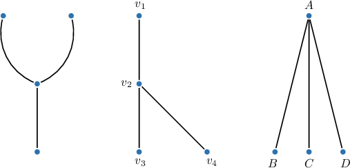

A **labeled graph** is a graph in which each vertex has a unique identifier (label). Changing the labels results in a different graph, even if the structure remains the same. When working with labeled graphs, we treat all three drawings above as different graphs.

There is no algebraic formula to determine the number of *unlabeled* trees on $n$ vertices. However, for sufficiently large $n,$ this number can be approximated by

$$

|T_n| \approx \frac {C \alpha^n}{ \sqrt{n^{5}}},

$$

where $C = 0.534949606$ and $\alpha = 2.95576528565.$

### Cayley's Formula

The number of *labeled* trees on $n$ vertices is given by **Cayley's formula**:

$$

|T_n| = n^{n-2}

$$

We'll prove this result at the end of the lesson.

For example, the number of labeled trees on $3$ vertices is

$$

\begin{aligned}|𝑇_{3}| & =3^{3−2} \\ & =3^{1} \\ & =3.\end{aligned}

$$

All possible labeled trees on $3$ vertices are shown below:

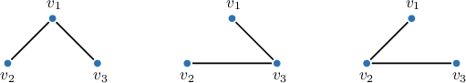

### Example: Counting the Number of Labeled Trees

#### Question

How many labeled trees are there on $8$ vertices?

#### Explanation

Cayley's formula for the number of labeled trees on $n$ vertices is

$$

|T_n| = n^{n-2}.

$$

Therefore, the number of labeled trees on $8$ vertices is

$$

\begin{aligned}|𝑇_{8}| & =8^{8−2} \\ & =8^{6}.\end{aligned}

$$

### Using Cayley's Formula on Rooted Trees

A **rooted tree** is a tree with one vertex designated as the root. When drawing a rooted tree, we usually place the root at the top and arrange the other vertices below by levels: the $1$st level contains vertices that are at a distance $1$ from the root in the original tree, the $2$nd level, those at a distance $2$, and so on.

For example, consider the tree shown below.

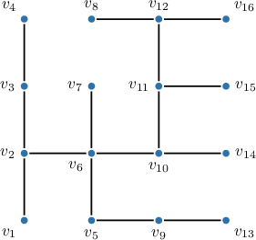

Suppose we designate the vertex $v_{10}$ as the root. In this case, we may redraw the rooted tree by levels as follows:

The number of labeled rooted trees on $n$ vertices is

$$

|T'_n| = n^{n-1}.

$$

This result follows from Cayley's formula for the number of labeled trees on $n$ vertices, $|T_n| = n^{n-2}.$ Since each labeled tree can be rooted at any of its $n$ vertices, we apply the Product Rule:

$$

\begin{aligned}|𝑇_{′𝑛}| & =(# of choices for the root)×(# of labeled trees) \\ & =𝑛⋅𝑛^{𝑛−2} \\ & =𝑛^{𝑛−1}.\end{aligned}

$$

For example, the number of labeled rooted trees on $3$ vertices is

$$

\begin{aligned}|𝑇_{′3}| & =3^{3−1} \\ & =3^{2} \\ & =9.\end{aligned}

$$

### Example: Counting the Number of Labeled Rooted Trees

#### Question

How many labeled rooted trees are there on $17$ vertices?

#### Explanation

A ** is a tree in which one vertex has been designated the root.

Cayley's formula for the number of labeled trees on $n$ vertices is

$$

|T_n| = n^{n-2}.

$$

First, note that on $n$ vertices, there are $n$ choices for a tree's root. Then, by the rule of product, we have

$$

\begin{aligned}# of labeled rooted trees & =(# of choices for the root)×(# of labeled trees) \\ & =𝑛⋅𝑛^{𝑛−2} \\ & =𝑛^{𝑛−1}.\end{aligned}

$$

Therefore, the number of labeled rooted trees on $17$ vertices is

$$

\begin{aligned}17⋅|𝑇_{17}| & =17⋅17^{17−2} \\ & =17^{17−1} \\ & =17^{16}.\end{aligned}

$$

### Using Cayley's Formula on Rooted Forests

A **rooted forest** is a graph in which each connected component is a rooted tree.

The number of labeled rooted forests on $n$ vertices is

$$

|F_n| = (n+1)^{n-1}.

$$

This result follows from the bijection between the set $F_n$ of all labeled rooted forests on $n$ vertices and the set $T_{n+1}$ of all labeled trees on $n+1$ vertices. Since these sets are in one-to-one correspondence, they have the same cardinality:

$$

\begin{aligned}|𝐹_{𝑛}| & =|𝑇_{𝑛+1}| \\ & =(𝑛+1)^{(𝑛+1)−2} \\ & =(𝑛+1)^{𝑛−1}\end{aligned}

$$

For example, the number of labeled rooted forests on $3$ vertices is

$$

\begin{aligned}|𝐹_{3}| & =(3+1)^{3−1} \\ & =4^{2} \\ & =16.\end{aligned}

$$

### Example: Counting the Number of Labeled Rooted Forests

#### Question

How many labeled rooted forests are there on $9$ vertices?

#### Explanation

A ** is a tree in which one vertex has been designated the root. A ** is a graph in which each connected component is a rooted tree.

Cayley's formula for the number of labeled trees on $n$ vertices is

$$

|T_n| = n^{n-2}.

$$

First, note that there is a bijection between the set $F_n$ of all labeled rooted forests on $n$ vertices and the set $T_{n+1}$ of all labeled trees on $n+1$ vertices. As a result, these sets have the same cardinality:

$$

\begin{aligned}|𝐹_{𝑛}| & =|𝑇_{𝑛+1}| \\ & =(𝑛+1)^{(𝑛+1)−2} \\ & =(𝑛+1)^{𝑛−1}\end{aligned}

$$

Therefore, the number of labeled rooted forests on $9$ vertices is

$$

\begin{aligned}|𝐹_{9}| & =(9+1)^{9−1} \\ & =10^{8}.\end{aligned}

$$

### Proof of Cayley's Formula

Cayley's formula for counting the number of labeled trees on $n$ vertices is given by

$$

T(n) = n^{n-2}.

$$

There are multiple ways to prove this theorem. Here, we'll use a so-called **double counting** method. We will count the number of *labeled out-trees on $n$ vertices* using two separate methods and equate them, which yields an explicit formula for $T(n).$

**Method 1 - Rooting and Edge Labeling:**

Suppose we have a tree on $n$ labeled vertices, like the tree shown below.

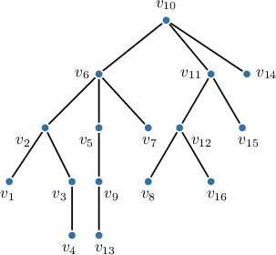

We select one of the vertices as the root vertex.

Our selection of the root vertex induces a natural direction of the edges "away" from the root vertex. This type of structure is called an **out-tree** and is *unique* for a given tree and choice of root.

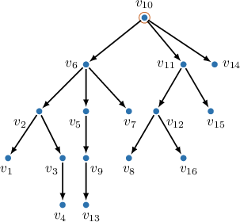

Since there are $n$ vertices in our tree, we have $(n-1)$ edges. Suppose we assign labels $e_1, e_2, \ldots e_{n-1}$ to these edges. One such configuration is shown below.

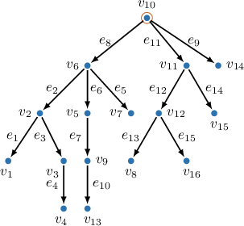

We call this configuration a **sequenced out-tree.** Since there are $(n-1)$ edges, we have $(n-1)!$ ways of assigning our edge labels.

For a given tree, we have a choice of $n$ vertices as the root and $(n-1)!$ ways of assigning the edge labels. Therefore, the total number of sequenced out-trees for a given tree is

$$

\text{\# sequenced out-trees for a given tree} = n\cdot (n-1)! = n!

$$

and since there are $T(n)$ possible labeled trees on $n$ vertices, the total number of sequenced out-trees on $n$ vertices equals

$$

𝑛

$$

**Method 2 – Sequential Construction:**

We now count the number of sequenced out-trees on $n$ vertices using a different method.

Suppose we initiate a rooted forest on $n$ vertices with no edges. Each vertex is a rooted tree, and our forest has $n$ rooted trees.

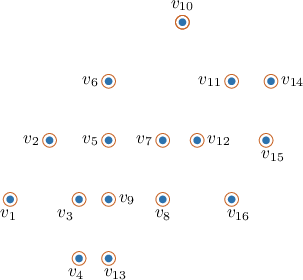

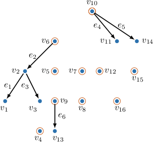

Suppose we have already added $n-k$ edges to our tree, which means our forest currently contains $k$ rooted trees.

To assign the next edge, we must choose a starting vertex (the tail of our directed edge) and an end vertex (the head of our directed edge):

- For the starting vertex, we can choose any of the $n$ vertices on the graph.

- To end with a sequenced out-tree, we cannot select any vertex in the graph as the end vertex. Instead, we must choose a *root* vertex in *another rooted tree* of our forest. In other words, it must be a root vertex, but it cannot be the root vertex in the same tree as our starting vertex. Once selected, the end vertex is no longer a root vertex.

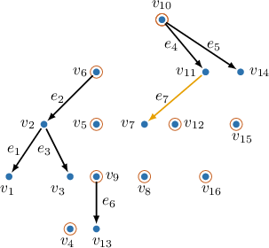

- Since our graph contains $k$ rooted trees, we have $(k-1)$ choices of edge for a given vertex.

- Therefore, the number of choices available for the next edge equals $n(k-1).$

Now, we have $n(k-1)$ choices at every step. Therefore, the total number of directed out-trees equals

$$

\begin{aligned}# sequenced out-trees on n vertices & =𝑛(𝑛−1)⋅𝑛(𝑛−2)⋅𝑛(𝑛−3)⋯𝑛⋅1 \\ & =𝑛^{𝑛−1}⋅(𝑛−1)! \\ & =𝑛^{𝑛−2}⋅𝑛!\end{aligned}

$$

Equating the results from both methods, we have

$$

n!\cdot T(n) = n^{n-2} n!

$$

which finally yields Cayley's formula

$$

T(n) = n^{n-2}.

$$
