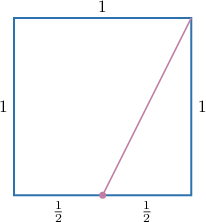
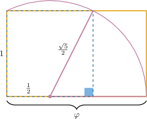

# Second-Order Homogeneous Recurrence Relations: Characteristic Equations with Distinct Real Roots

Source: https://www.mathacademy.com/topics/2007?courseId=109
Topic ID: 2007

## Prerequisites

- [Solving Quadratic Equations by Factoring](../../../high-school/traditional/lessons/algebra-i/375-solving-quadratic-equations-by-factoring.md)
- [Exponential Functions](../../../high-school/traditional/lessons/algebra-i/1153-exponential-functions.md)
- [Introduction to Recurrence Relations](./1989-introduction-to-recurrence-relations.md)
- [Solving Systems of Linear Equations Using Elimination: One Transformation](../../../high-school/traditional/lessons/algebra-i/4026-solving-systems-of-linear-equations-using-elimination-one-transformation.md)

## Lesson

### Introduction

The **Fibonacci sequence** is given by

$$

1,\:1,\:2,\:3,\:5,\:8,\:13,\:21,\ldots\,.

$$

Every term in the sequence (apart from the first two) is the sum of the two previous terms. Therefore, we can define this sequence using the recursive rule

$$

a_{n+2}=a_{n+1}+a_n, \qquad a_1=1,\quad a_2=1.

$$

We call this rule a **recurrence relation** or **difference equation**.

Note the following:

- This is a **second-order recurrence relation** because we need two terms to calculate the next term.

- This recurrence relation is called **linear** because it does not feature any products of the $a_n$ terms (there no terms like $a_n\cdot a_{n-1}$ or $a_n^2,$ for example).

- The values $a_1 = 1, a_2 = 1$ are called **initial conditions.** They are necessary to uniquely define the sequence.

- It's possible to write the relation so that the $a_n$'s are on one side and zero is on the other side: For this reason, we call this a **homogeneous** recurrence relation. In contrast, an example of an **inhomogeneous** recurrence relation is

In this lesson, we'll learn how to construct a formula for the $n$th term of a particular type of second-order, homogeneous recurrence relation.

### Solving Second-Order Recurrence Relations

Suppose we want to find a formula for the $n$th term for the following recurrence relation:

$$

a_{n}-5 a_{n-1} + 6a_{n-2} =0

$$

Notice that we haven't specified any initial conditions. We'll worry about those later.

We will attempt to find a solution of the form

$$

a_n=\lambda^n,

$$

where $\lambda$ is some nonzero constant. Therefore,

$$

a_{n-1} = \lambda^{n-1}, \qquad a_{n-2} = \lambda^{n-2}.

$$

Substituting the above into our recurrence relation gives

$$

\lambda^{n }-5 \lambda^{n-1} +6 \lambda^{n-2} = 0.

$$

We can factor this equation as

$$

\lambda^{n-2}(\lambda^2 -5 \lambda +6) = 0.

$$

Now, notice that $\lambda^{n-2}\neq 0.$ Therefore, by the zero-product property, we must have

$$

\lambda^2 - 5\lambda + 6 = 0.

$$

This quadratic equation is called the **characteristic equation** of the recurrence relation.

Factoring the characteristic equation gives

$$

(\lambda - 2)(\lambda - 3) = 0.

$$

So, the solutions to the characteristic equation are $\lambda = 2$ or $\lambda = 3.$ This gives us two **fundamental solutions** to our recurrence relation, namely

$$

a_n = 2^n, \qquad a_n = 3^n.

$$

It can be shown that any linear combination of the fundamental solutions is also a solution to the recurrence relation. Therefore, the **general solution** of the recurrence equation is

$$

a_n = A\cdot 2^n + B\cdot 3^n

$$

where $A$ and $B$ are arbitrary constants. The values of $A$ and $B$ are determined by the initial conditions.

### Example: Finding and Solving a Characteristic Equation

#### Question

Consider the recurrence relation $a_{n} = 2a_{n-1}+3a_{n-2}.$ If $a_n = \lambda^n$ is a nonzero solution, then what are the possible values of $\lambda?$

#### Explanation

Assuming $a_n=\lambda^n,$ we obtain that

$$

a_{n-1}= \lambda^{n-1},\qquad a_{n-2}= \lambda^{n-2}.

$$

Substituting the above into our recurrence relation gives

$$

\begin{aligned}𝜆^{𝑛} & =2𝜆^{𝑛−1}+3𝜆^{𝑛−2}\end{aligned}

$$

which can be written as follows:

$$

\begin{aligned}𝜆^{𝑛}−2𝜆^{𝑛−1}−3𝜆^{𝑛−2} & =0 \\ 𝜆^{𝑛−2}(𝜆^{2}−2𝜆−3) & =0\end{aligned}

$$

So, we have the following characteristic equation:

$$

\lambda^2 - 2\lambda - 3 = 0

$$

Factoring, we get

$$

(\lambda + 1) (\lambda - 3) = 0.

$$

Therefore, the roots of the characteristic equation are $\lambda = -1$ and $\lambda = 3.$

### Example: Finding the General Solution to a Second-Order Recurrence Relation

#### Question

Find the general solution to the difference equation

$$

a_n + a_{n-1} -2a_{n-2} =0.

$$

#### Explanation

Let $a_n=\lambda^n.$ Then, we have

$$

a_{n-1} = \lambda^{n-1}, \qquad a_{n-2} = \lambda^{n-2}.

$$

Substituting the above into our difference equation gives

$$

\begin{aligned}𝜆^{𝑛}+𝜆^{𝑛−1}−2𝜆^{𝑛−2} & =0 \\ 𝜆^{𝑛−2}(𝜆^{2}+𝜆−2) & =0.\end{aligned}

$$

The characteristic equation is

$$

\lambda^2 + \lambda -2 = 0.

$$

Factoring the characteristic equation results in

$$

(\lambda -1)(\lambda+2) = 0,

$$

and so $\lambda = 1$ or $\lambda = -2.$

Therefore, the general solution to the difference equation is

$$

\begin{aligned}𝑎_{𝑛} & =𝐴⋅(−2)^{𝑛}+𝐵⋅(1)^{𝑛} \\ & =𝐴⋅(−2)^{𝑛}+𝐵.\end{aligned}

$$

### Example: Solving Second-Order Recurrence Relations With Initial Conditions

#### Question

Solve the recurrence relation

$$

a_n = a_{n-2}, \qquad a_0=2, \quad a_1=4.

$$

#### Explanation

Moving all terms of our recurrence relation to the left-hand side, we obtain

$$

a_n - a_{n-2} = 0.

$$

First, we find the roots of the characteristic equation:

$$

\begin{aligned}𝜆^{2}−1 & =0 \\ (𝜆+1)(𝜆−1) & =0 \\ 𝜆 & =−1,1\end{aligned}

$$

So, the general solution is

$$

\begin{aligned}𝑎_{𝑛} & =𝐴⋅(−1)^{𝑛}+𝐵⋅1^{𝑛} \\ & =𝐴⋅(−1)^{𝑛}+𝐵.\end{aligned}

$$

We find the constants $A$ and $B$ using the initial conditions:

- Substituting $a_0 = 2$ into the general solution gives

- Substituting $a_1=4$ into the general solution gives

Therefore, we have the following system:

$$

\begin{aligned}𝐴+𝐵=2 \\ −𝐴+𝐵=4\end{aligned}

$$

Solving this system gives $A=-1$ and $B=3.$

Therefore, the solution is

$$

\begin{aligned}𝑎_{𝑛} & =(−1)⋅(−1)^{𝑛}+3 \\ & =(−1)^{𝑛+1}+3.\end{aligned}

$$

### The Fibonacci Sequence

A Fibonacci sequence $F_n$ is a particular second-order recurrence relation where each term is the sum of the previous two terms:

$$

F_n = F_{n-1} + F_{n-2}

$$

Let's find the general solution to this relation. First, let $F_n = \lambda^n.$ Then, we have

$$

F_{n-1} = \lambda^{n-1} \qquad F_{n-2} = \lambda^{n-2}.

$$

Substituting the above into our recurrence relation gives

$$

\lambda^n = \lambda^{n-1} + \lambda^{n-2}

$$

which can be written as follows:

$$

\begin{aligned}𝜆^{𝑛}−𝜆^{𝑛−1}−𝜆^{𝑛−2} & =0 \\ 𝜆^{𝑛−2}(𝜆^{2}−𝜆−1) & =0\end{aligned}

$$

So, we have the following characteristic equation:

$$

\lambda^2 - \lambda - 1 = 0

$$

Solving for $\lambda$ using the quadratic formula, we get

$$

\begin{aligned}𝜆 & =\frac{1±\sqrt{√(−1)^{2}−4⋅1⋅(−1)}}{2(1)} \\ & =\frac{1±\sqrt{√5}}{2}.\end{aligned}

$$

Therefore, the general solution is

$$

F_n = A \cdot \left(\dfrac{1 + \sqrt{5}}{2}\right)^n + B \cdot \left(\dfrac{1 - \sqrt{5}}{2}\right)^n.

$$

The number

$$

\varphi = \dfrac{1+\sqrt5}{2} \approx 1.618\,033\,988\ldots

$$

is called the **golden ratio**.

Now, note that

$$

\dfrac{1 - \sqrt{5}}{2} = 1- \varphi.

$$

Therefore, our general solution can be written as

$$

F_n = A \cdot \varphi^n + B \cdot (1 - \varphi)^n.

$$

### The Golden Ratio

As we saw previously, the number

$$

\varphi = \dfrac{1+\sqrt5}{2} \approx 1.618\,033\,988\ldots

$$

is called the **golden ratio**. It is an irrational number that frequently appears in geometry, architecture, and nature, to name a few places.

We can visualize the golden ratio with the help of a unit square. We start by placing a dot at the midpoint of one side and we draw a line segment to an opposite corner:

By the Pythagorean theorem, the length of this line segment is $\dfrac{\sqrt5}{2}.$

Now, we rotate this line segment about the dot until it runs along the square's side.

The length of the resulting rectangle is the golden ratio. We sometimes call this a **golden rectangle.**
