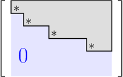

# Row Echelon Form

Source: https://www.mathacademy.com/topics/2083?courseId=109
Topic ID: 2083

## Prerequisites

- [Systems of Equations as Augmented Matrices](./148-systems-of-equations-as-augmented-matrices.md)
- [Index Notation for Matrices](../../../high-school/integrated-math-honors/lessons/integrated-math-iii-honors/1167-index-notation-for-matrices.md)

## Lesson

### Introduction

Consider the following matrices:

$$

\begin{aligned}2 & 6 & 7 & 8 \\ 0 & 3 & 6 & 9 \\ 0 & 1 & 4 & 7 \\ 0 & 0 & 5 & 8\end{aligned}

$$

The first non-zero entry on each row (from left to right) is called the **leading entry** of that row.

- In the matrix $A,$ the leading entries are $a_{11}=2,$ $a_{22}=3,$ $a_{32}=1,$ and $a_{43}=5.$

- In the matrix $B,$ the leading entries are $b_{11}=1,$ $b_{22}=3,$ $b_{33}=-2,$ and $b_{44}=2.$ The $5$th row has no leading entry.

The leading entries are highlighted below.

$$

\begin{aligned}2 & 6 & 7 & 8 \\ 0 & 3 & 6 & 9 \\ 0 & 1 & 4 & 7 \\ 0 & 0 & 5 & 8\end{aligned}

$$

### Example: Identifying the Leading Entries of a Matrix

#### Question

What is the sum of the leading entries of the $1$st, $3$rd and $4$th rows in the matrix $A,$ given below?

$$

\begin{aligned}−1 & 1 & 0 & 1 \\ 0 & 0 & 7 & 8 \\ 0 & −4 & 2 & 4 \\ 0 & 0 & 8 & 4\end{aligned}

$$

#### Explanation

The first non-zero entry of each row (from left to right) is the leading entry.

Therefore, the leading entries of the $1$st, $3$rd and $4$th rows of $A$ are $-1$, $-4$ and $8$, respectively.

$$

\begin{aligned}−1 & 1 & 0 & 1 \\ 0 & 0 & 7 & 8 \\ 0 & −4 & 2 & 4 \\ 0 & 0 & 8 & 4\end{aligned}

$$

So, the answer is $-1+(-4)+8=3.$

### Row Echelon Form

Let's consider our matrices $A$ and $B$ once more, with the leading entries highlighted.

$$

\begin{aligned}2 & 6 & 7 & 8 \\ 0 & 3 & 6 & 9 \\ 0 & 1 & 4 & 7 \\ 0 & 0 & 5 & 8\end{aligned}

$$

We say that a matrix is in **row echelon form** if it satisfies the following conditions:

1. All the zero rows (rows with only zeros), if any, are placed at the *bottom* of the matrix.

2. Each leading entry of a row is in a column *to the right* of the leading entry of the row above it.

Here, $B$ is in row echelon form since both conditions are satisfied. However, $A$ is not in row echelon form since condition II is violated: the leading entry of the third row $(a_{32}={\color{red}1})$ is placed just below the leading entry of the second row $(a_{22}=3).$

Generally speaking, row echelon form means that we have *stairs* where each step (represented by a leading entry $\boxed{\large\ast}$) has a height of $1.$

Finally, an *augmented* matrix is in row echelon form if the coefficient matrix (i.e., the part that is to the left of the vertical bar) is in row echelon form.

### Example: Identifying Matrices in Row Echelon Form

#### Question

Which of the following matrices are in row echelon form?

$$

\begin{aligned}2 & 1 \\ 0 & 0 \\ 0 & 3\end{aligned}

$$

#### Explanation

Remember that a matrix is in row echelon form if it satisfies the following conditions:

1. All the zero rows (rows with only zeros), if any, are placed at the ** of the matrix.

2. Each leading entry of a row is in a column ** of the leading entry of the row above it.

With that in mind, let's look at each matrix in turn.

- The matrix $A$ is not in row echelon form since the second row contains only zeros and it is not at the bottom of the matrix (condition I is violated).

- The matrix $B$ is in row echelon form (both conditions are satisfied).

- The matrix $C$ is in row echelon form (both conditions are satisfied).

### Example: Identifying Augmented Matrices in Row Echelon Form

#### Question

Which of the following augmented matrices are in row echelon form?

$$

\begin{aligned}1 & 2 & −1 & 0 \\ 0 & 1 & 0 & 1 \\ 0 & 1 & 1 & 1\end{aligned}

$$

#### Explanation

Remember that an augmented matrix is in row echelon form if its coefficient matrix satisfies the following conditions:

1. All the zero rows (rows with only zeros), if any, are placed at the ** of the matrix.

2. Each leading entry of a row is in a column ** of the leading entry of the row above it.

With that in mind, let's look at each matrix in turn.

- The first matrix is not in row echelon form since $a_{32} \neq 0$ (condition II is violated).

- The second matrix is in row echelon form (both conditions are satisfied).

- The third matrix is in row echelon form (both conditions are satisfied).

- The fourth matrix is not in row echelon form since, for example, the leading entry $a_{22}$ lies to the left of the leading entry $a_{13}$ (condition II is violated).

### Example: Identifying Operations That Would Transform a Matrix To Row Echelon Form

#### Question

Consider the matrix $A$ given below. Which entries of $A$ could be replaced by $0$ in order to get a matrix in row echelon form?

$$

\begin{aligned}3 & 11 & 10 & 9 \\ 0 & 4 & 7 & 8 \\ 0 & −1 & 6 & 5 \\ 0 & 1 & 2 & 4\end{aligned}

$$

#### Explanation

Notice that by replacing $a_{32}$, $a_{42}$, and $a_{43}$ with $0$, we get a matrix in row echelon form:

$$

\begin{aligned}3 & 11 & 10 & 9 \\ 0 & 4 & 7 & 8 \\ 0 & −1 & 6 & 5 \\ 0 & 1 & 2 & 4\end{aligned}

$$
