# Connected Graphs

Source: https://www.mathacademy.com/topics/2756?courseId=109
Topic ID: 2756

## Prerequisites

- [Subgraphs and Graph Complements](./1260-subgraphs-and-graph-complements.md)
- [Walks, Paths, and Distances in Directed Graphs](./5431-walks-paths-and-distances-in-directed-graphs.md)

## Lesson

### Introduction

An undirected graph is **connected** if there is a path between every pair of vertices. A graph is **disconnected** if at least two vertices have no path between them.

A **component** (or *connected component*) of an undirected graph is a connected subgraph that is not contained in any other connected subgraph.

From these definitions, we can prove the following:

- A connected graph consists of exactly one component.

- A disconnected graph consists of at least two components.

- An isolated vertex is a component.

- There is no path between vertices in different components.

For example, consider the following graph:

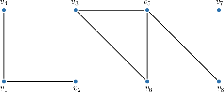

This graph has $3$ connected components, as shown below.

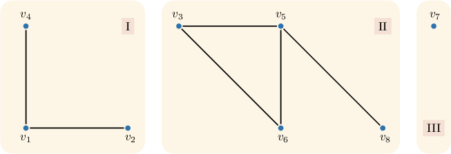

### Example: Identifying the Number of Connected Components in a Graph

#### Question

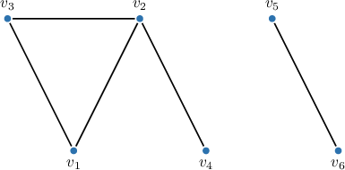

How many connected components does the graph above have?

#### Explanation

A **** (or **) of an undirected graph is a connected subgraph that is not contained in any other connected subgraph. In a connected component, every pair of vertices is connected by a path, and no paths exist that lead to vertices outside the component. Obviously, a single vertex with no edges is also a connected component.

Our graph has $2$ connected components.

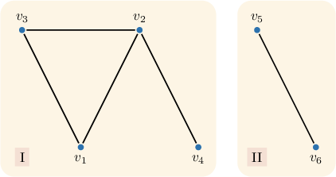

### Weakly Connected Graphs

Unlike undirected graphs, where connectivity is a single concept, directed graphs have three distinct types of connectivity: weakly connected, unilaterally connected, and strongly connected.

A directed graph is **weakly connected** if replacing all directed edges with undirected edges results in a connected graph.

For example, consider the graph $G$ below.

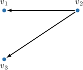

By replacing all directed edges with undirected ones, we obtain the following connected undirected graph:

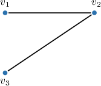

Therefore, the graph $G$ is weakly connected.

### Example: Identifying Connectivity in Undirected and Directed Graphs Given Lists of Edges

#### Question

The vertices and edges of the directed graph $G$ are given above. Determine whether the graph $G$ is weakly connected or disconnected and how many weakly connected components it contains.

#### Explanation

Recall that a **** (or **) of an undirected graph is a connected subgraph that is not contained in any other connected subgraph. In a connected component, every pair of vertices is connected by a path, and no paths exist that lead to vertices outside the component. A single vertex with no edges is also a connected component.

A directed graph is ** if the underlying undirected graph (i.e., the graph formed when the direction of the edges is removed) is connected.

First, let's sketch our directed graph.

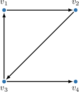

The corresponding undirected graph is shown below.

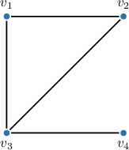

From the figure, we observe that the undirected graph is connected. So, our initial directed graph is weakly connected and has $1$ weakly connected component.

### Strongly Connected and Unilaterally Connected Graphs

A directed graph is **strongly connected** if there is a directed path between every pair of vertices in both directions.

For example, consider the graph $G$ below.

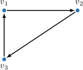

In this graph, for every pair of vertices, there exists a directed path between them in both directions. For instance, for $v_1$ and $v_2,$ the paths $(v_1 \to v_2)$ and $(v_2 \to v_3 \to v_1)$ exist. Therefore, the graph $G$ is strongly connected.

A directed graph is **unilaterally connected** (or *semiconnected*) if there is a directed path between each pair of vertices in at least one direction.

For example, consider the graph $G$ below.

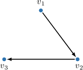

In this graph, for every pair of vertices, there exists a path in one direction: $(v_1 \to v_2), (v_2 \to v_3),$ and $(v_1 \to v_2 \to v_3).$ Therefore, the graph $G$ is unilaterally connected. Note that it is not strongly connected, for example because there is no path from $v_2$ to $v_1$.

### Example: Identifying Strongly Connected and Unilaterally Connected Graphs

#### Question

Consider the directed graph $G$ above. Fill in the empty cells in the table below that shows paths between the graph's vertices and determine the graph's connectivity.

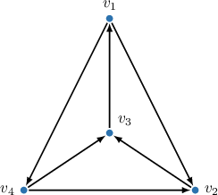

#### Explanation

Recall that a directed graph is ** if there is a path between each pair of graph vertices in both directions. A directed graph is ** if there is a path between each pair of vertices in at least one direction.

If a graph is strongly connected, it's also unilaterally connected. But not the other way around.

First, let's write down the missing paths to the table.

So, in our graph, there is a path between every pair of vertices $(v_i \to \ldots \to v_j)$ and its reverse $(v_j \to \ldots \to v_i).$ Therefore, the graph $G$ is $\boxed{\color{blue}\textrm{both strongly and unilaterally connected}}.$
