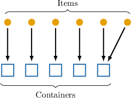

# The Pigeonhole Principle

Source: https://www.mathacademy.com/topics/2761?courseId=109
Topic ID: 2761

## Prerequisites

- [Partitions of Sets](../methods-of-proof/240-partitions-of-sets.md)
- [The Floor and Ceiling Functions](../differential-equations/290-the-floor-and-ceiling-functions.md)
- [Direct Proof](../methods-of-proof/2801-direct-proof.md)

## Lesson

### Introduction

The **pigeonhole principle** (PHP) is a fundamental fact in combinatorial mathematics. It provides a systematic way to prove various existence statements.

This principle states the following:

*If we want to place $n$ items into $m$ containers, where $n > m,$ then at least one container must contain more than one item.*

The above can be illustrated using the following diagram.

For example, suppose a language school has $10$ classrooms, and each student is assigned to one of the classrooms. What is the minimum number of students required to guarantee that at least one classroom has at least two students?

In our case, we have the following:

- The "items" are the students. Let's denote the number of students by $n$ (unknown).

- The "containers" are classrooms. There are $10$ classrooms in total.

The pigeonhole principle guarantees that at least one classroom must have more than one student if $n>10.$ The minimum positive integer that satisfies this condition is $n=11.$

Therefore, the minimum number of students required is $11.$

### Example: Applying the Pigeonhole Principle

#### Question

A farmer distributes 39 apples among several baskets. What is the maximum number of baskets that ensures at least one basket contains at least two apples?

#### Explanation

The ** states that if we want to place $n$ items into $m$ containers, where $n > m,$ then at least one container must contain more than one item.

In our case, we have the following:

- The "items" are the apples. There are $39$ apples in total.

- The "containers" are the baskets. Let's denote the number baskets by $m$ (unknown).

The pigeonhole principle guarantees that at least one basket must have more than one apple if $m<39.$ The maximum positive integer that satisfies this condition is $m=38.$

Therefore, the maximum number of baskets required is $\boxed{\color{blue}38}.$

### Generalized Pigeonhole Principle

The **generalized pigeonhole principle** states the following:

*If $n$ items are placed into $m$ containers, then at least one container must have at least items, where $\left\lceil x \right \rceil$ is the ceiling function.*

For example, a conference has $60$ attendees, each assigned a room number between $11$ and $18$ (inclusive).

In our case, we have the following:

- The "items" are the attendees. There are $60$ attendees in total.

- The "containers" are the room numbers. There are $8$ room numbers in total.

By the generalized pigeonhole principle, at least one room number must be assigned to at least

$$

\left\lceil \frac{60}{8} \right\rceil = \left\lceil 7.5 \right\rceil = 8 \text{ attendees.}

$$

### Example: Applying the Generalized Pigeonhole Principle

#### Question

In a city, each traffic light is labeled by an integer number from $1$ to $5$ (inclusive). What is the minimum number of traffic lights required, guaranteeing that at least $7$ traffic lights have the same labeling number?

#### Explanation

The ** states that if we want to place $n$ items into $m$ containers, where $n > m,$ then at least one container must contain more than one item.

The ** states that if $n$ items are placed into $m$ containers, then at least one container must have at least

$$

\left\lceil \frac{n}{m} \right\rceil

$$

items, where $\left\lceil x \right \rceil$ is the ceiling function.

In our case, we have the following:

- The "items" are the traffic lights. Let's denote the number of traffic lights by $n$ (unknown).

- The "containers" are the labels. There are $5$ labels in total.

By the generalized pigeonhole principle, there is at least one label that has at least

$$

\left\lceil \frac{n}{5} \right\rceil

$$

traffic lights which got that label.

To ensure that at least $7$ traffic lights receive the same label, we need

$$

\left\lceil \frac{n}{5} \right\rceil \geq 7.

$$

This implies

$$

\frac{n}{5} > 6.

$$

Solving for $n,$ we get

$$

n > 30.

$$

Since $n$ must be an integer, the minimum value satisfying this condition is $n = 31.$

So, the minimum number of of traffic lights required to guarantee that at least $7$ of traffic lights receive the same label is $31.$

### Example: Proving Statements Using the Pigeonhole Principle

#### Question

Prove that if $16$ numbers are selected from the set $\{1,2,…,30\}$, then two of the chosen numbers must sum to $31.$

#### Explanation

To prove this statement, we'll use the pigeonhole principle, which states that if we want to place $n$ items into $m$ containers, where $n > m,$ then at least one container must contain more than one item.

To do that, we proceed as follows:

Let's partition the set $\{1,2,\ldots,30\}$ into $15$ subsets, each containing $2$ elements such that the sum of elements in each subset equals $31$, as follows:

$$

\{1,30\}, \quad \{2,29\}, \quad \{3,28\}, \quad \ldots, \quad \{15,16\}.

$$

Now, let's apply the pigeonhole principle. In our case, we have the following:

- The "items" are the chosen numbers. There are $16$ of them in total.

- The "containers" are the constructed $2$-element subsets. There are $15$ of them in total.

The pigeonhole principle guarantees that at least one subset will contain at least two of the chosen numbers, which leads to the following:

By the pigeonhole principle, if $16$ numbers are selected from these $15$ subsets, then there is at least one subset from which two numbers must be selected.

Finally, we make the conclusion:

Since the sum of the numbers in each of the subsets is $31$, we obtain that two of the chosen numbers must sum to $31.$
