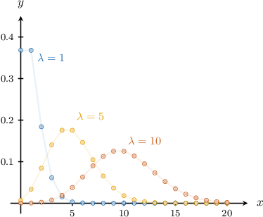

# Modeling With the Poisson Distribution

Source: https://www.mathacademy.com/topics/2838?courseId=109
Topic ID: 2838

## Prerequisites

- [The Poisson Distribution](./3282-the-poisson-distribution.md)

## Lesson

### Introduction

A **Poisson distribution** is a probability distribution that models the number of events that occur in an interval of time or space if events occur independently and at a constant average rate.

If the rate of the events is $\lambda,$ then the number of events $x$ occurring in an interval of fixed length has the following probability mass function:

$$

f(x) = \dfrac{\lambda^x e^{-\lambda}}{x!}, \qquad x=0,1,2,3, \ldots

$$

If a random variable $X$ follows a Poisson distribution with rate $\lambda,$ then we write $X \sim \text{Po}(\lambda).$

For example, suppose that calls come in at an average rate of $3$ calls per minute at a call center. Then the number of calls $X$ that are received during the next minute has the following probability mass function:

$$

f(x) = \dfrac{3^x e^{-3}}{x!}

$$

In particular, the probability of receiving $4$ calls during the next minute is

$$

\begin{aligned}𝑃(𝑋=4) & =𝑓(4) \\ & =\frac{3^{4}𝑒^{−3}}{4!} \\ & ≈0.168\end{aligned}

$$

rounded to $3$ decimal places.

### The Graph of the Poisson Distribution

The shape of the graph of the Poisson distribution depends on the value of $\lambda.$ When $\lambda$ is small, the probability is concentrated at small values of $x.$ When $\lambda$ is larger, the probability is concentrated at larger values of $x.$

### Example: Identifying Random Variables that Follow a Poisson Distribution

#### Question

Which of the following random variables could be modeled using a Poisson distribution?

1. The number of calls received at a telephone center over a 10-minute period

2. The number of giraffes in a zoo

3. The number of pairs of shoes produced with defects in a factory in a single day

#### Explanation

A Poisson distribution models the number of events that occur in an interval of time or space if events occur independently and at a constant average rate.

With that in mind, let's consider each of the given random variables.

- Random variable I follows a Poisson distribution. The number of calls received can be modeled as independent events with a constant average rate, and we wish to know how many events occur in an interval of time (10 minutes).

- Random variable II does ** follow a Poisson distribution. There are no events that occur at a constant average rate, and there is no interval of time or space.

- Random variable III follows a Poisson distribution. The pairs of shoes produced with defects can be modeled as independent events with a constant average rate, and we wish to know how many events occur in an interval of time (one day).

Therefore, the correct answer is "I and III only."

### Example: Computing the Probability of a Poisson Random Variable at Some Value

#### Question

In a telephone exchange, an average of $3$ prank calls are received per day. What is the probability of receiving $5$ prank calls tomorrow? Round your answer to $3$ decimal places. You may assume that prank calls occur independently and at a constant average rate.

#### Explanation

A Poisson random variable $X$ with rate $\lambda$ has the following probability mass function:

$$

f(x) = \dfrac{\lambda^x e^{-\lambda}}{x!}

$$

Let $X$ be the number of prank calls received by the telephone exchange. Since the average rate is $3$ prank calls per day, and events occur independently and at a constant average rate, the number of prank calls can be modeled as a Poisson random variable with rate $\lambda = 3,$ and we can write $X\sim \text{Po}(3).$

So, $X$ has the following probability mass function:

$$

f(x) = \dfrac{3^x e^{-3}}{x!}

$$

Therefore, the probability of receiving $5$ prank calls is

$$

\begin{aligned}𝑃(𝑋=5) & =𝑓(5) \\ & =\frac{3^{5}𝑒^{−3}}{5!} \\ & ≈0.101\end{aligned}

$$

rounded to $3$ decimal places.

### Example: Computing the Probability of a Poisson Random Variable on a Bounded Interval

#### Question

On average, $4$ traffic accidents occur per week on a particular freeway. What is the probability of fewer than $3$ accidents next week? You may assume that accidents occur independently and at a constant average rate.

#### Explanation

A Poisson random variable $X$ with rate $\lambda$ has the following probability mass function:

$$

f(x) = \dfrac{\lambda^x e^{-\lambda}}{x!}

$$

Let $X$ be the number of traffic accidents. Since the average rate is $4$ traffic accidents per week, and events occur independently and at a constant average rate, the number of traffic accidents can be modeled as a Poisson random variable with rate $\lambda = 4,$ and we can write $X\sim \text{Po}(4).$

So, $X$ has the following probability mass function:

$$

f(x) = \dfrac{4^x e^{-4}}{x!}

$$

Therefore, the probability of finding fewer than $3$ traffic accidents on the next week is

$$

\begin{aligned}𝑃(𝑋<3) & =𝑃(𝑋∈{0,1,2}) \\ & =𝑓(0)+𝑓(1)+𝑓(2) \\ & =\frac{4^{0}𝑒^{−4}}{0!}+\frac{4^{1}𝑒^{−4}}{1!}+\frac{4^{2}𝑒^{−4}}{2!} \\ & =𝑒^{−4}(\frac{4^{0}}{0!}+\frac{4^{1}}{1!}+\frac{4^{2}}{2!}) \\ & ≈0.238\end{aligned}

$$

rounded to $3$ decimal places.

### Example: Computing the Probability of a Poisson Random Variable on an Unbounded Interval

#### Question

In a factory, $3$ machines, on average, suffer some fault during the course of a week. What is the probability that at least $2$ machines will register a fault next week? You may assume that faults occur independently and at a constant average rate.

#### Explanation

A Poisson random variable $X$ with rate $\lambda$ has the following probability mass function:

$$

f(x) = \dfrac{\lambda^x e^{-\lambda}}{x!}

$$

Let $X$ be the number of machines with a fault in the factory. Since the average rate is $3$ faulty machines per week, and events occur independently and at a constant average rate, the number of machines with faults can be modeled as a Poisson random variable with rate $\lambda = 3,$ and we can write $X\sim \text{Po}(3).$

So, $X$ has the following probability mass function:

$$

f(x) = \dfrac{3^x e^{-3}}{x!}

$$

To compute $P(X \geq 2),$ we will use the complement:

$$

P(X \geq 2) = 1 - P(X< 2)

$$

Computing the probability of the complement, we get

$$

\begin{aligned}𝑃(𝑋<2) & =𝑃(𝑋∈{0,1}) \\ & =𝑓(0)+𝑓(1) \\ & =\frac{3^{0}𝑒^{−3}}{0!}+\frac{3^{1}𝑒^{−3}}{1!} \\ & ≈0.199\end{aligned}

$$

rounded to $3$ decimal places.

Therefore, the probability of at least $2$ machines registering a fault next week is

$$

\begin{aligned}𝑃(𝑋≥2) & =1−𝑃(𝑋<2) \\ & ≈1−0.199 \\ & ≈0.801\end{aligned}

$$

rounded to $3$ decimal places.
