# Dijkstra's Algorithm

Source: https://www.mathacademy.com/topics/2899?courseId=109
Topic ID: 2899

## Prerequisites

- [Shortest Paths in Unweighted Graphs](./2895-shortest-paths-in-unweighted-graphs.md)

## Lesson

### Introduction

**Dijkstra's algorithm** is a greedy algorithm that finds the shortest path from a given source vertex to every other vertex in a weighted graph with non-negative edge weights. It was developed by Edsger W. Dijkstra in 1956 and published in 1959. It is widely used in network routing, mapping, and various optimization problems.

Dijkstra's algorithm uses a **min-priority queue,** ensuring that the vertex with the smallest known distance is processed first. This approach efficiently determines the shortest paths by progressively relaxing edges and updating distances.

The steps involved in Dijkstra's algorithm are as follows:

- **Step 1:** Initialize an empty priority queue, a distance list, and a previous node list for path reconstruction.

- **Step 2:** Insert the source vertex into the priority queue, followed by all other vertices.

- **Step 3:** Extract the vertex with the smallest distance from the priority queue.

- **Step 4:** For every unvisited neighbor of the extracted vertex, update its distance if a shorter path is found. Adjust the priority queue accordingly.

Repeat Steps 3 and 4 until the priority queue is empty.

The pseudocode for Dijkstra's algorithm for the shortest path is the following:

Note that Dijkstra's algorithm can be applied to undirected and directed graphs. It is best understood by studying a concrete example, so let's do that.

### A Worked Example

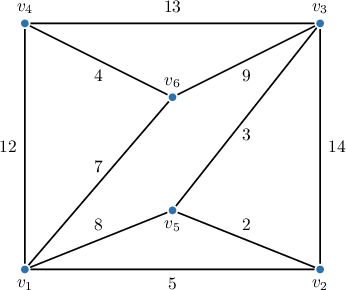

Let's apply Dijkstra's algorithm to the graph above, starting at $v_1.$

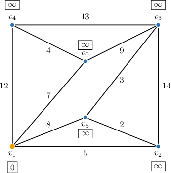

- for $v_2,$ we have $\text{dist}[v_1] + d(v_1,v_2) = 0 + 5 = 5 < \infty = \text{dist}[v_2],$

- for $v_4,$ we have $\text{dist}[v_1] + d(v_1,v_4) = 0 + 12 = 12 < \infty = \text{dist}[v_4],$

- for $v_5,$ we have $\text{dist}[v_1] + d(v_1,v_5) = 0 + 8 = 8 < \infty = \text{dist}[v_5],$

- for $v_6,$ we have $\text{dist}[v_1] + d(v_1,v_6) = 0 + 7 = 7 < \infty = \text{dist}[v_6].$

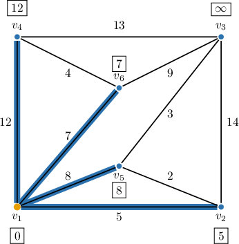

- for $v_3,$ we have $\text{dist}[v_2] + d(v_2,v_3) = 5 + 14 = 19 < \infty = \text{dist}[v_3],$

- for $v_5,$ we have $\text{dist}[v_2] + d(v_2,v_5) = 5 + 2 = 7 < 8 = \text{dist}[v_5].$

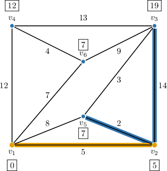

- for $v_3,$ we have $\text{dist}[v_5] + d(v_5,v_3) = 7 + 3 = 10 < 19 = \text{dist}[v_3].$

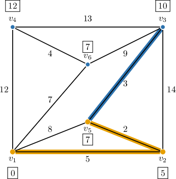

- for $v_3,$ we have $\text{dist}[v_6] + d(v_6,v_3) = 7 + 9 = 16 \not \lt 10 = \text{dist}[v_3],$

- for $v_4,$ we have $\text{dist}[v_6] + d(v_6,v_4) = 7 + 4 = 11 < 12 = \text{dist}[v_4].$

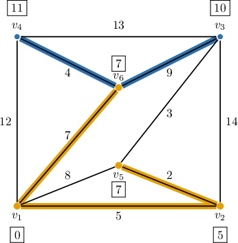

- for $v_4,$ we have $\text{dist}[v_3] + d(v_3,v_4) = 10 + 13 = 23 \not \lt 11 = \text{dist}[v_4].$

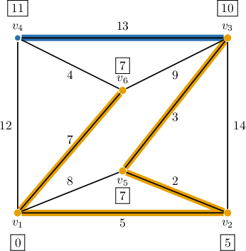

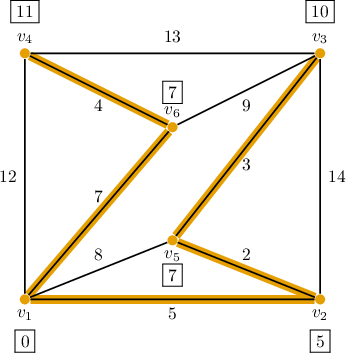

The results show that the distance from $v_1$ to $v_4$ is $11$ (highlighted in the table below).

To find the path from $v_1$ to $v_4,$ we trace back through the previous vertices: the previous vertex of $v_4$ is $v_6,$ whose previous vertex is $v_1.$

Therefore, a shortest path from $v_1$ to $v_4$ is $v_1 - v_6 - v_4.$

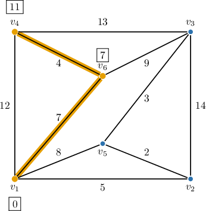

### Example: Applying One Iteration of Dijkstra's Algorithm

#### Question

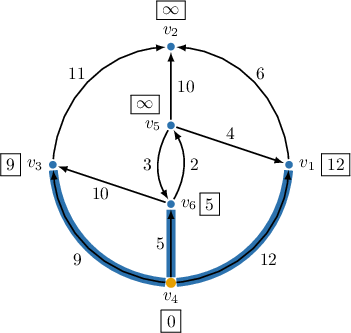

Consider the weighted graph above. Dijkstra's algorithm for finding the shortest paths is applied to the graph, starting at $v_4.$ After considering all the vertices connected to $v_4,$ we have the following configuration, where the priority queue is ordered left to right from shortest to longest path found:

Complete the blanks in the following statements.

On the next step of the algorithm, we pop the vertex $\boxed{\phantom{\mathrm{v_6}}}$ from the head of the priority queue and visit its neighbors $𝑣_{3}$

We set the distance to $\boxed{\phantom{\mathrm{odd}}}$ equal to $𝑣_{3}$, and set the previous vertex $\boxed{\phantom{\mathrm{odd}}}$.

After sorting, the priority queue is $\boxed{\phantom{\mathrm{v_5, v_3, v_1, v_2}}}$.

#### Explanation

Dijkstra's algorithm finds the shortest path from a starting vertex to each of the other vertices in a weighted graph.

The pseudocode for Dijkstra's algorithm for the shortest path is the following:

So, on the next step of Dijkstra's algorithm, we pop (i.e., remove) the vertex from the head (i.e., the front) of the priority queue. This would be the vertex $\boxed{\color{blue}v_6}.$

We inspect the distance to all the neighbors of $v_6$ still in the queue. So, we consider the vertices $𝑣_{3}$

- The current distance to $v_3$ is $\text{dist}[v_3] = 9.$ The distance to $v_3$ via $v_6$ is Since $\text{dist}[v_6] + d(v_6,v_3) = 15 \not\lt 9 = \text{dist}[v_3],$ this path is not shorter than the current one to $v_3,$ so we do nothing.

- The current distance to $v_5$ is $\text{dist}[v_5] = \infty.$ The distance to $v_5$ via $v_6$ is Since $\text{dist}[v_6] + d(v_6,v_5) = 7 < \infty = \text{dist}[v_5],$ we set the distance to $\text{dist}[v_5] = 7$ and the previous vertex to $\text{prev}[v_5] = v_6.$

In conclusion, we set the distance to $𝑣_{5}$ equal to $\boxed{\color{blue}7},$ and set the previous vertex $\boxed{\color{blue}v_6}.$

Finally, now that we have inspected the neighbors of $v_6,$ we sort the priority queue in ascending order of current distance:

$$

\text{dist}[v_5] \leq \text{dist}[v_3] \leq \text{dist}[v_1] \leq \text{dist}[v_2] \quad\Rightarrow\quad \text{Priority Queue}: \boxed{\color{blue}v_5, v_3, v_1, v_2}

$$

After considering all the vertices connected to $v_6,$ we have the following configuration:

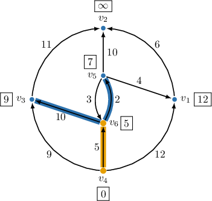

### Example: Applying Dijkstra's Algorithm

#### Question

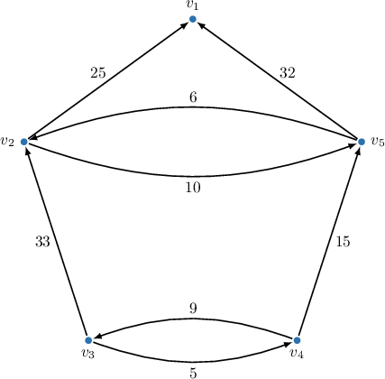

Apply Dijkstra's algorithm to the graph above starting at $v_3.$

#### Explanation

Dijkstra's algorithm finds the shortest path from a starting vertex to each of the other vertices in a weighted graph.

The pseudocode for Dijkstra's algorithm for the shortest path is the following:

With that in mind, we proceed as follows:

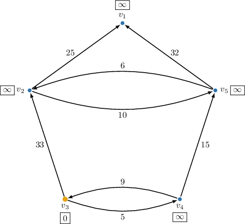

- for $v_4,$ we have $\text{dist}[v_3] + d(v_3,v_4) = 0 + 5 = 5 < \infty = \text{dist}[v_4],$ and

- for $v_2,$ we have $\text{dist}[v_3] + d(v_3,v_2) = 0 + 33 = 33 < \infty = \text{dist}[v_2].$

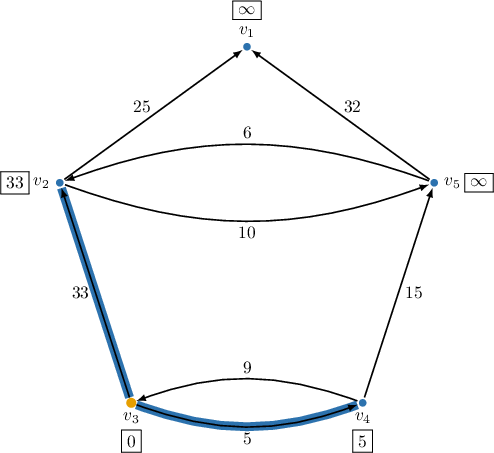

- for $v_5,$ we have $\text{dist}[v_4] + d(v_4,v_5) = 5 + 15 = 20 < \infty = \text{dist}[v_5].$

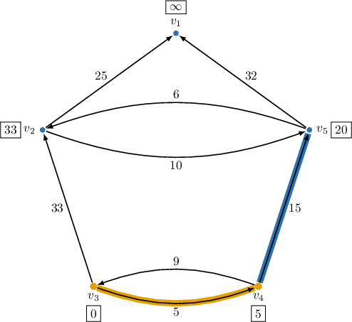

- for $v_2,$ we have $\text{dist}[v_5] + d(v_5,v_2) = 20 + 6 = 26 < 33 = \text{dist}[v_2],$ and

- for $v_1,$ we have $\text{dist}[v_5] + d(v_5,v_1) = 20 + 32 = 52 < \infty = \text{dist}[v_1].$

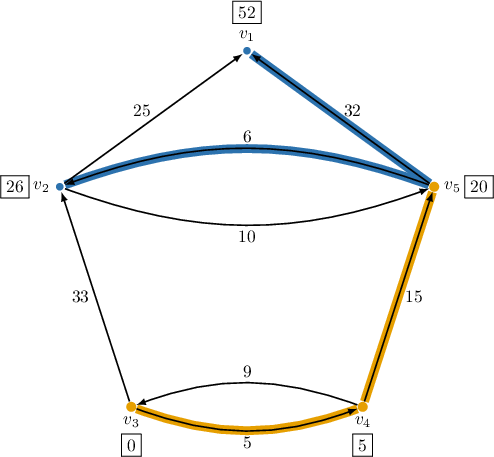

- for $v_1,$ we have $\text{dist}[v_2] + d(v_2,v_1) = 26 + 25 = 51 < 52 = \text{dist}[v_1].$

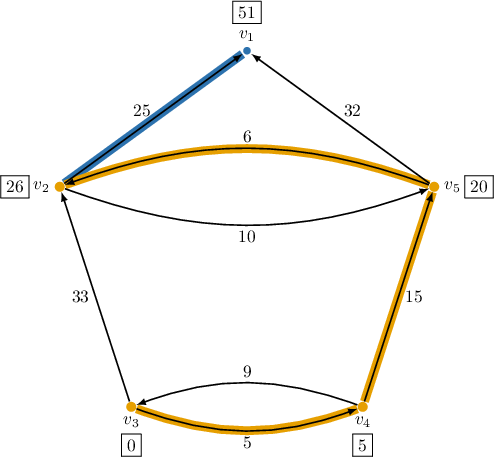

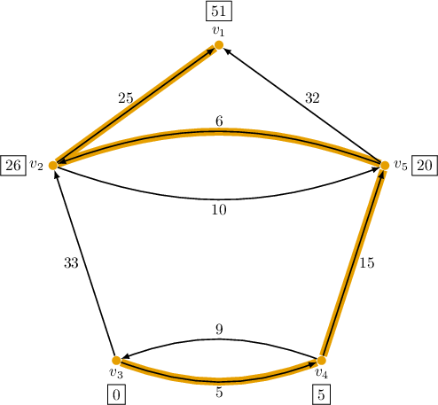

According to the results, the distance from $v_3$ to $v_1$ equals $51$ (highlighted in the table below).

To find the path from $v_3$ to $v_1,$ we trace back through the previous vertices: the previous vertex of $v_1$ is $v_2,$ whose previous vertex is $v_5,$ whose previous vertex is $v_4,$ whose previous vertex is $v_3.$

Therefore, the shortest path from $v_3$ to $v_1$ is $v_3 - v_4 - v_5 - v_2 - v_1.$

