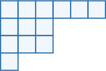
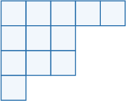

# Partitions

Source: https://www.mathacademy.com/topics/2986?courseId=109
Topic ID: 2986

## Prerequisites

- [Introduction to Sequences](../../../high-school/traditional/lessons/algebra-i/2271-introduction-to-sequences.md)

## Lesson

### Introductions

A **partition** of a positive integer $n$ is a way of writing $n$ as a sum of positive integers. Each summand in a partition is called a **part**.

Although the order of the parts is irrelevant, we usually write partitions in descending order. For example, when $n=20,$ some partitions are:

$$

\begin{aligned} & 20 \\ & 18+1+1 \\ & 15+5 \\ & 10+5+4+1 \\ & 10+5+2+2+1\end{aligned}

$$

Reordering the parts does *not* create a new partition. For example, $5+10+1+4$ is the same partition as $10+5+4+1.$

### Example: Identifying Partitions of Small Natural Numbers

#### Question

Which of the following is the same partition as $1+3+4+4?$

1. $4+3+1+4$

2. $4+4+3+3$

3. $4+4+4$

#### Explanation

First, notice that $1+3+4+4 = 12.$ So, we have a partition of $12.$

- Partition I is the same partition as $1+3+4+4$ because both contain the same summands (but in a different order).

- $4+4+3+3$ is ** a partition of $12$ since $4+4+3+3=14 \neq 12.$

- Partition III is ** the same partition as $1+3+4+4$ because they contain different summands: $4+4+4$ has three $4$'s, while $1+3+4+4$ has two $4$'s.

Therefore, the correct answer is "I only."

### Representing a Partition Using Young Diagrams

Young diagrams are a common way to represent partitions visually.

A Young diagram is a finite collection of cells arranged in left-justified rows with non-increasing lengths from top to bottom.

To visually represent a partition:

- Write its parts in descending (i.e., non-increasing) order: $a_1+a_2+...+a_k.$

- Draw $a_1$ cells in the $1$st row of the Young diagram, $a_2$ cells in the $2$nd row, and so on, up to $a_k.$

For example, the partition $6+3+3+1$ is represented using the Young diagram as follows:

### Example: Identifying the Young Diagram of a Partition

#### Question

What partition is represented by the Young diagram shown below?

#### Explanation

Each row in a Young diagram represents a summand in a partition. The rows in the diagram are ordered from the longest at the top to the shortest at the bottom.

The given diagram represents the partition

$$

5+3+3+1.

$$

### The Partition Function

The number of partitions of $n$ is called the **partition function** and is denoted by $p(n).$

For example, let’s list all the partitions for $n=5$:

$$

\begin{aligned} & 5 \\ & 4+1 \\ & 3+2 \\ & 3+1+1 \\ & 2+2+1 \\ & 2+1+1+1 \\ & 1+1+1+1+1\end{aligned}

$$

Therefore, $p(5) = 7.$

The values of the partition function for $n=1,2,3,4,5,6,7,8,9,10,11,12\dots$ are:

$$

1,\: 2,\: 3,\: 5,\: 7,\: 11,\: 15,\: 22,\: 30,\: 42,\: 56,\: 77,\:\dots

$$

There is no known algebraic formula for calculating $p(n)$ in the general case. Understanding the function $p(n)$ is an ongoing area of mathematical research.

The partition function is *not* additive, meaning that, in general,

$$

p(m+k) \neq p(m)+p(k).

$$

Moreover, for any integers $m,k>3,$ we have

$$

p(m+k)>p(m)+p(k).

$$

### Example: Evaluating the Partition Function

#### Question

Given that $p(n)$ is the number of partitions of the integer $n,$ what is the value of $p(2) \cdot p(4)?$

#### Explanation

First, let's calculate $p(2)$ and $p(4).$

- The partitions of $2$ are the following: So, there are $2$ distinct partitions, including the number $2$ itself. Hence, $p(2) = 2.$

- The partitions of $4$ are the following: So, there are $5$ distinct partitions, including the number $4$ itself. Hence, $p(4) = 5.$

Therefore, we obtain

$$

p(2) \cdot p(4) = 2 \cdot 5 = 10

$$
