# Logic Gates and Combinational Circuits

Source: https://www.mathacademy.com/topics/3791?courseId=109
Topic ID: 3791

## Prerequisites

- [Introduction to Logic Circuits](./3789-introduction-to-logic-circuits.md)

## Lesson

### Introduction

In a previous lesson, we saw how to represent a logic circuit using a switch circuit. In this lesson, we'll study how to represent logic circuits using **logic gates.**

Logic gates perform basic logical operations on one or more binary inputs to produce a binary output.

For instance, the **NOT gate** takes one binary input, $x,$ and produces the binary output $\overline{x}{:}$

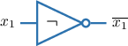

The **AND gate** takes two binary inputs, $x_1$ and $x_2,$ and produces the binary output $x_1 \land x_2{:}$

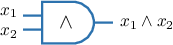

All the logic gates that we will use are shown below.

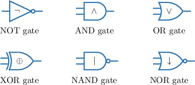

A **combinational circuit** is a type of logic circuit that uses logic gates to implement Boolean functions. For example, consider the following combinational circuit:

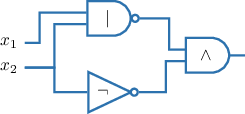

Let's find an expression representing this logic circuit. To do so, we examine each gate in turn.

- The inputs $x_1$ and $x_2$ go through the NAND gate. So, the output of this gate gives $x_1 \mid x_2,$ as shown below.

- Another input $x_2$ goes through the NOT gate. So, the output of this gate gives $\overline{x_2},$ as shown below.

- Finally, the output of the part corresponding to $x_1 \mid x_2$ and the output of $\overline{x_2}$ go through the AND gate. Therefore, the whole circuit can be represented by the expression $(x_1 \mid x_2) \land \overline{x_2}.$

### Example: Constructing a Logical Expression Given a Combinatorial Circuit

#### Question

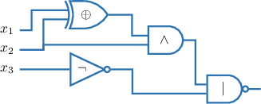

Find an expression that represents the combinatorial circuit given above.

#### Explanation

Let's examine each gate of the circuit in turn.

- The inputs $x_1$ and $x_2$ go through the XOR gate. So, the output of this gate gives $x_1 \oplus x_2,$ as shown below.

- The output of the part corresponding to $x_1 \oplus x_2$ and another input $x_2$ go through the AND gate. So, the output of this gate gives $(x_1 \oplus x_2) \land x_2,$ as shown below.

- The input ${x_3}$ go through the NOT gate. So, the output of this gate gives $\overline{x_3},$ as shown below.

- Finally, the output of the part corresponding to $(x_1 \oplus x_2) \land x_2$ and the output $\overline{x_3}$ go through the NAND gate. Therefore, the whole circuit can be represented by the expression

### Example: Constructing a Combinatorial Circuit Given a Logical Expression

#### Question

Construct a combinatorial circuit that represents the logical expression $(x_1 \mid \overline{x_2}) \oplus x_2.$

#### Explanation

To construct the corresponding circuit, we proceed as follows.

- We start by drawing the inputs $x_1$ and $x_2{:}$

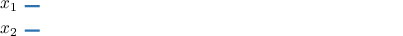

- Next, we draw the NOT gate corresponding to the negation $\overline{x_2}{:}$

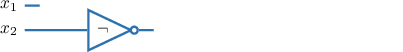

- Next, we draw the NAND gate, and forward $x_1$ and the output of $\overline{x_2}$ through that gate. This gives the circuit for $x_1 \mid \overline{x_2}{:}$

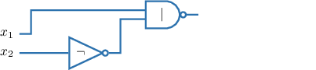

- Finally, we draw the XOR gate and branch out one more $x_2$ input. After that, we forward this new branch and the output of the NAND gate through the XOR gate. This gives the circuit for the whole expression.

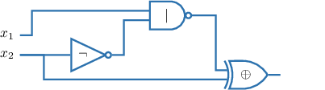

### Identifying Logic Gates by Their Form

Logic gates are typically not labeled with the symbol of the logical operator they represent. Instead, we identify each operator by its distinct shape. For instance, the NOT, AND, and OR gates have the following shapes:

An example of a combinational circuit without labels is given below, along with a label guide.

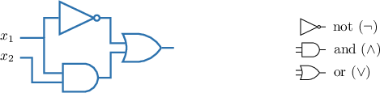

Let’s now examine each gate in the circuit in turn to find its corresponding Boolean expression.

- The input $x_1$ goes through the NOT gate. So, the output of this gate gives $\overline{x_1},$ as shown below.

- The input $x_1$ and the input of $x_2$ go through the AND gate. So, the output of this gate gives $x_1 \land x_2,$ as shown below.

- Finally, the output of the part corresponding to $\overline{x_1}$ and the output of $x_1 \land x_2$ go through the OR gate. Therefore, the whole circuit can be represented by the expression $\overline{x_1} \lor (x_1 \land x_2).$

### Example: Constructing a Logical Expression Using NOT, AND, and OR Gates

#### Question

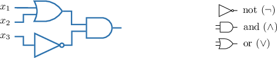

Find an expression that represents the combinatorial circuit given above.

#### Explanation

Let's examine each gate of the circuit in turn.

- The input $x_1$ and the input $x_2$ go through the OR gate. So, the output of this gate gives $x_1 \lor x_2,$ as shown below.

- The input $x_3$ goes through the NOT gate. So, the output of this gate gives $\overline{x_3},$ as shown below.

- Finally, the output of the part corresponding to ${x_1}\lor {x_2}$ and the output of $\overline x_3$ go through the AND gate. So, the output of this gate gives $({x_1} \lor {x_2}) \land\overline{x_3},$ as shown below. Therefore, the whole circuit can be represented by the expression
