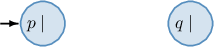
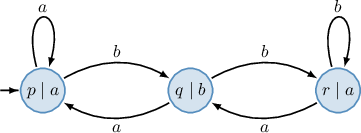
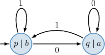

# Moore Machines

Source: https://www.mathacademy.com/topics/3796?courseId=109
Topic ID: 3796

## Prerequisites

- [Mealy Machines](./3795-mealy-machines.md)

## Lesson

### Introduction

Recall that a transducer is a machine that receives a string as input and then returns another string as output. In a previous lesson, we studied Mealy machines. In this lesson, we'll look at another type of transducer called a **Moore machine.**

A Moore machine is a six-tuple of the form $M = (Q, \Sigma, \Gamma, \delta, \omega, q_0),$ where:

- $Q$ is a nonempty finite set of **states**. These are all the possible configurations the machine can be in.

- $\Sigma$ is a nonempty finite set of **input symbols**. The machine can process this "alphabet" of symbols as inputs.

- $\Gamma$ is a nonempty finite set of **output symbols**. The machine can write this "alphabet" of symbols as outputs.

- $\delta$ is a **transition function** of the form $\delta: Q \times \Sigma \to Q.$ It takes a state and an input symbol and returns a state. This function determines how the machine moves from one state to another based on a given input symbol.

- $\omega$ is an **output function** of the form $\omega: Q \to \Gamma.$ It takes a state and returns an output symbol. This function determines what symbol to write based on a given state.

- $q_0 \in Q$ is a **start state** (or **initial state**). This is the state in which the machine begins.

We can visualize a Moore machine as a directed graph where

- vertices represent the states and their corresponding output symbol,

- the arcs, labeled with input symbols, represent transitions from one state to another, and

- the start state is labeled by the input arrow $\to.$

An example of a Moore machine is shown in the diagram below.

In this case, the machine has the following components:

- The set of states $Q = \{p,q\}$ (represented by the vertices).

- The set of input symbols $\Sigma = \{0,1\}$ (represented by the arcs' labels).

- The set of output symbols $\Omega = \{a,b\}$ (represented by the vertices' labels).

- The transition function $\delta,$ defined by the arcs with the following transitions: For instance, the arrow from $p$ to $q,$ labeled $0,$ means that $\delta(p,0) = q.$

- The output function $\omega$ is defined for each vertex (state) with the following outputs: For instance, the node labeled $q\mid a$ means that $\omega(q) = a.$

- The start state $p$ (that is labeled by the input arrow $\to$), as shown below.

### Transition and Output Tables of Moore Machines

Like Mealy machines, transition and output functions, $\delta$ and $\omega,$ are often put into tables.

Below is an example of a Moore machine's transition table (on the left) and output table (on the right). Note that we place $\to$ next to the initial state in the transition table.

Let's construct a diagram of the machine given by these tables. From the tables, we determine that the machine has the following components:

- the set of states $Q = \{p,q\}$ (given by the rows),

- the set of input symbols $\Sigma = \{0,1\}$ (given by the columns of the transition table),

- the set of output symbols $\Gamma = \{0,1\}$ (given by the values in the output table),

- the start state $p$ (labeled by $\to$ in the transition table), and

- the transition function $\delta$ and the output function $\omega$ are given in the tables.

Now that we have the components, we can construct our diagram. First, let's draw the states of our machine.

According to the transition table, $p$ is the start state, so we labeled it with an input arrow and left space in each label for the corresponding outputs.

From the tables, we also get the following:

- Consider row $p$ of the tables. Its intersection with column $0$ in the transition table is $p,$ indicating that $\delta(p,0)=p.$ So, we draw an arrow (loop) from $p$ to $p,$ labeled $0.$ Its intersection with column $1$ in the transition table is $q,$ indicating that $\delta(p,1)=q.$ So, we draw an arrow from $p$ to $q,$ labeled $1.$ The $1$ in the output table means that $\omega(p)=1.$ So, we write $p \mid 1$ in the vertex $p.$

- Consider row $q$ of the tables. Its intersection with column $0$ in the transition table is $p,$ indicating that $\delta(q,0)=p.$ So, we draw an arrow from $q$ to $p,$ labeled $0.$ Its intersection with column $1$ in the transition table is $q,$ indicating that $\delta(q,1)=q.$ So, we draw an arrow (loop) from $q$ to $q,$ labeled $1.$ The $0$ in the output table means that $\omega(q)=0.$ So, we write $q \mid 0$ in the vertex $q.$

We have gone through every cell in both tables and added all the arcs, so our diagram is complete.

### Example: Constructing Transition and Output Tables Given a Diagram

#### Question

The diagram above shows a Moore machine. Fill in the blanks in the following table corresponding to the transition function $\delta.$

#### Explanation

In our case, the machine has the following components:

- the set of states $Q=\{p,q,r\},$

- the set of input symbols $\Sigma=\{a, b\},$

- the set of output symbols $\Gamma=\{a, b\},$ and

- the start state $p.$

With that in mind, let's determine the transition function.

First, we draw an empty table with a different state written in each row and a different input symbol written in each column:

Notice that we write $\to$ next to $p$ since it's the start state.

Next, we fill in the cells:

- There is an arrow (loop) from $p$ to $p,$ labeled $a.$ This means that $\delta(p, a)=p.$ So, we write $p$ at the intersection of row $p$ and column $a.$

- There is an arrow from $p$ to $q,$ labeled $b.$ This means that $\delta(p,b)=q.$ So, we write $q$ at the intersection of row $p$ and column $b.$

- There is an arrow from $q$ to $p,$ labeled $a.$ This means that $\delta(q,a)=p.$ So, we write $p$ at the intersection of row $q$ and column $a.$

- There is an arrow from $q$ to $r,$ labeled $b.$ This means that $\delta(q,b)=r.$ So, we write $r$ at the intersection of row $q$ and column $b.$

- There is an arrow from $r$ to $q,$ labeled $a.$ This means that $\delta(r,a)=q.$ So, we write $q$ at the intersection of row $r$ and column $a.$

- There is an arrow (loop) from $r$ to $r,$ labeled $b.$ This means that $\delta(r, b)=r.$ So, we write $r$ at the intersection of row $r$ and column $b.$

### Example: Drawing a Diagram Given Transition and Output Tables

#### Question

Construct a diagram representing the Moore machine given by the above transition table (on the left) and the output table (on the right).

#### Explanation

In our case, the machine has the following components:

- the set of states

- the set of input symbols

- the set of output symbols

- the start state and

- the transition function and the output function are given in the tables.

First, let's draw the states of our machine.

According to the transition table, is the start state, so we labeled it with an input arrow.

From the tables, we also get the following:

- Consider row of the tables. Its intersection with column in the transition table is indicating that So, we draw an arrow (loop) from to labeled Its intersection with column in the transition table is indicating that So, we draw an arrow from to labeled The in the output table means that So, we write in the -node.

- Consider row of the tables. Its intersection with column in the transition table is indicating that So, we draw an arrow (loop) from to labeled Its intersection with column in the transition table is indicating that So, we draw an arrow from to labeled The in the output table means that So, we write in the -node.

We have been through every cell in the tables, so our diagram is complete.

### Using Moore Machines to Process Strings

A Moore machine can process string by extending the definition of its output function $\omega$ to process each symbol of the string in turn.

Let $\sigma=a\beta$ be a string, where $a$ is the first symbol of $\sigma,$ and $\beta$ is the remainder of $\sigma$ after removing the first symbol. Formally, we can extend the output function $\omega$ of a Moore machine to strings recursively using

$$

\begin{aligned}𝜔(𝛿(𝑞,𝜖)) & =𝜔(𝑞), \\ 𝜔(𝛿(𝑞,𝜎)) & =𝜔(𝑞)⋅𝜔(𝛿(𝛿(𝑞,𝑎),𝛽)),\end{aligned}

$$

where $\epsilon$ denotes the empty string (the string containing no symbols), $q$ is a state of the machine, $\delta$ is the transition function, and $\cdot$ denotes a concatenation of strings. Note that an input string of length $n$ outputs a string of length $n+1.$

Let's find the output string the Moore machine below would return if it received the input string $101.$

According to the definition of the extension of the output function on the set of strings, we obtain the following:

$$

\begin{aligned}𝜔(𝛿(𝑝,101)) & =𝜔(𝑝)⋅𝜔(𝛿(𝛿(𝑝,1),01)) \\ & =𝑏⋅𝜔(𝛿(𝑝,01)) \\ & =𝑏⋅𝜔(𝑝)⋅𝜔(𝛿(𝛿(𝑝,0),1)) \\ & =𝑏𝑏⋅𝜔(𝛿(𝑞,1)) \\ & =𝑏𝑏⋅𝜔(𝑞)⋅𝜔(𝛿(𝛿(𝑞,1),𝜖)) \\ & =𝑏𝑏𝑎⋅𝜔(𝛿(𝑝,𝜖)) \\ & =𝑏𝑏𝑎⋅𝜔(𝑝) \\ & =𝑏𝑏𝑎𝑏\end{aligned}

$$

Working with the formal definition can be tricky. So, let's describe what is going on in the computations from a slightly different point of view.

- *Step 0.* Before processing the input, the machine goes to the start state $p.$ From the diagram, $\omega(p)=\boxed{b}.$ Now, the machine is ready to process inputs.

- *Step 1.* The machine is in the start state $p$ and observes the first letter of the string: From the diagram, $\delta(p,1)=p$ and $\omega(p)=\boxed{b}.$ So, the machine switches to state $p$ (in this case, does not change the state) and moves to the next letter of the string. At the same time, the machine outputs $\boxed{b}.$

- *Step 2.* The machine is in the state $p$ and observes the second letter of the string: From the diagram, $\delta(p,0)=q$ and $\omega(q)=\boxed{a}.$ So, the machine switches to state $q$ and moves to the next letter of the string. At the same time, the machine outputs $\boxed{a}.$

- *Step 3.* The machine is in the state $q$ and observes the third letter of the string: From the diagram, $\delta(q,1)=p$ and $\omega(p)=\boxed{b}.$ So, the machine switches to state $p$ and stops since the entire string has been processed. At the same time, the machine outputs $\boxed{b}.$

Therefore, the output string is $\omega(\delta(p, 101))=\boxed{bbab}.$

### Example: Applying a Moore Machine to a String

#### Question

Consider the Moore machine represented from the (transition/output) table above. If the machine received the input string $001,$ what output string would the machine return?

#### Explanation

Let $\sigma=a\beta$ be a finite sequence of input symbols (string), where $a$ is the first symbol of $\sigma$ and $\beta$ is the remainder of $\sigma$ after removing the first symbol.

Then, we can extend the output function $\omega$ of a Moore machine to strings recursively using

$$

\begin{aligned}𝜔(𝛿(𝑞,𝜖)) & =𝜔(𝑞), \\ 𝜔(𝛿(𝑞,𝜎)) & =𝜔(𝑞)⋅𝜔(𝛿(𝛿(𝑞,𝑎),𝛽)),\end{aligned}

$$

where $\epsilon$ denotes the empty string (the string containing no symbols), $q$ is a state of the machine, $\delta$ is the transition function, and $\cdot$ denotes a concatenation of strings.

Now, we can compute the result using this definition of the extension of the output function $\sigma$ on the set of strings. Recall that initial state output $\omega(p)$ must be included before processing the input strings, and for any input of string of length $n$, a Moore machine outputs the string of length $n+1.$ In our case, we obtain the following:

$$

\begin{aligned}𝜔(𝛿(𝑝,001)) & =𝜔(𝑝)⋅𝜔(𝛿(𝛿(𝑝,0),01)) \\ & =0⋅𝜔(𝛿(𝑞,01)) \\ & =0⋅𝜔(𝑞)⋅𝜔(𝛿(𝛿(𝑞,0),1)) \\ & =01⋅𝜔(𝛿(𝑝,1)) \\ & =01⋅𝜔(𝑝)⋅𝜔(𝛿(𝛿(𝑝,1),𝜖)) \\ & =010⋅𝜔(𝛿(𝑝,𝜖)) \\ & =010⋅𝜔(𝑝) \\ & =0100\end{aligned}

$$

Let's describe what is going on in the computations from a slightly different point of view.

- ** Before processing the input, the machine goes to the start state $p.$ From the table, $\omega(p)=\boxed{0}.$ Now, the machine is ready to process inputs.

- ** The machine is in the start state $p$ and observes the first letter of the string: From the tables, $\delta(p,0)=q$ and $\omega(q)=\boxed{1}.$ So, the machine switches to state $q$ and moves to the next letter of the string. At the same time, the machine outputs $\boxed{1}.$

- ** The machine is in the state $q$ and observes the second letter of the string: From the tables, $\delta(q,0)=p$ and $\omega(p)=\boxed{0}.$ So, the machine switches to state $p$ and moves to the next letter of the string. At the same time, the machine outputs $\boxed{0}.$

- ** The machine is in the state $p$ and observes the third letter of the string: From the tables, $\delta(p,1)=p$ and $\omega(p)=\boxed{0}.$ So, the machine switches to state $p$ (in this case, does not change the state) and stops since the entire string has been processed. At the same time, the machine outputs $\boxed{0}.$

Therefore, the output string is $\omega(\delta(p,001))=\boxed{0100}.$

### Moore Machines vs Mealy Machines

Mealy machines and Moore machines are both transducers. The difference between them lies in their output functions:

- The output function of a Mealy machine depends on the state *and* the input symbol: When represented in a diagram, each arc (transition) is labeled with an output value.

- The output function of a Moore machine depends on the state *only*: When represented in a diagram, each vertex (state) is labeled with an output value.

Despite these differences, both machines are equivalent in that we can construct a corresponding Moore machine for any given Mealy machine that produces the same output behavior. Conversely, we can construct a corresponding Mealy machine for any given Moore machine that replicates its behavior.

**Note**. In a Mealy-to-Moore conversion, the first output of the Moore machine is fixed by its initial state. Subsequent outputs match those of the Mealy machine, possibly with a one-symbol delay.
