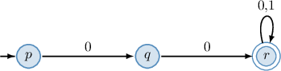
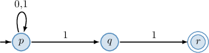
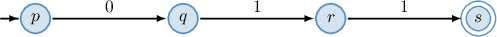
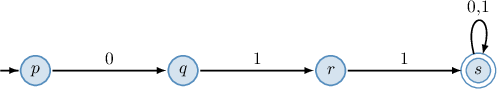
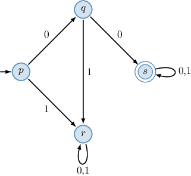

# The Language of Automata

Source: https://www.mathacademy.com/topics/3799?courseId=109
Topic ID: 3799

## Prerequisites

- [Necessary and Sufficient Conditions](../methods-of-proof/2793-necessary-and-sufficient-conditions.md)
- [Nondeterministic Finite Automata](./3798-nondeterministic-finite-automata.md)

## Lesson

### Introduction

In a previous lesson, we demonstrated how an acceptor, such as a deterministic or nondeterministic finite automaton, defines a **language** - the subset of all finite strings over the input alphabet it accepts. But how do we describe the language of a given acceptor?

We can describe a language by identifying the necessary and sufficient conditions for a string to be accepted. These conditions ensure that the automaton transitions through the correct states and eventually terminates at a final state.

For example, consider the NFA defined over the set of input symbols $\{0,1\}$ represented by the diagram below.

Let's see how this automaton processes a string. As usual, we start at $p$ (the start state, and observe the first symbol of the string.

- If the first symbol of the string is $\boxed{0},$ the automaton switches to state $q$ and proceeds to the next symbol of the string. Otherwise, if the first symbol is $1,$ the automaton gets stuck.

- If the second symbol of the string is $\boxed{0},$ the automaton switches to state $r$ and proceeds to the next symbol of the string. Otherwise, if the second symbol is $1,$ the automaton gets stuck.

- Now, being at state $r,$ the automaton goes through the remaining symbols in the string staying at state $r.$

The NFA only transitions to and terminates at final states when processing strings that start with $\boxed{00}.$ As a result, we conclude that the automaton accepts all finite strings over $\{0,1\}$ that start with $\boxed{00}$ and rejects all others.

### Example: Determining the Language Defined by an NFA

#### Question

The diagram above shows a nondeterministic finite automaton defined over the set of input symbols $\{0,1\}.$ Describe all finite strings over $\{0,1\}$ accepted by the automaton.

#### Explanation

The language of an automaton is the subset of all finite strings over the input alphabet that are accepted by the automaton.

Let's now consider how the given automaton processes a string. As usual, we start at $p$ (the start state), observing the first symbol of the string.

Notice that the loop at $p,$ labeled with $0$ and $1,$ guarantees that the automaton will be at state $p$ (and possibly in some other states) at each step while proceeding with the string. Let's suppose all symbols of the string except the two final ones have already been processed.

- If the second from the end symbol of the string is ${\color{blue}1},$ the automaton switches to states $p$ and $q$ and proceeds to the final symbol of the string.

- If the last symbol of the string is ${\color{blue}1},$ the automaton switches to states $p$ and $r.$

On the other hand, if the string does not end with $11,$ the automaton can't finish the processing at the final state $r.$

As a result, the automaton accepts all finite strings over $\{0,1\}$ that $\boxed{\color{blue}\textrm{end}}$ with $\boxed{\color{blue}11}.$ All other strings will be rejected.

### Example: Determining a NFA Defining a Language

#### Question

Determine a nondeterministic automaton that accepts the language over $\Sigma = \{0,1 \}$ consisting of finite strings starting with $011?$

#### Explanation

Recall that the language of an automaton is the subset of all finite strings over the input alphabet that are accepted by the automaton.

In our case, we need an automaton that accepts all finite strings starting with $011.$ These are the strings of the form

$$

011\ldots,

$$

where $\ldots$ denotes any (possibly empty) finite substring of $0$'s and $1$'s.

An automaton that accepts only the string $011$ is given in the following diagram:

However, we need to accept longer strings that start with $011.$ To do that, we add a loop from $s$ to itself, labeled by $0$ and $1.$

### Example: Determining the Language Defined by a DFA

#### Question

The diagram above shows a deterministic finite automaton defined over the set of input symbols $\{0,1\}.$ Describe all finite strings over $\{0,1\}$ accepted by the automaton.

#### Explanation

The language of an automaton is the subset of all finite strings over the input alphabet that are accepted by the automaton.

Let's now consider how the given automaton processes a string. As usual, we start at $p$ (the start state), observing the first symbol of the string.

First, notice that the loop at $r$ labeled with $0$ and $1$ guarantees that if the automaton is at state $r,$ it will stay at state $r$ at each step while proceeding with the string. However, $r$ is not a final state. So, we must consider all strings that never switch the automation to state $r.$

- If the first symbol of the string is ${\color{blue}0},$ the automaton switches to state $q$ and proceeds to the next symbol of the string. Otherwise, if the first symbol is $1,$ the automaton switches to state $r,$ and we reject this string.

- If, when at state $q,$ the second symbol of the string is ${\color{blue}0},$ the automaton switches to state $s$ and proceeds to the next symbol of the string. Otherwise, if the second symbol is $1,$ the automaton switches to state $r,$ and we reject this string.

- Now, being at state $s,$ the automaton goes through the remaining symbols in the string staying at state $s.$

As a result, the automaton accepts all finite strings over $\{0,1\}$ that $\boxed{\color{blue}\textrm{start}}$ with $\boxed{\color{blue}00}.$ All other strings will be rejected.

### Deterministic vs Nondeterministic Automata

Now that we've explored how automata define languages, let's compare deterministic finite automata (DFA) and nondeterministic finite automata (NFA).

- A DFA has exactly *one* transition per input symbol for each state. Given an input string, its path is uniquely determined.

- An NFA may have *multiple* transitions (or none) for the same input symbol, allowing various possible paths. It tries multiple paths and accepts if at least one path reaches a final state.

Both DFAs and NFAs recognize the same class of languages. For every NFA, there exists an equivalent DFA that accepts the same language, though the DFA might have exponentially more states. And vice versa, for every DFA, there exists an equivalent NFA.

As a result, NFAs are often more concise and more straightforward to design, especially for complex patterns. However, DFAs, while sometimes larger, are more efficient in execution because they do not require backtracking or multiple simultaneous computations.
