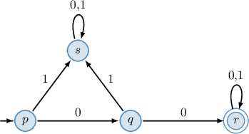

# Regular Expressions

Source: https://www.mathacademy.com/topics/3800?courseId=109
Topic ID: 3800

## Prerequisites

- [The Language of Automata](./3799-the-language-of-automata.md)

## Lesson

### Introduction

In formal language theory, we often construct new languages by applying operations to existing ones. These operations allow us to build complex languages from simpler ones.

Let $L$ and $M$ be two languages. Then, we define the following operations on languages:

- The **union** $L \cup M$ consists of all the strings that belong to either language:

- The **concatenation** $LM$ consists of all the strings that can be obtained by concatenating (i.e., joining) a string from the first language with a string from the second language (in this exact order):

- The **Kleene closure** (or **Kleene star**) $L^\ast$ consists of all the strings that can be obtained by concatenating an arbitrary (finite) number of strings from the language: Note that the empty string $\epsilon$ also belongs to $L^\ast.$

To demonstrate, consider the following languages:

$$

L = \big\{ 11, a, ab \big\}, \qquad M = \big\{ 11, 10, 00 \big\}

$$

From these two, we construct new languages as follows:

- The union of $L$ and $M$ is

- The concatenation of $L$ and $M$ is

- The Kleene closure of $L$ contains strings such as $1111,$ $11ab$ and $aaba11.$ Indeed, notice that where each individual component belongs to $L.$ On the other hand, some strings *not* in the closure $L^\ast$ are $a1a,$ since $1$'s can only appear in multiples of two (from the string $11 \in L$), or $11ba,$ since $b$ must be proceeded by an $a$ (from the string $ab \in L$).

### Example: Applying Operations on Languages

#### Question

Consider the languages $L$ and $M$ below, where $\epsilon$ denotes the empty string.

$$

L = \big\{ 00, 11, 10, 01 \big\}, \qquad M = \big\{ 11, b, ab, \epsilon \big\}

$$

Construct the language $L\cup M.$

#### Explanation

The language $L \cup M$ is just the union of the underlying languages. It consists of all the strings that belong either to $L,$ or $M,$ or both:

$$

L \cup M = \big\{ \alpha : \: \alpha \in L \: \lor \alpha \in M \big\}

$$

In our case, we have the following:

$$

\begin{aligned}𝐿∪𝑀 & ={𝛼\,:\,𝛼∈{00,11,10,01},\,𝛼∈{11,𝑏,𝑎𝑏,𝜖}} \\ & ={00,\,11,\,10,\,01,\,𝑏,\,𝑎𝑏,\,𝜖}\end{aligned}

$$

### Regular Expressions

A **regular expression** is a formal notation used to describe a language. It provides a convenient and concise way to define a set of strings based on a specific pattern. Regular expressions have a wide range of real-world applications, such as in data analysis tasks involving text processing.

The basic regular expressions are as follows:

- **Constants** The symbol $\emptyset$ (empty set) is a regular expression denoting the language The symbol $\epsilon$ (empty string) is a regular expression denoting the language In other words, $\epsilon$ corresponds to the language containing only the empty string.

- **Symbols** If $a$ is a symbol, then $\boldsymbol{a}$ (with a bold typeface) is a regular expression denoting the language In other words, $\boldsymbol{a}$ corresponds to the language containing only the symbol $a.$

We can build more complex regular expressions inductively using the following language operations:

- **Union** If $E$ and $F$ are regular expressions, then $E+F$ is a regular expression denoting the language For example, the regular expression $\boldsymbol{a}+\boldsymbol{b}$ defines the language over $\{a,b\}$ consisting of the strings $a$ and $b{:}$ Thus, the strings $a$ and $b$ (and *only* $a$ and $b$) belong to the language defined by this regular expression.

- **Concatenation** If $E$ and $F$ are regular expressions, then $EF$ is a regular expression denoting the language For example, the regular expression $\boldsymbol{a} \boldsymbol{b}$ defines the language over $\{a,b\}$ consisting of all the strings that contain precisely two symbols, where the first symbol is $a$ and the second is $b.$ No other characters or arrangements are allowed. Thus, the string $ab$ (and *only* $ab$) belongs to the language defined by this regular expression.

- **Kleene Closure (Repetition)** If $E$ is a regular expression, then $E^\ast$ is a regular expression denoting the language For example, the regular expression $\boldsymbol{a}^\ast$ defines the language over $\{a\}$ consisting of all the strings with an arbitrary (finite) number of consecutive symbols $a,$ including the empty string.

Let's see how we can combine these operations to construct a more complex regular expression in the following example.

### Example: Identifying Strings From Languages Defined by Regular Expressions

#### Question

Consider the following regular expression.

$$

\boldsymbol{1}^\ast (\boldsymbol{0} + \boldsymbol{1}) \boldsymbol{1}

$$

Which of the following strings belong to the language defined by the above regular expression?

1. $0$

2. $101$

3. $\epsilon$ (empty string)

#### Explanation

The regular expression $\boldsymbol{1}^\ast$ defines the language over $\{1\}$ consisting of all the strings starting with an arbitrary (finite) number of consecutive symbols $1,$ including the empty string.

$$

\boldsymbol{1}^\ast = \{\epsilon, 1, 11, 111, 1111,\ldots\}

$$

The regular expression $\boldsymbol{0}+\boldsymbol{1}$ defines the language over $\{0,1\}$ consisting of all strings containing exactly one $0$ or $1.$

$$

\boldsymbol{0}+\boldsymbol{1} = \{0,1\}

$$

The regular expression $\boldsymbol{1}$ defines the language over $\{1\}$ consisting of all the strings containing the symbol $1{:}$

$$

\boldsymbol{1} = \{1\}

$$

Then, the regular expression $\boldsymbol{1}^\ast (\boldsymbol{0} + \boldsymbol{1}) \boldsymbol{1}$ defines the concatenation of the languages described above.

$$

\begin{aligned}𝟏^{∗}(𝟎+𝟏)𝟏 & ={𝜖,1,11,111,1111…}⋅{0,1}⋅{1} \\ & ={𝜖,1,11,111,1111…}⋅{01,11} \\ & ={01,101,1101,11101,⋯,11,111,1111,…}\end{aligned}

$$

Note that $\{\varepsilon\} \cdot \{a\} = \{a\},$ where $a$ is any symbol.

Thus, the language defined by the regular expression $\boldsymbol{1}^\ast (\boldsymbol{0} + \boldsymbol{1}) \boldsymbol{1}$ contains all strings that begin with zero or more leading $1$s, followed by $0$ or $1,$ followed by a trailing $1.$

With that in mind, let's examine our strings.

- The string $0$ does not belong to the language defined by $\boldsymbol{1}^\ast (\boldsymbol{0} + \boldsymbol{1}) \boldsymbol{1}.$

- The string $101$ belongs to the language defined by $\boldsymbol{1}^\ast (\boldsymbol{0} + \boldsymbol{1}) \boldsymbol{1}.$

- The string $\epsilon$ does not belong to the language defined by $\boldsymbol{1}^\ast (\boldsymbol{0} + \boldsymbol{1}) \boldsymbol{1}.$

Therefore, the correct answer is "II only."

### Example: Building a Regular Expression That Defines a Language

#### Question

Find a regular expression that defines the language over $\{0,1\}$ consisting of all the strings that start with $1$ and end with $0?$

#### Explanation

Let's construct a regular expression corresponding to the given language.

- Our strings must start with $1.$ So, we start the expression with $\boldsymbol{1}.$

- The symbol $1$ can then be followed by any number of symbols from $\{0,1\}.$ The expression for any one symbol from $\{0,1\}$ is $\boldsymbol{0}+\boldsymbol{1}$, so, the expression for any number is $(\boldsymbol{0}+\boldsymbol{1})^\ast.$

- Finally, the strings must end with $0.$ This corresponds to the expression $\boldsymbol{0}.$

Combining all the above, we get the following regular expression:

$$

\boldsymbol{1} (\boldsymbol{0} + \boldsymbol{1})^\ast\, \boldsymbol{0}

$$

### Regular Languages, Deterministic, and Nondeterministic Automata

Deterministic finite automata (DFA), nondeterministic finite automata (NFA), and regular expressions all define the same set of languages called **regular languages**.

As a result, every regular expression corresponds to a finite automaton and vice versa, meaning they are *equivalent* in expressive power.

For instance, the following all define the same regular language, namely, the language over $\{0,1\}$ that consists of all finite strings starting with $00{:}$

- The regular expression $\boldsymbol{00}(\boldsymbol{0} + \boldsymbol{1})^\ast.$

- The NFA represented by the diagram below.

- The DFA represented by the diagram below.

