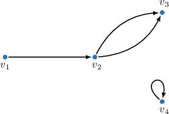
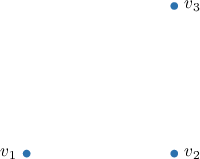
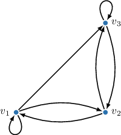
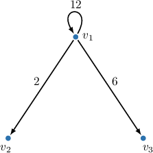
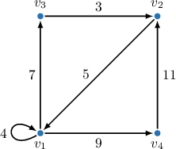
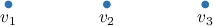
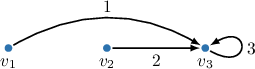

# Adjacency Matrices of Directed Graphs

Source: https://www.mathacademy.com/topics/5415?courseId=109
Topic ID: 5415

## Prerequisites

- [Adjacency Matrices](./2757-adjacency-matrices.md)
- [Walks, Paths, and Distances in Directed Graphs](./5431-walks-paths-and-distances-in-directed-graphs.md)

## Lesson

### Introduction

In a directed multigraph $G=(V,E)$ with $n$ vertices $v_1, v_2, \ldots, v_n,$ the **adjacency matrix** $A$ of the graph is an $n \times n$ matrix (table), where the entry $a_{ij}$ at the intersection of the $i$th row and the $j$th column equals the number of edges from $v_i$ to $v_j$ (in this order).

Notice that, according to this definition:

- If there are no edges connecting $v_i$ and $v_j,$ the corresponding entry is $0.$

- For $i=j,$ we count the number of loops at the vertex $v_i.$

- The adjacency matrix of a directed graph is *not* symmetric in general.

Let's look at an example of how to build the adjacency matrix for the graph below.

Let's examine the edges of the graph to determine the matrix entries step by step.

- There is an edge from $v_1$ to $v_2.$ Hence, we write $1$ in the entry $a_{12}.$

- There are two edges from $v_2$ to $v_3.$ Hence, we write $2$ in the entry $a_{23}.$

- There is an edge from $v_4$ to $v_4$ (i.e., the loop). Hence, we write $1$ in the entry $a_{44}.$

- Finally, we write $0$ for all remaining entries where no edges exist.

The adjacency matrix is completed. In the usual matrix notation, we can write this as follows.

$$

\begin{aligned}0 & 1 & 0 & 0 \\ 0 & 0 & 2 & 0 \\ 0 & 0 & 0 & 0 \\ 0 & 0 & 0 & 1\end{aligned}

$$

### Example: Building the Adjacency Matrix of a Directed Graph

#### Question

$$

\begin{aligned}1 & 1 & 1 \\ 1 & 0 & 1 \\ 0 & 1 & 1\end{aligned}

$$

The directed graph with vertices $v_1,$ $v_2,$ $v_3$ (in this exact order) has the adjacency matrix shown above. Draw the graph that corresponds to this adjacency matrix.

#### Explanation

Given a fixed order of vertices $v_1, v_2, \ldots, v_n$ in a directed graph, the ** $A$ of the graph is an $n \times n$-matrix (table), where the element $a_{ij}$ at the intersection of the $i$th row and the $j$th column represents the number of edges from $v_i$ and $v_j$ (in this order).

Note that, unlike undirected graphs, the adjacent matrix of a directed graph is ** symmetric in general.

First, we draw our vertices on the plane.

Now, let's examine the adjacency matrix $A.$

Since this is a directed graph, the matrix may not be symmetric about the main diagonal. Hence, we need to iterate through all the nonzero entries, row by row.

- Consider the $1$st row. Since $a_{11}=1,$ there is a loop at $v_1.$ Additionally, since $a_{12}=1$ and $a_{13}=1,$ we have the edges $v_1 \to v_2$ and $v_1 \to v_3.$

- Consider the $2$nd row. Since $a_{21}=1$ and $a_{23}=1,$ we have the edges $v_2 \to v_1$ and $v_2 \to v_3.$

- Consider the $3$rd row. Since $a_{32}=1,$ we have the edge $v_3 \to v_2.$ Additionally, since $a_{33}=1,$ there is a loop at $v_3.$

The resulting graph is shown below.

### Adjacency Matrices of Directed Weighted Graphs

In a directed weighted graph $G=(V,E)$ without parallel edges, with $n$ vertices $v_1, v_2, \ldots, v_n,$ the **adjacency matrix** $A$ of the graph is an $n \times n$ matrix, where the entry $a_{ij}$ at the intersection of the $i$th row and the $j$th column equals the *weight* of the edge from $v_i$ to $v_j$ (in this order). If no edge exists between $v_i$ and $v_j,$ then the entry $a_{ij}$ is considered to be $\infty.$

Notice that, according to this definition:

- The entry $a_{ii}$ is the weight of the loop at the vertex $v_i,$ or $\infty$ if no loop exists.

- The adjacency matrix of a directed, weighted graph is *not* symmetric in general.

Let's look at an example of how to build the adjacency matrix for the graph below.

Let's examine the edges of the graph to determine the matrix entries step by step.

- The weight of the edge $v_1 \to v_2$ is $2.$ Hence, we write $2$ in the entry $a_{12}.$

- The weight of the edge $v_1 \to v_3$ is $6.$ Hence, we write $6$ in the entry $a_{13}.$

- The weight of the loop at the vertex $v_1$ is $12.$ Hence, we write $12$ in the entry $a_{11}.$

- Finally, we write $\infty$ for all remaining entries where no edges exist.

The adjacency matrix is completed. Using an alternative notation, we can write it as follows:

$$

\begin{aligned}12 & 2 & 6 \\ ∞ & ∞ & ∞ \\ ∞ & ∞ & ∞\end{aligned}

$$

### Example: Building the Adjacency Matrix of a Directed Weighted Graph (Without Multiple Edges)

#### Question

Fill in the missing values in the adjacency matrix of the above graph:

#### Explanation

Given a fixed order of vertices $v_1, v_2, \ldots, v_n$ in a directed weighted graph without multiple edges, the ** $A$ of the graph is an $n \times n$-matrix (table), where the element $a_{ij}$ at the intersection of the $i$th row and the $j$th column represents the weight of the arrow from $v_i$ to $v_j.$

Note that, unlike undirected graphs, the adjacent matrix of a directed graph is ** symmetric in general. Also, if there is no edge from vertex $v_i$ to vertex $v_j,$ then we write the symbol $\infty$ at the intersection of the $i$th row and the $j$th column on the adjacency matrix.

In our case, the vertices are arranged as $v_1,v_2,v_3,v_4.$ Let's examine the edges of our graph.

- There is a loop in the vertex $v_1$ with a weight of $4.$ Hence, we write $4$ in the intersection of the $1$st row and the $1$st column in the adjacency matrix.

- There is an edge from $v_1$ to $v_4$ with a weight of $9.$ Hence, we write $9$ in the intersection of the $1$st row and the $4$th column in the adjacency matrix.

- There is no edges from $v_3$ to $v_1.$ Hence, we write the symbol $\infty$ in the intersection of the $3$rd row and the $1$st column in the adjacency matrix.

- There is no loop in the vertex $v_4.$ Hence, we write the symbol $\infty$ in the intersection of the $4$th row and the $4$th column in the adjacency matrix.

Therefore, the adjacency matrix is as follows:

### Example: Building a Graph From an Adjacency Matrix (Without Multiple Edges)

#### Question

$$

\begin{aligned}∞ & ∞ & 1 \\ ∞ & ∞ & 2 \\ ∞ & ∞ & 3\end{aligned}

$$

The directed weighted graph with vertices $v_1,$ $v_2,$ $v_3$ (in this exact order) has the adjacency matrix shown above. Draw the graph that corresponds to this adjacency matrix.

#### Explanation

Given a fixed order of vertices $v_1, v_2, \ldots, v_n$ in a directed weighted graph without multiple edges, the ** $A$ of the graph is an $n \times n$-matrix (table), where the element $a_{ij}$ at the intersection of the $i$th row and the $j$th column represents the weight of the arrow from $v_i$ to $v_j.$ When the symbol $\infty$ appears at this intersection, there is no edge from vertex $v_i$ to vertex $v_j.$

Note that, unlike undirected graphs, the adjacent matrix of a directed graph is ** symmetric in general.

First, we draw our vertices on the plane.

Now, let's examine the adjacency matrix $A.$

Since this is a directed graph, the matrix may not be symmetric about the main diagonal. Hence, we must iterate through all the entries different from the symbol $\infty,$ row by row.

- Consider the $1$st row. Since $a_{13}=1,$ we have the edge $v_1 \to v_3$ with a weight of $1.$

- Consider the $2$nd row. Since $a_{23}=2,$ we have the edge $v_2 \to v_3$ with a weight of $2.$

- Consider the $3$rd row. Since $a_{33}=3,$ there is a loop at $v_1$ with a weight of $3.$

The resulting graph is shown below.

