# Processing Strings Using Turing Machines

Source: https://www.mathacademy.com/topics/5420?courseId=109
Topic ID: 5420

## Prerequisites

- [Introduction to Turing Machines](./3802-introduction-to-turing-machines.md)

## Lesson

### Introduction

In a previous lesson, we saw how to update a Turing machine's configuration. In this lesson, we'll discuss setting up and applying a Turing machine to an input string.

In a Turing machine's starting state, a given input string is written on the tape with infinite empty cells on either side. The tape head is positioned at the leftmost cell that holds the input symbol and is labeled with the machine's start state.

Below is an example of the starting configuration of a Turing machine with a starting state of $q$ and an input string of $10\square1$.

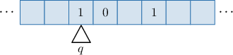

We then repeatedly update its configuration using the transition function $\delta: Q \times \Gamma \to Q \times \Gamma \times \{L,R\},$ as before. By doing so, we get one of the following three cases:

- If the machine reaches a final state in a finite number of steps, it stops.

- If the transition function $\delta(q,X)$ is undefined at some point in the process, the machine gets stuck.

- If the machine repeats a step or sequence of steps forever, it falls into an infinite cycle and never stops.

Let's demonstrate with an example.

### A Worked Example

Suppose the string $10\square1$ is written on the tape of the Turing machine given by the diagram below, where $\square$ is the blank symbol and the tape head initially observes the left-most symbol of the string in state $q_1.$

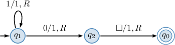

Let's see how the machine processes the data on the tape step-by-step.

- According to the description, our Turing machine starts in the following configuration:

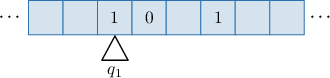

- The machine observes symbol $1$ in state $q_1.$ According to the transition diagram, $(q_1,1) \to (q_1,1,R).$ So, we should stay in state $q_1,$ write $1$ into the cell, and move right. Performing this transition gives us the following new configuration:

- The machine observes symbol $0$ in state $q_1.$ According to the transition diagram, $(q_1,0) \to (q_2,1,R).$ So, we should swap to state $q_2,$ write $1$ into the cell, and move right. Performing this transition gives us the following new configuration:

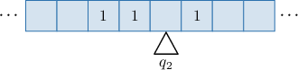

- The machine observes an empty cell $\square$ in state $q_2.$ According to the transition diagram, $(q_2,\square) \to (q_0,1,R).$ So, we should swap to state $q_0,$ write $1$ into the cell, and move right. Performing this transition gives us the following new configuration:

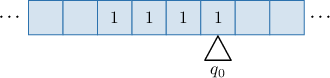

Finally, the machine observes the symbol $1$ in state $q_0.$ According to the transition diagram, $q_0$ is the final state. So, the machine stops at $q_0.$

Let's now see an example of a machine that doesn't stop at a final state.

### Example: Applying a Turing Machine to a String Using a Transition Diagram

#### Question

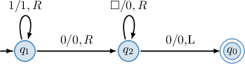

The string $0\square$ is written on the tape of the Turing machine given by the transition table above, where $\square$ is the blank symbol. The tape head initially observes the left-most symbol of the string in state $q_1.$ What would be the machine's configuration when it stops?

#### Explanation

Let's see how the machine processes the data on the tape step-by-step.

- According to the description, our Turing machine starts at the following configuration:

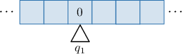

- The machine observes symbol $0$ in state $q_1.$ According to the transition diagram, $(q_1,0) \to (q_2,0,R).$ So, we should swap to state $q_2,$ write $0$ into the cell, and move right. Performing this transition gives us the following new configuration:

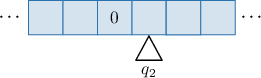

- The machine observes an empty cell $\square$ in state $q_2.$ According to the transition diagram, $(q_2,\square) \to (q_2,0,R).$ So, we should stay in state $q_2,$ write $0$ into the cell, and move right. Performing this transition gives us the following new configuration:

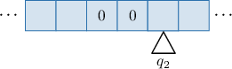

Notice that the final step will be repeated forever since the tape has infinitely many empty cells to the right. So, the machine falls into an infinite cycle and never stops.

### Example: Applying a Turing Machine to a String Using a Transition Table

#### Question

The string $01\square0$ is written on the tape of the Turing machine given by the transition table above, where $\square$ is the blank symbol. The tape head initially observes the left-most symbol of the string in state $q_1.$ What would be the machine's configuration when it stops?

#### Explanation

Let's see how the machine processes the data on the tape step-by-step.

- According to the description, our Turing machine starts in the following configuration:

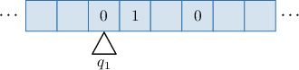

- The machine observes symbol $0$ in state $q_1.$ According to the transition table, $\delta(q_1,0) = (q_1,1,R).$ So, we should stay in state $q_1,$ write $1$ into the cell, and move right. Performing this transition gives us the following new configuration:

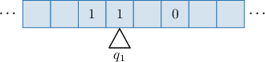

Finally, the machine observes the symbol $1$ in state $q_1.$ According to the transition table, the transition function is not defined at $(q_1,1).$ So, the machine gets stuck.

### Instantaneous Descriptions

Constructing a tape diagram for each configuration of a Turing machine can be cumbersome. Fortunately, an **instantaneous description** (ID) provides a concise shorthand notation.

For a given configuration, the ID consists of the current sequence of symbols on the tape, with the current state placed just before the symbol being observed. For example, the ID of a machine with the configuration below is $1q_10.$

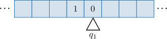

To a machine transitioning from one ID to another, we use the $\vdash$ notation. For example, if the machine above contains the command $(q_1,0) \to (q_2, 1, R),$ the next transition is expressed as follows:

$$

1q_10 \:\vdash\: 11q_2\square

$$

In this case, we add $\square$ after $q_2$ because the head now observes a blank symbol. Let's now apply a Turing machine to a string using instantaneous descriptions.

Suppose the string $00$ is written on the tape of the Turing machine given by the transition table below, where $\square$ is the blank symbol and the tape head initially observes the left-most symbol of the string in state $q_1.$

We'll write a sequence of the machine's moves encoded using instantaneous descriptions. First, let's summarize the nontrivial commands from our transition table:

Then, the machine goes through the following configurations:

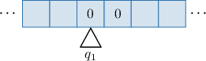

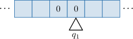

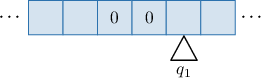

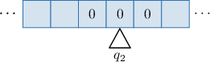

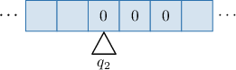

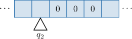

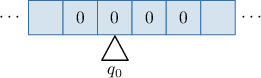

Finally, writing the sequence of IDs using $\vdash$ notation, we get the following:

$$

\begin{aligned}𝑞_{1}00 & \,⊢\,0𝑞_{1}0 \\ & \,⊢\,00𝑞_{1}◻ \\ & \,⊢\,0𝑞_{2}00 \\ & \,⊢\,𝑞_{2}000 \\ & \,⊢\,𝑞_{2}◻000 \\ & \,⊢\,0𝑞_{0}000\end{aligned}

$$

### Example: Applying a Turing Machine to a String Using Instantaneous Descriptions

#### Question

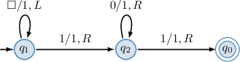

The string $101$ is written on the tape of the Turing machine given by the transition table above, where $\square$ is the blank symbol. The tape head initially observes the left-most symbol of the string in state $q_1.$ Write the sequence of the machine's configurations in terms of instantaneous descriptions.

#### Explanation

First, let's summarize the nontrivial commands from our transition table:

The machine goes through the following configurations:

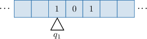

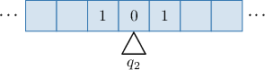

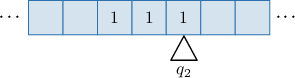

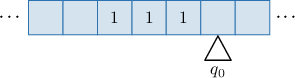

Using the $\vdash$ notation, we get the following:

$$

\begin{aligned}𝑞_{1}101 & \,⊢\,1𝑞_{2}01 \\ & \,⊢\,11𝑞_{2}1 \\ & \,⊢\,111𝑞_{0}◻\end{aligned}

$$
