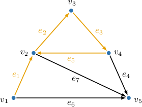
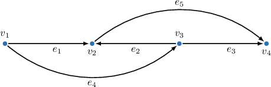
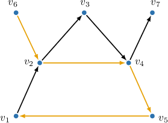
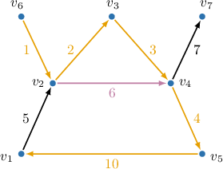
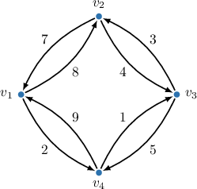
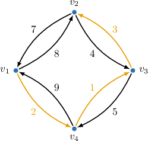

# Walks, Paths, and Distances in Directed Graphs

Source: https://www.mathacademy.com/topics/5431?courseId=109
Topic ID: 5431

## Prerequisites

- [Walks, Trails, Paths, and Distances](./951-walks-trails-paths-and-distances.md)

## Lesson

### Introduction

A **walk** $w$ of length $n$ in a directed graph is a sequence of $n$ edges $e_1,e_2,\ldots,e_n$ with the associated vertices $v_1,v_2,\ldots,v_{n+1}$ where each edge $e_i$ starts at the vertex $v_i$ and ends at $v_{i+1}$ for $i=1,2,\ldots,n.$ This can be written as follows:

$$

w=v_1 \overset{e_1}{\to} v_2 \overset{e_2}{\to} v_3 \overset{e_3}{\to} \cdots \overset{e_n}{\to} v_{n+1}

$$

In a walk, it is possible to visit any vertex or traverse any edge multiple times. As we can see, walks in a directed graph are defined exactly the same as in an undirected graph, except that traversal is only allowed along edge directions. For example, consider the graph below.

An example of a valid walk in this graph is as follows

$$

w_1=v_1 \overset{e_1}{\to} v_2 \overset{e_2}{\to} v_3 \overset{e_3}{\to} v_4 \overset{e_5}{\to} v_2

$$

Since this graph has no parallel edges, the walk above can be written just as correctly as follows:

$$

w_1=v_1 \to v_2 \to v_3 \to v_4 \to v_2

$$

Trails and paths in directed graphs are defined exactly as in undirected graphs:

- A **trail** is a walk in which all edges are distinct.

- A **path** is a walk in which all vertices (and, as a result, all edges) are distinct.

Notice that the walk $w_1$ above is a trail but *not* a path because it visits vertex $v_2$ twice.

### Example: Identifying Walks, Trails, and Paths in Directed Graphs

#### Question

In the directed graph below, how many distinct trails exist from $v_1$ to $v_4?$

#### Explanation

A ** of length $n$ in a directed graph is a sequence of $n$ edges $e_1,e_2,\ldots,e_n$ with the associated vertices $v_1,v_2,\ldots,v_{n+1}$ where the edge $e_i$ is incident on vertices $v_i$ and $v_{i+1}$ (in this order) for each $i=1,2,\ldots,n.$ This can be written as follows:

$$

v_1 \overset{e_1}{\to} v_2 \overset{e_2}{\to} v_3 \overset{e_3}{\to} \cdots \overset{e_n}{\to} v_{n+1}

$$

If the graph has no multiple (parallel) edges, we can drop the $e_i$'s in the above notation since any corresponding pair of incident vertices will uniquely determine any edge.

$$

v_1 \to v_2 \to v_3 \to \cdots \to v_{n+1}

$$

A ** is a walk in which all edges are distinct.

A ** is a walk in which all vertices (and, as a result, all edges) are distinct.

With that in mind, let's list all possible trails from $v_1$ to $v_4{:}$

- $v_1 \overset{e_1}{\to} v_2 \overset{e_5}{\to} v_4$

- $v_1 \overset{e_4}{\to} v_3 \overset{e_3}{\to} v_4$

- $v_1 \overset{e_4}{\to} v_3 \overset{e_2}{\to} v_2 \overset{e_5}{\to} v_4$

Therefore, there are $3$ distinct trails between the vertices $v_1$ and $v_4.$

### Distances in Directed Graphs

The **distance** between vertices $u$ and $v$ in an unweighted directed graph, $d(u,v),$ is the length (i.e., the number of edges) of the shortest path from $u$ to $v.$ If no path from $u$ to $v$ exists, we say that the distance is $\infty.$

For example, consider the graph below.

Let's determine the distances between $v_6$ and $v_1,$ and vice versa.

- The shortest path from $v_6$ to $v_1$ is $v_6 \to v_2 \to v_4 \to v_5 \to v_1.$ It consists of $4$ edges. Thus,

$$

\begin{aligned}𝑑(𝑣_{6},𝑣_{1}) & =4\end{aligned}

$$

- There are no paths from $v_1$ to $v_6.$ Thus,

$$

\begin{aligned}𝑑(𝑣_{1},𝑣_{6}) & =∞\end{aligned}

$$

As we can see, distances in directed graphs are *not* symmetric.

The **weight of a walk** in a weighted directed graph is the sum of the weights of the traversed edges. The same definition applies to trails and paths.

The **distance** between vertices $u$ and $v$ in a weighted directed graph, $d(u,v),$ is the weight of the *shortest path* from $u$ to $v$ (i.e., the path with the least weight). If no path from $u$ to $v$ exists, the distance is considered $\infty.$

For example, consider the same graph as above, but this time with weights, and try to determine the distance between $v_6$ and $v_1.$

As we can see, this time the shortest path from $v_2$ to $v_4$ is not the immediate edge $v_2 \to v_4$ with a weight of $6$, but rather the detour $v_2 \to v_3 \to v_4$ with a total weight of $2+3=5.$

Therefore, the shortest path from $v_6$ to $v_1$ is $(v_6 \to v_2 \to v_3 \to v_4 \to v_5 \to v_1).$ Therefore, the distance is

$$

d(v_6, v_1)=1+2+3+4+10=20

$$

### Example: Finding Distances in Directed Graphs

#### Question

Find the distance from $v_1$ to $v_2$ in the weighted directed graph above.

#### Explanation

The distance between vertices $u$ and $v$ in a graph is the length of the shortest path from $u$ to $v.$ In a weighted graph, the length of the path equals the sum of the weights of corresponding edges in the path. If no path from $u$ to $v$ exists, we say that the distance is $\infty.$

In our case, the shortest path from $v_1$ to $v_2$ is

$$

v_1 \to v_4 \to v_3 \to v_2

$$

that contains $3$ edges of cumulative length of

$$

2+1+3=6.

$$

Therefore, $d(v_1,v_2)= 6.$
