# Kahn's Algorithm

Source: https://www.mathacademy.com/topics/5551?courseId=109
Topic ID: 5551

## Prerequisites

- [The Degree of a Vertex](./954-the-degree-of-a-vertex.md)
- [Topological Ordering](./5432-topological-ordering.md)

## Lesson

### Introduction

Recall that a **topological ordering** (**TO**, or **topological sort**) of a directed acyclic graph (DAG) is a linear ordering of its vertices such that for every directed edge $u \to v$ from vertex $u$ to vertex $v$, $u$ appears before $v$ in the ordering.

We can find a topological ordering of a DAG using **Kahn's algorithm.**

Kahn's algorithm for topological ordering consists of two main steps:

- **Step 1:** Add all vertices with no *incoming* edges (where the indegree $\deg^-(v)=0$) to the TO, in any order.

- **Step 2:** Remove all vertices added in Step 1 from the graph, along with all their *outgoing* edges.

We repeat steps 1 and 2 until no vertices remain in the graph.

If, at any point, there are vertices remaining in the graph, but none have an in-degree of 0, it means the initial graph was not a directed acyclic graph (DAG). In this case, the remaining vertices form one or more cycles.

Thus, Kahn's algorithm can *detect cycles effectively and identify the vertices involved!* Cycle detection is an important problem in graph theory.

We can express Kahn's algorithm using **pseudocode.** Pseudocode is a simplified, programming language-independent way of describing an algorithm. It uses a mix of natural language and programming concepts, helping programmers to plan and visualize code logic without focusing on syntax.

The pseudocode for Kahn's algorithm is the following:

Let's illustrate Kahn's algorithm by finding a topological ordering of the following DAG. Notice that the graph is disconnected, but this does not prevent Kahn's algorithm from producing a valid topological ordering (TO).

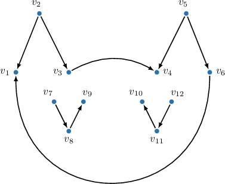

We start with an empty TO: $\{\}.$

Step 1.1. Add all vertices with an indegree of $0$ to the TO; these vertices are $v_2, v_5, v_7,$ and $v_{12}.$ Since we can list them in any order, we will use ascending order based on their indices. Hence, the TO is: $\{v_2, v_5, v_7,v_{12}\}.$

Step 2.1. Remove the vertices $v_2, v_5, v_7,$ and $v_{12}$ from the graph, along with all their outgoing edges. The resulting graph is shown below.

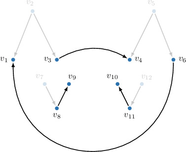

Step 2.1. Add all vertices with an indegree of $0$ to the TO; these vertices are $v_3, v_6, v_8,$ and $v_{11}.$ Hence, the TO is: $\{v_2, v_5, v_7,v_{12}, v_3, v_6, v_8, v_{11}\}.$

Step 2.2. Remove the vertices $v_3, v_6, v_8,$ and $v_{11}$ from the graph, along with all their outgoing edges.

Step 3.1. Add all vertices with an indegree of $0$ to the TO; these vertices are $v_1, v_4, v_9,$ and $v_{10}.$ Hence, the TO is: $\{v_2, v_5, v_7,v_{12}, v_3, v_6, v_8, v_{11}, v_1, v_4, v_9, v_{10}\}.$

Step 3.2. No vertices remain; therefore, the topological ordering (TO) is complete, as shown in the image below.

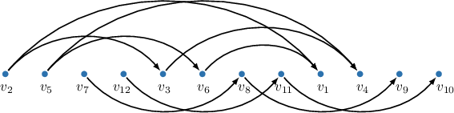

Notice that:

- At each step of the algorithm, we'll always add vertices to the topological ordering in ascending order of their indices for simplicity, but the vertices can be added in any order.

- Kahn's algorithm produces only one variant of a topological ordering (TO). In general, a TO is not unique, and finding all possible topological orderings requires other exhaustive search algorithms.

### Example: Implementing One Iteration of Kahn's Algorithm

#### Question

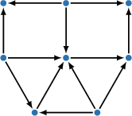

Consider the above directed acyclic graph. Suppose we want to construct a corresponding topological ordering (TO) using Kahn's algorithm. Which of the following graphs results from applying the first iteration of the algorithm?

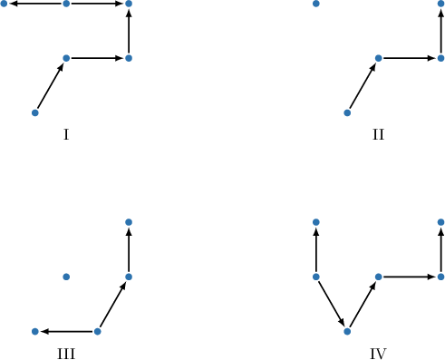

#### Explanation

Recall that Kahn's algorithm for topological ordering consists of two main substeps:

- Substep 1. Add all vertices with no ** edges to the TO, in any order.

- Substep 2. Remove all vertices processed in substep 1 from the graph and all the corresponding ** edges.

Repeat substeps 1 and 2 until no vertices remain in the graph.

In the given graph, only three vertices have no incoming edges. Hence, only these three should be added to the TO in substep 1 and then removed along with their outgoing edges in substep 2, completing the first iteration of the algorithm.

These three vertices and their outgoing edges are highlighted in the image below.

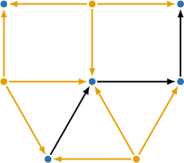

Therefore, the graph after the first iteration of the algorithm will be as follows:

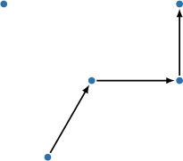

So, the correct answer is graph $\textrm{II}.$

### Example: Constructing a Topological Ordering Using Kahn's Algorithm

#### Question

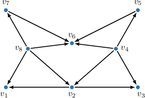

Use Kahn's algorithm to construct a topological ordering for the directed acyclic graph above.

#### Explanation

Recall that Kahn's algorithm for topological ordering (TO) consists of two main substeps:

- Substep 1. Add all vertices with no ** edges to the TO, in any order.

- Substep 2. Remove all vertices processed in substep 1 from the graph and all the corresponding ** edges.

Repeat substeps 1 and 2 until no vertices remain in the graph.

The pseudocode for Kahn's algorithm is the following:

With that in mind, we proceed as follows:

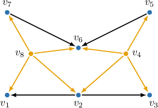

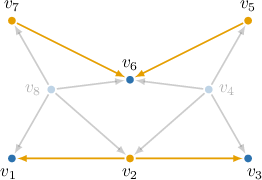

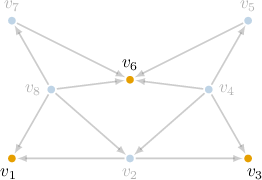

After completing all the steps, we obtained the following topological ordering:

$$

v_4, v_8, v_2, v_5, v_7, v_1, v_3,v_6

$$

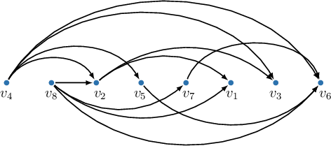
