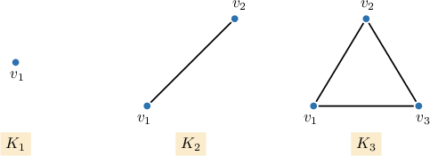
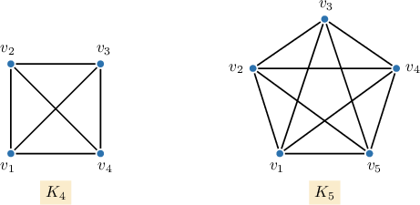
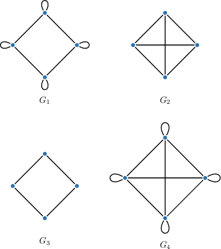
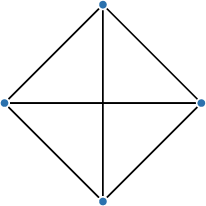
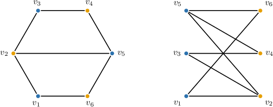
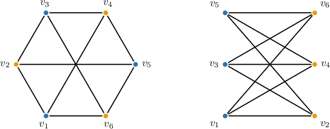

# Complete and Bipartite Graphs

Source: https://www.mathacademy.com/topics/5639?courseId=109
Topic ID: 5639

## Prerequisites

- [The Rules of Sum and Product](../../../high-school/traditional/lessons/geometry/161-the-rules-of-sum-and-product.md)
- [Partitions of Sets](../methods-of-proof/240-partitions-of-sets.md)
- [Finite Linear Series](./786-finite-linear-series.md)
- [The Degree of a Vertex](./954-the-degree-of-a-vertex.md)
- [Subgraphs and Graph Complements](./1260-subgraphs-and-graph-complements.md)
- [Cycles in Graphs](./1702-cycles-in-graphs.md)
- [Disjoint Sets](../methods-of-proof/2789-disjoint-sets.md)

## Lesson

### Introduction

The **complete graph** on $n$ vertices, denoted by $K_n,$ is the simple undirected graph on $n$ vertices in which each pair of vertices is connected by an edge. That is, any two vertices in a complete graph are adjacent.

The complete graphs on $1,2,3,4,$ and $5$ vertices are shown below.

Properties of the complete graph $K_n$:

- Each vertex has degree $n-1.$

- The complement graph is an empty graph (a graph with $n$ isolated vertices).

- The total number of edges is $\dfrac{n(n-1)}{2}.$

To see why the last property is true, suppose we're counting the number of edges in a complete graph $K_n$ with vertices $v_1, v_2, \ldots, v_n.$

- $v_1$ is adjacent to $(n-1)$ other vertices.

- $v_2$ is adjacent to $(n-2)$ other vertices (as well as $v_1$ which we already counted).

- $v_3$ is adjacent to $(n-3)$ other vertices (as well as $v_1$ and $v_2$ which we already counted).

- $\quad \vdots$

- $v_{n-1}$ is adjacent to $v_n$ (as well as $v_1, v_2, \ldots, v_{n-2}$ which we already counted).

Thus, the total number of edges is

$$

\begin{aligned}(𝑛−1)+(𝑛−2)+⋯+2+1=\underset{\underset{𝑖=1}{∑}}{\overset{}{𝑛−1}}𝑖=\frac{𝑛(𝑛−1)}{2}.\end{aligned}

$$

### Example: Identifying Complete Graphs

#### Question

Which of the following is the complete graph on $4$ vertices?

#### Explanation

The complete graph on $n$ vertices is the simple (no loops or multiple edges) graph with $n$ vertices where every two vertices are adjacent. It's denoted by $K_n.$

The complete graph $K_4$ on $4$ vertices can be represented as follows:

Therefore, the correct answer is $G_2.$

### Bipartite Graphs

A **bipartite graph** (or *bigraph*) is a graph $G=(V, E)$ whose vertex set can be partitioned into two disjoint subsets $V_1$ and $V_2$ (i.e., $V_1 \cup V_2 = V$ and $V_1 \cap V_2 = \emptyset$) such that each edge connects a vertex from $V_1$ to a vertex from $V_2.$

Equivalently, in a bipartite graph, adjacent vertices always belong to different subsets $V_1$ and $V_2.$ As a result, bipartite graphs cannot contain odd-length cycles.

For example, consider the graph $G$ shown below (on the left) and its partition (on the right), which demonstrates that it is bipartite.

As you can see above, we have redrawn the graph $G$ in a way that clearly shows there are no edges between vertices within the subset $V_1=\left\{v_1,v_3,v_5\right\}$ or within the subset $V_2=\left\{v_2,v_4,v_6\right\}.$

In a **complete bipartite graph**, every vertex in the first set is connected to every vertex in the second set. A complete bipartite graph with $m=|V_1|$ and $n=|V_2|$ is denoted by $K_{m,n}.$

For example, the graph $G$ above is not a complete bipartite graph because it is missing the edges $v_1-v_4$ and $v_3 - v_6.$ By adding these two edges, we obtain the complete bipartite graph $K_{3,3}$ shown below.

By the rule of product, since $|V_1| = m,$ and $|V_2| = n,$ we have that $K_{m,n}$ has $mn$ edges. For example, the graph $K_{3,3}$ has $3\times 3 = 9$ edges.

### Example: Finding the Number of Edges in a Complete Bipartite Graph

#### Question

Calculate the number of edges of the complete bipartite graph $K_{5,6}.$

#### Explanation

The complete bipartite graph $K_{m,n}$ has $mn$ edges.

Therefore, our graph $K_{5,6}$ has

$$

mn = 5 \cdot 6 = \boxed{\color{blue}30}

$$

edges.
