# Introduction to Graphs

Source: https://www.mathacademy.com/topics/950?courseId=109
Topic ID: 950

## Prerequisites

- [Bijections](../methods-of-proof/2679-bijections.md)

## Lesson

### Introduction

A **graph** $G$ (or, more precisely, **undirected graph**) is a pair $(V, E)$ consisting of

- a set $V$ of **vertices** (or **nodes**), and

- a set $E$ of **edges** (or **arcs**),

such that each edge $e \in E$ is associated with an unordered pair of vertices $u, v \in V.$ The edge is denoted as $u-v$ or $(u,v)$.

For example, we can define the graph $G_1$ as

$$

\begin{aligned}𝐺_{1} & =(𝑉,𝐸),\end{aligned}

$$

where

$$

\begin{aligned}𝑉 & ={𝑣_{1},𝑣_{2},𝑣_{3},𝑣_{4}}\,and\,𝐸={𝑒_{1},𝑒_{2},𝑒_{3},𝑒_{4},𝑒_{5}},\end{aligned}

$$

such that each edge is associated with the vertices as follows:

Although graphs are formal mathematical entities, they can be represented graphically, just like mathematical functions are depicted as curves on the coordinate plane.

The vertices of a graph are usually shown as dots or circles on a plane, and the edges are represented by straight or curved lines connecting the corresponding vertices. However, it's important not to confuse the graph itself with its image or graphical representation.

For example, the image of the graph $G_1$ can be depicted as follows:

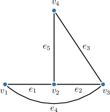

If an edge $e$ is associated with a pair of vertices $u$ and $v,$ we say that $e$ is **incident** to $u$ and $v,$ and also that $u$ and $v$ are **incident** to $e.$ For example, in the graph $G_1,$ the edge $e_1$ is incident to vertices $v_1$ and $v_2,$ $e_2$ is incident to $v_2$ and $v_3,$ and so on.

Two vertices associated with the same edge are called **adjacent**. Adjacent vertices must be connected in the graphical representation of a graph. For example, in the graph $G_1,$ the adjacent vertex pairs are $v_1$ and $v_2, v_1$ and $v_3,$ and so on.

Finally, if a vertex is not incident to any edge, it is called **isolated**. The graph $G_1$ above has no isolated vertices, but the following graph has two: $v_3$ and $v_4.$

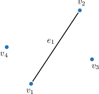

### Directed Graphs

A **directed graph** $G$ (or **digraph**) is a pair $(V, E)$ consisting of

- a set $V$ of *vertices* (or *nodes*), and

- a set $E$ of *edges* (or *arcs*),

such that each edge $e \in E$ is associated with an *ordered* pair of vertices $u, v \in V$. In other words, in a directed graph, all edges have orientations. The edges are denoted as $u \to v$ or $(u,v).$

For example, we can define the directed graph $G_2$ as

$$

\begin{aligned}𝐺_{2} & =(𝑉,𝐸),\end{aligned}

$$

where

$$

\begin{aligned}𝑉 & ={𝑣_{1},𝑣_{2},𝑣_{3},𝑣_{4}}\,and\,𝐸={𝑒_{1},𝑒_{2},𝑒_{3},𝑒_{4},𝑒_{5}},\end{aligned}

$$

such that each edge is associated with the vertices as follows:

In diagrams of directed graphs, the edges are represented by straight or curved *arrows* connecting the corresponding vertices. For example, the image of the graph $G_2$ can be as follows:

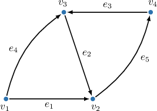

In directed graphs, the *adjacency* and *incidence* are defined similarly to those in undirected graphs. For example, in the graph $G_2,$ the vertex $v_1$ is incident to the tail of $e_1,$ $v_2$ is incident to the head of $e_1,$ and we refer to the vertices $v_1$ and $v_2$ as adjacent to each other.

### Parallel Edges and Loops

In undirected graphs, edges incident to the same pair of vertices are called **parallel** (or multiple). In directed graphs, parallel edges also must have the same direction.

For example, in the image below, the edges $e_1, e_2,$ and $e_3$ of the undirected graph on the left are all parallel. However, in the directed graph on the right, only $e_1$ and $e_2$ are parallel because $e_3$ has the opposite direction.

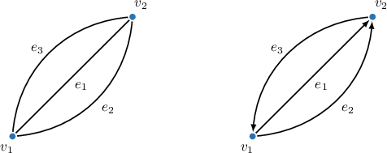

A **loop** is an edge that is incident to a single vertex. For example, in the image below, the edges $e_1$ and $e_2$ form loops in both graphs.

### Example: Recognizing Basic Terminology of Graphs

#### Question

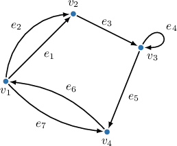

Given the directed graph above, complete the blanks to make the following statements true.

- $e_4$ is incident on $\boxed{\phantom{\textrm{v_3}}}$

- $v_2$ is $\boxed{\phantom{\textrm{a vertex}}}$ of the graph.

- $e_2$ and $e_1$ are $\boxed{\phantom{\textrm{parallel}}}$ edges.

#### Explanation

A directed graph $G$ is a tuple $(V, E)$ consisting of a set $V$ of **** (or **) and a set $E$ of **** (or **) such that each edge $e \in E$ is associated with an ordered pair of vertices. The vertices are usually depicted as dots on the plane, and the edges of a directed graph are represented by straight (or curved) arrows.

If an edge $e$ is associated with a pair of vertices $u$ and $v,$ we say that $e$ is **** on $u$ and $v,$ and also that $u$ and $v$ are **** on $e.$

Finally, edges defined by the same ordered pair of vertices are called **** (or multiple), and a **** is an edge that is incident on a single vertex.

With that in mind, we select the following options in our statements:

$e_4$ is incident on $\boxed{\color{blue}v_3}.$

$v_2$ is $\boxed{\color{blue}\textrm{a vertex}}$ of the graph.

$e_2$ and $e_1$ are $\boxed{\color{blue}\textrm{parallel}}$ edges.

### Multigraphs and Simple Graphs

A graph with at least one loop or parallel edges is called a **multigraph**. Otherwise, it is called a **simple** graph.

For example, in the image below, the graphs $G_1$ (with loops at vertices $v_2$ and $v_3$) and $G_2$ (with parallel edges from vertex $2$ to $3$) are multigraphs, while $G_3$ is a simple graph.

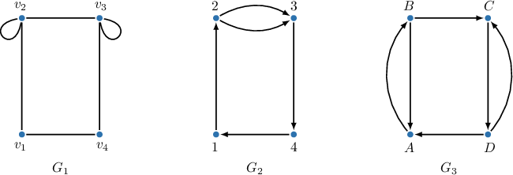

### Example: Identifying a Simple Graph

#### Question

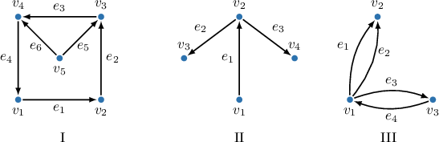

Which of the above graphs are simple?

#### Explanation

A ** is a graph with no loops or parallel edges.

With that in mind, let's examine our graphs.

- Graph I is a simple graph. Indeed, it has no loops or parallel edges.

- Graph II is a simple graph. Indeed, it has no loops or parallel edges.

- Graph III is ** simple since it has a pair of parallel edges $e_1$ and $e_2.$ Notice that the edges $e_3$ and $e_4$ are not parallel since they have opposite directions.

Therefore, the correct answer is "I and II only."

### Graph Layouts

Any graph can be drawn on a plane in various equally valid ways (layouts). The only rule is that an edge associated with vertices $u$ and $v$ in the formal model of a graph must *connect* these vertices in its graphical representation.

For example, all three layouts below represent the same graph.

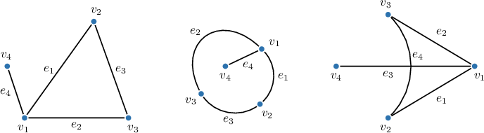

Notice that in the rightmost image, the edges $e_3$ and $e_4$ intersect without forming a vertex at the intersection point. This is allowed in graph representations and does not imply any additional meaning; however, it is preferable to avoid such overlaps if possible.

Like undirected graphs, directed graphs can be drawn on a plane in various equally valid ways. For example, the two images below represent the same graph.

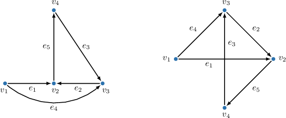

As in undirected graphs, the edges of a digraph can intersect without forming a vertex, for example, edges $e_1$ and $e_3$ in the rightmost image above.

### Isomorphic Graphs

Graphs $G$ and $H$ (with no parallel edges) are **isomorphic** if there is a bijection $f$ between the vertices of $G$ and vertices of $H$ such that any two vertices $u$ and $v$ are adjacent in $G$ if and only if $f(u)$ and $f(v)$ are adjacent in $H.$

In other words, a graph isomorphism is a bijective mapping of vertices that preserves the adjacency (connectivity by edges). We denote isomorphic graphs as $G \cong H.$

**Watch out!** In directed graphs, isomorphism preserves not only connectivity but also the directions!

For example, all three graphs below are isomorphic to each other.

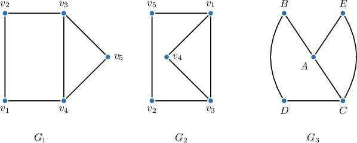

If we inspect graphs $G_1$ and $G_2$ above, we will see that in $G_1,$ the vertex $v_1$ is incident to two edges, while in $G_2,$ the vertex $v_1$ is incident to three edges. But although $G_1$ and $G_2$ look different, they have the same underlying structure and are therefore isomorphic. The following vertex mapping preserves their adjacency:

$$

v_1 \leftrightarrow v_2,\ \ \ v_2 \leftrightarrow v_5,\ \ \ v_3 \leftrightarrow v_1,\ \ \ v_4 \leftrightarrow v_3,\ \ \ v_5 \leftrightarrow v_4

$$

Next, to prove that $G_1 \cong G_3,$ we can define the following mapping:

$$

v_1 \leftrightarrow D,\ \ \ v_2 \leftrightarrow B,\ \ \ v_3 \leftrightarrow A,\ \ \ v_4 \leftrightarrow C,\ \ \ v_5 \leftrightarrow E

$$

It's not clear upon inspection that this mapping preserves adjacency. In this case, we must conduct a detailed verification to ensure that for each edge in $G_1,$ the corresponding edge exists in $G_3$ and that there are no additional edges in $G_3.$

From the table above, we can see that the vertices $v_1$ and $v_2$ are adjacent in $G_1$, and their images in $G_3,$ $f(v_1)=D$ and $f(v_2)=B$ are also adjacent, and so on. Therefore, $G_1 \cong G_3.$

In general, telling whether two graphs are isomorphic is a famously difficult problem, the **graph isomorphism problem**. For small graphs, we may be able to guess the mapping by inspection, but for larger graphs, we may need to check many possible bijections.

### Example: Identifying Isomorphic Graphs

#### Question

Which of the following graphs are isomorphic?

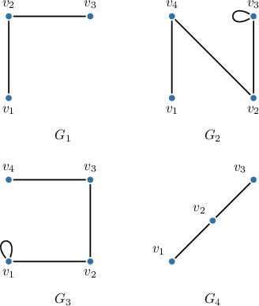

#### Explanation

Graphs $G$ and $H$ (with no parallel edges) are isomorphic if there is a bijection $f$ between the vertices of $G$ and vertices of $H$ such that any two vertices $u$ and $v$ are adjacent in $G$ if and only if $f(u)$ and $f(v)$ are adjacent in $H.$

In other words, a graph isomorphism is a bijective mapping of vertices that preserves the adjacency (connectivity by edges). Isomorphic graphs have the same structure but might be drawn differently. We denote isomorphic graphs as $G \cong H.$

With that in mind, let's examine our graphs.

Since graph isomorphism requires a bijection between the set of vertices, isomorphic graphs must have the same number of vertices. So, the only possible isomorphic pairs are

- $G_1$ and $G_4,$ and

- $G_2$ and $G_3.$

Let's consider these pairs separately.

- $G_1 \cong G_4.$ Indeed, these are the same graphs drawn differently on the plane. For example, the following mapping gives an isomorphism of $G_1$ onto $G_4{:}$

- $G_2 \cong G_3.$ Indeed, these are the same graphs drawn differently on the plane. For example, the following mapping gives an isomorphism of $G_2$ onto $G_3{:}$

Therefore, the correct answer is "$G_1 \cong G_4$ and $G_2\cong G_3.$"
