# Walks, Trails, Paths, and Distances

Source: https://www.mathacademy.com/topics/951?courseId=109
Topic ID: 951

## Prerequisites

- [Introduction to Graphs](./950-introduction-to-graphs.md)
- [The Maximum and Minimum of a Set](../methods-of-proof/4396-the-maximum-and-minimum-of-a-set.md)

## Lesson

### Introduction

A **walk** $w$ of length $n$ in an undirected graph is a sequence of $n$ edges $e_1,e_2,\ldots,e_n$ with the associated vertices $v_1,v_2,\ldots,v_{n+1}$ where the edge $e_i$ is incident on vertices $v_i$ and $v_{i+1}$ for each $i=1,2,\ldots,n.$ This can be written as follows:

$$

w=v_1 \overset{e_1}{-} v_2 \overset{e_2}{-} v_3 \overset{e_3}{-} \cdots \overset{e_n}{-} v_{n+1}

$$

In a walk, it is possible to visit any vertex or traverse any edge multiple times. For example, consider the graph below.

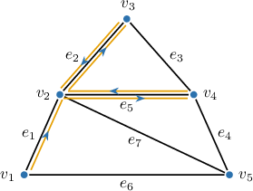

Notice that the walk $w_1$ visits vertex $v_2$ three times and traverses edges $e_2$ and $e_5$ twice each.

$$

w_1=v_1 \overset{e_1}{-} v_2 \overset{e_5}{-} v_4 \overset{e_5}{-} v_2 \overset{e_2}{-} v_3 \overset{e_2}{-} v_2

$$

In a graph with no parallel edges, we usually omit the $e_i$'s in the above notation since any corresponding pair of incident vertices uniquely determines an edge. Thus, the walk above can be written equally correctly as follows:

$$

w_1=v_1 - v_2 - v_4 - v_2 - v_3 - v_2

$$

A **trail** is a walk in which all edges are distinct. The walk $w_1$ above is not a trail because it includes the repeated edges $e_2$ and $e_5.$ As an example of a trail, consider the same graph, but with a new walk highlighted.

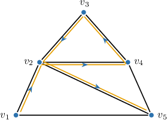

The walk $w_2$ is a valid trail because, although it has the repeated vertex $v_2,$ all its edges are distinct.

$$

w_2=v_1 - v_2 - v_4 - v_3 - v_2 - v_5

$$

A **path** is a walk in which all vertices (and, as a result, all edges) are distinct. Neither $w_1$ nor $w_2$ above is a path because they have the repeated vertex $v_2$. As an example of a path, consider the same graph, but with a new walk highlighted.

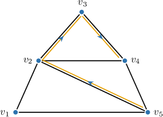

The walk $w_3$ is a valid path because it does not contain any repeated vertices or edges.

$$

w_3=v_5 - v_2 - v_3 - v_4

$$

### Example: Identifying Walks, Trails, and Paths in Undirected Graphs

#### Question

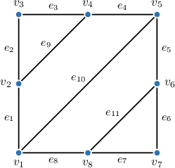

Which of the following statements are true about the graph shown above?

1. $v_2 - v_3 - v_4 - v_2 - v_3 - v_4$ is a walk

2. $v_1 - v_2 - v_4 - v_5 - v_6 - v_8 - v_1$ is a trail

3. $v_1 - v_3 - v_5 - v_7$ is a path

#### Explanation

A ** of length $n$ in an undirected graph is a sequence of $n$ edges $e_1,e_2,\ldots,e_n$ with the associated vertices $v_1,v_2,\ldots,v_{n+1}$ where the edge $e_i$ is incident on vertices $v_i$ and $v_{i+1}$ for each $i=1,2,\ldots,n.$ This can be written as follows:

$$

v_1 \overset{e_1}{-} v_2 \overset{e_2}{-} v_3 \overset{e_3}{-} \cdots \overset{e_n}{-} v_{n+1}

$$

Suppose the graph has no multiple (parallel) edges. In that case, we can drop the $e_i$'s in the above notation since any corresponding pair of incident vertices will uniquely determine any edge.

A ** is a walk in which all edges are distinct.

A ** is a walk in which all vertices (and, as a result, all edges) are distinct.

With that in mind, let's examine our statements.

- Statement I is true. Indeed, it's a walk since we can write it as where vertices and edges can be repeated.

- Statement II is true. Indeed, it's a trail since we can write it as where all edges are distinct.

- Statement III is false. Notice that it's not a walk, and consequently, it is not a path: no edge directly joins vertices $v_1$ and $v_3.$

Therefore, the correct answer is "I and II only."

### Distances

The **distance** between vertices $u$ and $v$ in a graph, $d(u,v),$ is the length (i.e., the number of edges) of the shortest path from $u$ to $v.$ If no path from $u$ to $v$ exists, we say that the distance is $\infty.$

For example, consider the graph below.

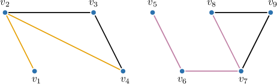

Let's determine the distances between the following vertices:

- The shortest path from $v_1$ to $v_4$ is $v_1-v_2-v_4.$ It consists of $2$ edges. Thus,

$$

\begin{aligned}𝑑(𝑣_{1},𝑣_{4}) & =2\end{aligned}

$$

- The shortest path from $v_5$ to $v_8$ is $v_5-v_6-v_7-v_8.$ It consists of $3$ edges. Thus,

$$

\begin{aligned}𝑑(𝑣_{5},𝑣_{8}) & =3\end{aligned}

$$

- There are no paths from $v_2$ to $v_5.$ Thus,

$$

\begin{aligned}𝑑(𝑣_{2},𝑣_{5}) & =∞\end{aligned}

$$

Several algorithms exist to find the shortest path between two vertices in a graph; they will be discussed in future lessons.

### Weighted Graphs

In a **weighted** graph, a numerical value (called a **weight**) is associated with each edge. Although weights can be any real numbers, only positive numbers are usually used for most practical purposes.

In visual representations, weights are shown as numbers or labels directly on the edges. For example:

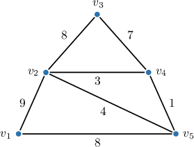

The **weight of a walk** (also referred to as *length* or *cost*) in a weighted graph is the sum of the weights of the traversed edges. The same definition applies to trails and paths. We denote the weight of a walk $w$ as $|w|,$ and also $\ell(w)$ when referring to it as length.

For example, consider the walk $w_1$ in the graph above.

$$

w_1=v_1 - v_2 - v_4 - v_2 - v_3 - v_2

$$

This walk consists of five edges, so its weight is equal to the sum of their weights:

$$

|w_1|=9+3+3+8+8=31

$$

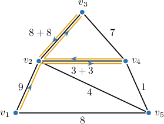

The **distance** between vertices $u$ and $v$ in a weighted graph, $d(u,v),$ is the weight of the *shortest path* (the path with the least weight) from $u$ to $v.$ As in unweighted graphs, if no path from $u$ to $v$ exists, the distance is considered $\infty.$

For example, in the graph above, the shortest path from $v_1$ to $v_3$ is $(v_1 - v_5 - v_4 - v_3);$ therefore, the distance is

$$

d(v_1, v_3)=8+1+7=16

$$

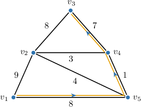

### Example: Finding Distances in Undirected Graphs

#### Question

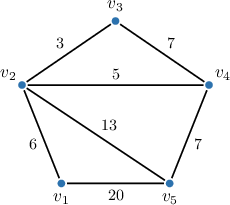

Find the distance from $v_1$ to $v_5$ in the weighted graph above.

#### Explanation

The distance between vertices $u$ and $v$ in a graph is the length of the shortest path from $u$ to $v.$ In a weighted graph, the length of the path equals the sum of the weights of corresponding edges in the path. If no path from $u$ to $v$ exists, we say that the distance is $\infty.$

In our case, the shortest path from $v_1$ to $v_5$ is

$$

v_1 - v_2 - v_4 - v_5

$$

that contains $3$ edges of cumulative length of

$$

6+5+7=18.

$$

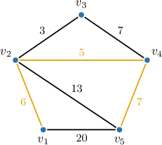

Therefore, $d(v_1,v_5)=18.$

**** There are other paths from $v_1$ to $v_5$ with equal or fewer number of edges. However, the cumulative length of these paths is greater than $18.$

### Defining Eccentricity, Radius, Diameter, and Center for Unweighted Graphs

The **eccentricity** of a vertex $v$ in a graph $G=(V,E),$ denoted $\epsilon(v),$ is the maximum distance between $v$ and any other vertex of the graph:

$$

\epsilon(v) = \max_{w \in V} \left\{ d(v,w) \right\}

$$

If there is at least one vertex $w$ such that no path exists from $v$ to $w,$ then $\epsilon(v)$ is considered $\infty.$

For example, consider the graph $G_1$ below.

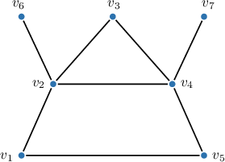

In this graph, $d(v_1,v_7)=3$ because the shortest path is $(v_1 - v_2 - v_4 - v_7).$ By symmetry, $d(v_5,v_6)=3.$

From any of the three remaining vertices $v_2, v_3,$ and $v_4,$ any other vertex can be reached by traversing at most two edges.

Therefore, the eccentricities of the vertices are as follows:

The following three graph parameters (namely, radius, diameter, and center) are based on the concept of eccentricity.

The **radius** of the graph is the minimum eccentricity of the graph's vertices:

$$

r(G) = \min_{v \in V} \{ \epsilon(v) \}

$$

In the graph above, the minimum eccentricity is $2;$ hence, $r(G_1)=2.$

The **diameter** of the graph is the maximum eccentricity of the graph vertices (alternatively, the diameter is the longest possible distance between the vertices of the graph):

$$

d(G) = \max_{v \in V} \{ \epsilon(v) \} = \max_{v, w \in V} \{ d(v,w) \}

$$

In the graph above, the maximum eccentricity is $3;$ hence, $d(G_1)=3.$

In geometry, the diameter of a circle is always twice the radius. This is not the case for radii and diameters in graphs, as illustrated by the example above, where $d=1.5r.$ For *connected* graphs, the following inequality holds:

$$

\text{radius} \leq \textrm{diameter} \leq 2 \cdot \textrm{radius}

$$

You'll learn more about connected graphs in future lessons.

The **center** of a graph is the *set* of all vertices with the minimum eccentricity (i.e., the graph's radius).

$$

\begin{aligned}{𝑣∈𝑉\,:\,𝜖(𝑣)=𝑟(𝐺)}\end{aligned}

$$

In the graph above, three vertices have the minimum eccentricity of $2;$ hence, the center of $G_1$ is $\{v_2, v_3, v_4\}.$

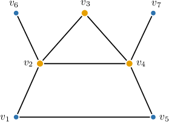

### Example: Finding Numerical Characteristics of a Graph

#### Question

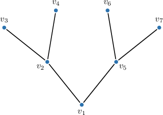

Find the radius $r(G)$ and the diameter $d(G)$ of the graph $G$ above.

#### Explanation

The ** of a graph vertex $v$ in a connected graph $G$ is the maximum distance between $v$ and any other vertex of the graph:

$$

\epsilon(v) = \max_{w \in V} \{ d(v,w) \},

$$

where $V$ is the set of graph vertices.

The ** of the graph is the minimum eccentricity of the graph vertices:

$$

r(G) = \min_{v \in V} \{ \epsilon(v) \}

$$

The ** of the graph is the maximum eccentricity of the graph vertices (alternatively, the diameter is the longest possible distance between the vertices of the graph):

$$

d(G) = \max_{v \in V} \{ \epsilon(v) \} = \max_{v, w \in V} \{ d(v,w) \}

$$

In our case, the eccentricities of the vertices are as follows:

$$

\begin{aligned}𝜖(𝑣_{1}) & =2 \\ 𝜖(𝑣_{2}) & =3 \\ 𝜖(𝑣_{3}) & =4 \\ 𝜖(𝑣_{4}) & =4 \\ 𝜖(𝑣_{5}) & =3 \\ 𝜖(𝑣_{6}) & =4 \\ 𝜖(𝑣_{7}) & =4\end{aligned}

$$

Therefore, the required radius and diameter are

$$

\begin{aligned}𝑟(𝐺)=\underset{𝑣∈𝑉}{min}{𝜖(𝑣)}=2, \\ 𝑑(𝐺)=\underset{𝑣∈𝑉}{max}{𝜖(𝑣)}=4.\end{aligned}

$$

**** For any connected graph, we have the following inequality:

$$

\text{radius} \leq \textrm{diameter} \leq 2 \cdot \textrm{radius}

$$
