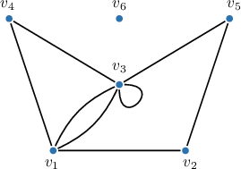
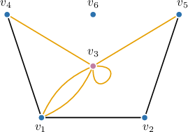
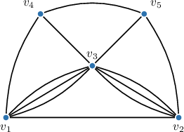
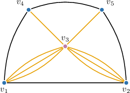
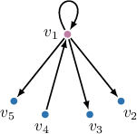
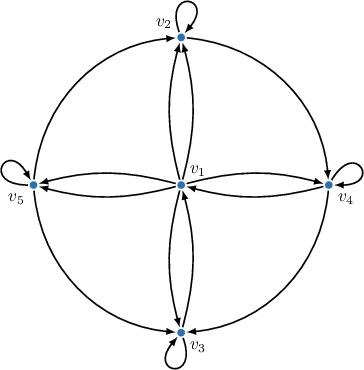
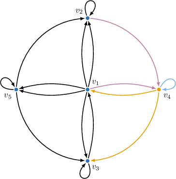
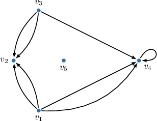

# The Degree of a Vertex

Source: https://www.mathacademy.com/topics/954?courseId=109
Topic ID: 954

## Prerequisites

- [Sigma Notation](../../../high-school/integrated-math-honors/lessons/integrated-math-ii-honors/673-sigma-notation.md)
- [Introduction to Graphs](./950-introduction-to-graphs.md)

## Lesson

### Introduction

The **degree** of a vertex in an undirected graph is the number of edges incident to the vertex. Every loop contributes $2$ to the degree of the vertex, as it is incident to the vertex twice. The degree of $v$ is denoted by $\deg(v).$

For example, consider the graph below.

Let's consider the simple cases first:

- The vertex $v_1$ has four incident edges; hence, its degree is $4.$

- The vertices $v_2, v_4,$ and $v_5$ have two incident edges each; hence, their degree is $2.$

- The vertex $v_6$ is isolated and has no incident edges; hence, its degree is $0.$

Finally, the vertex $v_3,$ as shown in the image below, has four incident edges and one loop, which contributes $2$ to the vertex degree; hence, the degree of $v_3$ is $6.$

Thus, we have:

$$

\begin{aligned}deg⁡(𝑣_{1}) & =4 \\ deg⁡(𝑣_{2}) & =deg⁡(𝑣_{4})=deg⁡(𝑣_{5})=2 \\ deg⁡(𝑣_{3}) & =6 \\ deg⁡(𝑣_{6}) & =0\end{aligned}

$$

### Example: Finding the Degree of a Vertex

#### Question

In the graph above, find the degree of the vertex $v_3.$

#### Explanation

The degree of a vertex in an undirected graph is the number of edges incident to the vertex. Also, by definition, every loop contributes $2$ to the degree of the corresponding vertex. The degree of $v$ is usually denoted by $\deg(v).$

In our case, the vertex $v_3$ has $8$ edges incident to it.

Therefore, $\deg(v_3)=8.$

### The Degree Sum Formula

In an undirected graph $G=(V,E),$ the sum of the degrees of all vertices is equal to twice the number of edges, or

$$

\sum_{v \in V} \deg(v) = 2 |E|.

$$

This can be explained by noting that when we sum the degrees of all vertices in a graph, each edge contributes exactly $2$ to the total sum.

For example, let's consider the graph we saw earlier:

The vertex degrees we determined earlier are as follows:

$$

\begin{aligned}deg⁡(𝑣_{1}) & =4 \\ deg⁡(𝑣_{2}) & =deg⁡(𝑣_{4})=deg⁡(𝑣_{5})=2 \\ deg⁡(𝑣_{3}) & =6 \\ deg⁡(𝑣_{6}) & =0\end{aligned}

$$

Hence, the sum of the degrees is

$$

\sum_{v \in V} \deg(v) = 4+2+2+2+6+0=16

$$

On the other hand, this graph has $8$ edges, hence $2|E|=2(8)=16,$ confirming our degree sum formula.

### Example: Applying the Degree Sum Formula

#### Question

An undirected graph has vertices $v_1, v_2,$ and $v_3$ of degrees $8,$ $7,$ and $3,$ respectively. If the cumulative sum of degrees for the remaining vertices equals $134,$ then how many edges does the graph have?

#### Explanation

Let $V$ be the set of vertices and $E$ be the set of edges of our graph.

Recall that, according to the sum of degrees formula for an undirected graph, we have

$$

\sum_{v \in V} \deg(v) = 2 |E|.

$$

Now, notice that the sum of the degrees of all the vertices in our graph is

$$

\sum_{v \in V} \deg(v) = (8+7+3) + 134 = 152.

$$

Substituting this into the formula above and solving for the number of edges, we obtain the following:

$$

\begin{aligned}\underset{𝑣∈𝑉}{∑}deg⁡(𝑣) & =2|𝐸| \\ 152 & =2|𝐸| \\ |𝐸| & =76\end{aligned}

$$

Therefore, the graph has $76$ edges.

### Example: Applying the Degree Sum Formula in Context

#### Question

In a class chat, students can send messages to each other via private channels. Each private channel connects exactly two students who communicate directly. David has private channels with $7$ classmates, Kevin with $5$ classmates, and Mary with $4$ classmates. If the sum of the number of private channels that each student in the class has, excluding David, Kevin, and Mary, equals $38,$ then how many different private channels are there in the class chat?

#### Explanation

First, we describe the given problem using graphs. Let the vertex set $V$ be the set of students, and connect two students by an edge if they have a private channel together, so the edge set $E$ is the set of private channels. Then $\deg(v)$ is the number of private channels that student $v$ has.

Recall that, according to the sum of degrees formula for an undirected graph, we have

$$

\sum_{v \in V} \deg(v) = 2 |E|.

$$

Now, notice that the sum of the degrees of all the vertices in our graph is

$$

\sum_{v \in V} \deg(v) = (7+5+4) + 38 = 54.

$$

Substituting this into the formula above and solving for the number of edges, we obtain the following:

$$

\begin{aligned}\underset{𝑣∈𝑉}{∑}deg⁡(𝑣) & =2|𝐸| \\ 54 & =2|𝐸| \\ |𝐸| & =27\end{aligned}

$$

Therefore, there are a total of $\boxed{\color{blue}27}$ different private channels.

### Vertex Degrees in Directed Graphs

For a vertex $v$ in a *directed* graph, the number of incoming edges is called the **indegree** of the vertex and is denoted by $\deg^-(v).$ The number of outgoing edges is called the **outdegree** of the vertex and is denoted by $\deg^+(v).$

A loop contributes $1$ to both the indegree (as the edge's head) and outdegree (as the edge's tail) of its vertex.

For example, consider the graph below.

The vertex $v_1$ has two incoming edges: one from $v_4$ and one from the loop. It also has four outgoing edges: one to each of $v_2, v_3,$ and $v_5,$ as well as one to the loop. Thus,

$$

\deg^-(v_1)=2, \ \ \ \deg^+(v_1)=4

$$

A vertex $v$ with no incoming edges $(\deg^-(v) = 0)$ is called a **source**. A vertex $v$ with no outgoing edges $(\deg^+(v) = 0)$ is called a **sink**. Any isolated vertex is both a source and a sink.

For example, consider the graph below.

The sources and sinks among the vertices are:

### Example: Finding the Degree of a Vertex in a Directed Graph

#### Question

In the graph below, find the indegree and outdegree of the vertex $v_4.$

#### Explanation

Recall that for a vertex $v$ in a directed graph, the number of incoming edges is called the ** of the vertex and is denoted $\deg^-(v).$ The number of outgoing edges is called the ** of the vertex and is denoted $\deg^+(v).$ Also, by definition, every loop in a directed graph contributes $1$ to the ** and $1$ to the ** of the corresponding vertex.

In our case, the vertex $v_4$ has $3$ incoming edges and $3$ outcoming edges, as shown below.

Therefore, $\deg^-(v_4)=3$ and $\deg^+(v_4)=3.$

### The Degree Sum Formula in Directed Graphs

In a directed graph $G=(V,E),$ the sum of the indegrees of all vertices is equal to the sum of the outdegrees of all vertices, which is also equal to the number of edges. That is,

$$

\sum_{v \in V} \deg^-(v) = \sum_{v \in V} \deg^+(v) = |E|.

$$

This can be easily explained by noting that each edge contributes exactly $1$ to the total sum of indegrees and exactly $1$ to the total sum of outdegrees.

For example, consider the graph from the previous section:

Let's find the sum of all indegrees and outdegrees:

On the other hand, this graph has $8$ edges, confirming our degree sum formula.
