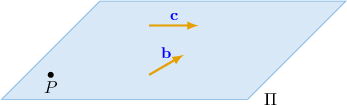
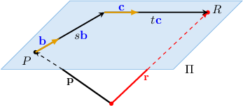
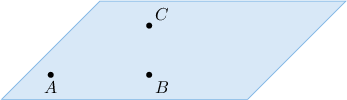
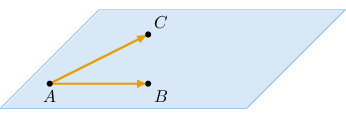

# The Parametric Equations of a Plane

Source: https://www.mathacademy.com/topics/1806?courseId=55
Topic ID: 1806

## Prerequisites

- [Calculating the Cross Product Using Determinants](../../../high-school/integrated-math-honors/lessons/integrated-math-iii-honors/245-calculating-the-cross-product-using-determinants.md)
- [The Vector Equation of a Line](./1376-the-vector-equation-of-a-line.md)

## Lesson

### Introduction

Any plane can be uniquely determined by a point and two non-parallel direction vectors. For example, let $\Pi$ be the plane that passes through the point $P(1,0,2)$ and is parallel to the vectors $\mathbf{b}= \langle 0,3,0 \rangle$ and $\mathbf{c}= \langle -1,1,1 \rangle.$

Using the vectors $\mathbf{b}$ and $\mathbf{c},$ we can construct a **parametric equation** of the plane.

First, let $R$ be any general point in the plane, with position vector $\mathbf{r}.$ Notice that we can get from $P$ to $R$ using a linear combination of $\mathbf{b}$ and $\mathbf{c}$ with some (unknown for us) coefficients $s$ and $t$, as shown below.

So, we can write the **parametric equation** of the plane as

$$

{\color{red}\mathbf{r}} = \mathbf{p}+s{\color{blue}\,\mathbf{b}}+t\,{\color{blue}\mathbf{c}}, \qquad s,t \in (-\infty,\infty).

$$

This formula works whenever $\mathbf{b}$ and $\mathbf{c}$ are not parallel.

In our case, $\mathbf{b}$ and $\mathbf{c}$ are indeed not parallel to each other. So, using column vector notation, the parametric equation for the plane $\Pi$ is given by

$$

\begin{aligned}1 \\ 0 \\ 2\end{aligned}

$$

### Example: Finding the Parametric Equation of the Plane Parallel To Two Given Vectors

#### Question

Find a parametric equation of the plane that passes through the point $P(-3,2,5)$ and is parallel to the vectors $\mathbf{b}= \langle 17,3,15 \rangle$ and $\mathbf{c}= \langle 5,0,-8 \rangle.$

#### Explanation

A parametric equation of a plane is given by

$$

\mathbf{r}=\mathbf{p}+ s\mathbf{b}+ t \mathbf{c},

$$

where $\mathbf{p}$ is the position vector of a point on the plane and the vectors $\mathbf{b}$ and $\mathbf{c}$ are parallel to the plane but not to each other.

Here, the position vector of the given point $P$ is $\mathbf{p}=\langle -3,2,5 \rangle,$ and the two vectors that are parallel to the plane (but not to each other) are $\mathbf{b}= \langle 17,3,15 \rangle$ and $\mathbf{c}= \langle 5,0,-8 \rangle.$

So, a parametric equation of the plane is given by

$$

\begin{aligned}𝐫 & =⟨−3,2,5⟩+𝑠\,⟨17,3,15⟩+𝑡\,⟨5,0,−8⟩,\,𝑠,𝑡∈(−∞,∞).\end{aligned}

$$

### Example: Finding a Normal Vector To a Plane Given by Parametric Equation

#### Question

Find a normal vector to the plane

$$

\mathbf{r}= \langle -6,3, 2 \rangle + t \langle 4, 2, -1 \rangle + s \langle 4, -3, 2 \rangle,\qquad t,\,s \in (-\infty,\infty).

$$

#### Explanation

From the parametric equation, we have that $\mathbf{v} = \langle 4, 2, -1 \rangle$ and $\mathbf{w} = \langle 4, -3, 2 \rangle$ are parallel to the plane.

Now, we need to find a normal vector of the plane. To do that, we use the cross product of $\mathbf{v}$ and $\mathbf{w}$ as follows:

$$

\begin{aligned}𝐧 & =𝐯×𝐰 \\ & =\begin{aligned}4 \\ 2 \\ −1\end{aligned}×\begin{aligned}4 \\ −3 \\ 2\end{aligned} \\ & =\begin{aligned}𝐢 & 𝐣 & 𝐤 \\ 4 & 2 & −1 \\ 4 & −3 & 2\end{aligned} \\ & =𝐢−12𝐣−20𝐤 \\ & =⟨1,−12,−20⟩\end{aligned}

$$

Therefore, a normal vector to the plane is $\mathbf{n}=\langle 1, -12, -20 \rangle.$

### Example: Finding the Parametric Equation of the Plane Parallel To Two Lines

#### Question

Find a parametric equation of the plane that passes through the point $C(2,50,-19)$ and is parallel to the lines $\mathbf{r}= \langle 2,\sqrt{6},17 \rangle + s \langle -1,7,2 \rangle$ and $\mathbf{r}= \langle 20,-44, 27 \rangle + t \langle 2\sqrt{3},9,-8 \rangle$.

#### Explanation

The direction vectors of the lines are $\mathbf{v_1}=\langle -1,7,2 \rangle$ and $\mathbf{v_2}=\langle 2\sqrt{3},9,-8 \rangle$, respectively. These vectors are parallel to the plane but not to each other.

We also know that the point $C(2,50,-19)$ lies on the plane and its position vector is $\mathbf{c}=\langle 2,50,-19 \rangle.$

So, the corresponding parametric equation of the plane is given by

$$

\begin{aligned}𝐫 & =𝐜+𝑠𝐯_{𝟏}+𝑡𝐯_{𝟐} \\ 𝐫 & =⟨2,50,−19⟩+𝑠\,⟨−1,7,2⟩+𝑡\,⟨2\sqrt{√3},9,−8⟩,\,𝑠,𝑡∈(−∞,∞)\end{aligned}

$$

### Finding the Equation of a Plane Passing Through Three Points

Any plane can be uniquely determined by three non-collinear points.

To write down a parametric equation of the plane, the trick is to use the three non-collinear points to construct two displacement vectors that are parallel to the plane.

Then we can proceed as usual to find the equation of the plane. Let's practice this technique in the following example.

### Example: Finding the Parametric Equation of the Plane Passing Through Three Given Points

#### Question

Find a parametric equation of the plane that passes through the points $A(-1,4,-3),$ $B(7,5,4),$ and $C(2,-2,8).$

#### Explanation

First, we need to find two vectors that are parallel to the plane (but not to each other). Let's use the displacement vectors $\overrightarrow{AB}$ and $\overrightarrow{AC},$ as follows:

$$

\begin{aligned}\overset{𝐴𝐵}{} & =⟨7,5,4⟩−⟨−1,4,−3⟩ \\ & =⟨8,1,7⟩ \\ \overset{𝐴𝐶}{} & =⟨2,−2,8⟩−⟨−1,4,−3⟩ \\ & =⟨3,−6,11⟩\end{aligned}

$$

Now, if we consider the position vector $\mathbf{a}=\langle -1,4,-3 \rangle$ of the point $A,$ then the corresponding parametric equation of the plane is given by

$$

\begin{aligned}𝐫 & =𝐚+𝑠\overset{𝐴𝐵}{}+𝑡\overset{𝐴𝐶}{} \\ 𝐫 & =⟨−1,4,−3⟩+𝑠⟨8,1,7⟩+𝑡⟨3,−6,11⟩,\,𝑠,𝑡∈(−∞,∞).\end{aligned}

$$

**** The form of the final equation depends on our choice of vectors and the point on the plane. We could have picked other vectors. Likewise, we could have chosen $B$ or $C$ instead of $A$ as our point on the plane. So, the answer is **!
