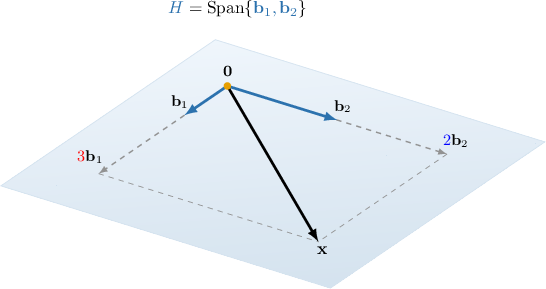
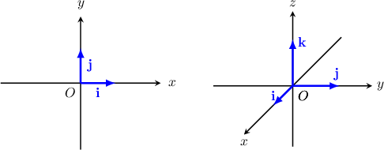

# Expressing the Coordinates of a Vector in a Given Basis

Source: https://www.mathacademy.com/topics/1864?courseId=55
Topic ID: 1864

## Prerequisites

- [Finding a Basis of a Span](./1855-finding-a-basis-of-a-span.md)

## Lesson

### Introduction

Given a subspace $H$ with a basis $\mathcal B = \{\mathbf b_1, \mathbf b_2 \}$ and a vector $\mathbf x \in H,$ the **coordinates of the vector** $\mathbf{x}$ **relative to the basis** $\mathcal{B}$ are the coefficients ${\color{red} x_1}$ and ${\color{blue} x_2}$ such that

$$

{\color{red}x_1} \mathbf{b}_1+{\color{blue}x_2} \mathbf{b}_2 = \mathbf{x}.

$$

We can write the vector $\mathbf x$ relative to the basis $\mathcal B$ using these coordinates, as follows:

$$

[\begin{aligned}𝑥_{1} \\ 𝑥_{2}\end{aligned}]

$$

To demonstrate, consider the basis $\mathcal{B}=\{\mathbf{b}_1, \mathbf{b}_2 \},$ where

$$

\begin{aligned}2 \\ 0 \\ 0\end{aligned}

$$

Also let $H = \text{span} \{\mathbf b_1, \mathbf b_2 \},$ and consider the vector $\begin{aligned}8 \\ 4 \\ 0\end{aligned}$

The vector $\mathbf x$ can be expressed as a unique linear combination of $\mathbf b_1$ and $\mathbf b_2.$ That is to say, there exist *unique coefficients* $\color{red}x_1$ and $\color{blue}x_2$ such that

$$

\begin{aligned}𝑥_{1}𝐛_{1}+𝑥_{2}𝐛_{2} & =𝐱 \\ 𝑥_{1}\begin{matrix}2 \\ 0 \\ 0\end{matrix}+𝑥_{2}\begin{matrix}1 \\ 2 \\ 0\end{matrix} & =\begin{matrix}8 \\ 4 \\ 0\end{matrix}.\end{aligned}

$$

Let's solve for these coefficients. From the above, we get the following system:

$$

\begin{aligned}2𝑥_{1}+𝑥_{2}=8 \\ 2𝑥_{2}=4\end{aligned}

$$

The unique solution of this system is

$$

[\begin{aligned}𝑥_{1} \\ 𝑥_{2}\end{aligned}]

$$

Therefore, we have that

$$

\mathbf{x} = {\color{red}3} \mathbf{b}_1+ {\color{blue}2} \mathbf{b}_2,

$$

which can be visualized as shown below.

### Example: Finding a Vector Given Its Coordinates Relative To a Given Basis

#### Question

Find the vector $\mathbf{x}$ if $\,\mathcal{B}=\{\mathbf{b}_1, \mathbf{b}_2 \}$ is a basis of $\text{Span}\{\mathbf{b}_1, \mathbf{b}_2 \},$ and

$$

\begin{aligned}3 \\ −4 \\ 0\end{aligned}

$$

#### Explanation

We know that any vector in $\text{Span}\{\mathbf{b}_1, \mathbf{b}_2 \}$ has the form

$$

\begin{aligned}𝑥_{1}\begin{matrix}3 \\ −4 \\ 0\end{matrix}+𝑥_{2}\begin{matrix}1 \\ 0 \\ 2\end{matrix}\end{aligned}

$$

where $x_1$ and $x_2$ are the coordinates relative to the basis $\,\mathcal{B}.$ Since we are told that $[\begin{aligned}−1 \\ 3\end{aligned}]$ we obtain

$$

\begin{aligned}𝐱 & =\underset{𝑥_{1}}{\underset{}{(−1)}}\begin{matrix}3 \\ −4 \\ 0\end{matrix}+\underset{𝑥_{2}}{\underset{}{(\,3\,)}}\begin{matrix}1 \\ 0 \\ 2\end{matrix} \\ & =\begin{matrix}−3 \\ 4 \\ 0\end{matrix}+\begin{matrix}3 \\ 0 \\ 6\end{matrix} \\ & =\begin{matrix}0 \\ 4 \\ 6\end{matrix}.\end{aligned}

$$

### Example: Finding the Coordinates of a Vector Relative To a Given Basis by Inspection

#### Question

Find the coordinates of the vector $\mathbf{x}$ relative to the basis $\mathcal{B}=\{\mathbf{b}_1, \mathbf{b}_2 \},$ where

$$

\begin{aligned}0 \\ 0 \\ 1\end{aligned}

$$

#### Explanation

Remember, the order of the vectors in a basis is important.

Notice that

$$

\begin{aligned}0 \\ 2 \\ −5\end{aligned}

$$

which means that

$$

\mathbf{x} = (-5) \cdot \mathbf{b}_1 + 2 \cdot \mathbf{b}_2

$$

and therefore

$$

[\begin{aligned}−5 \\ 2\end{aligned}]

$$

### Example: Finding the Coordinates of a Vector Relative To a Given Basis Containing Two Vectors

#### Question

Find the coordinates of the vector $\mathbf{x}$ relative to the basis $\mathcal{B}=\{\mathbf{b}_1, \mathbf{b}_2 \},$ where

$$

\begin{aligned}1 \\ 3 \\ 4\end{aligned}

$$

#### Explanation

We need to find $x_1$ and $x_2$ such that

$$

\begin{aligned}𝑥_{1}𝐛_{1}+𝑥_{2}𝐛_{2} & =𝐱 \\ 𝑥_{1}\begin{matrix}1 \\ 3 \\ 4\end{matrix}+𝑥_{2}\begin{matrix}3 \\ 5 \\ 0\end{matrix} & =\begin{matrix}−5 \\ −11 \\ −8\end{matrix}.\end{aligned}

$$

The equation above gives the system with the augmented matrix

$$

\begin{aligned}1 & 3 & −5 \\ 3 & 5 & −11 \\ 4 & 0 & −8\end{aligned}

$$

Row-reducing the matrix using Gaussian elimination, we obtain the following:

$$

\begin{aligned}𝑀 & =\begin{matrix}1 & 3 & −5 \\ 3 & 5 & −11 \\ 4 & 0 & −8\end{matrix} & 𝑅_{2} & :=𝑅_{2}+(−3)𝑅_{1} \\ & ∼\begin{matrix}1 & 3 & −5 \\ 0 & −4 & 4 \\ 4 & 0 & −8\end{matrix} & 𝑅_{3} & :=𝑅_{3}+(−4)𝑅_{1} \\ & ∼\begin{matrix}1 & 3 & −5 \\ 0 & −4 & 4 \\ 0 & −12 & 12\end{matrix} & 𝑅_{3} & :=𝑅_{3}+(−3)𝑅_{2} \\ & ∼\begin{matrix}1 & 3 & −5 \\ 0 & −4 & 4 \\ 0 & 0 & 0\end{matrix} & & \end{aligned}

$$

The augmented matrix above corresponds to the following system of equations:

$$

\begin{aligned}𝑥_{1}+3𝑥_{2}=−5 \\ −4𝑥_{2}=4\end{aligned}

$$

From the second equation, we get $x_2 =-1.$ Substituting this into the first equation, we obtain

$$

x_1 + 3 \left( -1 \right) = -5 \qquad \Longrightarrow \qquad x_1 = -2.

$$

Therefore, $[\begin{aligned}−2 \\ −1\end{aligned}]$

### Example: Finding the Coordinates of a Vector Relative To a Given Basis Containing More Than Two Vectors

#### Question

Find the coordinates of the vector $\mathbf{x}$ relative to the basis $\mathcal{B}=\{\mathbf{b}_1, \mathbf{b}_2, \mathbf{b}_3 \},$ where

$$

\begin{aligned}1 \\ 0 \\ 1\end{aligned}

$$

#### Explanation

We need to find $x_1,$ $x_2,$ and $x_3$ such that

$$

\begin{aligned}𝑥_{1}𝐛_{𝟏}+𝑥_{2}𝐛_{𝟐}+𝑥_{3}𝐛_{𝟑} & =𝐱 \\ 𝑥_{1}\begin{matrix}1 \\ 0 \\ 1\end{matrix}+𝑥_{2}\begin{matrix}3 \\ −9 \\ 0\end{matrix}+𝑥_{3}\begin{matrix}0 \\ −1 \\ 1\end{matrix} & =\begin{matrix}1 \\ 7 \\ 6\end{matrix}.\end{aligned}

$$

Writing the above system as an augmented matrix $M$ and reducing using Gaussian elimination, we get the following:

$$

\begin{aligned}𝑀 & =\begin{matrix}1 & 3 & 0 & 1 \\ 0 & −9 & −1 & 7 \\ 1 & 0 & 1 & 6\end{matrix} & 𝑅_{3} & :=𝑅_{3}+(−1)𝑅_{1} \\ & ∼\begin{matrix}1 & 3 & 0 & 1 \\ 0 & −9 & −1 & 7 \\ 0 & −3 & 1 & 5\end{matrix} & 𝑅_{3} & :=𝑅_{3}+(−\frac{1}{3})𝑅_{2} \\ & ∼\begin{matrix}1 & 3 & 0 & 1 \\ 0 & −9 & −1 & 7 \\ 0 & 0 & \frac{4}{3} & \frac{8}{3}\end{matrix} & & \end{aligned}

$$

The system is now

$$

\begin{aligned}𝑥_{1}+3𝑥_{2}=1 \\ −9𝑥_{2}−𝑥_{3}=7 \\ \frac{4}{3}𝑥_{3}=\frac{8}{3}.\end{aligned}

$$

From the third equation, we get $x_3 =2.$ Substituting this into the second equation, we obtain

$$

-9x_2 - 2 = 7 \qquad\Longrightarrow\qquad x_2 = -1,

$$

and substituting $x_2=-1$ into the first equation, we get

$$

x_1+3(-1) = 1 \qquad\Longrightarrow\quad x_1 = 4.

$$

Therefore, $\begin{aligned}4 \\ −1 \\ 2\end{aligned}$

### The Standard Basis

Let's consider a set of vectors

$$

\begin{aligned}1 \\ 0 \\ 0\end{aligned}

$$

Notice that the set $\mathcal{S}$ is linearly independent since the vector equation $x_1\mathbf{e}_1+x_2\mathbf{e}_2+x_3\mathbf{e}_3=\mathbf{0}$ leads to the system

$$

\begin{aligned}𝑥_{1}=0 \\ 𝑥_{2}=0 \\ 𝑥_{3}=0,\end{aligned}

$$

which has only the zero solution.

Also, notice that any vector in $\mathbb{R}^3$ can be written as a linear combination of $\mathbf{e}_1,$ $\mathbf{e}_2,$ and $\mathbf{e}_3.$ For instance,

$$

\begin{aligned}−2 \\ 0 \\ 5\end{aligned}

$$

In particular, the equation above tells us that

$$

\begin{aligned}−2 \\ 0 \\ 5\end{aligned}

$$

that is to say, the numbers $\color{red}-2,$ $\color{red}0,$ $\color{red}5$ are the coordinates of $\mathbf{v}$ relative to the basis $\mathcal{S}.$

The basis $\mathcal{S}$ is somewhat special, since the coordinates of a vector relative to this basis coincide with the components of the vector. We refer to $\mathcal{S}$ as the **standard basis**. Remember that in $\mathbb{R}^2$ and $\mathbb{R}^3$ we even have special notations for the vectors of the standard basis:

$$

[\begin{aligned}1 \\ 0\end{aligned}]

$$

In general, the standard basis of $\mathbb{R}^n$ is

$$

\begin{aligned}1 \\ 0 \\ 0 \\ ⋮ \\ 0\end{aligned}

$$
