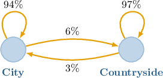

# Markov Chains

Source: https://www.mathacademy.com/topics/1911?courseId=55
Topic ID: 1911

## Prerequisites

- [The Complement of an Event](../../../high-school/traditional/lessons/geometry/1120-the-complement-of-an-event.md)
- [Multiplying a Matrix by a Column Vector](../../../high-school/integrated-math-honors/lessons/integrated-math-iii-honors/1195-multiplying-a-matrix-by-a-column-vector.md)
- [Recursive Sequences](../../../high-school/traditional/lessons/algebra-i/1226-recursive-sequences.md)

## Lesson

### Introduction

We can use repeated matrix multiplication to determine the state of a system given its initial state and some information about how one state transitions to the next state.

To explain this concretely, suppose we have a population where people live either in the city or the countryside. A study carried out by the local authority shows that, each year,

- $6\%$ of the city population relocates to the countryside,

- $3\%$ of the countryside population relocates to the city, and

- everyone else remains where they are.

This information can be represented using a diagram, like the one below.

We can also present this information as a table:

We want to use this information to determine how the population will be distributed $n$ years after the study was carried out.

First, let's turn this table into a matrix $P\mathbin{:}$

$$

[\begin{aligned}0.94 & 0.03 \\ 0.06 & 0.97\end{aligned}]

$$

Notice that this matrix has the following properties:

- it is a square matrix

- the sum of the entries in each column equals $1$

- all entries in the matrix are non-negative

A square matrix with these properties is called a **stochastic matrix**.

Now suppose that, at the time of the study, $70\%$ of the population lived in the city and $30\%$ in the countryside. We can represent this **initial state** using a so-called **stochastic vector** $\mathbf x_0,$ given by

$$

[\begin{aligned}0.70 \\ 0.30\end{aligned}]

$$

Stochastic vectors contain non-negative entries only, and the sum of the entries equals $1.$ Note that each column of $P$ is a stochastic vector.

Now that we have our stochastic matrix and initial state vector, we can use matrix multiplication to calculate the population distribution sometime after the initial study took place:

- To calculate the population distribution after one year, we calculate the product $P\mathbf x_0\mathbin{:}$ The resulting vector tells us that one year after the study, $66.7$% of the population will live in the city, and $33.3$% will live in the countryside.

- To model the distribution after $2$ years, we compute $P\mathbf x_1\mathbin{:}$ The resulting vector tells us that two years after the study, $63.7$% of the population will live in the city, and $36.3$% will live in the countryside.

### Example: Identifying Stochastic Vectors and Stochastic Matrices

#### Question

Which of the following are stochastic matrices?

$$

[\begin{aligned}−0.2 & 0 \\ 1.2 & 1\end{aligned}]

$$

#### Explanation

Recall that a stochastic vector is a vector with nonnegative entries that add up to $1.$ A matrix is stochastic if all its columns are stochastic vectors.

With that in mind, let's examine our matrices in turn.

- Matrix $\bf{U}$ is ** a stochastic matrix since its first column is not a stochastic vector (it contains negative entries):

- Matrix $\bf{V}$ is a stochastic matrix. Indeed, each column is a stochastic vector (the corresponding entries are nonnegative and add up to one):

- Matrix $\bf{W}$ is ** a stochastic matrix since its third column is not a stochastic vector (the corresponding entries don't add up to one):

Therefore, the correct answer is "$\bf{V}$ only."

### Example: Constructing a Stochastic Matrix Given Some Data

#### Question

There are two groups of people in a particular city: those who use their own vehicles and those who use public transport. A study has shown that, each year

- $35\%$ of people who used their own vehicles swap to public transport, and

- $25\%$ of people who used public transport swap to their own vehicles.

Give the stochastic matrix that describes how people change their means of transportation each year.

#### Explanation

We are given the following situation for each year:

- $35\%$ of people who used their own vehicles swap to public transport. This implies that $65\%$ of them remain using their own vehicles.

- $25\%$ of people who used public transport swap to their own vehicles. This implies that $75\%$ of them remain using public transport.

Writing this information in tabular form, we obtain the following:

Note that we can write a corresponding stochastic matrix as follows:

$$

[\begin{aligned}0.65 & 0.25 \\ 0.35 & 0.75\end{aligned}]

$$

### Markov Chains

Let's reconsider the population we looked at earlier, where the stochastic vector that represents the initial distribution of people between the city and the countryside is

$$

[\begin{aligned}0.70 \\ 0.30\end{aligned}]

$$

and the yearly change in this distribution is represented by the stochastic matrix

$$

[\begin{aligned}0.94 & 0.03 \\ 0.06 & 0.97\end{aligned}]

$$

Earlier, we found that the population distribution after $1$ and $2$ years is given by the vectors $\mathbf x_1$ and $\mathbf x_2,$ respectively, where

$$

[\begin{aligned}0.94 & 0.03 \\ 0.06 & 0.97\end{aligned}]

$$

and

$$

[\begin{aligned}0.94 & 0.03 \\ 0.06 & 0.97\end{aligned}]

$$

The vectors $\mathbf{x}_0, \mathbf{x}_1, \mathbf{x}_2, \ldots$ are called **state vectors**, and $\mathbf x_0$ is the **initial state**.

To find the state vector corresponding to the $(k+1)$th year, we left-multiply the state vector corresponding to the $k$th year by $P.$ This gives rise to the following sequence:

$$

\begin{aligned}𝐱_{1} & =𝑃𝐱_{0}, \\ 𝐱_{2} & =𝑃𝐱_{1}, \\ 𝐱_{3} & =𝑃𝐱_{2}, \\ ⋮ & \,⋮ \\ 𝐱_{𝑘+1} & =𝑃𝐱_{𝑘} \\ ⋮ & \,⋮\end{aligned}

$$

A sequence of stochastic vectors $\mathbf{x}_0, \mathbf{x}_1, \mathbf{x}_2, \ldots$ related to a stochastic matrix $P$ in this way is called a **Markov chain**.

### Example: Calculating a State Vector

#### Question

$$

[\begin{aligned}0.5 & 0.1 \\ 0.5 & 0.9\end{aligned}]

$$

Consider a Markov chain with the stochastic matrix $P$ and the initial state vector $\mathbf{x}_0$ given above. Calculate the state vector $\mathbf{x}_2.$

#### Explanation

To find the state vector $\mathbf{x}_2,$ we apply two steps of the Markov chain:

$$

\mathbf{x_1}=P\mathbf{x}_0, \qquad \mathbf{x}_2=P\mathbf{x}_1

$$

After the first step, we have

$$

\begin{aligned}𝐱_{1} & =𝑃𝐱_{0} \\ & =[\begin{matrix}0.5 & 0.1 \\ 0.5 & 0.9\end{matrix}][\begin{matrix}0.2 \\ 0.8\end{matrix}] \\ & =[\begin{matrix}0.18 \\ 0.82\end{matrix}].\end{aligned}

$$

Finally, after the second step, we obtain

$$

\begin{aligned}𝐱_{2} & =𝑃𝐱_{1} \\ & =[\begin{matrix}0.5 & 0.1 \\ 0.5 & 0.9\end{matrix}][\begin{matrix}0.18 \\ 0.82\end{matrix}] \\ & =[\begin{matrix}0.172 \\ 0.828\end{matrix}].\end{aligned}

$$

### Example: Constructing a Stochastic Matrix and Making a Prediction

#### Question

A certain industry produces $2$ types of sugar, namely sugar $A$ and sugar $B$. The following table describes how the number of consumers changes between both types of sugar in a month:

That is, $70\%$ of sugar $A$ customers switch to sugar $B$ each month, and $45\%$ of sugar $B$ customers switch to sugar $A.$

Currently, $600$ customers use sugar $A,$ while $400$ customers use sugar $B.$ How many customers will use sugar $A$ in one month? You may assume that the total number of customers doesn't change.

#### Explanation

From the table, we can build the corresponding stochastic matrix:

$$

[\begin{aligned}0.3 & 0.45 \\ 0.7 & 0.55\end{aligned}]

$$

The vector describing the number of customers for each type of sugar is

$$

[\begin{aligned}600 \\ 400\end{aligned}]

$$

Dividing the vector above by the total number of customers $(1\,000),$ we get the stochastic vector of the initial state:

$$

[\begin{aligned}600 \\ 400\end{aligned}]

$$

To find the state vector $\mathbf{x}_1$ after one month, we apply one step of the Markov chain:

$$

\mathbf{x}_1=P\mathbf{x}_0

$$

Therefore, we have

$$

\begin{aligned}𝐱_{1} & =𝑃𝐱_{0} \\ & =[\begin{matrix}0.3 & 0.45 \\ 0.7 & 0.55\end{matrix}][\begin{matrix}0.6 \\ 0.4\end{matrix}] \\ & =[\begin{matrix}0.36 \\ 0.64\end{matrix}].\end{aligned}

$$

So, after one month, $\color{blue}36\%$ of customers will use sugar $A.$ Computing $36\%$ of $1\,000,$ we obtain

$$

1\,000 \cdot 0.36 = 360.

$$

Therefore, $360$ customers will use sugar $A$ in one month.
