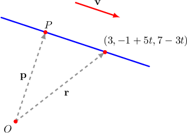
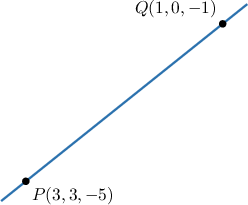

# The Parametric Equations of a Line

Source: https://www.mathacademy.com/topics/1920?courseId=55
Topic ID: 1920

## Prerequisites

- [The Vector Equation of a Line](./1376-the-vector-equation-of-a-line.md)

## Lesson

### Introduction

Suppose that we have a straight line passing through the point $P(3,-1,7)$ and that's parallel to the direction vector $\begin{aligned}0 \\ 5 \\ −3\end{aligned}$ As we know, we can write the vector equation of the line as follows:

$$

\begin{aligned}𝐫 & =𝐩+𝑡𝐯 \\ 𝐫 & =\begin{aligned}3 \\ −1 \\ 7\end{aligned}+𝑡\begin{aligned}0 \\ 5 \\ −3\end{aligned},\end{aligned}

$$

where $t \in (-\infty,\infty).$

Using the vector equation above, we can create a set of **parametric equations** where we express a general point $(x,y,z)$ in terms of the parameter $t.$

If we let $\begin{aligned}𝑥 \\ 𝑦 \\ 𝑧\end{aligned}$ be the position vector of the general point $(x,y,z),$ then the above equation can be written as

$$

\begin{aligned}𝐫 & =\begin{aligned}3 \\ −1 \\ 7\end{aligned}+𝑡\begin{aligned}0 \\ 5 \\ −3\end{aligned} \\ \begin{aligned}𝑥 \\ 𝑦 \\ 𝑧\end{aligned} & =\begin{aligned}3 \\ −1 \\ 7\end{aligned}+𝑡\begin{aligned}0 \\ 5 \\ −3\end{aligned} \\ \begin{aligned}𝑥 \\ 𝑦 \\ 𝑧\end{aligned} & =\begin{aligned}3 \\ −1+5𝑡 \\ 7−3𝑡\end{aligned}.\end{aligned}

$$

So, we have the following system of equations:

$$

\begin{aligned}𝑥=3 \\ 𝑦=−1+5𝑡 \\ 𝑧=7−3𝑡\end{aligned}

$$

The equations in the above system are called the **parametric equations** of the straight line. Geometrically, the equation states that a point belongs to the line if and only if its coordinates have the form

$$

(3, \: -1+5t, \: 7-3t),

$$

where $t \in (-\infty, \infty).$

### Example: Finding the Vector Equation of a Straight Line Given Parametrically

#### Question

Consider the straight line given by the following parametric equations:

$$

\begin{aligned}𝑥=2+2𝑡 \\ 𝑦=5𝑡 \\ 𝑧=1−𝑡\end{aligned}

$$

What would be the vector equation of the line?

#### Explanation

These parametric equations are equivalent to

$$

\begin{aligned}\begin{aligned}𝑥 \\ 𝑦 \\ 𝑧\end{aligned} & =\begin{aligned}2+2𝑡 \\ 5𝑡 \\ 1−𝑡\end{aligned} \\ \begin{aligned}𝑥 \\ 𝑦 \\ 𝑧\end{aligned} & =\begin{aligned}2 \\ 0 \\ 1\end{aligned}+\begin{aligned}2𝑡 \\ 5𝑡 \\ −𝑡\end{aligned} \\ \begin{aligned}𝑥 \\ 𝑦 \\ 𝑧\end{aligned} & =\begin{aligned}2 \\ 0 \\ 1\end{aligned}+𝑡\begin{aligned}2 \\ 5 \\ −1\end{aligned} \\ 𝐫 & =\begin{aligned}2 \\ 0 \\ 1\end{aligned}+𝑡\begin{aligned}2 \\ 5 \\ −1\end{aligned},\end{aligned}

$$

where $t \in (-\infty,\infty).$

### Example: Finding a Vector Parallel To a Straight Line Given Parametrically

#### Question

Consider the straight line given by the following parametric equations:

$$

\begin{aligned}𝑥=5−𝑡 \\ 𝑦=3 \\ 𝑧=1\end{aligned}

$$

Find a vector that is parallel to the line.

#### Explanation

First, let's find the corresponding vector equation:

$$

\begin{aligned}\begin{aligned}𝑥 \\ 𝑦 \\ 𝑧\end{aligned} & =\begin{aligned}5−𝑡 \\ 3 \\ 1\end{aligned} \\ \begin{aligned}𝑥 \\ 𝑦 \\ 𝑧\end{aligned} & =\begin{aligned}5 \\ 3 \\ 1\end{aligned}+\begin{aligned}−𝑡 \\ 0 \\ 0\end{aligned} \\ \begin{aligned}𝑥 \\ 𝑦 \\ 𝑧\end{aligned} & =\begin{aligned}5 \\ 3 \\ 1\end{aligned}+𝑡\begin{aligned}−1 \\ 0 \\ 0\end{aligned} \\ 𝐫 & =\begin{aligned}5 \\ 3 \\ 1\end{aligned}+𝑡\begin{aligned}−1 \\ 0 \\ 0\end{aligned},\end{aligned}

$$

where $t \in (-\infty,\infty).$

This implies that the line passes through the point $(5,3,1)$ and is parallel to the vector $\begin{aligned}−1 \\ 0 \\ 0\end{aligned}$

### Example: Finding the Parametric Equations of a Line

#### Question

Find the parametric equations of the line shown in the figure below.

#### Explanation

We know that the line passes through the points $P(3,3,-5)$ and $Q(1,0,-1)$. Now, we need to find a direction vector that is parallel to the given line. We can use the vector $\overrightarrow{PQ}$ as follows:

$$

\begin{aligned}𝐯 & =\overset{𝑃𝑄}{} \\ & =\overset{𝑂𝑄}{}−\overset{𝑂𝑃}{} \\ & =\begin{aligned}1 \\ 0 \\ −1\end{aligned}−\begin{aligned}3 \\ 3 \\ −5\end{aligned} \\ & =\begin{aligned}−2 \\ −3 \\ 4\end{aligned}.\end{aligned}

$$

So, the vector equation of the line is

$$

\begin{aligned}𝐫 & =𝐩+𝑡𝐯 \\ 𝐫 & =\begin{aligned}3 \\ 3 \\ −5\end{aligned}+𝑡\begin{aligned}−2 \\ −3 \\ 4\end{aligned} \\ \begin{aligned}𝑥 \\ 𝑦 \\ 𝑧\end{aligned} & =\begin{aligned}3 \\ 3 \\ −5\end{aligned}+\begin{aligned}−2𝑡 \\ −3𝑡 \\ 4𝑡\end{aligned} \\ \begin{aligned}𝑥 \\ 𝑦 \\ 𝑧\end{aligned} & =\begin{aligned}3−2𝑡 \\ 3−3𝑡 \\ −5+4𝑡\end{aligned}\end{aligned}

$$

where $t \in (-\infty,\infty).$ And finally, the parametric equations:

$$

\begin{aligned}𝑥=3−2𝑡 \\ 𝑦=3−3𝑡 \\ 𝑧=−5+4𝑡\end{aligned}

$$

### Example: Finding the Parametric Equations of a Segment

#### Question

Find the parametric equations that describe all the points on the line segment $\overline{PQ},$ where $P(1,-5,3)$ and $Q(0, 4, -4).$

#### Explanation

First, we need to find a direction vector that is parallel to the line passing through the given points. We can use the vector $\overrightarrow{PQ}$ as follows:

$$

\begin{aligned}𝐯 & =\overset{𝑃𝑄}{} \\ & =\overset{𝑂𝑄}{}−\overset{𝑂𝑃}{} \\ & =\begin{aligned}0 \\ 4 \\ −4\end{aligned}−\begin{aligned}1 \\ −5 \\ 3\end{aligned} \\ & =\begin{aligned}−1 \\ 9 \\ −7\end{aligned}\end{aligned}

$$

So, the vector equation of the line is

$$

\begin{aligned}𝐫 & =𝐩+𝑡𝐯 \\ 𝐫 & =\begin{aligned}1 \\ −5 \\ 3\end{aligned}+𝑡\begin{aligned}−1 \\ 9 \\ −7\end{aligned} \\ \begin{aligned}𝑥 \\ 𝑦 \\ 𝑧\end{aligned} & =\begin{aligned}1 \\ −5 \\ 3\end{aligned}+\begin{aligned}−𝑡 \\ 9𝑡 \\ −7𝑡\end{aligned} \\ \begin{aligned}𝑥 \\ 𝑦 \\ 𝑧\end{aligned} & =\begin{aligned}1−𝑡 \\ −5+9𝑡 \\ 3−7𝑡\end{aligned}\end{aligned}

$$

where $t \in (-\infty,\infty).$

To get the equations for the line segment, we take only $t \in [0,1].$ Notice that substitution of $t=0$ in the above equation gives the coordinates of $P$ and substitution of $t=1$ gives the coordinates of $Q.$

Therefore, the parametric equations of the line segment $\overline{PQ}$ are the following:

$$

\begin{aligned}𝑥=1−𝑡 \\ 𝑦=−5+9𝑡 \\ 𝑧=3−7𝑡\end{aligned}

$$
