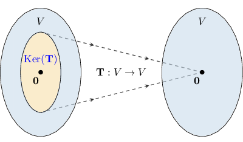

# The Kernel of a Linear Transformation

Source: https://www.mathacademy.com/topics/1960?courseId=55
Topic ID: 1960

## Prerequisites

- [The Dimension of the Null Space of a Matrix](./1868-the-dimension-of-the-null-space-of-a-matrix.md)
- [The Standard Matrix of a Linear Transformation](../../../high-school/integrated-math-honors/lessons/integrated-math-iii-honors/1959-the-standard-matrix-of-a-linear-transformation.md)

## Lesson

### Introduction

The **kernel** of a linear transformation is the set of vectors that map to the zero vector. We define it formally as follows:

*For a linear transformation $\mathbf{T}$, the **** of $\mathbf{T}$ is the set of all the vectors $\mathbf{u}$ such that $\mathbf{T}(\mathbf{u})=\mathbf{0}.$ We can write this as*

$$

\textrm{Ker}(\mathbf{T}) = \left\{ \;\mathbf{u} \;| \; \mathbf{T}(\mathbf{u}) = \mathbf{0} \right\}.

$$

The diagram below shows the kernel of a linear transformation $\mathbf{T}: V \rightarrow V$ in a vector space $V$.

Notice that, because of linearity, the zero vector is always in the kernel of a linear transformation:

$$

\mathbf{T}(\mathbf{0})=\mathbf{T}(0\cdot\mathbf{v})=0\cdot\mathbf{T}(\mathbf{v})= \mathbf 0

$$

for any vector $\mathbf{v}$.

### Example: Determining Whether Given Vectors Belong to the Kernel of a Linear Transformation

#### Question

Consider the linear transformation $[\begin{aligned}𝑥 \\ 𝑦\end{aligned}]$ and the vectors $[\begin{aligned}2 \\ 1\end{aligned}]$ Which of the given vectors belong to the kernel of $\mathbf{T}?$

#### Explanation

A vector $\mathbf{u}$ belongs to the kernel of a linear transformation $\mathbf{T}$ if $\mathbf{T}(\mathbf{u})=\mathbf{0}.$

Therefore, we need to compute $\mathbf{T}(\mathbf{v}_i)$ for each vector $\mathbf v_i\mathbin{:}$

$$

\begin{aligned}𝐓(𝐯_{1}) & =𝐓([\begin{aligned}2 \\ 1\end{aligned}])=[\begin{aligned}0 \\ 0\end{aligned}] \\ 𝐓(𝐯_{2}) & =𝐓([\begin{aligned}3 \\ 1\end{aligned}])=[\begin{aligned}2 \\ −3\end{aligned}] \\ 𝐓(𝐯_{3}) & =𝐓([\begin{aligned}2 \\ 3\end{aligned}])=[\begin{aligned}−8 \\ 12\end{aligned}]\end{aligned}

$$

Since $\,\mathbf{T}(\mathbf{v}_1)=\mathbf{0},$ we conclude that, of the given vectors, the only vector that belongs to the kernel of $\,\mathbf{T}$ is $\,\mathbf{v}_1.$

### Example: Calculating a Component of a Vector in the Kernel of a Linear Transformation

#### Question

Consider the linear transformation $\begin{aligned}𝑥 \\ 𝑦 \\ 𝑧\end{aligned}$ and the vector $\begin{aligned}𝑘 \\ 2 \\ 6\end{aligned}$ Find the value of $\,k\,$ such that $\,\mathbf{u}\in\textrm{Ker}(\mathbf{T}).$

#### Explanation

A vector $\mathbf{u}$ belongs to the kernel of a linear transformation $\mathbf{T}$ if $\mathbf{T}(\mathbf{u})=\mathbf{0}.$

So, we need to solve the following equation:

$$

\begin{aligned}𝐓(𝐮) & =𝟎 \\ \begin{aligned}3⋅𝑘+12⋅2−3⋅6 \\ −2⋅𝑘+4⋅2−2⋅6 \\ 6⋅𝑘−3⋅2+3⋅6\end{aligned} & =\begin{aligned}0 \\ 0 \\ 0\end{aligned} \\ \begin{aligned}3𝑘+6 \\ −2𝑘−4 \\ 6𝑘+12\end{aligned} & =\begin{aligned}0 \\ 0 \\ 0\end{aligned}\end{aligned}

$$

Therefore, we get the system

$$

\begin{aligned}3𝑘+6=0 \\ −2𝑘−4=0 \\ 6𝑘+12=0.\end{aligned}

$$

The solution to all three of these equations is $k=-2.$

### Finding the Kernel of a Linear Transformation

We know how to determine whether a given vector is in the kernel of a linear transformation. But how do we find the kernel of a linear transformation?

First, remember that if $T$ is the standard matrix of $\mathbf{T},$ then

$$

\textrm{Ker}(\mathbf{T}) = \textrm{Null}(T) = \left\{ \;\mathbf{x} \;|\; T\mathbf{x}=\mathbf{0} \right\}.

$$

Therefore, to find all the vectors in the kernel of a linear transformation, we just need to find the null space of the corresponding standard matrix. We can do this by solving the matrix equation $T\mathbf{x}=\mathbf{0}.$

### Example: Finding the Kernel of a Linear Transformation

#### Question

Consider the linear transformation $[\begin{aligned}𝑥 \\ 𝑦\end{aligned}]$ Find $\textrm{Ker}(\mathbf{T}).$

#### Explanation

Finding the kernel of $\mathbf{T}$ is equivalent to finding the null space of the standard matrix of $\mathbf{T}.$

For the given linear transformation, the standard matrix is $[\begin{aligned}2 & 4 \\ 3 & 6\end{aligned}]$

Setting $[\begin{aligned}𝑥 \\ 𝑦\end{aligned}]$ we then need to solve the equation $T\mathbf{x}=\mathbf{0}.$ First, we reduce $T$ to row echelon form, as follows:

$$

\begin{aligned}𝑇 & =[\begin{aligned}2 & 4 \\ 3 & 6\end{aligned}] & 𝑅_{2} & :=𝑅_{2}+(−\frac{3}{2})𝑅_{1} \\ & ∼[\begin{aligned}2 & 4 \\ 0 & 0\end{aligned}] & & \end{aligned}

$$

The basic variables are the variables whose coefficients are pivots. In this case, the basic variable is $x,$ and we have one free variable, $y.$ That means we need to find $x$ in terms of $y.$

From the first equation, we get

$$

x=-2y.

$$

Therefore, the kernel of the linear transformation $\,\mathbf{T}$ is $[\begin{aligned}−2𝑦 \\ 𝑦\end{aligned}]$

### The Nullity of a Linear Transformation

The **nullity** of a linear transformation $\mathbf{T}$ is the dimension of its kernel. This means that

$$

\text{nullity}(\mathbf{T}) = \dim(\textrm{Ker}(\mathbf{T})) = \text{nullity}(T).

$$

To compute the dimension of the kernel of $\mathbf{T},$ we just have to reduce the matrix $T$ to row echelon form and count the number of non-pivot columns.

### Example: Finding the Nullity of a Linear Transformation

#### Question

Given the linear transformation $\begin{aligned}𝑥 \\ 𝑦 \\ 𝑧\end{aligned}$ find $\,\textrm{nullity}(\mathbf{T}).$

#### Explanation

First, we write down the standard matrix of $\mathbf{T}\mathbin{:}$

$$

\begin{aligned}2 & 4 & 0 \\ 4 & 10 & −1 \\ −6 & −12 & 1\end{aligned}

$$

Recall that $\textrm{nullity}(\mathbf{T}) = \textrm{nullity}(T) = \textrm{dim}(\textrm{Null}(T)).$

In order to find $\textrm{dim}(\textrm{Null}(T)),$ we reduce $T$ to row echelon form, as follows:

$$

\begin{aligned}𝑇 & =\begin{aligned}2 & 4 & 0 \\ 4 & 10 & −1 \\ −6 & −12 & 1\end{aligned} & 𝑅_{2} & :=𝑅_{2}+(−2)𝑅_{1} \\ & ∼\begin{aligned}2 & 4 & 0 \\ 0 & 2 & −1 \\ −6 & −12 & 1\end{aligned} & 𝑅_{3} & :=𝑅_{3}+3𝑅_{1} \\ & ∼\begin{aligned}2 & 4 & 0 \\ 0 & 2 & −1 \\ 0 & 0 & 1\end{aligned} & & \end{aligned}

$$

The reduced matrix above has no non-pivot columns. Therefore,

$$

\textrm{nullity}(\mathbf{T})=\textrm{dim}(\textrm{Null}(T))=0.

$$
