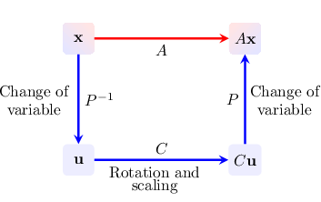
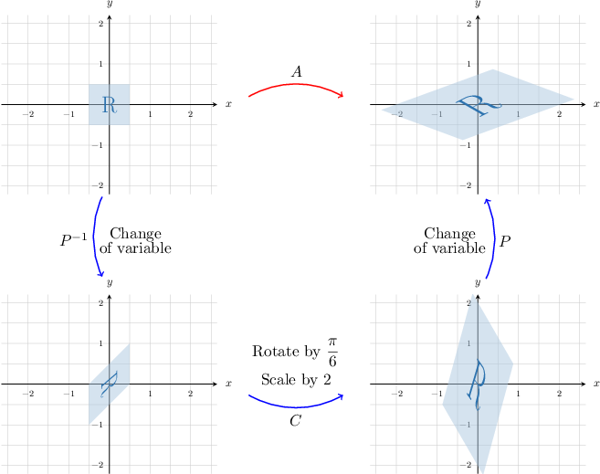

# Reducing Real 2x2 Matrices to Rotation-Scaling Form

Source: https://www.mathacademy.com/topics/2018?courseId=55
Topic ID: 2018

## Prerequisites

- [Rotation-Scaling Matrices](./2017-rotation-scaling-matrices.md)
- [Finding Complex Eigenvectors of Real 2x2 Matrices](./3574-finding-complex-eigenvectors-of-real-2x2-matrices.md)

## Lesson

### Introduction

Rotation-scaling matrices are involved in an important theorem regarding complex eigenvalues.

To sketch out the key idea, let's consider the matrix

$$

[\begin{aligned}−5 & −10 \\ 4 & 7\end{aligned}]

$$

which has the complex eigenvalue

$$

\lambda=1-2\text{i}={\color{blue}1}+({\color{red}-2})\text{i}

$$

and the corresponding complex eigenvector

$$

[\begin{aligned}2−i \\ −1+i\end{aligned}]

$$

Now, we construct a rotation-scaling matrix $C$ using the real and imaginary parts of the eigenvalue $\lambda$ as follows:

$$

[\begin{aligned}Re(𝜆) & Im(𝜆) \\ −Im(𝜆) & Re(𝜆)\end{aligned}]

$$

We also construct a matrix $P$ whose columns are the real and imaginary parts of the corresponding eigenvector:

$$

\begin{aligned}| & | \\ Re(𝐯) & Im(𝐯) \\ | & |\end{aligned}

$$

The **rotation-scaling theorem** states that $A$ can be factored as follows:

$$

A=PCP^{-1}

$$

Let's check that this is true in this case:

$$

\begin{aligned}𝑃𝐶𝑃^{−1} & =[\begin{matrix}2 & −1 \\ −1 & 1\end{matrix}][\begin{matrix}1 & −2 \\ 2 & 1\end{matrix}][\begin{matrix}2 & −1 \\ −1 & 1\end{matrix}]^{−1} \\ & =[\begin{matrix}0 & −5 \\ 1 & 3\end{matrix}][\begin{matrix}1 & 1 \\ 1 & 2\end{matrix}] \\ & =[\begin{matrix}−5 & −10 \\ 4 & 7\end{matrix}] \\ & =𝐴\,✓\end{aligned}

$$

### The Rotation-Scaling Theorem

Let's now formally state the rotation-scaling theorem:

*Let $A$ be a $2 \times 2$ matrix with real entries. If $\lambda$ is a complex (not real) eigenvalue of $A,$ and $\mathbf{v}$ is an eigenvector corresponding to $\lambda,$ then*

$$

A = PCP^{-1}

$$

*where*

$$

\begin{aligned}| & | \\ Re(𝐯) & Im(𝐯) \\ | & |\end{aligned}

$$

Note the following:

- When two matrices $A$ and $C$ are related via the equation $A = PCP^{-1},$ we say that they are **similar.**

- The rotation-scaling theorem tells us that every $2 \!\times\! 2$ real matrix with complex (non-real) eigenvalues is similar to a rotation-scaling matrix.

- We call the right-hand side of $A = PCP^{-1}$ the **rotation-scaling form** of $A.$ We can also refer to this as the **rotation-scaling decomposition** of $A.$

- The matrix $P$ *must* be constructed from the eigenvector that corresponds to the eigenvalue defined by $C.$

### Example: Finding the Eigenvalues and Eigenvectors of a Matrix in Rotation-Scaling Form

#### Question

$$

[\begin{aligned}1 & −1 \\ 1 & 0\end{aligned}]

$$

Consider the matrix $P$ and the rotation-scaling matrix $C$ shown above. Given that $A=PCP^{-1},$ what are the eigenvalues and the corresponding eigenvectors of $A?$

#### Explanation

Recall that for any $2 \times 2$ real matrix $A$ with complex eigenvalues, we have $A=PCP^{-1},$ where

$$

\begin{aligned}| & | \\ Re(𝐯) & Im(𝐯) \\ | & |\end{aligned}

$$

and $\mathbf{v}$ is an eigenvector of $A$ corresponding to the complex eigenvalue $\lambda.$

- From the matrix $[\begin{aligned}3 & −1 \\ −(−1) & 3\end{aligned}]$ we deduce that $\text{Re}(\lambda)={\color{blue}3}$ and $\text{Im}(\lambda) = {\color{red}-1}.$ So, our eigenvalue is

- From the matrix $[\begin{aligned}1 & −1 \\ 1 & 0\end{aligned}]$ we deduce that our corresponding eigenvector is

Finally, the second eigenvalue of $A$ must be the complex conjugate of $\lambda,$ and the second eigenvector must be the complex conjugate of $\mathbf{v}.$

Therefore, our eigenvalues and eigenvectors are

$$

[\begin{aligned}1±i \\ 1\end{aligned}]

$$

### Example: Converting a Matrix to Rotation-Scaling Form Given Multiple Parts of the Decomposition

#### Question

$$

[\begin{aligned}1 \\ 1+2i\end{aligned}]

$$

Consider the vector $\mathbf{v}$ and the rotation-scaling matrix $C$ shown above. Given that $\mathbf{v}$ is an eigenvector of a $2 \times 2$ matrix $A$ corresponding to the eigenvalue $\lambda=-1-4\text{i},$ find a matrix $P$ such that $A=PCP^{-1}.$

#### Explanation

Recall that for any $2 \times 2$ real matrix $A$ with complex eigenvalues, we have $A=PCP^{-1},$ where

$$

\begin{aligned}| & | \\ Re(𝐯) & Im(𝐯) \\ | & |\end{aligned}

$$

and $\mathbf{v}$ is an eigenvector of $A$ corresponding to the complex eigenvalue $\lambda.$

First, notice that

$$

[\begin{aligned}Re(𝜆) & Im(𝜆) \\ −Im(𝜆) & Re(𝜆)\end{aligned}]

$$

Next, we can find the real and imaginary parts of our eigenvector:

$$

\begin{aligned}𝐯 & =[\begin{matrix}1 \\ 1+2i\end{matrix}]=\underset{Re(𝐯)}{\underset{}{[\begin{matrix}1 \\ 1\end{matrix}]}}+i\underset{Im(𝐯)}{\underset{}{[\begin{matrix}0 \\ 2\end{matrix}]}}\end{aligned}

$$

Finally, we can now construct $P\mathbin{:}$

$$

\begin{aligned}𝑃 & =\begin{matrix}| & | \\ Re(𝐯) & Im(𝐯) \\ | & |\end{matrix}=[\begin{matrix}1 & 0 \\ 1 & 2\end{matrix}]\end{aligned}

$$

### Example: Converting a Matrix to Rotation-Scaling Form Using the Complex Conjugate

#### Question

$$

[\begin{aligned}−2i \\ 7\end{aligned}]

$$

Consider the vector $\mathbf{v}$ and the rotation-scaling matrix $C$ shown above. Given that $\mathbf{v}$ is an eigenvector of a $2 \times 2$ matrix $A$ corresponding to the eigenvalue $\lambda=2+4\text{i},$ find a matrix $P$ such that $A=PCP^{-1}.$

#### Explanation

Recall that for any $2 \times 2$ real matrix $A$ with complex eigenvalues, we have $A=PCP^{-1},$ where

$$

\begin{aligned}| & | \\ Re(𝐯) & Im(𝐯) \\ | & |\end{aligned}

$$

and $\mathbf{v}$ is an eigenvector of $A$ corresponding to the complex eigenvalue $\lambda.$

First, notice that

$$

[\begin{aligned}Re(𝜆) & Im(𝜆) \\ −Im(𝜆) & Re(𝜆)\end{aligned}]

$$

while

$$

[\begin{aligned}Re(\overset{𝜆}{}) & Im(\overset{𝜆}{}) \\ −Im(\overset{𝜆}{}) & Re(\overset{𝜆}{})\end{aligned}]

$$

So, our rotation-scaling matrix $C$ corresponds to the eigenvalue $\overline{\lambda}=2-4\text{i},$ the complex conjugate of $\lambda.$ Hence, to construct the matrix $P,$ we use the eigenvector $\overline{\mathbf{v}},$ the complex conjugate of $\mathbf{v}.$

Next, we find the real and imaginary parts of our eigenvector:

$$

\begin{aligned}\overset{𝐯}{} & =[\begin{matrix}2i \\ 7\end{matrix}]=\underset{Re(\overset{𝐯}{})}{\underset{}{[\begin{matrix}0 \\ 7\end{matrix}]}}+i\underset{Im(\overset{𝐯}{})}{\underset{}{[\begin{matrix}2 \\ 0\end{matrix}]}}\end{aligned}

$$

Finally, we can now construct $P\mathbin{:}$

$$

\begin{aligned}𝑃 & =\begin{matrix}| & | \\ Re(\overset{𝐯}{}) & Im(\overset{𝐯}{}) \\ | & |\end{matrix}=[\begin{matrix}0 & 2 \\ 7 & 0\end{matrix}].\end{aligned}

$$

### Example: Converting a Matrix to Rotation-Scaling Form Given Only One Eigenvalue

#### Question

$$

[\begin{aligned}1 & −5 \\ 9 & −5\end{aligned}]

$$

Consider the matrices shown above. Given that $A$ has the complex eigenvalue $\lambda=-2+6\text{i},$ and that $A=PCP^{-1}$ where $C$ is a rotation-scaling matrix, find the matrix $P.$

#### Explanation

Recall that for any $2 \times 2$ real matrix $A$ with complex eigenvalues, we have $A=PCP^{-1},$ where

$$

\begin{aligned}| & | \\ Re(𝐯) & Im(𝐯) \\ | & |\end{aligned}

$$

and $\mathbf{v}$ is an eigenvector of $A$ corresponding to the complex eigenvalue $\lambda.$

Since we are given the eigenvalue $\lambda=-2+6\text{i},$ we can immediately construct the rotation-scaling matrix:

$$

[\begin{aligned}−2 & 6 \\ −6 & −2\end{aligned}]

$$

To compute the eigenvectors of a matrix, we need to find non-zero solutions to the matrix equation

$$

(A - \lambda I) \textbf{x}=\mathbf{0}.

$$

In our case, we have $\,\lambda_1 =-2+6\text{i},$ and

$$

\begin{aligned}𝐴−𝜆𝐼 & =[\begin{matrix}1 & −5 \\ 9 & −5\end{matrix}]−[\begin{matrix}−2+6i & 0 \\ 0 & −2+6i\end{matrix}] \\ & =[\begin{matrix}3−6i & −5 \\ 9 & −3−6i\end{matrix}].\end{aligned}

$$

So, we have the homogeneous system of linear equations

$$

\begin{aligned}(3−6i)𝑥_{1}−5𝑥_{2}=0 \\ 9𝑥_{1}+(−3−6i)𝑥_{2}=0.\end{aligned}

$$

Since the matrix $A-\lambda I$ is singular, the system above must have a non-zero solution. This means that one equation of the system is a multiple of another. As a result, we can drop one of the rows and take one of the variables as the free variable. For example, from the second equation, we get

$$

x_1=\dfrac 1 3(1+2\text{i})x_2.

$$

Hence, the general solution is given by

$$

\begin{aligned}\frac{1}{3}(1+2i)𝑥_{2} \\ 𝑥_{2}\end{aligned}

$$

Setting $x_2=3$, we get the eigenvector

$$

[\begin{aligned}1+2i \\ 3\end{aligned}]

$$

Therefore, we can construct the matrix $P$ as follows:

$$

\begin{aligned}𝑃=\begin{matrix}| & | \\ Re(𝐯) & Im(𝐯) \\ | & |\end{matrix}=[\begin{matrix}1 & 2 \\ 3 & 0\end{matrix}].\end{aligned}

$$

### The Geometric Interpretation of Rotation-Scaling Form

Suppose $A$ is a real $2\!\times\! 2$ matrix. To interpret the rotation-scaling form $A=PCP^{-1},$ we should bear in mind the following:

- The matrix $C$ rotates vectors $\mathbf x\in\mathbb R^2$ and then scales them.

- We can think of $P$ as representing the following change of variable:

Therefore, $A$ can be thought of as a change of variable from $\mathbf x$ to $\mathbf u,$ followed by a rotation and scaling before returning to the original variable.

For example, let's consider the matrix $A,$ given by

$$

[\begin{aligned}\sqrt{3}+1 & −2 \\ 1 & \sqrt{3}−1\end{aligned}]

$$

This is a real matrix with complex eigenvalues and is thus similar to a rotation-scaling matrix.

Using the techniques described in this lesson, we can show that the rotation-scaling decomposition of $A$ is

$$

[\begin{aligned}1 & −1 \\ 1 & 0\end{aligned}]

$$

The matrix $C$ can be written explicitly as a constant multiple of a rotation matrix as follows:

$$

[\begin{aligned}1 & −1 \\ 1 & 0\end{aligned}]

$$

Thus, the matrix $C$ represents the following:

- a rotation of $\arccos\left(\dfrac{\sqrt 3}{2}\right) = \dfrac\pi 6$ counterclockwise about $O,$ and

- an enlargement of scale factor ${\color{blue}{2}}.$

The image of a unit square centered at the origin under the action of $A$ can therefore be decomposed as follows:

