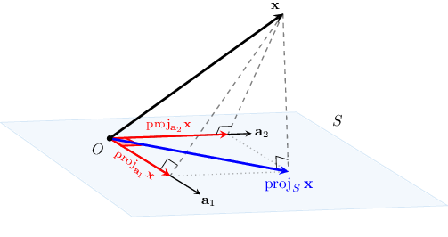
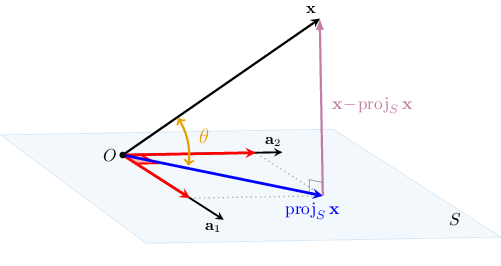

# Projecting Vectors Onto Subspaces in Euclidean Spaces (Orthogonal Bases)

Source: https://www.mathacademy.com/topics/2123?courseId=55
Topic ID: 2123

## Prerequisites

- [The Components of a Vector with Respect to an Orthogonal or Orthonormal Basis](./2825-the-components-of-a-vector-with-respect-to-an-orthogonal-or-orthonormal-basis.md)

## Lesson

### Introduction

If $\big\{\mathbf{a}_1, \mathbf{a}_2, \ldots, \mathbf{a}_n \big\}$ is a set of orthogonal vectors, then the **orthogonal projection of a vector $\mathbf{x}$ onto the subspace $S = \textrm{Span}\{\mathbf{a}_1, \mathbf{a}_2, \ldots, \mathbf{a}_n \}$** is given by

$$

\begin{aligned}proj_{𝑆}\,𝐱 & =proj_{𝐚_{1}}𝐱+proj_{𝐚_{2}}𝐱+⋯+proj_{𝐚_{𝑛}}𝐱 \\ & =\frac{𝐱⋅𝐚_{1}}{𝐚_{1}⋅𝐚_{1}}𝐚_{1}+\frac{𝐱⋅𝐚_{2}}{𝐚_{2}⋅𝐚_{2}}𝐚_{2}+⋯+\frac{𝐱⋅𝐚_{𝑛}}{𝐚_{𝑛}⋅𝐚_{𝑛}}𝐚_{𝑛}.\end{aligned}

$$

In other words, the orthogonal projection of $\mathbf{x}$ onto $S = \textrm{Span}\{\mathbf{a}_1, \mathbf{a}_2, \ldots, \mathbf{a}_n \}$ is the sum of the orthogonal projections of $\mathbf{x}$ onto each one-dimensional subspace of $\textrm{Span}\big\{\mathbf{a}_1, \mathbf{a}_2, \ldots, \mathbf{a}_n \big\}.$

**Watch out!** The formula works *only* when the set of vectors $\{\mathbf{a}_1, \mathbf{a}_2, \ldots, \mathbf{a}_n \}$ is orthogonal!

In case of a $2$-dimensional subspace $S=\textrm{Span} \big\{\mathbf{a}_1,\mathbf{a}_2 \big\},$ we can visualize the orthogonal projection geometrically, as follows:

$$

{\color{blue}\textrm{proj}_{S} \: \mathbf{x}} = {\color{red}\textrm{proj}_{\mathbf{a}_1}\mathbf{x}} + {\color{red}\textrm{proj}_{\mathbf{a}_2}\mathbf{x}}

$$

**Note:** A proof of the formula will be provided at the end of the lesson. But first, let's get some practice using the formula.

### Example: Finding the Orthogonal Projection of a Vector Onto a Subspace Spanned by Orthogonal Vectors

#### Question

Consider the vector $\mathbf{x}$ and the subspace $S=\textrm{Span}\{\mathbf{a}_1,\mathbf{a}_2 \},$ where

$$

\begin{aligned}1 \\ 1 \\ 1\end{aligned}

$$

Find the orthogonal projection of $\mathbf{x}$ onto the subspace $S$ given that the set $\{\mathbf{a}_1,\mathbf{a}_2\}$ is orthogonal.

#### Explanation

Since the set $\{\mathbf{a}_1,\mathbf{a}_2\}$ is orthogonal, the orthogonal projection of $\mathbf{x}$ onto the subspace $S$ is given by

$$

\textrm{proj}_{S}\,\mathbf{x} = \textrm{proj}_{\mathbf{a}_1}\mathbf{x} + \textrm{proj}_{\mathbf{a}_2}\mathbf{x}.

$$

So, we first find the orthogonal projections of $\mathbf{x}$ onto $\textrm{Span}\{\mathbf{a}_1\}$ and $\textrm{Span}\{\mathbf{a}_2\}\mathbin{:}$

$$

\begin{aligned}proj_{𝐚_{1}}𝐱 & =\frac{𝐱⋅𝐚_{1}}{𝐚_{1}⋅𝐚_{1}}𝐚_{1}=\frac{2⋅1+3⋅1+(−2)⋅1}{1^{2}+1^{2}+1^{2}}𝐚_{1}=1\begin{aligned}1 \\ 1 \\ 1\end{aligned}=\begin{aligned}1 \\ 1 \\ 1\end{aligned} \\ proj_{𝐚_{2}}𝐱 & =\frac{𝐱⋅𝐚_{2}}{𝐚_{2}⋅𝐚_{2}}𝐚_{2}=\frac{2⋅(−2)+3⋅1+(−2)⋅1}{(−2)^{2}+1^{2}+1^{2}}𝐚_{2}=−\frac{1}{2}\begin{aligned}−2 \\ 1 \\ 1\end{aligned}\end{aligned}

$$

Therefore, we have that

$$

\begin{aligned}proj_{𝑆}\,𝐱 & =proj_{𝐚_{1}}𝐱+proj_{𝐚_{2}}𝐱 \\ & =\begin{aligned}1 \\ 1 \\ 1\end{aligned}+(−\frac{1}{2})\begin{aligned}−2 \\ 1 \\ 1\end{aligned} \\ & =\begin{aligned}2 \\ \frac{1}{2} \\ \frac{1}{2}\end{aligned}.\end{aligned}

$$

### Example: Finding the Orthogonal Projection of a Vector Onto a Plane

#### Question

Consider the vector $\mathbf{x}$ and the plane $\mathbf{r}=s\mathbf{v}+t\mathbf{w},$ where $s,t\in\mathbb R,$ and

$$

\begin{aligned}2 \\ 3 \\ −1\end{aligned}

$$

Find the orthogonal projection of $\mathbf{x}$ onto the plane given that $\mathbf{v} \perp \mathbf{w}.$

#### Explanation

Since our plane passes through the origin, it defines the subspace $S=\text{Span}\{\mathbf{v}, \mathbf{w}\}$ in $\mathbb{R}^3.$ And, since the set $\{\mathbf{v},\mathbf{w}\}$ is orthogonal, the orthogonal projection of $\mathbf{x}$ onto the subspace $S$ is given by

$$

\textrm{proj}_{S}\,\mathbf{x} = \textrm{proj}_{\mathbf{v}}\,\mathbf{x} + \textrm{proj}_{\mathbf{w}}\,\mathbf{x}.

$$

So, we first find the orthogonal projections of $\mathbf{x}$ onto $\textrm{Span}\{\mathbf{v}\}$ and $\textrm{Span}\{\mathbf{w}\}\mathbin{:}$

$$

\begin{aligned}proj_{𝐯}\,𝐱 & =\frac{𝐱⋅𝐯}{𝐯⋅𝐯}𝐯=\frac{13⋅2+(−2)⋅3+(−1)⋅(−1)}{2^{2}+3^{2}+(−1)^{2}}𝐯=\frac{3}{2}\begin{aligned}2 \\ 3 \\ −1\end{aligned} \\ proj_{𝐰}\,𝐱 & =\frac{𝐱⋅𝐰}{𝐰⋅𝐰}𝐰=\frac{13⋅5+(−2)⋅(−3)+(−1)⋅1}{5^{2}+(−3)^{2}+1^{2}}𝐰=2\begin{aligned}5 \\ −3 \\ 1\end{aligned}\end{aligned}

$$

Therefore, we have that

$$

\begin{aligned}proj_{𝑆}\,𝐱 & =proj_{𝐯}\,𝐱+proj_{𝐰}\,𝐱 \\ & =\frac{3}{2}\begin{aligned}2 \\ 3 \\ −1\end{aligned}+2\begin{aligned}5 \\ −3 \\ 1\end{aligned} \\ & =\begin{aligned}3 \\ \frac{9}{2} \\ −\frac{3}{2}\end{aligned}+\begin{aligned}10 \\ −6 \\ 2\end{aligned} \\ & =\begin{aligned}13 \\ −\frac{3}{2} \\ \frac{1}{2}\end{aligned}.\end{aligned}

$$

### The Distance Between a Vector and a Subspace

Let $n,m$ be positive integers such that $n\leq m.$ Given an orthogonal set $\big\{\mathbf{a}_1, \mathbf{a}_2, \ldots, \mathbf{a}_n \big\} \subset \Bbb R^m$ and a vector $\mathbf x \in \Bbb R^m,$ we define the **distance between the vector $\mathbf{x}$ and the vector space $S=\textrm{Span}\{\mathbf{a}_1,\mathbf{a}_2, \ldots, \mathbf{a}_n \}$** as

$$

\Vert{ \color{purple} \mathbf{x} - \text{proj}_{S}\,\mathbf{x} }\Vert.

$$

We can also define the **angle between the vector $\mathbf{x}$ and the subspace $S$** to be the acute angle $\theta$ between the vector $\mathbf{x}$ and its orthogonal projection $\text{proj}_{S}\,\mathbf{x},$ as shown in the diagram below.

Finally, notice that we can represent the vector $\mathbf{x}$ as a sum of two orthogonal vectors:

$$

\mathbf{x} = \underbrace{\textrm{proj}_{S}\mathbf{x}}_{\large \in S} + \underbrace{(\mathbf{x}-\textrm{proj}_{S}\mathbf{x})}_{\large \in S^\perp}

$$

**Note:** The vector $\textbf{x}-\textrm{proj}_{S}\,\mathbf{x},$ whose norm $\| \textbf{x}-\textrm{proj}_{S}\,\mathbf{x} \|$ represents the distance from $\mathbf{x}$ to $S,$ is sometimes called the **vector rejection of $\mathbf{x}$ from $S.$**

### Example: Calculating the Distance Between a Vector and a Subspace Spanned by Orthogonal Vectors

#### Question

Consider the vector $\mathbf{x}$ and the subspace $S=\textrm{Span}\{\mathbf{a}_1,\mathbf{a}_2 \},$ where

$$

\begin{aligned}1 \\ 2 \\ 1\end{aligned}

$$

Find the distance between $\mathbf{x}$ and the subspace $S$ given that the set $\{\mathbf{a}_1,\mathbf{a}_2\}$ is orthogonal.

#### Explanation

Since the set $\{\mathbf{a}_1,\mathbf{a}_2\}$ is orthogonal, the orthogonal projection of $\mathbf{x}$ onto the subspace $S$ is given by

$$

\textrm{proj}_{S}\,\mathbf{x} = \textrm{proj}_{\mathbf{a}_1}\mathbf{x} + \textrm{proj}_{\mathbf{a}_2}\mathbf{x}.

$$

So, we first find the orthogonal projections of $\mathbf{x}$ onto $\textrm{Span}\{\mathbf{a}_1\}$ and $\textrm{Span}\{\mathbf{a}_2\}\mathbin{:}$

$$

\begin{aligned}proj_{𝐚_{1}}𝐱 & =\frac{𝐱⋅𝐚_{1}}{𝐚_{1}⋅𝐚_{1}}𝐚_{1}=\frac{3⋅1+2⋅2+1⋅1}{1^{2}+2^{2}+1^{2}}𝐚_{1}=\frac{4}{3}\begin{aligned}1 \\ 2 \\ 1\end{aligned} \\ proj_{𝐚_{2}}𝐱 & =\frac{𝐱⋅𝐚_{2}}{𝐚_{2}⋅𝐚_{2}}𝐚_{2}=\frac{3⋅1+2⋅(−1)+1⋅1}{1^{2}+(−1)^{2}+1^{2}}𝐚_{2}=\frac{2}{3}\begin{aligned}1 \\ −1 \\ 1\end{aligned}\end{aligned}

$$

Therefore, we have that

$$

\begin{aligned}proj_{𝑆}\,𝐱 & =proj_{𝐚_{1}}𝐱+proj_{𝐚_{2}}𝐱 \\ & =\frac{4}{3}\begin{aligned}1 \\ 2 \\ 1\end{aligned}+\frac{2}{3}\begin{aligned}1 \\ −1 \\ 1\end{aligned} \\ & =\frac{2}{3}2\begin{aligned}1 \\ 2 \\ 1\end{aligned}+\begin{aligned}1 \\ −1 \\ 1\end{aligned} \\ & =\begin{aligned}2 \\ 2 \\ 2\end{aligned}=\overset{𝐱}{^}.\end{aligned}

$$

Finally, the distance between $\mathbf{x}$ and the subspace $S$ is given by

$$

\begin{aligned}𝑑(𝐱,\overset{𝐱}{^}) & =‖𝐱−\overset{𝐱}{^}‖ \\ & =\sqrt{√(𝑥_{1}−\overset{𝐱}{^}_{1})^{2}+(𝑥_{2}−\overset{𝐱}{^}_{2})^{2}+(𝑥_{3}−\overset{𝐱}{^}_{3})^{2}} \\ & =\sqrt{√(3−2)^{2}+(2−2)^{2}+(1−2)^{2}} \\ & =\sqrt{√2}.\end{aligned}

$$

### Example: Calculating the Acute Angle Between a Vector and a Subspace Spanned by Orthogonal Vectors

#### Question

Consider the vector $\mathbf{x}$ and the subspace $S=\textrm{Span}\{\mathbf v,\mathbf w\}$ where

$$

\begin{aligned}0 \\ 1 \\ 1\end{aligned}

$$

Find the acute angle between $\mathbf{x}$ and the subspace $S$ given that the set $\{\mathbf{v},\mathbf{w}\}$ is orthogonal.

#### Explanation

Since the set $\{\mathbf{v},\mathbf{w}\}$ is orthogonal, the orthogonal projection of $\mathbf{x}$ onto the subspace $S$ is given by

$$

\textrm{proj}_{S}\,\mathbf{x} = \textrm{proj}_{\mathbf{v}}\mathbf{x} + \textrm{proj}_{\mathbf{w}}\mathbf{x}.

$$

So, we first find the orthogonal projections of $\mathbf{x}$ onto $\textrm{Span}\{\mathbf{v}\}$ and $\textrm{Span}\{\mathbf{w}\}\mathbin{:}$

$$

\begin{aligned}proj_{𝐯}\,𝐱 & =\frac{𝐱⋅𝐯}{𝐯⋅𝐯}𝐯=\frac{\sqrt{√10}⋅0+3⋅1+1⋅1}{0^{2}+(−1)^{2}+1^{2}}𝐯=2\begin{aligned}0 \\ 1 \\ 1\end{aligned}=\begin{aligned}0 \\ 2 \\ 2\end{aligned} \\ proj_{𝐰}\,𝐱 & =\frac{𝐱⋅𝐰}{𝐰⋅𝐰}𝐰=\frac{\sqrt{√10}⋅0+3⋅(−1)+1⋅1}{0^{2}+(−1)^{2}+(−1)^{2}}𝐰=(−1)\begin{aligned}0 \\ −1 \\ 1\end{aligned}=\begin{aligned}0 \\ 1 \\ −1\end{aligned}\end{aligned}

$$

Therefore, we have that

$$

\begin{aligned}proj_{𝑆}\,𝐱 & =proj_{𝐯}\,𝐱+proj_{𝐰}\,𝐱 \\ & =\begin{aligned}0 \\ 2 \\ 2\end{aligned}+\begin{aligned}0 \\ 1 \\ −1\end{aligned} \\ & =\begin{aligned}0 \\ 3 \\ 1\end{aligned}.\end{aligned}

$$

The acute angle between $\mathbf{x}$ and $S$ is the acute angle between $\mathbf{x}$ and $\textrm{proj}_S \mathbf{x}$ or any other non-zero vector that is parallel to $\textrm{proj}_S \mathbf{x}.$ So, computing the cosine using the dot product, we obtain

$$

\begin{aligned}cos⁡𝜃 & =\frac{𝐱⋅proj_{𝑆}\,𝐱}{‖𝐱‖\,‖proj_{𝑆}\,𝐱‖} \\ & =\frac{\sqrt{√10}⋅0+3⋅3+1⋅1}{\sqrt{√(\sqrt{√10})^{2}+3^{2}+1^{2}}\,\sqrt{√0^{2}+3^{2}+1^{2}}} \\ & =\frac{10}{\sqrt{√20}\,\sqrt{√10}} \\ & =\frac{10}{10\,\sqrt{√2}} \\ & =\frac{\sqrt{√2}}{2}.\end{aligned}

$$

Therefore,

$$

\theta = \arccos\left( \dfrac{{\sqrt2}}{2}\right) = \dfrac{\pi}{4},

$$

which is already an acute angle.

### Justification of the Formula

Let's now prove the formula for the orthogonal projection of a vector $\mathbf{x}$ onto the subspaces $\textrm{Span}\{\mathbf{a}_1 \}$ and $\textrm{Span}\{\mathbf{a}_2 \}$ given that $\mathbf{a}_1\perp \mathbf{a}_2.$

We start by writing $\mathbf{x}$ as a sum of two vectors

$$

\mathbf{x} = \mathbf{x}_S + \mathbf{x}_{S^\perp},

$$

where $\mathbf{x}_S=\text{proj}_S\,\mathbf{x}$ is in $\textrm{Span}\{\mathbf{a}_1,\mathbf{a}_2\},$ and $\mathbf{x}_{S^\perp}$ is in the orthogonal complement of $\textrm{Span}\{\mathbf{a}_1,\mathbf{a}_2\}$. That is, $\mathbf{x}_S=k_1\mathbf{a}_1+k_2\mathbf{a}_2\in S\,$ and $\mathbf{x}_{S^\perp} \in S^\perp.$

From the equation above, we get

$$

\begin{aligned}𝐱_{𝑆^{⊥}} & =𝐱−𝐱_{𝑆} \\ & =𝐱−(𝑘_{1}𝐚_{1}+𝑘_{2}𝐚_{2}) \\ & =𝐱−𝑘_{1}𝐚_{1}−𝑘_{2}𝐚_{2}.\end{aligned}

$$

Now, using the fact that $\mathbf{x}_{S^\perp}$ is orthogonal to $S,$ and the fact that $\mathbf{a}_1\cdot\mathbf{a}_2=0,$ we obtain

$$

\begin{aligned}\begin{aligned}𝐱_{𝑆^{⊥}}⋅𝐚_{1}=0 \\ 𝐱_{𝑆^{⊥}}⋅𝐚_{2}=0\end{aligned} & \,\,\,⟹\,\,\,\begin{aligned}(𝐱−𝑘_{1}𝐚_{1}−𝑘_{2}𝐚_{2})⋅𝐚_{1}=0 \\ (𝐱−𝑘_{1}𝐚_{1}−𝑘_{2}𝐚_{2})⋅𝐚_{2}=0\end{aligned} \\ & \,\,\,⟹\,\,\,\begin{aligned}𝐱⋅𝐚_{1}−𝑘_{1}(𝐚_{1}⋅𝐚_{1})−𝑘_{2}(𝐚_{2}⋅𝐚_{1})=0 \\ 𝐱⋅𝐚_{2}−𝑘_{1}(𝐚_{1}⋅𝐚_{2})−𝑘_{2}(𝐚_{2}⋅𝐚_{2})=0\end{aligned} \\ & \,\,\,⟹\,\,\,\begin{aligned}𝑘_{1}(𝐚_{1}⋅𝐚_{1})=𝐱⋅𝐚_{1} \\ 𝑘_{2}(𝐚_{2}⋅𝐚_{2})=𝐱⋅𝐚_{2}\end{aligned} \\ & \,\,\,⟹\,\,\,\begin{aligned}𝑘_{1}=\frac{𝐱⋅𝐚_{1}}{𝐚_{1}⋅𝐚_{1}} \\ 𝑘_{2}=\frac{𝐱⋅𝐚_{2}}{𝐚_{2}⋅𝐚_{2}}.\end{aligned}\end{aligned}

$$

As a result, we obtain our formula

$$

\begin{aligned}proj_{𝑆}\,𝐱 & =𝑘_{1}𝐚_{1}+𝑘_{2}𝐚_{2} \\ & =\frac{𝐱⋅𝐚_{1}}{𝐚_{1}⋅𝐚_{1}}𝐚_{1}+\frac{𝐱⋅𝐚_{2}}{𝐚_{2}⋅𝐚_{2}}𝐚_{2} \\ & =proj_{𝐚_{1}}𝐱+proj_{𝐚_{2}}𝐱.\end{aligned}

$$
