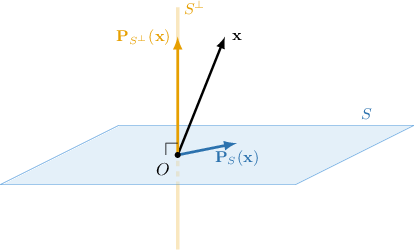

# Projection Matrices, Linear Transformations and Their Properties

Source: https://www.mathacademy.com/topics/2125?courseId=55
Topic ID: 2125

## Prerequisites

- [Projecting Vectors Onto Subspaces in Euclidean Spaces (Arbitrary Bases)](./2124-projecting-vectors-onto-subspaces-in-euclidean-spaces-arbitrary-bases.md)
- [The Standard Matrix of a Linear Transformation in Terms of the Standard Basis](./2211-the-standard-matrix-of-a-linear-transformation-in-terms-of-the-standard-basis.md)
- [Symmetric Matrices](./3118-symmetric-matrices.md)
- [Nilpotent and Idempotent Matrices](./3776-nilpotent-and-idempotent-matrices.md)

## Lesson

### Introduction

As we know, if $A$ is the matrix whose columns are the linearly independent vectors $\mathbf{a}_1, \mathbf{a}_2, \ldots, \mathbf{a}_n$ then the projection of a vector $\mathbf{x}$ onto $S=\textrm{Span}\{\mathbf{a}_1, \mathbf{a}_2, \ldots, \mathbf{a}_n \}$ is given by

$$

\textrm{proj}_{S} \: \mathbf{x} = {\color{blue}A(A^T\!A)^{-1}\!A^T}\,\mathbf{x}.

$$

Now, if we denote $P_S = A(A^T\!A)^{-1}\!A^T$, then

$$

\textrm{proj}_{S} \: \mathbf{x} = {\color{blue}P_S}\,\mathbf{x}.

$$

The matrix $P_S$ is called the **orthogonal projection matrix**. In other words, an orthogonal projection matrix

$$

P_S=A(A^T\!A)^{-1}\!A^T

$$

is a matrix that transforms any vector of the vector space into its projection to subspace $S$ spanned by the columns of $A$.

Knowing this, we can define the **orthogonal projection transformation** $\mathbf{P}_{\!S}$ as

$$

\mathbf{P}_{\!S}: \mathbb{R}^n \to \mathbb{R}^n

$$

such that

$$

\mathbf{x} \,\,\, \mapsto \textrm{proj}_S\,\mathbf{x}.

$$

It maps each vector from $\mathbb{R}^n$ into its orthogonal projection on $S$.

**Note:** The matrix $P_S$ is the standard matrix of the orthogonal projection transformation, that is, the matrix relative to the standard basis of $\mathbb{R}^n.$

### Example: Finding a Matrix that Defines an Orthogonal Projection Onto the Subspace Spanned by a Vector

#### Question

Find a matrix that defines the orthogonal projection of $\mathbb{R}^3$ onto the subspace spanned by $\begin{aligned}1 \\ 2 \\ −3\end{aligned}$

#### Explanation

Recall that the matrix $P_S = A(A^T\!A)^{-1}\!A^T$ maps any vector $\mathbf x\in \mathbb{R}^n$ onto its orthogonal projection in the subspace $S$ spanned by the columns of the matrix $A.$

In our case, $\begin{aligned}1 \\ 2 \\ −3\end{aligned}$ Therefore,

$$

\begin{aligned}𝑃_{𝑆} & =𝐴(𝐴^{𝑇}\,𝐴)^{−1}\,𝐴^{𝑇} \\ & =\begin{aligned}1 \\ 2 \\ −3\end{aligned}[\begin{aligned}1 & 2 & −3\end{aligned}]\begin{aligned}1 \\ 2 \\ −3\end{aligned}^{−1}[\begin{aligned}1 & 2 & −3\end{aligned}] \\ & =\begin{aligned}1 \\ 2 \\ −3\end{aligned}⋅(14)^{−1}[\begin{aligned}1 & 2 & −3\end{aligned}] \\ & =\frac{1}{14}\begin{aligned}1 \\ 2 \\ −3\end{aligned}[\begin{aligned}1 & 2 & −3\end{aligned}] \\ & =\frac{1}{14}\begin{aligned}1 & 2 & −3 \\ 2 & 4 & −6 \\ −3 & −6 & 9\end{aligned}.\end{aligned}

$$

### Example: Finding a Matrix That Defines an Orthogonal Projection Onto the Subspace Spanned by a Plane

#### Question

Find a matrix that defines the orthogonal projection of $\mathbb{R}^3$ onto the plane whose parametric equation is $\mathbf{r}=s\mathbf{v} + t\mathbf{w}$, where

$$

\begin{aligned}1 \\ 2 \\ 1\end{aligned}

$$

#### Explanation

Recall that the matrix $P_S = A(A^T\!A)^{-1}\!A^T$ maps any vector $\mathbf x\in \mathbb{R}^n$ onto its orthogonal projection in the subspace $S$ spanned by the columns of the matrix $A.$

Notice that the plane $\mathbf{r}=s\mathbf{v}+t\mathbf{w}$ is actually the subspace $\text{Span}\{\mathbf{v}, \mathbf{w}\}.$ Hence, we have

$$

\begin{aligned}1 & 1 \\ 2 & −1 \\ 1 & 1\end{aligned}

$$

Therefore,

$$

\begin{aligned}𝑃_{𝑆} & =𝐴(𝐴^{𝑇}\,𝐴)^{−1}\,𝐴^{𝑇} \\ & =\begin{aligned}1 & 1 \\ 2 & −1 \\ 1 & 1\end{aligned}[\begin{aligned}1 & 2 & 1 \\ 1 & −1 & 1\end{aligned}]\begin{aligned}1 & 1 \\ 2 & −1 \\ 1 & 1\end{aligned}^{−1}[\begin{aligned}1 & 2 & 1 \\ 1 & −1 & 1\end{aligned}] \\ & =\begin{aligned}1 & 1 \\ 2 & −1 \\ 1 & 1\end{aligned}[\begin{aligned}6 & 0 \\ 0 & 3\end{aligned}]^{−1}[\begin{aligned}1 & 2 & 1 \\ 1 & −1 & 1\end{aligned}] \\ & =\begin{aligned}1 & 1 \\ 2 & −1 \\ 1 & 1\end{aligned}⋅\frac{1}{6}[\begin{aligned}1 & 0 \\ 0 & 2\end{aligned}]⋅[\begin{aligned}1 & 2 & 1 \\ 1 & −1 & 1\end{aligned}] \\ & =\frac{1}{6}\begin{aligned}1 & 1 \\ 2 & −1 \\ 1 & 1\end{aligned}[\begin{aligned}1 & 2 & 1 \\ 2 & −2 & 2\end{aligned}] \\ & =\frac{1}{2}\begin{aligned}1 & 0 & 1 \\ 0 & 2 & 0 \\ 1 & 0 & 1\end{aligned}.\end{aligned}

$$

### A Criterion of an Orthogonal Projection Matrix

A matrix $P$ is an orthogonal projection matrix if and only if the following two conditions hold:

- $P^2 = P$ (the matrix is idempotent), and

- $P^T = P$ (the matrix is symmetric with respect to the main diagonal).

Let's check whether $\begin{aligned}\frac{1}{2} & \frac{1}{2} \\ \frac{1}{2} & \frac{1}{2}\end{aligned}$ is an orthogonal projection matrix:

$$

\begin{aligned}𝐴^{𝑇} & =\begin{aligned}\frac{1}{2} & \frac{1}{2} \\ \frac{1}{2} & \frac{1}{2}\end{aligned} \\ & =𝐴.\,✓ \\ 𝐴^{2} & =𝐴⋅𝐴 \\ & =\begin{aligned}\frac{1}{2} & \frac{1}{2} \\ \frac{1}{2} & \frac{1}{2}\end{aligned}\begin{aligned}\frac{1}{2} & \frac{1}{2} \\ \frac{1}{2} & \frac{1}{2}\end{aligned} \\ & =\begin{aligned}\frac{1}{2} & \frac{1}{2} \\ \frac{1}{2} & \frac{1}{2}\end{aligned} \\ & =𝐴.\,✓\end{aligned}

$$

Therefore, $A$ is an orthogonal projection matrix.

### Example: Identifying an Orthogonal Projection Matrix

#### Question

Which of the following are orthogonal projection matrices?

$$

[\begin{aligned}2 & 1 \\ 1 & 3\end{aligned}]

$$

#### Explanation

Recall that $Q$ is an orthogonal projection matrix if and only if $Q^2=Q$ and $Q^T=Q.$

With that in mind, let's examine our matrices.

- $A$ is ** an orthogonal projection matrix. We have $A^T = A$ but

- $B$ is ** an orthogonal projection matrix. We have

- $C$ is an orthogonal projection matrix. Indeed, $C^T = C$ and

Therefore, the correct answer is "$C$ only."

### Projection Onto the Orthogonal Complement

As we know, any vector $\mathbf{x} \in \mathbb{R}^n$ can be expressed as a sum of its projections onto the subspace $S$ and the corresponding orthogonal complement $S^\perp.$

If $\mathbf{P}_S$ and $\mathbf{P}_{S^\perp}$ are the orthogonal projections onto the subspace $S$ and its orthogonal complement $S^\perp,$ respectively, then

$$

\mathbf{P}_S (\mathbf{x}) + \mathbf{P}_{S^\perp} (\mathbf{x}) = \mathbf{x}.

$$

In $\mathbb{R}^3,$ this can be illustrated as follows:

In particular, this means that the sum of the corresponding projection matrices equals the identity matrix:

$$

P_S + P_{S^\perp} = I

$$

### Example: Finding an Orthogonal Projection Matrix Given Vectors That Span the Orthogonal Complement

#### Question

$$

\begin{aligned}1 \\ 1 \\ 2\end{aligned}

$$

Given that the vector $\mathbf{a}$ above spans $S^\perp,$ and that $P$ is the orthogonal projection matrix of $\mathbb{R}^3$ onto the subspace $S$, what is the value of $p_{13} + p_{32}?$

#### Explanation

First, we find the orthogonal projection matrix onto $S^\perp = \textrm{Span}\{\mathbf{a}\}.$

Using the formula for the orthogonal projection matrix

$$

P_{S^\perp} = \mathbf{a} (\mathbf{a}^T\!\mathbf{a})^{-1} \mathbf{a}^T,

$$

we obtain the following:

$$

\begin{aligned}𝑃_{𝑆^{⊥}} & =\begin{aligned}1 \\ 1 \\ 2\end{aligned}[\begin{aligned}1 & 1 & 2\end{aligned}]\begin{aligned}1 \\ 1 \\ 2\end{aligned}^{−1}[\begin{aligned}1 & 1 & 2\end{aligned}] \\ & =6^{−1}\begin{aligned}1 \\ 1 \\ 2\end{aligned}[\begin{aligned}1 & 1 & 2\end{aligned}] \\ & =\frac{1}{6}\begin{aligned}1 & 1 & 2 \\ 1 & 1 & 2 \\ 2 & 2 & 4\end{aligned}\end{aligned}

$$

Recall that $P_S + P_{S^\perp} = I.$ Therefore,

$$

\begin{aligned}𝑃_{𝑆} & =𝐼−𝑃_{𝑆^{⊥}} \\ & =𝐼−\frac{1}{6}\begin{aligned}1 & 1 & 2 \\ 1 & 1 & 2 \\ 2 & 2 & 4\end{aligned} \\ & =\frac{1}{6}\begin{aligned}5 & −1 & −2 \\ −1 & 5 & −2 \\ −2 & −2 & 2\end{aligned}.\end{aligned}

$$

Finally, $p_{13} + p_{32} = (-2) + (-2) = -4.$
