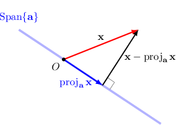

# Projecting Vectors Onto Subspaces in Inner Product Spaces

Source: https://www.mathacademy.com/topics/2126?courseId=55
Topic ID: 2126

## Prerequisites

- [The Norm of a Vector in Inner Product Spaces](./2098-the-norm-of-a-vector-in-inner-product-spaces.md)
- [Projecting Vectors Onto Subspaces in Euclidean Spaces (Orthogonal Bases)](./2123-projecting-vectors-onto-subspaces-in-euclidean-spaces-orthogonal-bases.md)
- [Evaluating Definite Integrals Using Symmetry](../../../ap-courses/lessons/ap-calculus-ab/2975-evaluating-definite-integrals-using-symmetry.md)

## Lesson

### Introduction

Let $V$ be an inner product space with the inner product $\langle\cdot, \cdot\rangle.$ If

$$

\big\{ \mathbf{a}_1, \mathbf{a}_2 , \ldots, \mathbf{a}_n \big\}

$$

is a set of mutually orthogonal vectors in $V,$ then the **orthogonal projection** of a vector $\mathbf{x}\in V$ onto the subspace

$$

S = \text{Span}\{ \mathbf{a}_1, \mathbf{a}_2 , \ldots, \mathbf{a}_n \}

$$

with respect to the inner product is given by

$$

\begin{aligned}proj_{𝑆}\,𝐱 & =proj_{𝐚_{1}}𝐱+proj_{𝐚_{2}}𝐱+⋯+proj_{𝐚_{𝑛}}𝐱 \\ & =\frac{⟨𝐱,𝐚_{1}⟩}{⟨𝐚_{1},𝐚_{1}⟩}𝐚_{1}+\frac{⟨𝐱,𝐚_{2}⟩}{⟨𝐚_{2},𝐚_{2}⟩}𝐚_{2}+⋯+\frac{⟨𝐱,𝐚_{𝑛}⟩}{⟨𝐚_{𝑛},𝐚_{𝑛}⟩}𝐚_{𝑛}.\end{aligned}

$$

In other words, the orthogonal projection of $\mathbf{x}$ onto $S$ is the sum of the orthogonal projections of $\mathbf{x}$ onto each one-dimensional subspace $\text{Span}\big\{\mathbf{a}_i\}$ for $i=1, 2, \cdots, n.$

Note the following:

- This is entirely analogous to the corresponding formula for Euclidean spaces.

- As in Euclidean spaces, the formula works *only* when the set of vectors $\{\mathbf{a}_1, \mathbf{a}_2, \ldots, \mathbf{a}_n \}$ is orthogonal with respect to the inner product!

### A Worked Example

Consider the functions

$$

f_1(t)=t,\qquad f_2(t)=t^2+1, \qquad h(t)= 5t^3,

$$

in the vector space $V = \mathcal{C}[-1,1]$ of continuous functions over $[-1,1],$ where the inner product is defined as

$$

\langle x(t),y(t) \rangle = \int_{-1}^1 x(t) y(t) \, \text{d}t.

$$

Let's find the orthogonal projection of $h(t)$ onto the subspace

$$

S= \text{Span}\{f_1(t), f_2(t)\},

$$

given that $f_1(t) \perp f_2(t)$ with respect to this inner product.

Since the set $\{f_1(t),f_2(t)\}$ is orthogonal, the orthogonal projection of $h(t)$ onto $S$ is given by

$$

\text{proj}_{S}\,h(t) = \text{proj}_{f_1(t)}\,h(t) + \text{proj}_{f_2(t)}\,h(t).

$$

Let's now compute these projections:

- First, we compute the orthogonal projection of $h(t)$ onto $\text{Span}\{f_1(t)\}\mathbin{:}$

- Next, we compute the orthogonal projection of $h(t)$ onto $\text{Span}\{f_2(t)\}\mathbin{:}$ Note: We used the fact that the integrand in the numerator is an odd function, so its integral over $[-1,1]$ must be zero.

Finally, we have

$$

\begin{aligned}proj_{𝑆}\,ℎ(𝑡) & =proj_{𝑓_{1}(𝑡)}\,ℎ(𝑡)+proj_{𝑓_{2}(𝑡)}\,ℎ(𝑡) \\ & =3𝑡+0 \\ & =3𝑡.\end{aligned}

$$

### Example: Finding the Orthogonal Projection of a Vector Onto a One-Dimensional Subspace

#### Question

Let $V = \Bbb R_1[t],$ the vector space of polynomials of degree at most $1$ with real coefficients. Given that the inner product on $V$ is defined as

$$

\langle p(t),q(t) \rangle = p(0)q(0)+p(1)q(1),

$$

find the orthogonal projection of $p(t)=-5t-3$ onto the subspace spanned by the polynomial $q(t) =t-1.$

#### Explanation

The orthogonal projection of $p(t)$ onto $\text{Span}\{q(t) \}$ is given by

$$

\text{proj}_{q(t)}\,p(t) = \dfrac{\langle{p(t),q(t)}\rangle}{\langle{q(t),q(t)}\rangle}\,q(t).

$$

In our case, we have

$$

\begin{aligned}⟨𝑝(𝑡),𝑞(𝑡)⟩ & =𝑝(0)𝑞(0)+𝑝(1)𝑞(1) \\ & =(−5𝑡−3)_{0}⋅(𝑡−1)_{0}+(−5𝑡−3)_{1}⋅(𝑡−1)_{1} \\ & =(−3)⋅(−1)+(−8)⋅0 \\ & =3+0 \\ & =3,\end{aligned}

$$

and

$$

\begin{aligned}⟨𝑞(𝑡),𝑞(𝑡)⟩ & =𝑞(0)𝑞(0)+𝑞(1)𝑞(1) \\ & =(𝑡−1)_{0}⋅(𝑡−1)_{0}+(𝑡−1)_{1}⋅(𝑡−1)_{1} \\ & =(−1)⋅(−1)+0⋅0 \\ & =1+0 \\ & =1.\end{aligned}

$$

Therefore, the projection is

$$

\begin{aligned}proj_{𝑞(𝑡)}\,𝑝(𝑡) & =\frac{⟨𝑝(𝑡),𝑞(𝑡)⟩}{⟨𝑞(𝑡),𝑞(𝑡)⟩}\,𝑞(𝑡) \\ & =\frac{3}{1}⋅(𝑡−1) \\ & =3(𝑡−1).\end{aligned}

$$

### Example: Finding the Orthogonal Projection of a Vector Onto a Subspace Spanned by Orthogonal Vectors

#### Question

Let $V = \mathcal{C}[-1,1],$ the vector space of continuous functions over $[-1,1]$, and let the inner product on $V$ be defined as

$$

\langle x(t),y(t) \rangle =\int_{-1}^{1} x(t) y(t) \, \text{d}t.

$$

Now consider the following elements of $V\mathbin{:}$

$$

f_1(t)=1,\quad f_2(t)=\sin \pi t, \quad g(t)=6t^2

$$

Find the orthogonal projection of $g(t)$ onto $S=\text{Span}\{f_1(t), f_2(t)\}$ given that $f_1(t) \perp f_2(t)$ with respect to the inner product, and that the orthogonal projection of $g(t)$ onto $\text{Span}\{f_1(t)\}$ equals $2.$

#### Explanation

Since the set $\{f_1(t),f_2(t)\}$ is orthogonal, the orthogonal projection of $g(t)$ onto the subspace $S$ is given by

$$

\text{proj}_{S}\,g(t) = \text{proj}_{f_1(t)}\,g(t) + \text{proj}_{f_2(t)}\,g(t).

$$

We are given that $\text{proj}_{f_1(t)}\,g(t) = 2,$ so let's now find the orthogonal projection of $g(t)$ onto $\text{Span}\{f_2(t)\}.$ This can be computed as

$$

\text{proj}_{f_2(t)}\,g(t) = \dfrac{\langle{g(t),f_2(t)}\rangle}{\langle{f_2(t),f_2(t)}\rangle}\,f_2(t).

$$

In our case, we have

$$

\begin{aligned}⟨𝑔(𝑡),𝑓_{2}(𝑡)⟩ & =∫_{1−1}𝑔(𝑡)𝑓_{2}(𝑡)\,d𝑡 \\ & =∫_{1−1}6𝑡^{2}⋅sin⁡(𝜋𝑡)\,d𝑡 \\ & =∫_{1−1}6𝑡^{2}sin⁡(𝜋𝑡)\,d𝑡.\end{aligned}

$$

Notice that $\sin (\pi t)$ is an odd function, while $6t^2$ is even. Hence, their product $6 t^2 \sin (\pi t)$ must be an odd function. Now, since we have an integral over the interval $[-1,1],$ which is symmetric about the origin, we can conclude that

$$

\int_{-1}^{1} 6t^2 \sin (\pi t) \, \text{d}t = 0.

$$

Therefore,

$$

\text{proj}_{f_2(t)}\,g(t) = \dfrac{0}{\langle{f_2(t),f_2(t)}\rangle} \cdot \sin \pi t = 0.

$$

Finally,

$$

\begin{aligned}proj_{𝑆}\,𝑔(𝑡) & =proj_{𝑓_{1}(𝑡)}\,𝑔(𝑡)+proj_{𝑓_{2}(𝑡)}\,𝑔(𝑡) \\ & =2+0 \\ & =2.\end{aligned}

$$

### The Distance Between a Vector and a Subspace

Suppose that $V$ is a vector space equipped with an inner product $\left\langle\cdot, \cdot\right\rangle$ and that $\mathbf{v}, \mathbf{w} \in V.$ The **distance $d$ between $\mathbf v$ and $\mathbf w$ with respect to the inner product** is defined by the *norm* of $\mathbf{v}- \mathbf{w}.$ That is,

$$

\begin{aligned}𝑑 & =‖𝐯−𝐰‖=\sqrt{⟨𝐯−𝐰,𝐯−𝐰⟩}.\end{aligned}

$$

For example, suppose that $V = \mathcal{C}[0,1],$ the vector space of continuous functions over $[0,1],$ equipped with the inner product

$$

\langle x(t),y(t) \rangle = \int_0^{1} x(t) y(t) \, \text{d}t.

$$

The distance between the functions $f(t)=4t$ and $g(t)=t+1$ with respect to the given inner product is

$$

\begin{aligned}𝑑 & =‖𝑓(𝑡)−𝑔(𝑡)‖ \\ & =‖4𝑡−(𝑡+1)‖ \\ & =‖3𝑡−1‖ \\ & =\sqrt{⟨3𝑡−1,3𝑡−1⟩} \\ & =\sqrt{∫_{10}(3𝑡−1)^{2}\,d𝑡} \\ & =\sqrt{\frac{1}{9}⋅(3𝑡−1)^{3}_{10}} \\ & =\sqrt{\frac{1}{9}⋅[(8)−(−1)]} \\ & =\sqrt{\frac{1}{9}⋅9} \\ & =\sqrt{1} \\ & =1.\end{aligned}

$$

More generally, given an orthogonal set

$$

\big\{ \mathbf{a}_1, \mathbf{a}_2 , \ldots, \mathbf{a}_n \big\} \subset V

$$

and a vector $\mathbf x \in V,$ the **distance between $\mathbf{x}$ and the subspace**

$$

S=\text{Span}\{ \mathbf{a}_1,\mathbf{a}_2, \ldots, \mathbf{a}_n \}

$$

is defined as

$$

\Vert{ \color{black} \mathbf{x} - \text{proj}_{S}\,\mathbf{x} }\Vert.

$$

### Example: Calculating the Distance Between a Vector and a Subspace

#### Question

Let $V = \Bbb R_1[t],$ the vector space of polynomials of degree at most $1$ with real coefficients. Given that the inner product on $V$ is defined as

$$

\langle p(t), q(t) \rangle = p(0)q(0) + p(1)q(1),

$$

find the distance between $p(t) = 4t + 2$ and the subspace spanned by $q(t) = t$ with respect to the inner product.

#### Explanation

The orthogonal projection of $p(t)$ onto $\text{Span}\{q(t) \}$ is given by

$$

\begin{aligned}proj_{𝑞(𝑡)}\,𝑝(𝑡) & =\frac{⟨𝑝(𝑡),𝑞(𝑡)⟩}{⟨𝑞(𝑡),𝑞(𝑡)⟩}\,𝑞(𝑡) \\ & =\frac{𝑝(0)𝑞(0)+𝑝(1)𝑞(1)}{𝑞(0)^{2}+𝑞(1)^{2}}⋅𝑞(𝑡) \\ & =\frac{(2)(0)+(6)(1)}{0^{2}+1^{2}}⋅𝑡 \\ & =6𝑡.\end{aligned}

$$

The distance between $p(t) = 4t + 2$ and the subspace spanned by $q(t) = t$ with respect to our inner product is

$$

\begin{aligned}𝑑 & =‖𝑝(𝑡)−proj_{𝑞(𝑡)}\,𝑝(𝑡)‖ \\ & =‖(4𝑡+2)−6𝑡‖ \\ & =‖−2𝑡+2‖ \\ & =\sqrt{⟨−2𝑡+2, −2𝑡+2⟩}.\end{aligned}

$$

Computing the inner product, we get

$$

\begin{aligned}⟨−2𝑡+2, −2𝑡+2⟩ & =(−2𝑡+2)_{0}⋅(−2𝑡+2)_{0}+(−2𝑡+2)_{1}⋅(−2𝑡+2)_{1} \\ & =(−2(0)+2)^{2}+(−2(1)+2)^{2} \\ & =2^{2}+0^{2} \\ & =4.\end{aligned}

$$

Therefore, the distance is $d = \sqrt{4} = 2.$

### The Intuition Behind Orthogonal Projections in Inner Product Spaces

The orthogonal projection of a vector $\mathbf{x}\in V$ onto $\text{Span}\{\mathbf{a}\}$ (or simply onto a vector $\mathbf{a}$) is the vector $\text{proj}_{\mathbf{a}}\,\mathbf{x}\in \text{Span}\{\mathbf{a}\}$ that is "closest" to $\mathbf{x}$ with respect to the distance defined by the inner product.

Although we've considered abstract vector spaces with any possible inner product in this lesson, we can still visualize this situation with the following diagram:

As shown in the diagram, the projection of $\mathbf{x}$ onto $\text{Span}\{\mathbf{a}\}$ is the vector $\text{proj}_{\mathbf{a}}\,\mathbf{x}$ such that $\mathbf{x} - \text{proj}_{\mathbf{a}}\,\mathbf{x}$ is orthogonal to $\text{Span}\{\mathbf{a}\}.$

Furthermore, $\| \mathbf{x} - \text{proj}_{\mathbf{a}}\,\mathbf{x} \|$ will be the smallest possible distance (with respect to our inner product) from $\mathbf{x}$ to any vector in $\text{Span}\{\mathbf{a}\}.$
