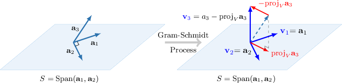

# The Gram-Schmidt Process in the General Case

Source: https://www.mathacademy.com/topics/2128?courseId=55
Topic ID: 2128

## Prerequisites

- [Projecting Vectors Onto Subspaces in Euclidean Spaces (Orthogonal Bases)](./2123-projecting-vectors-onto-subspaces-in-euclidean-spaces-orthogonal-bases.md)
- [The Gram-Schmidt Process for Two Vectors](./2127-the-gram-schmidt-process-for-two-vectors.md)

## Lesson

### Introduction

Consider the subspace $V=\text{Span}\{\mathbf{a}_1,\mathbf{a}_2,\mathbf{a}_3\},$ where

$$

\begin{aligned}1 \\ −1 \\ 0\end{aligned}

$$

We already know how to find an orthogonal basis for $2$-dimensional subspaces. But, how can we do it for subspaces with higher dimensions, like $V?$

Good news is that we can extend the **Gram-Schmidt process**. Since the first two vectors are already orthogonal, we proceed to find an orthogonal basis using the Gram-Schmidt process, as follows:

**Step 1**: We set $\begin{aligned}1 \\ −1 \\ 0\end{aligned}$

**Step 2**: We set $\begin{aligned}1 \\ 1 \\ −1\end{aligned}$

**Step 3**. Next, let $S=\text{Span}(\mathbf{a}_1,\mathbf{a}_2).$ We find ${\color{blue}\mathbf{v}_3}$ using the formula

$$

\begin{aligned}𝐯_{3} & =𝐚_{3}\,−\,proj_{𝑆}\,𝐚_{3} \\ & =𝐚_{3}\,−\,proj_{𝐯_{1}}\,𝐚_{3}\,−\,proj_{𝐯_{2}}\,𝐚_{3} \\ & =𝐚_{3}−\frac{𝐚_{3}⋅𝐯_{1}}{𝐯_{1}⋅𝐯_{1}}𝐯_{1}−\frac{𝐚_{3}⋅𝐯_{2}}{𝐯_{2}⋅𝐯_{2}}𝐯_{2}.\end{aligned}

$$

Notice that $\color{blue}\mathbf{v}_3$ is written as a linear combination of $\mathbf{a}_1(={\color{blue}\mathbf{v}_1}),$ $\mathbf{a}_2(={\color{blue}\mathbf{v}_2}),$ and $\mathbf{a}_3.$ This means that ${\color{blue}\mathbf{v}_3} \in V,$ and also ${\color{blue}\mathbf{v}_3} \perp S.$ Moreover,

$$

\text{Span}\{\mathbf{a}_1,\mathbf{a}_2,\mathbf{a}_3\} = V = \text{Span}\{ {\color{blue}\mathbf{v}_1}, {\color{blue}\mathbf{v}_2}, {\color{blue}\mathbf{v}_3} \}.

$$

Applying the formula for $\mathbf{v}_3$ in our case gives

$$

\begin{aligned}𝐯_{3} & =\begin{matrix}1 \\ −1 \\ 3\end{matrix}−(\frac{2}{2})\begin{matrix}1 \\ −1 \\ 0\end{matrix}−(−\frac{3}{3})\begin{matrix}1 \\ 1 \\ −1\end{matrix} \\ & =\begin{matrix}1 \\ −1 \\ 3\end{matrix}−\begin{matrix}1 \\ −1 \\ 0\end{matrix}+\begin{matrix}1 \\ 1 \\ −1\end{matrix} \\ & =\begin{matrix}1 \\ 1 \\ 2\end{matrix}.\end{aligned}

$$

Finally, $\begin{aligned}1 \\ −1 \\ 0\end{aligned}$ is an orthogonal basis for $V.$

### Example: Finding an Orthogonal Basis of a Span Given Some Orthogonal Vectors

#### Question

Consider the following vectors:

$$

\begin{aligned}1 \\ 1 \\ 1 \\ 1\end{aligned}

$$

Suppose that $V = \text{Span}\{\mathbf a_1, \mathbf a_2, \mathbf a_3\}.$ Given that $\mathcal B = \{\mathbf a_1, \mathbf a_2, \mathbf b\}$ is an orthogonal basis for $V, \mathbf{a}_1 \perp \mathbf{a}_2,$ and that $\mathcal B$ is derived from $V$ using the Gram-Schmidt process, what is the value of $\dfrac{c}{a}?$

#### Explanation

Since the first two vectors are already orthogonal, we proceed to find an orthogonal basis using the Gram-Schmidt process, as follows:

****: We set $\begin{aligned}1 \\ 1 \\ 1 \\ 1\end{aligned}$

****: We set $\begin{aligned}1 \\ 1 \\ −1 \\ −1\end{aligned}$

****. Next, we find $\mathbf{v}_3$ using the formula

$$

\begin{aligned}𝐯_{3} & =𝐚_{3}−proj_{𝐯_{1}}\,𝐚_{3}−proj_{𝐯_{2}}\,𝐚_{3} \\ & =𝐚_{3}−\frac{𝐚_{3}⋅𝐯_{1}}{𝐯_{1}⋅𝐯_{1}}𝐯_{1}−\frac{𝐚_{3}⋅𝐯_{2}}{𝐯_{2}⋅𝐯_{2}}𝐯_{2}.\end{aligned}

$$

Applying the formula for $\mathbf{v}_3$ in our case gives

$$

\begin{aligned}𝐯_{3} & =\begin{matrix}−1 \\ 0 \\ −2 \\ 1\end{matrix}−(−\frac{2}{4})\begin{matrix}1 \\ 1 \\ 1 \\ 1\end{matrix}−\frac{0}{4}\begin{matrix}1 \\ 1 \\ −1 \\ −1\end{matrix} \\ & =\begin{matrix}−1 \\ 0 \\ −2 \\ 1\end{matrix}+\frac{1}{2}\begin{matrix}1 \\ 1 \\ 1 \\ 1\end{matrix}−0\begin{matrix}1 \\ 1 \\ −1 \\ −1\end{matrix} \\ & =\frac{1}{2}2\begin{matrix}−1 \\ 0 \\ −2 \\ 1\end{matrix}+\begin{matrix}1 \\ 1 \\ 1 \\ 1\end{matrix} \\ & =\begin{matrix}−\frac{1}{2} \\ \frac{1}{2} \\ −\frac{3}{2} \\ \frac{3}{2}\end{matrix}.\end{aligned}

$$

Finally, $a=-\dfrac 1 2,$ $c=-\dfrac 3 2,$ and $\dfrac{c}{a} = \dfrac{\left(-\dfrac 3 2\right)}{\left(-\dfrac 1 2\right)} = 3.$

### Example: Finding an Orthogonal Basis For the Column Space of a Matrix Given Some Orthogonal Columns

#### Question

$$

\begin{aligned}2 & 1 & 2 \\ −1 & 3 & 0 \\ 1 & 3 & 6 \\ 2 & −1 & 0\end{aligned}

$$

Consider the subspace $V=\text{Col}(A)$ spanned by the columns $\mathbf{a}_1,\mathbf{a}_2,\mathbf{a}_3$ of the matrix $A,$ and an **** basis $\mathcal{B}$ of $\text{Col}(A),$ shown above. Given that $\mathbf{a}_1 \perp \mathbf{a}_2,$ and that $\mathcal B$ is derived from $V$ using the Gram-Schmidt process, what is the value of $|\,d\,|?$

#### Explanation

Since the first two vectors are already orthogonal, we proceed to find an orthogonal basis using the Gram-Schmidt process.

****: We set $\begin{aligned}2 \\ −1 \\ 1 \\ 2\end{aligned}$

****: We set $\begin{aligned}1 \\ 3 \\ 3 \\ −1\end{aligned}$

****. Next, we find $\mathbf{v}_3$ using the formula

$$

\begin{aligned}𝐯_{3} & =𝐚_{3}−proj_{𝐯_{1}}\,𝐚_{3}−proj_{𝐯_{2}}\,𝐚_{3} \\ & =𝐚_{3}−\frac{𝐚_{3}⋅𝐯_{1}}{𝐯_{1}⋅𝐯_{1}}𝐯_{1}−\frac{𝐚_{3}⋅𝐯_{2}}{𝐯_{2}⋅𝐯_{2}}𝐯_{2}.\end{aligned}

$$

Applying the formula for $\mathbf{v}_3$ in our case gives

$$

\begin{aligned}𝐯_{3} & =\begin{matrix}2 \\ 0 \\ 6 \\ 0\end{matrix}−\frac{10}{10}\begin{matrix}2 \\ −1 \\ 1 \\ 2\end{matrix}−\frac{20}{20}\begin{matrix}1 \\ 3 \\ 3 \\ −1\end{matrix} \\ & =\begin{matrix}2 \\ 0 \\ 6 \\ 0\end{matrix}−\begin{matrix}2 \\ −1 \\ 1 \\ 2\end{matrix}−\begin{matrix}1 \\ 3 \\ 3 \\ −1\end{matrix} \\ & =\begin{matrix}−1 \\ −2 \\ 2 \\ −1\end{matrix}.\end{aligned}

$$

Now, we normalize $\mathbf{v}_3$ dividing it by $\|\mathbf{v}_3\| = \sqrt{10}\mathbin{:}$

$$

\begin{aligned}𝐮_{3} & =\frac{𝐯_{3}}{‖𝐯_{3}‖}=\frac{1}{\sqrt{10}}\begin{matrix}−1 \\ −2 \\ 2 \\ −1\end{matrix}=\begin{matrix}−\frac{\sqrt{10}}{10} \\ −\frac{\sqrt{10}}{5} \\ \frac{\sqrt{10}}{5} \\ −\frac{\sqrt{10}}{10}\end{matrix}.\end{aligned}

$$

Finally, $|\,d\,| = \left|-\dfrac{\sqrt{10}}{10}\right|=\dfrac{\sqrt{10}}{10}.$

### Gram-Schmidt Process

But what do we do if the original basis we are given doesn't contain any orthogonal vectors? Well, then we make them orthogonal using the Gram-Schmidt process!

Given a basis $\,\{\mathbf{a}_1,\mathbf{a}_2,\ldots,\mathbf{a}_n\}$ for a non zero subspace $V$, we can get an orthogonal basis for $V$ by defining the vectors

$$

\begin{aligned}𝐯_{1} & =𝐚_{1} \\ 𝐯_{2} & =𝐚_{2}−proj_{𝐯_{1}}\,𝐚_{2} \\ 𝐯_{3} & =𝐚_{3}−proj_{𝐯_{1}}\,𝐚_{3}−proj_{𝐯_{2}}\,𝐚_{3} \\ ⋮\,\, & =\,⋮ \\ 𝐯_{𝑛} & =𝐚_{𝑛}−proj_{𝐯_{1}}\,𝐚_{𝑛}−proj_{𝐯_{2}}\,𝐚_{𝑛}−⋯−proj_{𝐯_{𝑛−1}}\,𝐚_{𝑛}.\end{aligned}

$$

The set of vectors $\{\mathbf{v}_1,\mathbf{v}_2,\ldots, \mathbf{v}_n\}$ will be an orthogonal basis for $V$.

Here, we build up the orthogonal basis one vector at a time, by taking away from each basis vector its orthogonal projection onto each of the $1$-dimensional subspaces spanned by one of the orthogonal basis vectors found already.

Furthermore, if we want to find an *orthonormal* basis, we just have to normalize the vectors $\mathbf{v}_i$ for $i=1,2,\dots,n.$

### Example: Finding an Orthogonal Basis Using the Gram-Schmidt Process

#### Question

$$

\begin{aligned}−1 \\ 1 \\ 1\end{aligned}

$$

Suppose that $V = \text{Span}\{\mathbf a_1, \mathbf a_2, \mathbf a_3\}.$ Given that $\mathcal B$ is an orthogonal basis for $V,$ and that $\mathcal B$ is derived from $V$ using the Gram-Schmidt process, what is the value of $\dfrac{b}{c}?$

#### Explanation

We find an orthogonal basis $\mathcal B$ of $V$ using the Gram-Schmidt process, as follows:

**** We set $\begin{aligned}−1 \\ 1 \\ 1\end{aligned}$

**** We find the vector $\mathbf{v}_2$ orthogonal to $\text{Span}\{\mathbf{v}_1\}$ using the usual formula:

$$

\begin{aligned}𝐯_{2} & =𝐚_{2}−proj_{𝐯_{1}}𝐚_{2} \\ & =𝐚_{2}−\frac{𝐚_{2}⋅𝐯_{1}}{𝐯_{1}⋅𝐯_{1}}𝐯_{1} \\ & =\begin{matrix}1 \\ 2 \\ 2\end{matrix}−\frac{3}{3}\begin{matrix}−1 \\ 1 \\ 1\end{matrix} \\ & =\begin{matrix}2 \\ 1 \\ 1\end{matrix}.\end{aligned}

$$

**** We find the vector $\mathbf{v}_3$ orthogonal to $\text{Span}\{\mathbf{v}_1,\mathbf{v}_2 \}$ using the usual formula:

$$

\begin{aligned}𝐯_{3} & =𝐚_{3}−proj_{𝐯_{1}}\,𝐚_{3}−proj_{𝐯_{2}}\,𝐚_{3} \\ & =𝐚_{3}−\frac{𝐚_{3}⋅𝐯_{1}}{𝐯_{1}⋅𝐯_{1}}𝐯_{1}−\frac{𝐚_{3}⋅𝐯_{2}}{𝐯_{2}⋅𝐯_{2}}𝐯_{2} \\ & =\begin{matrix}2 \\ 1 \\ −2\end{matrix}−(−\frac{3}{3})\begin{matrix}−1 \\ 1 \\ 1\end{matrix}−\frac{3}{6}\begin{matrix}2 \\ 1 \\ 1\end{matrix} \\ & =\begin{matrix}2 \\ 1 \\ −2\end{matrix}+\begin{matrix}−1 \\ 1 \\ 1\end{matrix}−\frac{1}{2}\begin{matrix}2 \\ 1 \\ 1\end{matrix} \\ & =\frac{1}{2}2\begin{matrix}2 \\ 1 \\ −2\end{matrix}+2\begin{matrix}−1 \\ 1 \\ 1\end{matrix}−\begin{matrix}2 \\ 1 \\ 1\end{matrix} \\ & =\begin{matrix}0 \\ \frac{3}{2} \\ −\frac{3}{2}\end{matrix}.\end{aligned}

$$

Finally, $b=\dfrac 3 2,$ $c=-\dfrac 3 2,$ and $\dfrac{b}{c} = \dfrac{\left(\dfrac 3 2\right)}{\left(-\dfrac 3 2\right)}=-1.$
