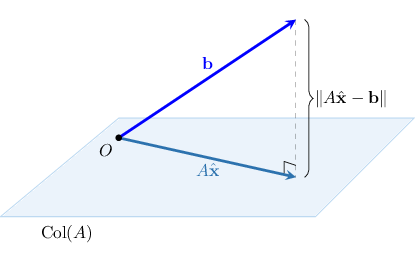
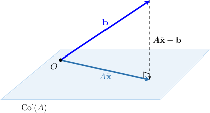

# The Least-Squares Solution of a Linear System (Without Collinearity)

Source: https://www.mathacademy.com/topics/2166?courseId=55
Topic ID: 2166

## Prerequisites

- [Matrices With Easy-to-Find Inverses](./42-matrices-with-easy-to-find-inverses.md)
- [Representing 3x3 Systems of Equations Using a Matrix Product](../../../high-school/integrated-math-honors/lessons/integrated-math-iii-honors/155-representing-3x3-systems-of-equations-using-a-matrix-product.md)
- [Projecting Vectors Onto Subspaces in Euclidean Spaces (Arbitrary Bases): Applications](./3818-projecting-vectors-onto-subspaces-in-euclidean-spaces-arbitrary-bases-applications.md)

## Lesson

### Introduction

Let's consider the following system of linear equations:

$$

\begin{aligned}𝑥_{1}+𝑥_{2}=−2 \\ −𝑥_{1}−4𝑥_{2}=4 \\ 2𝑥_{1}−𝑥_{2}=2\end{aligned}

$$

It is easy to show that the system is inconsistent (i.e., it has no solution). However, in real-world problems, we might want to find an approximate solution to the system.

Let's formulate the problem a little more rigorously. Firstly, we write down the system in the form $A\mathbf x = \mathbf b\mathbin{:}$

$$

\begin{aligned}1 & 1 \\ −1 & −4 \\ 2 & −1\end{aligned}

$$

We are interested in vectors $\hat{\mathbf{x}}$ such that $A\hat{\mathbf{x}}$ is very close to $\mathbf b.$ More precisely, we wish to *minimize the distance* between $A\hat{\mathbf{x}}$ and $\mathbf b.$ Recall that the distance between $A\hat{\mathbf{x}}$ and $\mathbf b$ is given by

$$

\Vert A{\hat{\mathbf{x}}} - \mathbf{b} \Vert.

$$

The smaller the value of $\Vert A{\hat{\mathbf{x}}} - \mathbf{b} \Vert,$ the better our approximation $\hat{\mathbf{x}}$ will be.

In terms of vector subspaces, we wish to find a vector $A{\hat{\mathbf{x}}}$ that lies in $\textrm{Col}(A)$ and is closest to $\mathbf{b}.$ Therefore, $A{\hat{\mathbf{x}}}$ must be the orthogonal projection of $\mathbf{b}$ onto the subspace spanned by the columns of $A.$

It can be shown that ${\hat{\mathbf{x}}}$ is found by solving the corresponding **normal equation**, given by

$$

\begin{aligned}𝐴^{𝑇}\,𝐴\overset{𝐱}{^} & =𝐴^{𝑇}𝐛.\end{aligned}

$$

We'll prove this at the end of the lesson. Note that the normal equation is obtained by left-multiplying the equation $A {\hat{\mathbf{x}}} = \mathbf b$ by $A^T.$

Since the columns of $A$ are linearly independent, the matrix $A^T \! A$ is invertible. Therefore, left-multiplying the normal equation by $(A^T \! A)^{-1},$ we obtain

$$

{\hat{\mathbf{x}}} = (A^T \! A)^{-1}A^T \mathbf{b}.

$$

We now compute the right-hand side as follows:

$$

\begin{aligned}\overset{𝐱}{^} & =(𝐴^{𝑇}\,𝐴)^{−1}𝐴^{𝑇}𝐛 \\ & =[\begin{aligned}1 & −1 & 2 \\ 1 & −4 & −1\end{aligned}]\begin{aligned}1 & 1 \\ −1 & −4 \\ 2 & −1\end{aligned}^{−1}\,\,\,\,[\begin{aligned}1 & −1 & 2 \\ 1 & −4 & −1\end{aligned}]\begin{aligned}−2 \\ 4 \\ 2\end{aligned} \\ & =[\begin{aligned}6 & 3 \\ 3 & 18\end{aligned}]^{−1}[\begin{aligned}−2 \\ −20\end{aligned}] \\ & =\frac{1}{99}[\begin{aligned}18 & −3 \\ −3 & 6\end{aligned}][\begin{aligned}−2 \\ −20\end{aligned}] \\ & =\begin{aligned}\frac{8}{33} \\ −\frac{38}{33}\end{aligned}\end{aligned}

$$

The vector ${\hat{\mathbf{x}}}$ is called the **least-squares solution** of the given system.

**Watch out!** We assumed that the columns of $A$ are linearly independent, which guarantees that $A^T \! A\,$ is invertible. However, if the columns of $A$ are linearly *dependent,* then we have to use a different approach to solve the problem.

### Example: Finding the Least-Squares Solution of a Linear System Given in Matrix Form

#### Question

Given that the columns of $A$ are linearly independent, find the least-squares solution of $A\mathbf{x}=\mathbf{b}$, where

$$

\begin{aligned}1 & −1 \\ 1 & 0 \\ 2 & −1 \\ 0 & 1\end{aligned}

$$

#### Explanation

First of all, we write the given system in the form $A \mathbf{x} = \mathbf{b}\mathbin{:}$

$$

\begin{aligned}1 & −1 \\ 1 & 0 \\ 2 & −1 \\ 0 & 1\end{aligned}

$$

We can find the least-squares solution ${\hat{\mathbf{x}}}$ of the equation above by solving the corresponding normal equation, which we obtain by left-multiplying our original equation by $A^T\mathbin{:}$

$$

\begin{aligned}𝐴^{𝑇}\,𝐴\overset{𝐱}{^} & =𝐴^{𝑇}𝐛\end{aligned}

$$

Since the columns of $A$ are linearly independent, the matrix $A^T \! A$ is invertible. Therefore, multiplying by $(A^T \! A)^{-1}$ on the left, we obtain

$$

\begin{aligned}\overset{𝐱}{^} & =(𝐴^{𝑇}\,𝐴)^{−1}𝐴^{𝑇}𝐛 \\ & =[\begin{aligned}1 & 1 & 2 & 0 \\ −1 & 0 & −1 & 1\end{aligned}]\begin{aligned}1 & −1 \\ 1 & 0 \\ 2 & −1 \\ 0 & 1\end{aligned}^{−1}\,\,\,[\begin{aligned}1 & 1 & 2 & 0 \\ −1 & 0 & −1 & 1\end{aligned}]\begin{aligned}1 \\ 0 \\ 1 \\ 0\end{aligned} \\ & =[\begin{aligned}6 & −3 \\ −3 & 3\end{aligned}]^{−1}[\begin{aligned}3 \\ −2\end{aligned}] \\ & =\frac{1}{3}[\begin{aligned}1 & 1 \\ 1 & 2\end{aligned}][\begin{aligned}3 \\ −2\end{aligned}] \\ & =\begin{aligned}\frac{1}{3} \\ −\frac{1}{3}\end{aligned}.\end{aligned}

$$

### Example: Finding the Least-Squares Solution of a Linear System

#### Question

Find the least-squares solution to the system of linear equations given below. You're given that the columns of the corresponding coefficient matrix are linearly independent.

$$

\begin{aligned}−2𝑥_{1}−𝑥_{2}=12 \\ 𝑥_{1}−2𝑥_{2}+𝑥_{3}=0 \\ −𝑥_{2}−2𝑥_{3}=−12 \\ 𝑥_{1}−𝑥_{3}=0\end{aligned}

$$

#### Explanation

First of all, we write the given system in the form $A \mathbf{x} = \mathbf{b}\mathbin{:}$

$$

\begin{aligned}−2 & −1 & 0 \\ 1 & −2 & 1 \\ 0 & −1 & −2 \\ 1 & 0 & −1\end{aligned}

$$

We can find the least-squares solution ${\hat{\mathbf{x}}}$ of the equation above by solving the corresponding normal equation, which we obtain by left-multiplying our original equation by $A^T\mathbin{:}$

$$

\begin{aligned}𝐴^{𝑇}\,𝐴\overset{𝐱}{^} & =𝐴^{𝑇}𝐛\end{aligned}

$$

Since the columns of $A$ are linearly independent, the matrix $A^T \! A$ is invertible. Therefore, multiplying by $(A^T \! A)^{-1}$ on the left, we obtain

$$

\begin{aligned}\overset{𝐱}{^} & =(𝐴^{𝑇}\,𝐴)^{−1}𝐴^{𝑇}𝐛 \\ & =\begin{aligned}−2 & 1 & 0 & 1 \\ −1 & −2 & −1 & 0 \\ 0 & 1 & −2 & −1\end{aligned}\begin{aligned}−2 & −1 & 0 \\ 1 & −2 & 1 \\ 0 & −1 & −2 \\ 1 & 0 & −1\end{aligned}^{−1}\,\,\,\,\begin{aligned}−2 & 1 & 0 & 1 \\ −1 & −2 & −1 & 0 \\ 0 & 1 & −2 & −1\end{aligned}\begin{aligned}12 \\ 0 \\ −12 \\ 0\end{aligned} \\ & =\begin{aligned}6 & 0 & 0 \\ 0 & 6 & 0 \\ 0 & 0 & 6\end{aligned}^{−1}\begin{aligned}−24 \\ 0 \\ 24\end{aligned} \\ & =\frac{1}{6}\begin{aligned}1 & 0 & 0 \\ 0 & 1 & 0 \\ 0 & 0 & 1\end{aligned}\begin{aligned}−24 \\ 0 \\ 24\end{aligned} \\ & =\begin{aligned}−4 \\ 0 \\ 4\end{aligned}.\end{aligned}

$$

### Example: Finding the Distance Between a Vector to a Subspace of Solutions of a Linear System

#### Question

Consider the system $A\mathbf{x}=\mathbf{b}$, where the matrix $A$ and the vector $\mathbf{b}$ are given below. Given that the columns of $A$ are linearly independent, find the minimum value of $\Vert A\mathbf{x} - \mathbf{b} \Vert.$

$$

\begin{aligned}1 & 1 \\ 1 & 0 \\ −1 & 0 \\ −1 & −1\end{aligned}

$$

#### Explanation

First of all, we write the given system in the form $A \mathbf{x} = \mathbf{b}\mathbin{:}$

$$

\begin{aligned}\overset{\overset\begin{aligned}1 & 1 \\ 1 & 0 \\ −1 & 0 \\ −1 & −1\end{aligned}}{}}{𝐴}\overset{\overset{[\begin{aligned}𝑥_{1} \\ 𝑥_{2}\end{aligned}]}{}}{𝐱} & =\overset{\overset\begin{aligned}22 \\ 0 \\ 0 \\ 2\end{aligned}}{}}{𝐛} \\ 𝐴𝐱 & =𝐛\end{aligned}

$$

We can find the least-squares solution ${\hat{\mathbf{x}}}$ of the equation above by solving the corresponding normal equation, which we obtain by left-multiplying our original equation by $A^T\mathbin{:}$

$$

\begin{aligned}𝐴^{𝑇}\,𝐴\overset{𝐱}{^} & =𝐴^{𝑇}𝐛\end{aligned}

$$

Since the columns of $A$ are linearly independent, the matrix $A^T \! A$ is invertible. Therefore, multiplying by $(A^T \! A)^{-1}$ on the left, we obtain

$$

\begin{aligned}\overset{𝐱}{^} & =(𝐴^{𝑇}\,𝐴)^{−1}𝐴^{𝑇}𝐛 \\ & =[\begin{aligned}1 & 1 & −1 & −1 \\ 1 & 0 & 0 & −1\end{aligned}]\begin{aligned}1 & 1 \\ 1 & 0 \\ −1 & 0 \\ −1 & −1\end{aligned}^{−1}\,\,\,\,[\begin{aligned}1 & 1 & −1 & −1 \\ 1 & 0 & 0 & −1\end{aligned}]\begin{aligned}22 \\ 0 \\ 0 \\ 2\end{aligned} \\ & =[\begin{aligned}4 & 2 \\ 2 & 2\end{aligned}]^{−1}[\begin{aligned}20 \\ 20\end{aligned}] \\ & =\frac{1}{4}[\begin{aligned}2 & −2 \\ −2 & 4\end{aligned}][\begin{aligned}20 \\ 20\end{aligned}] \\ & =\frac{1}{2}[\begin{aligned}1 & −1 \\ −1 & 2\end{aligned}][\begin{aligned}20 \\ 20\end{aligned}] \\ & =[\begin{aligned}0 \\ 10\end{aligned}].\end{aligned}

$$

The minimum value of $\Vert A\mathbf{x} - \mathbf{b} \Vert$ is attained when $\mathbf{x}={\hat{\mathbf{x}}},$ which is the least-squares solution of the system $A\mathbf{x}=\mathbf{b}.$

In this case, $A{\hat{\mathbf{x}}}$ represents the orthogonal projection of $\mathbf{b}$ onto the column space of $A,$ and $\Vert A{\hat{\mathbf{x}}} - \mathbf{b} \Vert$ is the distance between the vector $\mathbf{b}$ and the column space.

Therefore,

$$

\begin{aligned}𝐴\overset{𝐱}{^}−𝐛 & =\begin{aligned}1 & 1 \\ 1 & 0 \\ −1 & 0 \\ −1 & −1\end{aligned}[\begin{aligned}0 \\ 10\end{aligned}]−\begin{aligned}22 \\ 0 \\ 0 \\ 2\end{aligned}=\begin{aligned}−12 \\ 0 \\ 0 \\ −12\end{aligned}.\end{aligned}

$$

Finally,

$$

\Vert A{\hat{\mathbf{x}}}-\mathbf{b}\Vert =\sqrt{(-12)^2+0^2+(-12)^2+0^2}=12\sqrt{2}.

$$

### Deriving the Normal Equation

Suppose that is an matrix with linearly independent columns. We'll now explain why the least-squares solution to the least-squares problem

can be found by solving the normal equation

The vector must be the orthogonal projection of onto the subspace spanned by the columns of

As a result, we have that

which is equivalent to saying that is orthogonal to each column of Thus, the dot product of the columns of and the vector must be equal to

This system of equations can be written in terms of matrix products as

Finally, expanding the left-hand side, we obtain our normal equation:
