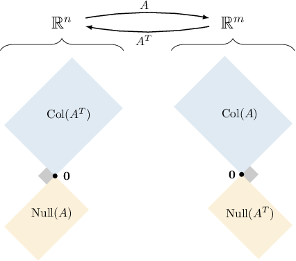
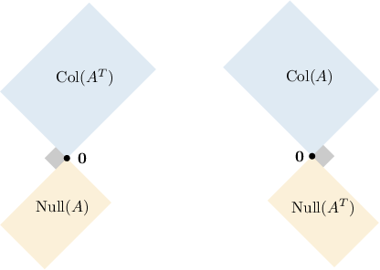
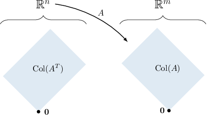
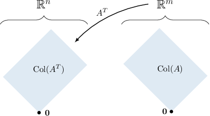
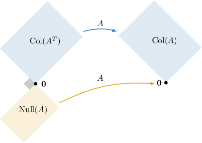
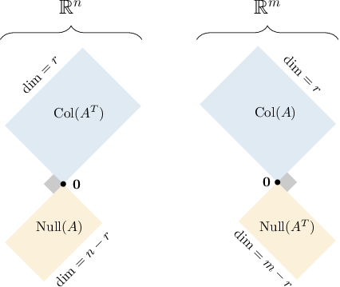
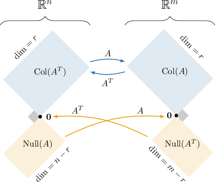
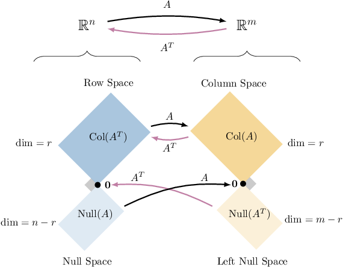

# The Four Fundamental Subspaces of a Matrix

Source: https://www.mathacademy.com/topics/2200?courseId=55
Topic ID: 2200

## Prerequisites

- [The Image and Rank of a Linear Transformation](./1963-the-image-and-rank-of-a-linear-transformation.md)
- [Orthogonal Complements](./2102-orthogonal-complements.md)
- [Orthogonal Linear Transformations](./4319-orthogonal-linear-transformations.md)

## Lesson

### Introduction

When considering an $m \times n$ matrix $A$ as a linear transformation

$$

\mathbb{R}^n \xrightarrow{\quad A \quad} \mathbb{R}^m,

$$

there are **four fundamental subspaces** that naturally occur. The first two are as follows:

- The **column space** of $A,$ denoted $\text{Col}(A),$ is a subspace of $\mathbb{R}^m.$ This is the set of all linear combinations of the columns of $A.$

- The **null space** of $A,$ denoted $\text{Null}(A),$ is a subspace of $\mathbb{R}^n.$ This is the set of all vectors in $\mathbb{R}^n$ that, when pre-multiplied by $A,$ result in the zero-vector $\mathbf{0}.$

Now, notice that the transpose $A^T$ is an $n \times m$ matrix and can be considered as the transformation

$$

\mathbb{R}^m \xrightarrow{\quad A^T \quad} \mathbb{R}^n.

$$

So, we have similar subspaces for the transpose $A^T{:}$

- The column space of $A^T,$ denoted $\text{Col}(A^T),$ is a subspace of $\mathbb{R}^n.$ We call this the **row space** of $A$ since the span of the columns of $A^T$ is equivalent to the span of the rows of $A.$

- The null space of $A^T,$ denoted $\text{Null}(A^T),$ is a subspace of $\mathbb{R}^m.$ We call this the **left null space** of $A$ since it is equivalent to the set of all vectors $\mathbf y\in\mathbb R^m$ such that $\mathbf y^T A = \mathbf{0}.$

Let's discuss how these spaces relate to each other:

- We have two subspaces in $\mathbb{R}^n$ that are orthogonal complements of each other:

- We have two subspaces in $\mathbb{R}^m$ that are orthogonal complements of each other:

The four fundamental subspaces of a matrix $A$ can be schematically visualized, as shown below.

To see why $\text{Col}(A)$ is the orthogonal complement of $\text{Null}(A^T),$ note the following:

- When calculating the product $A^T \mathbf x,$ we multiply each row of $A^T$ by $\mathbf x.$

- Suppose that $\mathbf x\in \text{Null}(A^T).$ Then, by definition, $A^T \mathbf x = \mathbf 0.$

- Thus, $\mathbf x$ must be orthogonal to each row of $A^T.$ Equivalently, this means that $\mathbf x$ is orthogonal to each *column* of $A.$

- Hence, $\text{Null}(A^T)$ is orthogonal to $\text{Col}(A).$

We can deduce that $\text{Null}(A)$ is the orthogonal complement of $\text{Col}(A^T)$ by similar reasoning.

### Example: Identifying an Orthogonal Fundamental Subspaces of a Matrix

#### Question

Which of the following subspaces must be orthogonal to $\text{Col}(A^T)$ for every matrix $A?$

1. $\text{Null}(A)$

2. $\text{Col}(A)$

3. $\text{Null}(A^T)$

#### Explanation

Recall that $\text{Col}(A^T)$ is the row space of $A,$ and consists of all linear combinations of the rows of $A.$

If a vector is orthogonal to every linear combination of the rows of $A,$ it must be orthogonal to each row of $A.$ But notice that when pre-multiplying a vector by $A,$ we multiply each row of $A$ by that vector. So, $\text{Col}(A^T)$ must be orthogonal to the null space of $A,$ which is $\text{Null}(A).$

Therefore, the correct answer is "I only."

**** In general, the four fundamental subspaces of a matrix $A$ can be schematically visualized, as shown below.

### Images Under the Action of a Matrix and Its Transpose

Given an $m \times n$ matrix $A,$ what is the image of $\mathbb{R}^n$ under $A?$

Note that pre-multiplying a vector $\mathbf{x} \in \mathbb{R}^n$ by $A$ gives a linear combination of the columns of $A{:}$

$$

\begin{aligned}| & | & ⋯ & | \\ 𝑎_{1} & 𝑎_{2} & ⋯ & 𝑎_{𝑛} \\ | & | & ⋯ & |\end{aligned}

$$

Therefore, by definition, the image of $\mathbb{R}^n$ under the action of $A$ is $\text{Col}(A),$ the column space of $A.$

Similarly, pre-multiplying a vector $\mathbf{x} \in \mathbb{R}^m$ by $A^T$ gives a linear combination of the columns of $A^T{:}$

$$

\begin{aligned}| & | & ⋯ & | \\ 𝑎_{𝑇1} & 𝑎_{𝑇2} & ⋯ & 𝑎_{𝑇𝑚} \\ | & | & ⋯ & |\end{aligned}

$$

Therefore, the image of $\mathbb{R}^m$ under the action of $A^T$ must be $\text{Col}(A^T).$ This is also the row space of $A,$ since a linear combination of the columns of $A^T$ is equivalent to a linear combination of the rows of $A.$

We can use similar reasoning to find the image of the four fundamental subspaces under the appropriate matrix.

### Example: Identifying the Images of the Four Fundamental Subspaces of the Matrix Under Its Action

#### Question

Let $A$ be a $m \times n$ matrix. What is the image of $\text{Col}(A^T)$ under the action of $A?$

#### Explanation

Pre-multiplying a vector $\mathbf{x} \in \mathbb{R}^n$ by $A$ gives a linear combination of the columns of $A{:}$

$$

\begin{aligned}| & | & ⋯ & | \\ 𝑎_{1} & 𝑎_{2} & ⋯ & 𝑎_{𝑛} \\ | & | & ⋯ & |\end{aligned}

$$

Therefore, the image of $\mathbb{R}^n$ under the action of $A$ must be $\text{Col}(A),$ the column space of $A.$

Furthermore, since $\text{Null}(A)$ is mapped to the zero vector $\mathbf{0}$ by the definition of the null subspace, the image of its orthogonal complement $\text{Col}(A^T)$ must be $\text{Col}(A).$

This can be schematically visualized, as shown below.

### Dimensions of the Four Fundamental Subspaces

Consider an $m \times n$ matrix $A$ with rank $r.$ The dimensions of the four fundamental subspaces of $A$ are as follows:

- $\text{dim}(\text{Col}(A)) = r.$ Since the column space is the span of the columns of $A,$ its dimension is the number of linearly independent columns which, by Gaussian elimination, is $\text{rank}(A)=r.$

- $\text{dim}(\text{Col}(A^T)) = r.$ It can be shown that the dimension of the row space of $A$ also equals $r.$ Therefore, $\text{rank}(A^T)=\text{rank}(A)=r.$

- $\text{dim}(\text{Null}(A)) = n-r.$ Since $\text{Null}(A)$ is the orthogonal complement of $\text{Col}(A^T)$ in $\mathbb{R}^n,$ we have that

- $\text{dim}(\text{Null}(A^T)) = m-r.$ Since $\text{Null}(A^T)$ is the orthogonal complement of $\text{Col}(A)$ in $\mathbb{R}^m,$ we have that

Let's add these dimensions to the diagram below.

### Example: Finding the Dimensions of the Four Fundamental Subspaces of a Matrix

#### Question

Consider a $8 \times 6$ matrix $A.$ If $\text{dim}(\text{Null}(A)) = 3,$ then find $\text{dim}(\text{Col}(A^T)).$

#### Explanation

The four fundamental subspaces of a matrix $A$ can be schematically visualized, as shown below.

In our case, we are given that $m=8,$ $n=6,$ and $n-r=3.$

Substituting $n=6$ into $n-r=3,$ we can find the rank of $A{:}$

$$

6 - r = 3 \qquad\Longrightarrow\qquad r = 3

$$

Therefore, we obtain

$$

\begin{aligned}dim(Col(𝐴^{𝑇})) & =𝑟=3.\end{aligned}

$$

### The Big Picture of the Four Fundamental Subspaces

Let's review what we have learned in this lesson.

If we consider an $m \times n$ matrix $A$ of rank $r$ as a transformation from $\mathbb{R}^n$ to $\mathbb{R}^m,$ then there are four fundamental subspaces of $A{:}$

- $\text{Col}(A)$ and $\text{Null}(A^T)$ are subspaces in $\mathbb{R}^m$ with dimensions $r$ and $m-r,$ respectively.

- $\text{Col}(A^T)$ and $\text{Null}(A)$ are subspaces in $\mathbb{R}^n$ with dimensions $r$ and $n-r,$ respectively.

Furthermore,

- $\text{Col}(A)$ and $\text{Null}(A^T)$ are orthogonal complements in $\mathbb{R}^m,$ and

- $\text{Null}(A)$ and $\text{Col}(A^T)$ are orthogonal complements in $\mathbb{R}^n.$

Finally, we have that

- the image of $\text{Col}(A^T)$ under the action of $A$ is $\text{Col}(A),$ and

- the image of $\text{Col}(A)$ under the action of $A^T$ is $\text{Col}(A^T).$

These facts about the four fundamental subspaces of a matrix $A$ can be schematically visualized, as shown below.

