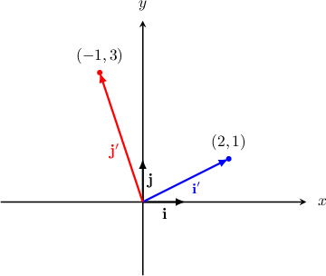
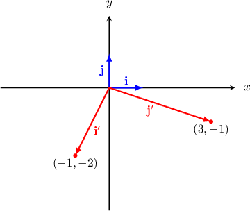

# The Standard Matrix of a Linear Transformation in Terms of the Standard Basis

Source: https://www.mathacademy.com/topics/2211?courseId=55
Topic ID: 2211

## Prerequisites

- [The Standard Matrix of a Linear Transformation](../../../high-school/integrated-math-honors/lessons/integrated-math-iii-honors/1959-the-standard-matrix-of-a-linear-transformation.md)

## Lesson

### Introduction

To construct the standard matrix of a linear transformation $T$ in $\mathbb{R}^2,$ we find the images of the vectors in the standard basis $\{\mathbf{i}, \mathbf{j} \}$ of $\mathbb{R}^2$ under $T,$ and then use those images as columns in the standard matrix.

To demonstrate, let's consider the following linear transformation:

$$

[\begin{aligned}𝑥 \\ 𝑦\end{aligned}]

$$

Computing $\mathbf T(\mathbf i),$ we get

$$

\begin{aligned}𝐓(𝐢) & =𝐓[\begin{matrix}1 \\ 0\end{matrix}] \\ & =[\begin{matrix}2⋅1−1⋅0 \\ 1+3⋅0\end{matrix}] \\ & =[\begin{matrix}2 \\ 1\end{matrix}].\end{aligned}

$$

Computing $\mathbf T(\mathbf j),$ we get

$$

\begin{aligned}𝐓(𝐣) & =𝐓[\begin{matrix}0 \\ 1\end{matrix}] \\ & =[\begin{matrix}2⋅0−1⋅1 \\ 0+3⋅1\end{matrix}] \\ & =[\begin{matrix}−1 \\ 3\end{matrix}].\end{aligned}

$$

Therefore, the standard matrix for this linear transformation is $[\begin{aligned}2 & −1 \\ 1 & 3\end{aligned}]$

In the diagram below, we see the vectors in the standard basis $\{\mathbf{i}, \mathbf{j} \}$ of $\mathbb{R}^2$ and their images $\{\mathbf{i'}, \mathbf{j'} \}$ under the transformation.

In general, a linear transformation in $\mathbb R^n$ has a standard matrix of dimensions $n \times n,$ whose columns are the images of the basis vectors under the action of the linear transformation.

### Example: Determining the Standard Matrix of a Linear Transformation Given the Image of the Standard Basis

#### Question

Given that $\{\mathbf{i}, \mathbf{j}, \mathbf k\}$ is the standard basis of $\mathbb{R}^3$ and the images of $\mathbf{i},$ $\mathbf{j},$ and $\mathbf{k}$ under the action of a linear transformation $\mathbf{T}$ are $\langle 3, 5, -1 \rangle,$ $\langle 0, 4,3 \rangle,$ and $\langle -1, 5, -2\rangle,$ respectively, what is the standard matrix of $\mathbf{T}?$

#### Explanation

Every linear transformation in $\mathbb{R}^3$ can be represented as a $3\times 3$ matrix. The standard matrix representation of the transformation has columns that are the images of the vectors $\mathbf{i}, \mathbf{j},$ and $\mathbf k$ under the action of the transformation.

Therefore, the standard matrix for the linear transformation is

$$

\begin{aligned}3 & 0 & −1 \\ 5 & 4 & 5 \\ −1 & 3 & −2\end{aligned}

$$

### Example: Determining the Standard Matrix of a Linear Transformation Given a Diagram

#### Question

In the diagram below, $\mathbf{i}$ and $\mathbf j$ are the vectors of the standard basis of $\mathbb{R}^2$, while $\mathbf{i'}$ and $\mathbf{j'}$ are their images under the linear transformation $\mathbf T.$ What is the standard matrix of $\mathbf T?$

#### Explanation

Every linear transformation in $\mathbb{R}^2$ can be represented as a $2\times 2$ matrix. The standard matrix representation of the transformation has columns that are the images of the vectors $\mathbf{i}$ and $\mathbf j$ under the action of the transformation.

From the diagram we see that

- the image of $\mathbf{i}$ is $[\begin{aligned}−1 \\ −2\end{aligned}]$ and

- the image of $\mathbf{j}$ is $[\begin{aligned}3 \\ −1\end{aligned}]$

Therefore, the standard matrix for the linear transformation is

$$

[\begin{aligned}−1 & 3 \\ −2 & −1\end{aligned}]

$$

### Example: Determining the Images of the Standard Basis Vectors Under a Given Linear Transformation

#### Question

The linear transformation $\mathbf T$ has the standard matrix

$$

[\begin{aligned}−1 & 5 \\ 8 & 3\end{aligned}]

$$

What are the images of the standard basis vectors $\{\mathbf{i}, \mathbf{j} \}$ of $\mathbb{R}^2$ under the action of $\mathbf T?$

#### Explanation

****

The images of the vectors in the standard basis $\{\mathbf{i}, \mathbf{j} \}$ are the first and second columns of $T,$ respectively.

Therefore, we have the following:

$$

\begin{aligned}𝐓(𝐢) & =𝐓[\begin{matrix}1 \\ 0\end{matrix}]=[\begin{matrix}−1 \\ 8\end{matrix}] \\ 𝐓(𝐣) & =𝐓[\begin{matrix}0 \\ 1\end{matrix}]=[\begin{matrix}5 \\ 3\end{matrix}]\end{aligned}

$$

****

We can find the images of the vectors in the standard basis $\{\mathbf{i}, \mathbf{j} \}$ by computing the matrix products $T\cdot\mathbf{i}$ and $T\cdot\mathbf{j}$ as follows:

$$

\begin{aligned}𝐓(𝐢) & =𝑇⋅𝐢=[\begin{matrix}−1 & 5 \\ 8 & 3\end{matrix}][\begin{matrix}1 \\ 0\end{matrix}]=[\begin{matrix}−1 \\ 8\end{matrix}] \\ 𝐓(𝐣) & =𝑇⋅𝐣=[\begin{matrix}−1 & 5 \\ 8 & 3\end{matrix}][\begin{matrix}0 \\ 1\end{matrix}]=[\begin{matrix}5 \\ 3\end{matrix}]\end{aligned}

$$
