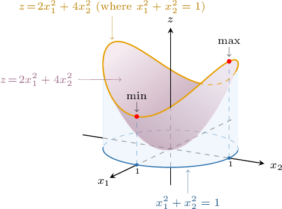

# Constrained Optimization of Quadratic Forms

Source: https://www.mathacademy.com/topics/3171?courseId=55
Topic ID: 3171

## Prerequisites

- [The Characteristic Equation of a Matrix](./1964-the-characteristic-equation-of-a-matrix.md)
- [The Norm of a Vector in N-Dimensional Euclidean Space](./2095-the-norm-of-a-vector-in-n-dimensional-euclidean-space.md)
- [Quadratic Forms](./3123-quadratic-forms.md)

## Lesson

### Introduction

Suppose we want to find the *maximum* value of the quadratic form

$$

Q(\mathbf{x})=2x_1^2 + 4x_2^2,

$$

subject to the constraint $\| \mathbf{x} \| = 1.$ This type of problem is known as a **constrained optimization problem**.

Since our quadratic form $Q(\mathbf{x})$ has no mixed term $x_1x_2$, we can find its maximum value for $\| \mathbf{x} || = 1$ using algebraic manipulation, as follows.

First, notice that $x_1^2 \geq 0.$ So, we have

$$

2x_1^2 \leq 4x_1^2.

$$

As a result,

$$

\begin{aligned}𝑄(𝐱) & =2𝑥_{21}+4𝑥_{22} \\ & ≤4𝑥_{21}+4𝑥_{22} \\ & =4(𝑥_{21}+𝑥_{22}).\end{aligned}

$$

Now, recall that $\| \mathbf{x} \| = 1$ is equivalent to $x_1^2 + x_2^2 =1.$ So,

$$

\begin{aligned}4(𝑥_{21}+𝑥_{22})=4(1)=4,\end{aligned}

$$

which means that

$$

Q(\mathbf{x}) \leq 4.

$$

So, the value of $Q(\mathbf{x})$ can be no greater than $4.$ But before we conclude that $4$ is the maximum, we need to make sure that $Q(\mathbf{x})$ can actually attain the value $4.$ Can we find a vector $\mathbf x,$ with $\| \mathbf{x} || = 1,$ such that $Q(\mathbf{x}) = 4?$

Indeed, we can. Setting $[\begin{aligned}0 & 1\end{aligned}]$ we get

$$

\begin{aligned}𝑄(𝐱) & =2𝑥_{21}+4𝑥_{22} \\ & =2(0)^{2}+4(1)^{2} \\ & =4.\end{aligned}

$$

Therefore, if $\| \mathbf{x} \| = 1,$ the maximum value of $Q(\mathbf{x})$ equals $4.$ Proceeding similarly, we can show that the minimum of $Q(\mathbf{x})$ is equal to $2.$

Graphically, the situation can be visualized if we intersect the surface $z= {\color{black}2x_1^2+4x_2^2}$ and the cylinder $\color{black}x_1^2+x_2^2=1,$ as shown below:

### Example: Finding the Maximum Value Given a Canonical Form on the Unit Sphere

#### Question

Find the maximum value of $Q(\mathbf{x})=2x_1^2 - 5x_2^2 +3x_3^2$ given that $\| \mathbf{x} \| =1.$

#### Explanation

First, notice that $x_1^2 \geq 0$ and $x_2^2 \geq 0.$ So, we have that

$$

2x_1^2 \leq 3x_1^2, \qquad -5x_2^2 \leq 3x_2^2.

$$

As a result,

$$

\begin{aligned}𝑄(𝐱) & =2𝑥_{21}−5𝑥_{22}+3𝑥_{23} \\ & ≤3𝑥_{21}+3𝑥_{22}+3𝑥_{23} \\ & =3(𝑥_{21}+𝑥_{22}+𝑥_{23}).\end{aligned}

$$

Now, recall that $\| \mathbf{x} \| = 1$ is equivalent to $x_1^2 + x_2^2 + x_3^2 =1.$ So,

$$

\begin{aligned}3(𝑥_{21}+𝑥_{22}+𝑥_{23})=3(1)=3,\end{aligned}

$$

and, in turn, $Q(\mathbf{x}) \leq 3.$

So, the value of $Q(\mathbf{x})$ can be no greater than $3.$ But before we conclude that $3$ is the maximum, we need to find a vector such that $Q(\mathbf{x}) = 3.$

Notice that when $[\begin{aligned}0 & 0 & 1\end{aligned}]$ we get

$$

\begin{aligned}𝑄(𝐱) & =2𝑥_{21}−5𝑥_{22}+3𝑥_{23} \\ & =2(0)^{2}−5(0)^{2}+3(1)^{2} \\ & =3.\end{aligned}

$$

Therefore, given that $\| \mathbf{x} \| =1,$ the maximum value of $Q(\mathbf{x})$ is equal to $3.$

### Example: Finding the Minimum Value Given a Canonical Form on the Unit Sphere

#### Question

Find the minimum value of $Q(\mathbf{x})=5x_1^2 - 4x_2^2 - 6x_3^2$ given that $\| \mathbf{x} \| =1.$

#### Explanation

First, notice that $x_1^2 \geq 0$ and $x_2^2 \geq 0.$ So, we have that

$$

5x_1^2 \geq -6x_1^2, \qquad -4x_2^2 \geq -6x_2^2.

$$

As a result,

$$

\begin{aligned}𝑄(𝐱) & =5𝑥_{21}−4𝑥_{22}−6𝑥_{23} \\ & ≥−6𝑥_{21}−6𝑥_{22}−6𝑥_{23} \\ & =−6(𝑥_{21}+𝑥_{22}+𝑥_{23}).\end{aligned}

$$

Now, recall that $\| \mathbf{x} \| = 1$ is equivalent to $x_1^2 + x_2^2 + x_3^2 =1.$ So,

$$

\begin{aligned}−6(𝑥_{21}+𝑥_{22}+𝑥_{23})=−6(1)=−6.\end{aligned}

$$

and, in turn, $Q(\mathbf{x}) \geq -6.$

So, the value of $Q(\mathbf{x})$ can be no smaller than $-6.$ But before we conclude that $-6$ is the minimum, we need to find a vector such that $Q(\mathbf{x}) = -6.$

Notice that when $[\begin{aligned}0 & 0 & 1\end{aligned}]$ we get

$$

\begin{aligned}𝑄(𝐱) & =5𝑥_{21}−4𝑥_{22}−6𝑥_{23} \\ & =5(0)^{2}−4(0)^{2}−6(1)^{2} \\ & =−6.\end{aligned}

$$

Therefore, given that $\| \mathbf{x} \| =1,$ the minimum value of $Q(\mathbf{x})$ is equal to $-6.$

### Constrained Optimization of Quadratic Forms

We can find a quadratic form's maximum and minimum values even when it contains cross-product terms. For this, we have the following theorem:

*Let $A$ be the matrix corresponding to our quadratic form $Q(\mathbf x)\mathbin{:}$*

- *The maximum value of $Q(\mathbf{x}),$ when $\| \mathbf{x} \|=1,$ is equal to the largest eigenvalue of $A{:}$* *The maximum is attained on the corresponding unit eigenvector $\mathbf{u}_{\text{max}}.$*

- *The minimum value of $Q(\mathbf{x}),$ when $\| \mathbf{x} \|=1,$ is equal to the smallest eigenvalue of $A{:}$* *The minimum is attained on the corresponding unit eigenvector $\mathbf{u}_{\text{min}}.$*

Suppose we are given the quadratic form

$$

Q(\mathbf{x})=4x_1^2-2x_1x_2+4x_2^2.

$$

How can we find a unit vector $\mathbf{u}_{\text{max}}$ at which the maximum of $Q(\mathbf{x})$ is attained?

First, we write down the matrix of our quadratic form:

$$

[\begin{aligned}4 & −1 \\ −1 & 4\end{aligned}]

$$

Now, we need to calculate the eigenvalues of the matrix $A\mathbin{:}$

$$

\begin{aligned}|𝐴−𝜆𝐼| & =0 \\ \begin{matrix}4−𝜆 & −1 \\ −1 & 4−𝜆\end{matrix} & =0 \\ (4−𝜆)(4−𝜆)−1 & =0 \\ 𝜆^{2}−8𝜆+15 & =0 \\ (𝜆−5)(𝜆−3) & =0 \\ 𝜆 & =5,\,3\end{aligned}

$$

Therefore, we have

$$

\max \{ Q(\mathbf{x}) \: | \: \| \mathbf{x} \|=1 \} = \lambda_{\text{max}} = 5.

$$

To find $\mathbf{u}_{\text{max}},$ we need a unit eigenvector that corresponds to the eigenvalue $\lambda_{\text{max}}=5.$ We start by computing $(A-5I)\mathbin{:}$

$$

\begin{aligned}𝐴−5𝐼 & =[\begin{matrix}4 & −1 \\ −1 & 4\end{matrix}]−5[\begin{matrix}1 & 0 \\ 0 & 1\end{matrix}]=[\begin{matrix}−1 & −1 \\ −1 & −1\end{matrix}]\end{aligned}

$$

Seeking a non-zero solution of $(A-5I)\mathbf{x}=\mathbf{0}$ gives the eigenvector $[\begin{aligned}1 \\ −1\end{aligned}]$

Finally, dividing $\mathbf{v}$ by its norm $\| \mathbf{v} \| = \sqrt{2},$ we get

$$

[\begin{aligned}1 \\ −1\end{aligned}]

$$

### Example: Finding the Maximum and Minimum Values of a Quadratic Form on the Unit Sphere

#### Question

Find the minimum value of $Q(\mathbf{x})=x_1^2-2x_2^2-2x_3^2+2x_2x_3$ given that $\| \mathbf{x} \| = 1.$

#### Explanation

Let $A$ be the matrix corresponding to our quadratic form. Recall that:

- The maximum value of $Q(\mathbf{x}),$ when $\| \mathbf{x} \|=1,$ is equal to the largest eigenvalue of $A{:}$

- The minimum value of $Q(\mathbf{x}),$ when $\| \mathbf{x} \|=1,$ is equal to the smallest eigenvalue of $A{:}$

First, we write down the matrix of our quadratic form:

$$

\begin{aligned}1 & 0 & 0 \\ 0 & −2 & 1 \\ 0 & 1 & −2\end{aligned}

$$

Now, we need to calculate the eigenvalues of the matrix $A\mathbin{:}$

$$

\begin{aligned}|𝐴−𝜆𝐼| & =0 \\ \begin{matrix}1−𝜆 & 0 & 0 \\ 0 & −2−𝜆 & 1 \\ 0 & 1 & −2−𝜆\end{matrix} & =0 \\ (1−𝜆)\begin{matrix}−2−𝜆 & 1 \\ 1 & −2−𝜆\end{matrix} & =0 \\ (1−𝜆)((−2−𝜆)(−2−𝜆)−1) & =0 \\ (1−𝜆)(𝜆^{2}+4𝜆+3) & =0 \\ (1−𝜆)(𝜆+3)(𝜆+1) & =0 \\ 𝜆 & =1,\,−1,\,−3\end{aligned}

$$

Therefore, we have

$$

\min \{ Q(\mathbf{x}) \: | \: \| \mathbf{x} \| = 1 \} = -3.

$$
