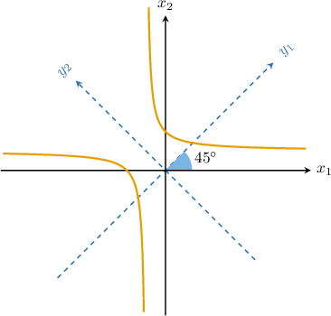
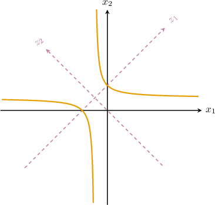

# Classifying Quadratic Curves

Source: https://www.mathacademy.com/topics/3336?courseId=55
Topic ID: 3336

## Prerequisites

- [Reducing a Quadratic Curve to Its Principal Axes](./3129-reducing-a-quadratic-curve-to-its-principal-axes.md)
- [Completing the Square With Leading Coefficients](../../../high-school/traditional/lessons/algebra-i/3824-completing-the-square-with-leading-coefficients.md)

## Lesson

### Introduction

The general equation of a second order (quadratic) curve is an expression of the form

$$

\alpha_{11}x_1^2+2\alpha_{12}x_1x_2 + \alpha_{22}x_2^2 + 2\alpha_{13}x_1+ 2\alpha_{23}x_2 +\alpha_{33}=0,

$$

where $x_1$ and $x_2$ are variables, and $\alpha_{ij} \in \Bbb R$ for all $1\leq i,j \leq 3.$

For example,

$$

3x_1^2-x_1x_2-5x_2^2+5x_2 - 1 = 0

$$

is a general quadratic curve.

### Non-Degenerate Quadratic Curves

There are three basic so-called *non-degenerate quadratic curves*:

### Degenerate (Real) Quadratic Curves

There are also a few so-called *degenerate (real) quadratic curves:*

Let's see why these equations define the described curves:

- $\dfrac{x_1^2}{a^2} - \dfrac{x_2^2}{b^2}=0$ is equivalent to $(bx_1 - ax_2)(bx_1 + ax_2)=0$ which in turn gives equations of two lines $bx_1 - ax_2=0$ and $bx_1 + ax_2=0$ intersecting at the origin.

- ${x_i^2}=a^2$ is equivalent to $(x_i - a)(x_i + a)=0$ which in turn gives equations of two parallel lines $x_i =a$ and $x_i=-a.$

- ${x_i^2}=0$ gives equations of two coincident lines $x_i =0$ and $-x_i=0.$

- $\dfrac{x_1^2}{a^2} + \dfrac{x_2^2}{b^2}=0$ is equivalent to $b^2x_1^2+a^2x_2^2=0$ which in turn gives a single point, the origin, since the sum of two squares is $0$ if and only if both squares are $0.$

### Empty Sets

Finally, some quadratic equations might define an *empty set* (or so-called *imaginary curve*):

Let's see why these equations define the described curves:

- Although there are no real solutions, the equation $\dfrac{x_1^2}{a^2} + \dfrac{x_2^2}{b^2} = -1,$ which is equivalent to $\dfrac{x_1^2}{(a\textrm{i})^2} + \dfrac{x_2^2}{(b\textrm{i})^2} = 1,$ has imaginary solutions, so we could interpret this as an imaginary ellipse.

- Although there are no real solutions, the equation ${x_i^2}=-a^2$ is equivalent to $(x_i - a\textrm{i})(x_i + a\textrm{i})=0$ which in turn gives equations of two imaginary parallel lines $x_i =a\textrm{i}$ and $x_i=-a\textrm{i}.$

### Example: Identifying a Quadratic Curve Type From Its Reduced Equation: No Cross-Product Term

#### Question

Which of the following equations define a non-empty set of points in the -plane?

#### Explanation

Let's examine each of the equations in turn.

- The equation defines a non-empty set. It represents the point in the -plane.

- The equation defines an empty set. Notice that the left-hand side is non-negative for all and while the right-hand side is negative.

- The equation defines a non-empty set. It represents a pair of intersecting lines, and

Therefore, the correct answer is "I and III only."

### Classifying a Quadratic Curve That Does Not Contain a Cross-Product Term

A quadratic equation with no cross-terms can be rewritten in standard form by completing the square. Let's see how this is done in the following example.

Suppose we are given the equation

$$

2x_1^2+x_2^2 - 4x_1 + 4x_2 = 2,

$$

what type of curve does it represent?

First, we complete the squares for the variables $x_1$ and $x_2\mathbin{:}$

$$

\begin{aligned}2𝑥_{21}^{}+𝑥_{22}^{}−4𝑥_{1}+4𝑥_{2} & =2 \\ 2(𝑥_{21}^{}−2𝑥_{1})+(𝑥_{22}^{}+4𝑥_{2}) & =2 \\ 2(𝑥_{21}^{}−2𝑥_{1}+1−1)+(𝑥_{22}^{}+4𝑥_{2}+4−4) & =2 \\ 2(𝑥_{1}−1)^{2}−2+(𝑥_{2}+2)^{2}−4 & =2 \\ 2(𝑥_{1}−1)^{2}+(𝑥_{2}+2)^{2} & =8\end{aligned}

$$

Now, performing the change of variables

$$

\begin{aligned}𝑦_{1}=𝑥_{1}−1, \\ 𝑦_{2}=𝑥_{2}+2,\end{aligned}

$$

we get the following equation in standard form:

$$

\begin{aligned}2𝑦_{21}^{}+𝑦_{22}^{} & =8 \\ \frac{𝑦_{21}^{}}{4}+\frac{𝑦_{22}^{}}{8} & =1 \\ \frac{𝑦_{21}^{}}{2^{2}}+\frac{𝑦_{22}^{}}{(\sqrt{√8})^{2}} & =1\end{aligned}

$$

This represents an ellipse with semiaxes $2$ and $\sqrt{8}.$

### Example: Identifying a Quadratic Curve Type: No Cross-Product Term

#### Question

What type of quadratic curve is defined by the following equation?

$$

3x_1^2 + 2x_1 - x_2 =\dfrac{5}{3}

$$

#### Explanation

First, we complete the square for the variable $x_1\mathbin{:}$

$$

\begin{aligned}3𝑥_{21}^{}+2𝑥_{1}−𝑥_{2} & =\frac{5}{3} \\ 3(𝑥_{21}^{}+\frac{2}{3}𝑥_{1})−𝑥_{2} & =\frac{5}{3} \\ 3(𝑥_{21}^{}+\frac{2}{3}𝑥_{1}+(\frac{1}{3})^{2}−(\frac{1}{3})^{2})−𝑥_{2} & =\frac{5}{3} \\ 3(𝑥_{1}+\frac{1}{3})^{2}−3(\frac{1}{3})^{2}−𝑥_{2} & =\frac{5}{3} \\ 3(𝑥_{1}+\frac{1}{3})^{2}−\frac{1}{3}−𝑥_{2} & =\frac{5}{3} \\ 3(𝑥_{1}+\frac{1}{3})^{2} & =𝑥_{2}+2\end{aligned}

$$

Now, performing the change of variables

$$

\begin{aligned}𝑦_{1}=𝑥_{1}+\frac{1}{3}, \\ 𝑦_{2}=𝑥_{2}+2,\end{aligned}

$$

we get the following:

$$

\begin{aligned}3𝑦_{21}^{} & =𝑦_{2} \\ 𝑦_{21}^{} & =\frac{1}{3}𝑦_{2}\end{aligned}

$$

This represents a parabola that opens in the direction of the positive $y_2$-axis.

### Classifying a General Quadratic Curve

In general, the cross-term of a quadratic equation can be eliminated by an orthogonal change of variables. That is, one of the kind

$$

\mathbf{x} =P \mathbf{y} ,

$$

where the columns of $P$ form an orthonormal eigenbasis for the corresponding quadratic form's matrix.

Let $\mathcal C$ be a plane curve defined as

$$

\mathcal C:\: 2x_1x_2 -2\sqrt2x_1+2\sqrt2x_2 =8.

$$

How do we determine the type of our curve?

Notice that the quadratic form $2x_1x_2$ can be reduced to canonical form $y_1^2-y_2^2$ using the change of variables

$$

[\begin{aligned}𝑥_{1} \\ 𝑥_{2}\end{aligned}]

$$

First, let's write the given change of variables explicitly:

$$

[\begin{aligned}𝑥_{1} \\ 𝑥_{2}\end{aligned}]

$$

We know that this change of variables reduces the corresponding quadratic form $Q(\mathbf x) = 2x_1x_2$ to its canonical form. Indeed, performing the change of variables on $\mathcal C,$ gives

$$

\begin{aligned}2𝑥_{1}𝑥_{2}−2\sqrt{√2}𝑥_{1}+2\sqrt{√2}𝑥_{2}=8\,⟹\,𝑦_{21}^{}−𝑦_{22}^{}+4𝑦_{2}=8,\end{aligned}

$$

and, by completing the square for the variable $y_2$, we get the equation

$$

\begin{aligned}𝑦_{21}^{}−(𝑦_{2}−2)^{2} & =4.\end{aligned}

$$

The graph of the resulting equation in the $y_1,y_2$ variables is the following.

Notice that we can write down the change-of-variables matrix as

$$

\begin{aligned}\frac{1}{\sqrt{√2}} & −\frac{1}{\sqrt{√2}} \\ \frac{1}{\sqrt{√2}} & \frac{1}{\sqrt{√2}}\end{aligned}

$$

which is a rotation matrix. Looking at the diagram above, we see that going from one coordinate system to another can be viewed as a rotation of our axes by $45^\circ.$

**Watch out!** In general, this action is an orthogonal transformation (it can be a rotation, a reflection, or a combination of such transformations).

Finally, performing the change of variables

$$

\begin{aligned}𝑧_{1}=𝑦_{1}, \\ 𝑧_{2}=𝑦_{2}−2,\end{aligned}

$$

we get the following:

$$

\begin{aligned}𝑦_{21}^{}−(𝑦_{2}−2)^{2} & =4 \\ \frac{𝑧_{21}^{}}{4}−\frac{𝑧_{22}^{}}{4} & =1 \\ \frac{𝑧_{21}^{}}{2^{2}}−\frac{𝑧_{22}^{}}{2^{2}} & =1\end{aligned}

$$

This (standard) equation represents a hyperbola in which both semiaxes are equal to $2.$

In the diagram below we represent the curve in the $z_1,z_2$ variables.

Looking at the diagram above, we see that in the final step we simply translated our system by $(0,2)$ in $y$-coordinates.

**Note:** Finding the simplest equation of a quadratic curve can be viewed as the following series of steps:

- **Step 1**. We eliminate the cross-term by reducing the quadratic part to canonical form. Geometrically, this is equivalent to an orthogonal transformation of our coordinate system.

- **Step 2**. We eliminate the linear terms by completing the squares. Geometrically, this is equivalent to a translation of our coordinate system.

### Example: Identifying a Quadratic Curve Type

#### Question

Consider the change of variables given by the matrix equation

$$

[\begin{aligned}𝑥_{1} \\ 𝑥_{2}\end{aligned}]

$$

and the curve $\mathcal C,$ defined as

$$

\mathcal C:\: 2x_1^2+6x_1x_2+ 2x_2^2 -2x_1+2x_2 =7 .

$$

Given that the change of variables above reduces $Q(\mathbf{x})=2x_1^2+6x_1x_2+2x_2^2$ to its canonical (diagonal) form $5y_1^2-y_2^2,$ what type of a quadratic curve is defined by $\mathcal C?$

#### Explanation

First, we note the following:

$$

C:\: \underbrace{ 2x_1^2+6x_1x_2+2x_2^2}_{Q(\mathbf{x})} -2x_1+2x_2 =7

$$

Let's write the given change of variables explicitly:

$$

[\begin{aligned}𝑥_{1} \\ 𝑥_{2}\end{aligned}]

$$

We know that the given change of variables reduces $Q(\mathbf x)$ to its canonical form. Therefore, performing the change of variables on $\mathcal C,$ we obtain

$$

\begin{aligned}2𝑥_{21}^{}+6𝑥_{1}𝑥_{2}+2𝑥_{22}^{}−2𝑥_{1}+2𝑥_{2} & =7 \\ 5𝑦_{21}^{}−𝑦_{22}^{}−2(\frac{1}{\sqrt{√2}}𝑦_{1}−\frac{1}{\sqrt{√2}}𝑦_{2})+2(\frac{1}{\sqrt{√2}}𝑦_{1}+\frac{1}{\sqrt{√2}}𝑦_{2}) & =7 \\ 5𝑦_{21}^{}−𝑦_{22}^{}+\frac{4}{\sqrt{√2}}𝑦_{2} & =7 \\ 5𝑦_{21}^{}−𝑦_{22}^{}+2\sqrt{√2}𝑦_{2} & =7\end{aligned}

$$

Now, we complete the square for the variable $y_2\mathbin{:}$

$$

\begin{aligned}5𝑦_{21}^{}−𝑦_{22}^{}+2\sqrt{√2}𝑦_{2} & =7 \\ 5𝑦_{21}^{}−(𝑦_{22}^{}−2\sqrt{√2}𝑦_{2}) & =7 \\ 5𝑦_{21}^{}−(𝑦_{22}^{}−2\sqrt{√2}𝑦_{2}+(\sqrt{√2})^{2})+2 & =7 \\ 5𝑦_{21}^{}−(𝑦_{22}^{}−2\sqrt{√2}𝑦_{2}+(\sqrt{√2})^{2})+(\sqrt{√2})^{2} & =7 \\ 5𝑦_{21}^{}−(𝑦_{2}−\sqrt{√2})^{2}+2 & =7 \\ 5𝑦_{21}^{}−(𝑦_{2}−\sqrt{√2})^{2} & =5\end{aligned}

$$

Finally, performing the change of variables

$$

\begin{aligned}𝑧_{1}=𝑦_{1}, \\ 𝑧_{2}=𝑦_{2}−\sqrt{√2},\end{aligned}

$$

we get the following:

$$

\begin{aligned}5𝑦_{21}^{}−(𝑦_{2}−\sqrt{√2})^{2} & =5 \\ 5𝑧_{21}^{}−𝑧_{22}^{} & =5 \\ \frac{𝑧_{21}^{}}{1^{2}}−\frac{𝑧_{22}^{}}{(\sqrt{√5})^{2}} & =1\end{aligned}

$$

This represents a hyperbola with semiaxes $1$ and $\sqrt5.$
