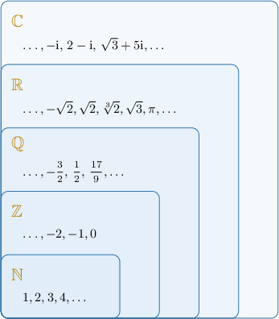
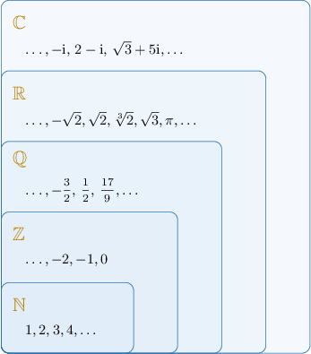

# Special Sets

Source: https://www.mathacademy.com/topics/47?courseId=55
Topic ID: 47

## Prerequisites

- [Sets](../../../high-school/traditional/lessons/geometry/45-sets.md)
- [Complex Numbers](../../../high-school/traditional/lessons/algebra-ii/735-complex-numbers.md)

## Lesson

### Introduction

Some sets are so important that special symbols are used to represent them.

- The set $\mathbb{N}$ represents the set of **natural numbers.** This set contains all the positive whole numbers: It's essential to remember that the natural numbers *do not contain zero!* However, if we wish to refer to the set of natural numbers *and* zero, we use the symbol $\mathbb N_0{:}$

- The set $\mathbb{Z}$ represents the set of **integers.** This set contains the positive and negative whole numbers and zero. The use of the letter "Z" comes from the German word "Zahlen," which means "numbers".

- The set $\mathbb{Q}$ represents the set of **rational numbers**. This set contains all fractions that can be expressed as the ratio (or **Q**uotient) of two integers.

- The set $\mathbb{R}$ represents the set of **real numbers**. This set contains all possible rational and irrational numbers (such as $\pi, \sqrt{2}, \sqrt{3}, \ldots$).

- The set $\mathbb C$ represents the set of **complex numbers**. These consist of any number of the form $a+\textrm i b,$ where $a,b\in\mathbb R.$

We can think of these special sets as being arranged in a hierarchy, as shown in the diagram below.

### Example: Identifying Special Sets Containing a Given Element

#### Question

Consider the following sets:

$$

\mathbb N, \quad \mathbb Z, \quad \mathbb Q, \quad \mathbb R, \quad \mathbb C

$$

To which of these sets does the number $3.25$ belong?

#### Explanation

Recall the following:

- $\mathbb{N}$ represents the set of ****.

- $\mathbb{Z}$ represents the set of ****.

- $\mathbb{Q}$ represents the set of ****.

- $\mathbb{R}$ represents the set of ****.

- $\mathbb C$ represents the set of ****.

With that in mind, we note the following:

- The number $3.25$ is not an integer, so it does ** belong to $\mathbb{Z}$ nor $\mathbb{N},$ so we can write

- However, notice that $3.25$ can be written as the ratio of two integers as follows: Consequently, $3.25$ is a rational number, and we can write

- Every rational is a real and complex number. Consequently, $3.25$ belongs to both $\mathbb R$ and $\mathbb{C},$ and we can write

Therefore, the correct answer is "$\mathbb Q, \mathbb R,$ and $\mathbb C$ only."

### Subscript and Superscript Notation With Special Sets

We can use subscripts and superscripts to limit the special sets to being only positive ("$+$" superscript), only negative ("$-$" superscript), and to include zero ("$0$" subscript).

For example, $\mathbb{Z}^+$ represents the positive integers, while $\mathbb{Z}^-$ represents the negative integers:

$$

\begin{aligned}ℤ^{+} & ={1,2,3,…} \\ ℤ^{−} & ={−1,−2,−3,…}\end{aligned}

$$

These sets do not include $0.$ If we want to include $0$ too, then we can use a subscript $0,$ as follows:

$$

\begin{aligned}ℤ_{+0} & ={0,1,2,3,…} \\ ℤ_{−0} & ={0,−1,−2,−3,…}\end{aligned}

$$

A table describing all the special sets is given below.

### Example: Identifying Elements Belonging to Scripted Special Sets

#### Question

Which of the numbers below belong to $\mathbb{Q}^-?$

1. $-\sqrt{3}$

2. $- 0.2$

3. $0$

4. $-\sqrt{4}$

#### Explanation

Remember that $\mathbb{Q}^-$ is the set of all negative rational numbers.

- $-\sqrt{3}$ is negative but not a rational number, so it does ** belong to $\mathbb{Q}^-. \quad \color{red}\times$

- $-0.2$ is negative, and it is a rational number because it can be written as a ratio of two integers: Therefore, $-0.2$ belongs to $\mathbb{Q}^-. \quad \color{green}\checkmark$

- $0$ is a rational number but not negative, so it does ** belong to $\mathbb{Q}^-. \quad \color{red}\times$

- $-\sqrt{4} =- 2$, and it is a rational number because it can be written as a ratio of two integers: Therefore, $-\sqrt 4$ belongs to $\mathbb{Q}^-. \quad \color{green}\checkmark$

In conclusion, the correct answer is "II and IV only."

### Example: Identifying Sets Containing a Given Element

#### Question

To which of the following sets do all the negative integers belong?

1. $\mathbb{Z}$

2. $\mathbb{Z}_0^+$

3. $\mathbb{Q}^-$

4. $\mathbb{R}_0^-$

#### Explanation

The negative integers are $-1, -2, -3, \ldots$

- The set $\mathbb{Z}$ contains all the integers, including the negative integers. $\quad \color{green}\checkmark$

- The set $\mathbb{Z}_0^+$ contains the positive integers and $0.$ So, it does not contain the negative integers. $\quad \color{red}\times$

- The set $\mathbb{Q}^-$ contains all the negative rational numbers. Since all integers are rational numbers, $\mathbb{Q}^-$ contains all the negative integers as well. $\quad \color{green}\checkmark$

- The set $\mathbb{R}_0^-$ contains all the negative real numbers and $0.$ Since all integers are real numbers, $\mathbb{R}_0^-$ contains all the negative integers as well. $\quad \color{green}\checkmark$

Therefore, the correct answer is "I, III, and IV only."
