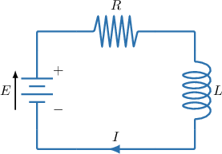
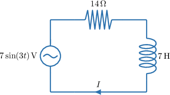
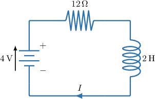
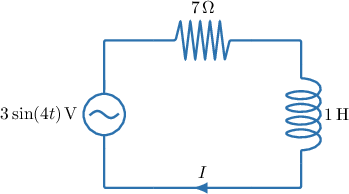
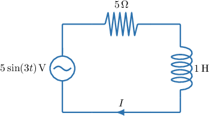

# Modeling RL Circuits With First-Order ODEs

Source: https://www.mathacademy.com/topics/1788?courseId=154
Topic ID: 1788

## Prerequisites

- [Writing Sums of Trigonometric Functions in Amplitude-Phase Form](../../../high-school/integrated-math-honors/lessons/integrated-math-iii-honors/1076-writing-sums-of-trigonometric-functions-in-amplitude-phase-form.md)
- [Modeling With First-Order ODEs](./2023-modeling-with-first-order-odes.md)
- [Solving First-Order Linear ODEs With Sinusoidal Forcing](./6680-solving-first-order-linear-odes-with-sinusoidal-forcing.md)

## Lesson

### Introduction

One application of differential equations is to model the current in electrical circuits.

An **electrical circuit** is a closed, continuous path through which an electric charge can flow. The **current**, measured in amperes ($\textrm{A}$), is the rate at which electric charge flows through the circuit as a function of time.

Electrical circuits can contain many different components.

- A **power source**, such as a **cell** (or **battery**), that supplies energy to the circuit by maintaining a potential difference (electromotive force, EMF), measured in volts ($\textrm{V}$).

- **Conducting paths**, such as wires, through which current carriers (electrons) flow.

- A **resistor** opposes the current and dissipates energy as heat. Resistance is measured in ohms ($\Omega$).

- An **inductor** opposes *changes* in the current over time by storing energy in a magnetic field. Inductance is measured in henries ($\textrm{H}$).

In the next slide, we will connect these components in series to form an RL circuit.

### RL Circuits

Electrical circuits are said to be **in series** if the components are connected end to end in a single path, so that the same current flows through every component in the circuit.

In this lesson, we'll look at **RL circuits**, which contain both a resistor and an inductor, most commonly in series with a voltage source. An example is shown below, consisting of a resistance $R,$ in ohms, an inductance $L,$ in henries, and a source EMF $E,$ in volts.

How do we find a differential equation that best describes the circuit's current $I(t),$ measured in amperes, where $t$ is the time, in seconds?

According to conservation of energy, as electric charge moves around a circuit, the energy gained from the source must equal the energy lost in the components. The decrease in voltage across a component is called a **voltage drop**.

From this follows **Kirchhoff's Voltage Law**, which states that in a series circuit, the source voltage (EMF) equals the sum of the voltage drops around the loop.

In an RL circuit, there are two voltage drops:

- The resistor *opposes the flow of current*, hence producing a voltage drop proportional to the current, with a constant of proportionality $R{:}$

- The inductor *opposes changes in current*, hence producing a voltage drop proportional to the rate of change of current, with a constant of proportionality $L{:}$

Therefore, by Kirchhoff's Voltage Law, the source voltage $E$ is the sum of the voltage drops: $E = V_R + V_L.$

As a result, the basic equation governing the amount of current $I(t)$ in the circuit is

$$

E = RI + L\,\dfrac{\mathrm{d}I}{\mathrm{d}t} \quad\Longrightarrow\quad \dfrac{\mathrm{d}I}{\mathrm{d}t} + \dfrac{R}{L}I = \dfrac{E}{L}.

$$

Next, we will look at a worked example with specific values for $R,$ $L,$ and $E.$

### A Worked Example

Consider the RL circuit shown below.

Let's find the differential equation that describes the current $I$ (in amperes) as a function of time $t$ (in seconds).

The diagram shows a series RL circuit with a source electromotive force (EMF) of $5\,\textrm{V},$ a resistor with resistance $15\,\Omega,$ and an inductor with an inductance of $3\,\textrm{H}.$

Kirchhoff's voltage law states that in a series circuit, the source voltage (EMF) equals the sum of the voltage drops.

In an RL circuit, there are two voltage drops:

- The voltage drop across the resistor is proportional to the current, with a constant of proportionality $R = 15\,\Omega{:}$

- The voltage drop across the inductor is proportional to the rate of change of current, with a constant of proportionality $L = 3\,\textrm{H}{:}$

Therefore, by Kirchhoff's voltage law, the differential equation governing the amount of current $I$ in the circuit is

$$

5 = 15I + 3\,\dfrac{\mathrm{d}I}{\mathrm{d}t},

$$

which gives

$$

\dfrac{\mathrm{d}I}{\mathrm{d}t} + 5I = \dfrac{5}{3}.

$$

### Example: Constructing an Equation Governing the Current in an RL Circuit

#### Question

Find the differential equation governing the amount of current $I$ (in amperes) at time $t$ (in seconds) in the circuit given in the diagram above.

#### Explanation

The diagram shows a series RL circuit with a source electromotive force (EMF) of $E(t) = 7\sin(3t)\,\textrm{V},$ a resistor with resistance $14\,\Omega,$ and an inductor with an inductance of $7\,\textrm{H}.$

Kirchhoff's voltage law states that in a series circuit, the source voltage (EMF) equals the sum of the voltage drops.

In an RL circuit, there are two voltage drops:

- The voltage drop across the resistor is proportional to the current, with a constant of proportionality $R = 14\,\Omega.$

- The voltage drop across the inductor is proportional to the rate of change of current, with a constant of proportionality $L = 7\,\textrm{H}.$

The source voltage (EMF) is given by

$$

E(t) = 7\sin(3t).

$$

Therefore, by Kirchhoff's voltage law, the differential equation governing the amount of current $I$ in the circuit is

$$

7\sin(3t) = 14I + 7\,\dfrac{\mathrm{d}I}{\mathrm{d}t},

$$

which gives

$$

7\,\dfrac{\mathrm{d}I}{\mathrm{d}t} = 7\sin(3t) - 14I,

$$

so

$$

\dfrac{\mathrm{d}I}{\mathrm{d}t} = \sin(3t) - 2I,

$$

Therefore, the differential equation is

$$

\dfrac{\mathrm{d}I}{\mathrm{d}t} + 2I = \sin(3t).

$$

### Steady-State Solutions for Constant EMFs

In a first-order linear differential equation, the solution splits into a **transient term** that decays over time and a **steady-state term** that remains as $t \to \infty.$

In an RL circuit with a constant electromotive force (EMF), this steady-state value corresponds to the long-term current in the circuit after all transient effects have died out, independent of the initial condition.

To demonstrate how to extract the steady-state current from the general solution of an RL circuit model, suppose the current $I(t),$ in amperes, in a series RL circuit governed by the differential equation

$$

\dfrac{\mathrm{d}I}{\mathrm{d}t} + 6I = 12.

$$

This is a first-order linear equation with constant coefficients. To find the general solution, we must sum the complementary and particular solutions.

- To find the complementary solution $I_c,$ we solve the corresponding homogeneous equation, given by Solving using an integration technique, such as separation of variables, we obtain the complementary solution where $A$ is a constant of integration.

- Next, we find the particular solution. Note that the right-hand side of the inhomogeneous equation is a polynomial of degree $0.$ So, we assume that the particular solution is also a polynomial of degree $0,$ i.e., To find the value of $\alpha,$ we substitute $I_p = \alpha$ and $\dfrac{\mathrm{d}I_p}{\mathrm{d}t} = (\alpha)' = 0,$ into the inhomogeneous equation: Therefore, the particular solution is $I_p(t) = 2.$

Now, since the general solution is given by the sum of the complementary solution and the particular solution, the general solution in our case is

$$

I(t) = I_c(t) + I_p(t) = Ae^{-6t} + 2.

$$

Note the following:

- The quantity $I_c = Ae^{-6t}$ is the *transient current*, since it goes to zero as $t \to \infty.$

- The constant $I_p = 2$ is the *steady-state current*. As $t\to\infty,$ the current $I$ approaches the value of the steady-state current.

Therefore, the steady-state current is $2$ amperes.

### Example: Solving an Equation Governing the Current in an RL Circuit: Constant EMF

#### Question

Find an equation for the current $I(t)$ (in amperes) in the circuit given in the diagram above, expressing your answer in terms of time $t$ (in seconds) ****, given that the current when $t = 0\,\textrm s$ is $1\,\textrm{A}.$

#### Explanation

The diagram shows a series RL circuit with a source electromotive force (EMF) of $4\,\textrm{V},$ a resistor of resistance of $12\,\Omega,$ and an inductor of inductance $2\,\textrm{H}.$

Kirchhoff's voltage law states that in a series circuit, the source voltage (EMF) equals the sum of the voltage drops.

In an RL circuit, there are two voltage drops:

- The voltage drop across the resistor is proportional to the current, with a constant of proportionality $R = 12\,\Omega.$

- The voltage drop across the inductor is proportional to the rate of change of current, with a constant of proportionality $L = 2\,\textrm{H}.$

Therefore, by Kirchhoff's voltage law, the differential equation governing the amount of current $I$ in the circuit is

$$

4 = 12I + 2\cdot\,\dfrac{\mathrm{d}I}{\mathrm{d}t}

$$

which gives

$$

\dfrac{\mathrm{d}I}{\mathrm{d}t} + 6I = 2.

$$

This is a first-order linear equation with constant coefficients. So, to find the general solution, we must find the sum of the complementary and particular solutions.

- To find the complementary solution $I_c,$ we solve the corresponding homogeneous equation, given by Solving using an integration technique, such as separation of variables, we obtain the complementary solution where $A$ is a constant of integration.

- Next, we find the particular solution. Note that the right-hand side of the inhomogeneous equation is a polynomial of degree $0.$ So, we assume that the particular solution is also a polynomial of degree $0,$ i.e., To find the value of $\alpha,$ we substitute $I_p = \alpha$ and $\dfrac{\mathrm{d}I_p}{\mathrm{d}t} = (\alpha)' = 0$ into the inhomogeneous equation: Therefore, the particular solution is $I_p(t) = \dfrac13.$

Now, since the general solution is given by the sum of the complementary solution and the particular solution, the general solution in our case is

$$

I(t) = I_c(t) + I_p(t) = Ae^{-6t} + \dfrac13.

$$

We're told that the circuit starts with an initial current of $1\,\textrm{A}.$ So, we can apply the initial condition $I(0) = 1,$ and solve for $A{:}$

$$

\begin{aligned}𝐼(0) & =1 \\ 𝐴𝑒^{−6(0)}+\frac{1}{3} & =1 \\ 𝐴 & =\frac{2}{3}\end{aligned}

$$

Therefore, we have the following expression for $I(t){:}$

$$

\begin{aligned}𝐼(𝑡) & =\frac{2}{3}𝑒^{−6𝑡}+\frac{1}{3} \\ & =\frac{1}{3}(2𝑒^{−6𝑡}+1)\end{aligned}

$$

Note the following:

- The quantity $I_c = \dfrac23e^{-6t}$ is the **, since it goes to zero as $t \to \infty.$

- The constant $I_p = \dfrac13$ is the **. As $t\to\infty,$ the current $I$ approaches the value of the steady-state current.

### Steady-State Solutions for Sinusoidal EMFs

In many cases, the EMF produced by a power source is sinusoidal, not constant. Such a power source is shown in the diagram below.

In a first-order linear RL circuit driven by a sinusoidal voltage, the solution consists of a transient current that decays over time and a steady-state current that oscillates with the same frequency as the input and is independent of the initial condition.

For example, let's find the amplitude of the steady-state current in the RL circuit shown below.

The diagram shows a series RL circuit with a source electromotive force (EMF) of $3\sin(4t)\,\textrm{V},$ a resistor of resistance $7\,\Omega,$ and an inductor of inductance $1\,\textrm{H}.$

Kirchhoff's voltage law states that in a series circuit, the source voltage (EMF) equals the sum of the voltage drops.

In an RL circuit, there are two voltage drops:

- The voltage drop across the resistor is proportional to the current, with a constant of proportionality $R = 7\,\Omega.$

- The voltage drop across the inductor is proportional to the rate of change of current, with a constant of proportionality $L = 1\,\textrm{H}.$

Therefore, by Kirchhoff's voltage law, the differential equation governing the amount of current $I$ in the circuit is

$$

3\sin(4t) = 7I + 1\cdot\dfrac{\mathrm{d}I}{\mathrm{d}t}

$$

which gives the equation

$$

\dfrac{\mathrm{d}I}{\mathrm{d}t} + 7I = 3\sin(4t).

$$

This is a first-order linear equation with constant coefficients. So, to find the general solution, we must find the sum of the complementary and particular solutions.

- To find the complementary solution $I_c,$ we solve the corresponding homogeneous equation, given by Solving using an integration technique, such as separation of variables, we obtain the complementary solution where $A$ is a constant of integration.

- Next, we find the particular solution. Note that the right-hand side of the inhomogeneous equation is sinusoidal with argument $4t.$ So, we assume that the particular solution is also sinusoidal with argument $4t,$ i.e., To find the values of $\alpha$ and $\beta,$ we substitute into the inhomogeneous equation and group like terms on the left-hand side: Equating the coefficients, we get the following system of equations: Solving this system gives $\alpha = -\dfrac{12}{65},$ $\beta = \dfrac{21}{65}.$ Therefore, the particular solution is

Now, since the general solution is given by the sum of the complementary solution and the particular solution, the general solution in our case is

$$

I(t) = I_c(t) + I_p(t) = Ae^{-7t} - \dfrac{12}{65}\cos(4t) + \dfrac{21}{65}\sin(4t).

$$

Note the following:

- The quantity $I_c(t) = Ae^{-7t}$ is the *transient current*, since it goes to zero as $t \to \infty.$

- The function $I_p(t) = - \dfrac{12}{65}\cos(4t) + \dfrac{21}{65}\sin(4t)$ is the *steady-state current*. It governs the current's long-term behavior.

Therefore, as $t\to\infty,$ we have

$$

I(t) \approx I_p(t) = -\dfrac{12}{65}\cos(4t) + \dfrac{21}{65}\sin(4t).

$$

Finally, the amplitude of the steady-state current is given by

$$

\sqrt{\left(-\dfrac{12}{65}\right)^2 + \left(\dfrac{21}{65}\right)^2} \approx 0.37\,\textrm{A},

$$

rounded to two decimal places. This amplitude represents the maximum magnitude of the steady-state current flowing through the circuit.

### Example: Solving an Equation Governing the Current in an RL Circuit: Sinusoidal EMF

#### Question

Find the amplitude of the steady-state current for the RL circuit shown above, ****

#### Explanation

The diagram shows a series RL circuit with a source electromotive force (EMF) of $5\sin(3t)\,\textrm{V},$ a resistor of resistance $5\,\Omega,$ and an inductor of inductance $1\,\textrm{H}.$

Kirchhoff's voltage law states that in a series circuit, the source voltage (EMF) equals the sum of the voltage drops.

In an RL circuit, there are two voltage drops:

- The voltage drop across the resistor is proportional to the current, with a constant of proportionality $R = 5\,\Omega.$

- The voltage drop across the inductor is proportional to the rate of change of current, with a constant of proportionality $L = 1\,\textrm{H}.$

Therefore, by Kirchhoff's voltage law, the differential equation governing the amount of current $I$ in the circuit is

$$

5\sin(3t) = 5I + \dfrac{\mathrm{d}I}{\mathrm{d}t}

$$

which gives

$$

\dfrac{\mathrm{d}I}{\mathrm{d}t} + 5I = 5\sin(3t).

$$

This is a first-order linear equation with constant coefficients. So, to find the general solution, we must find the sum of the complementary and particular solutions.

- To find the complementary solution $I_c,$ we solve the corresponding homogeneous equation, given by Solving using an integration technique, such as separation of variables, we obtain the complementary solution where $A$ is a constant of integration.

- Next, we find the particular solution. Note that the right-hand side of the inhomogeneous equation is sinusoidal with argument $3t.$ So, we assume that the particular solution is also sinusoidal with argument $3t,$ i.e., To find the values of $\alpha$ and $\beta,$ we substitute into the inhomogeneous equation and group like terms on the left-hand side: Equating the coefficients, we get the following system of equations: Solving this system gives $\alpha = -\dfrac{15}{34},$ $\beta = \dfrac{25}{34}.$ Therefore, the particular solution is

Now, since the general solution is given by the sum of the complementary solution and the particular solution, the general solution in our case is

$$

I(t) = I_c(t) + I_p(t) = Ae^{-5t} - \dfrac{15}{34}\cos(3t) + \dfrac{25}{34}\sin(3t).

$$

Note the following:

- The quantity $I_c(t) = Ae^{-5t}$ is the **, since it goes to zero as $t \to \infty.$

- The function $I_p(t) = - \dfrac{15}{34}\cos(3t) + \dfrac{25}{34}\sin(3t)$ is the **. It governs the current's long-term behavior.

Therefore, as $t\to\infty,$ we have

$$

I(t)\approx I_p(t) = - \dfrac{15}{34}\cos(3t) + \dfrac{25}{34}\sin(3t).

$$

Finally, the amplitude of the steady-state current is given by

$$

\sqrt{\left(-\dfrac{15}{34}\right)^2 + \left(\dfrac{25}{34}\right)^2} \approx 0.86\,\textrm{A},

$$

rounded to two decimal places.
