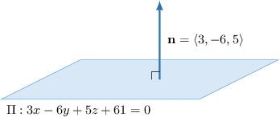

# The Cartesian Equation of a Plane

Source: https://www.mathacademy.com/topics/1807?courseId=154
Topic ID: 1807

## Prerequisites

- [Calculating the Cross Product Using Determinants](../../../high-school/integrated-math-honors/lessons/integrated-math-iii-honors/245-calculating-the-cross-product-using-determinants.md)
- [The Vector Equation of a Plane](./1805-the-vector-equation-of-a-plane.md)

## Lesson

### Introduction

If we are given an equation of a plane using the dot product, we can always obtain an equation in terms of $x,$ $y,$ and $z.$ For example, suppose we have the plane that passes through the point $P(-7,5,-2)$ and is perpendicular to the vector $\mathbf{n}=\langle 3,-6,5 \rangle.$

First, we note that the position vector of the point $P$ is $\mathbf{p}=\langle -7,5,-2 \rangle,$ and we can write down the equation of the plane using the dot product:

$$

\begin{aligned}(𝐫−𝐩)⋅𝐧 & =0 \\ 𝐫⋅𝐧 & =𝐩⋅𝐧 \\ 𝐫⋅⟨3,−6,5⟩ & =⟨−7,5,−2⟩⋅⟨3,−6,5⟩ \\ 𝐫⋅⟨3,−6,5⟩ & =−61\end{aligned}

$$

Now, to obtain the Cartesian equation, we substitute $\mathbf{r}=\langle x,y,z \rangle$ into the equation above and get

$$

\begin{aligned}⟨𝑥,𝑦,𝑧⟩⋅⟨3,−6,5⟩ & =−61 \\ 3𝑥−6𝑦+5𝑧 & =−61 \\ 3𝑥−6𝑦+5𝑧+61 & =0.\end{aligned}

$$

This final equation is called the **Cartesian equation of the plane**.

Note that in the equation

$$

{\color{blue}3}x+({\color{blue}-6})y+{\color{blue}5}z+61 = 0,

$$

the coefficients next to $x,$ $y,$ and $z$ are the coordinates of the normal vector

$$

\mathbf{n}=\langle {\color{blue}3},{\color{blue}-6},{\color{blue}5} \rangle

$$

.

### Example: Finding the Cartesian Equation of the Plane Perpendicular To a Given Vector

#### Question

Find a Cartesian equation of the plane that passes through the point $P(9,-2,3)$ and is perpendicular to the vector $\mathbf{n}=3\mathbf{i}-4\mathbf{j}+7\mathbf{k}.$

#### Explanation

First, we note that the position vector of the point $P$ is $\mathbf{p}=\langle 9,-2,3 \rangle$ and the normal vector of the plane is $\mathbf{n}=\langle 3,-4,7 \rangle.$

Using the dot product, we can find the equation of the plane as follows:

$$

\begin{aligned}(𝐫−𝐩)⋅𝐧 & =0 \\ 𝐫⋅𝐧 & =𝐩⋅𝐧 \\ 𝐫⋅⟨3,−4,7⟩ & =⟨9,−2,3⟩⋅⟨3,−4,7⟩ \\ 𝐫⋅⟨3,−4,7⟩ & =56.\end{aligned}

$$

Now, to obtain the Cartesian equation of the plane, we substitute $\mathbf{r}=\langle x,y,z \rangle$ into the equation above and get

$$

\begin{aligned}⟨𝑥,𝑦,𝑧⟩⋅⟨3,−4,7⟩ & =56 \\ 3𝑥−4𝑦+7𝑧 & =56 \\ 3𝑥−4𝑦+7𝑧−56 & =0.\end{aligned}

$$

### Example: Finding the Cartesian Equation of the Plane Perpendicular To a Given Line

#### Question

Find a Cartesian equation of the plane that passes through the point $P(-1,4,8)$ and is perpendicular to the line $\dfrac{x+3}{-5}=\dfrac{y-1}{3}=\dfrac{z+2}{2}.$

#### Explanation

First, we note that the position vector of $P$ is $\mathbf{p}=\langle -1,4,8 \rangle.$ From the canonical equation, we find that the line is parallel to the vector $\langle -5,3,2 \rangle.$ So, the normal vector of the plane is

$$

\mathbf{n}=\langle -5,3,2 \rangle.

$$

Using the dot product, we can find the equation of the plane as follows:

$$

\begin{aligned}(𝐫−𝐩)⋅𝐧 & =0 \\ 𝐫⋅𝐧 & =𝐩⋅𝐧 \\ 𝐫⋅⟨−5,3,2⟩ & =⟨−1,4,8⟩⋅⟨−5,3,2⟩ \\ 𝐫⋅⟨−5,3,2⟩ & =33\end{aligned}

$$

Now, to obtain the Cartesian equation of the plane, we substitute $\mathbf{r}=\langle x,y,z \rangle$ into the equation above and get

$$

\begin{aligned}⟨𝑥,𝑦,𝑧⟩⋅⟨−5,3,2⟩ & =33 \\ −5𝑥+3𝑦+2𝑧 & =33 \\ −5𝑥+3𝑦+2𝑧−33 & =0.\end{aligned}

$$

### Example: Finding the Vector Equation of a Plane Given Its Cartesian Equation

#### Question

Given the Cartesian equation $2x-y+z+13=0$ of the plane $\Pi,$ find an equation of $\Pi$ in the form $(\mathbf{r}-\mathbf{p})\cdot\mathbf{n}=0.$

#### Explanation

First, from the coefficients in equation of the plane, we get that the normal vector of $\Pi$ is $\mathbf{n}=\langle 2,-1,1 \rangle.$

Now, we solve the Cartesian equation of $\Pi$ for $z\mathbin{:}$

$$

\begin{aligned}2𝑥−𝑦+𝑧+13 & =0 \\ 𝑧 & =−2𝑥+𝑦−13\end{aligned}

$$

If we put, say, $x=0$ and $y=0,$ we get $z=-13.$ So, the point $P(0,0,-13)$ lies on $\Pi.$ Note that the position vector of $P$ is $\mathbf{p}=\langle 0,0,-13 \rangle.$

Finally, we obtain

$$

\begin{aligned}(𝐫−𝐩)⋅𝐧 & =0 \\ (𝐫−⟨0,0,−13⟩)⋅⟨2,−1,1⟩ & =0.\end{aligned}

$$

### Example: Finding the Cartesian Equation of the Plane Parallel To Two Vectors

#### Question

Find a Cartesian equation of the plane that passes through the point $P(-3,2,-6)$ and is parallel to the vectors $\mathbf{v_1}=\langle -3, 5, 2 \rangle$ and $\mathbf{v_2}=\langle 1, 3, -2 \rangle.$

#### Explanation

First, we note that the position vector of the point $P$ is $\mathbf{p}=\langle -3,2,-6 \rangle.$

Now, we need to find the normal vector of the plane. To do that, we use the cross product of $\mathbf{v_1}$ and $\mathbf{v_2}$ as follows:

$$

\begin{aligned}𝐧 & =𝐯_{𝟏}×𝐯_{𝟐} \\ & =\begin{aligned}−3 \\ 5 \\ 2\end{aligned}×\begin{aligned}1 \\ 3 \\ −2\end{aligned} \\ & =\begin{aligned}𝐢 & 𝐣 & 𝐤 \\ −3 & 5 & 2 \\ 1 & 3 & −2\end{aligned} \\ & =−16𝐢−4𝐣−14𝐤 \\ & =⟨−16,−4,−14⟩\end{aligned}

$$

Then, using the dot product, we can find the equation of the plane:

$$

\begin{aligned}(𝐫−𝐩)⋅𝐧 & =0 \\ 𝐫⋅𝐧 & =𝐩⋅𝐧 \\ 𝐫⋅⟨−16,−4,−14⟩ & =⟨−3,2,−6⟩⋅⟨−16,−4,−14⟩ \\ 𝐫⋅⟨−16,−4,−14⟩ & =124\end{aligned}

$$

Finally, to obtain the Cartesian equation of the plane, we substitute $\mathbf{r}=\langle x,y,z \rangle$ into the equation above and get

$$

\begin{aligned}⟨𝑥,𝑦,𝑧⟩⋅⟨−16,−4,−14⟩ & =124 \\ −16𝑥−4𝑦−14𝑧 & =124 \\ −16𝑥−4𝑦−14𝑧−124 & =0 \\ 8𝑥+2𝑦+7𝑧+62 & =0.\end{aligned}

$$
