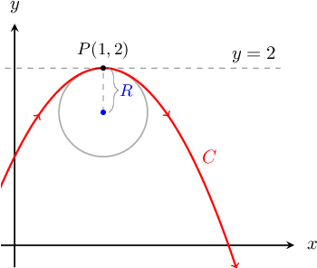
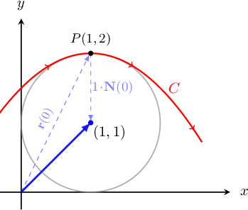
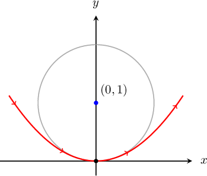

# Radius of Curvature

Source: https://www.mathacademy.com/topics/1834?courseId=154
Topic ID: 1834

## Prerequisites

- [Principal Normal Vectors](./1795-principal-normal-vectors.md)
- [Finding Curvature Using the Cross Product](./1836-finding-curvature-using-the-cross-product.md)

## Lesson

### Introduction

The **osculating circle** (sometimes called the *kissing circle*) of a curve $C$ at a point $P$ is a circle that

- is tangent to the curve $C$ at the point $P,$ and

- has the same curvature as the curve $C$ at the point $P.$

To demonstrate, consider the curve $C$ given by the vector function

$$

\mathbf r(t) = \langle t+1, 2-t^2\rangle.

$$

The curve $C$ and its osculating circle at the point $P$ are shown in the diagram below.

At the point $P(1,2),$ where $t=0,$ the curvature is $\kappa(0)=2.$

It can be proved that any circle has constant curvature, which is equal to the reciprocal of the circle's radius. So, for a general curve $\mathbf r (t)$ we define its **radius of curvature** as

$$

R(t) = \dfrac 1 {\kappa (t)}. \% = \dfrac{\left\|\mathbf r'(t)\right\|}{\| \mathbf T'(t) \|}

$$

In our example above, we get

$$

R(0) = \dfrac 1 {\kappa (0)} = \dfrac{1}{2}

$$

**Watch out!** Since computing the radius of curvature requires computing the curvature first, we might use different formulas for curvature depending on the situation.

For example, if a curve is parametrized by its arc length, we use the formula

$$

R(s) = \dfrac 1 {\kappa (s)} = \dfrac{1}{\| \mathbf{T}'(s) \|}.

$$

On the other hand, if a curve uses a general parameter $t,$ we use the formula

$$

R(t) = \dfrac 1 {\kappa (t)} = \dfrac{\left\|\mathbf r'(t)\right\|}{\| \mathbf T'(t) \|}.

$$

### Example: Finding the Radius of Curvature

#### Question

Consider a curve $\mathbf r(s)$ parametrized by its arc length $s.$ Find the radius of curvature of $\mathbf r(s)$ at an arbitrary point knowing that its unit tangent vector $\mathbf T(s)$ is given by

$$

\begin{aligned}𝐓(𝑠) & =−sin⁡(\frac{𝑠}{3})\,𝐢+cos⁡(\frac{𝑠}{3})\,𝐣\,.\end{aligned}

$$

#### Explanation

Since the curve $\mathbf{r}(s)$ and its unit tangent vector $\mathbf T(s)$ are both parametrized by arc length $s,$ we will use the following formula for the radius of curvature:

$$

R(s) = \dfrac{1}{\kappa(s)} = \dfrac{1}{\|\mathbf T'(s)\|}

$$

We differentiate $\mathbf T(s)$ with respect to $s$ and calculate its magnitude:

$$

\begin{aligned}𝐓^{′}(𝑠) & =\frac{d}{d𝑠}(−sin⁡(\frac{𝑠}{3}))𝐢+\frac{d}{d𝑠}(cos⁡(\frac{𝑠}{3}))\,𝐣 \\ & =−\frac{1}{3}cos⁡(\frac{𝑠}{3})\,𝐢−\frac{1}{3}sin⁡(\frac{𝑠}{3})\,𝐣 \\ 𝐓^{′}(𝑠) & =\sqrt{√(−\frac{1}{3}cos⁡(\frac{𝑠}{3}))^{2}+(−\frac{1}{3}sin⁡(\frac{𝑠}{3}))^{2}} \\ & =\sqrt{√\frac{1}{9}(cos^{2}⁡(\frac{𝑠}{3})+sin^{2}⁡(\frac{𝑠}{3}))} \\ & =\frac{1}{3}\end{aligned}

$$

Therefore, the radius of curvature is

$$

R(s) = \dfrac{1}{\|\mathbf T'(s)\|} = \dfrac{1}{\:\dfrac{1}{3}\:} = 3\,.

$$

### The Center of the Osculating Circle

The center of the osculating circle for a curve $\mathbf{r}(t)$ at a point where $t=t_0$ is located at the tip of the vector

$$

\mathbf r(t_0)+R(t_0) \mathbf N(t_0)

$$

where $\mathbf N(t)$ denotes the principal normal vector to the curve.

For example, the curve $C$ parameterized by the vector function

$$

\mathbf r(t) = \bigg\langle t+1, 2- \dfrac{t^2}{2} \bigg\rangle

$$

has the normal vector

$$

\mathbf{N}(t) = \dfrac{1}{\sqrt{1+t^2}} \langle -t, \: -1 \rangle ,

$$

and the radius of curvature at the point $P(1,2)$ where $t=0$ is $R(0)=1.$

So, the center of the osculating circle is at the tip of the vector

$$

\begin{aligned}𝐫(0)+𝑅(0)𝐍(0) & =⟨0+1,\,2−\frac{0^{2}}{2}⟩+1⋅\frac{1}{\sqrt{√1+0^{2}}}⟨0,\,−1⟩ \\ & =⟨1,2⟩+⟨0,−1⟩ \\ & =⟨1,1⟩.\end{aligned}

$$

Therefore, the center of the osculating circle at the point where $t=0$ is located at $\left(1, 1 \right),$ as shown below.

### Example: Finding the Center of the Osculating Circle

#### Question

Find the center and radius of the osculating circle to the curve $\mathbf{r}(t)$ at the point $\mathbf{r}(0),$ if the curve and the derivative $\mathbf{T}'(t)$ of the corresponding unit tangent vector are given by

$$

\mathbf r(t)=\left\langle t, \:\dfrac{ t^2}{2}\right\rangle, \qquad \mathbf T'(t)= \dfrac{1}{\sqrt{(t^2+1)^3}}\left\langle -t, \: 1\right\rangle \,.

$$

#### Explanation

Since we are given both the curve $\mathbf{r}(t)$ and the derivative $\mathbf T'(t)$ of the unit tangent, we will use the following formula to compute the radius of curvature:

$$

R(t) = \dfrac{1}{\mathbf \kappa(t)} = \dfrac{\| \mathbf r'(t) \|}{\left\| \mathbf T'(t) \right\|}

$$

First, we find $\mathbf{r}'(t),$ $\mathbf r'(0),$ and $\|\mathbf r'(0)\|\mathbin{:}$

$$

\begin{aligned}𝐫^{′}(𝑡) & =⟨1,𝑡⟩ \\ 𝐫^{′}(0) & =⟨1,0⟩ \\ ‖𝐫^{′}(0)‖ & =\sqrt{√1^{2}+0^{2}}=1\end{aligned}

$$

Next, we evaluate $\mathbf T'(0)$ and find its magnitude:

$$

\begin{aligned}𝐓^{′}(0) & =⟨−\frac{0}{\sqrt{√(1+0^{2})^{3}}},\,\frac{1}{\sqrt{√(1+0^{2})^{3}}}⟩=⟨0,1⟩ \\ ‖𝐓^{′}(0)‖ & =\sqrt{√0^{2}+1^{2}}=1\end{aligned}

$$

Therefore, the radius of curvature is

$$

\begin{aligned}𝑅(0) & =\frac{∥𝐫^{′}(0)∥}{‖𝐓^{′}(0)‖}=\frac{1}{1}=1.\end{aligned}

$$

Next, we find the principal normal vector at $t = 0\mathbin{:}$

$$

\begin{aligned}𝐍(0) & =\frac{𝐓^{′}(0)}{‖𝐓^{′}(0)‖}=⟨0,1⟩\end{aligned}

$$

Therefore, the center of the osculating circle is given by

$$

\begin{aligned}𝐫(0)+𝑅(0)𝐍(0) & = \\ ⟨0,0⟩+1⋅⟨0,1⟩ & = \\ ⟨0,1⟩ & .\end{aligned}

$$

### Example: Finding the Radius of Curvature Using the Cross Product Formula

#### Question

Find the radius of the osculating circle at the point where $t=0$ for the curve $\mathbf r(t)=\left\langle e^{t}, \: e^{- t} \right\rangle.$

#### Explanation

Since we are given only the curve $\mathbf r(t),$ we will use the cross product formula to find the radius of curvature:

$$

R(t) = \dfrac{1}{\kappa(t)} = \dfrac{\|\mathbf r'(t)\|^3}{\left\|\mathbf r'(t) \times \mathbf r''(t) \right\|}

$$

First, we calculate $\mathbf r'(t),$ $\mathbf r'(0),$ and $\|\mathbf r'(0)\|\mathbin{:}$

$$

\begin{aligned}𝐫^{′}(𝑡) & =⟨\frac{d}{d𝑡}(𝑒^{𝑡}),\,\frac{d}{d𝑡}(𝑒^{−𝑡})⟩ \\ & =⟨𝑒^{𝑡},\,−𝑒^{−𝑡}⟩ \\ 𝐫^{′}(0) & =⟨𝑒^{0},\,−𝑒^{−0}⟩ \\ & =⟨1,−1⟩ \\ ‖𝐫^{′}(0)‖ & =\sqrt{√(1)^{2}+(−1)^{2}} \\ & =\sqrt{√2}\end{aligned}

$$

Next, we calculate $\mathbf r''(t)$ and evaluate it at $t=0\mathbin{:}$

$$

\begin{aligned}𝐫^{″}(𝑡) & =⟨\frac{d}{d𝑡}(𝑒^{𝑡}),\,\frac{d}{d𝑡}(−𝑒^{−𝑡})⟩ \\ & =⟨𝑒^{𝑡},\,−(−𝑒^{−𝑡})⟩ \\ & =⟨𝑒^{𝑡},\,𝑒^{−𝑡}⟩ \\ 𝐫^{″}(0) & =⟨𝑒^{0},\,𝑒^{−0}⟩ \\ & =⟨1,1⟩\end{aligned}

$$

Now, we compute the cross product by considering $\mathbf r'(0)$ and $\mathbf r''(0)$ as $3$-dimensional vectors with zero $z$-components:

$$

\begin{aligned}𝐫^{′}(0)×𝐫^{″}(0) & =⟨1,\,−1,\,0⟩×⟨1,\,1,\,0⟩ \\ & =\begin{aligned}𝐢 & 𝐣 & 𝐤 \\ 1 & \,−1 & 0 \\ 1 & 1 & 0\end{aligned} \\ & =\begin{aligned}1 & \,−1 \\ 1 & 1\end{aligned}\,𝐤 \\ & =2\,𝐤 \\ ‖𝐫^{′}(0)×𝐫^{″}(0)‖ & =2\end{aligned}

$$

Therefore, the radius of curvature at $t=0$ is

$$

\begin{aligned}𝑅(0) & =\frac{‖𝐫^{′}(0)‖^{3}}{∥𝐫^{′}(0)×𝐫^{″}(0)∥}=\frac{(\sqrt{√2})^{3}}{\,2\,}=\sqrt{√2}\,.\end{aligned}

$$

### Infinite Radius of Curvature

If a curve has a curvature of zero at some point, the radius of curvature at that point is defined to be infinite.

It follows from the definition that a straight line has zero curvature at all of its points. Conversely, if a curve has zero curvature at any point, it must be contained on a straight line.

Suppose now that we want to find the radius of curvature for the curve

$$

\mathbf r(t) = \left\langle t^2, \: 1 - t^2, \: 1+ t^2 \right\rangle

$$

at an arbitrary point where $t> 0.$

First, we calculate $\mathbf r'(t)$ and its magnitude $\| \mathbf r'(t) \|\mathbin{:}$

$$

\begin{aligned}𝐫^{′}(𝑡) & =⟨\frac{d}{d𝑡}(𝑡^{2}),\,\frac{d}{d𝑡}(1−𝑡^{2}),\,\frac{d}{d𝑡}(1+𝑡^{2})⟩ \\ & =⟨2𝑡,\,−2𝑡,\,2𝑡⟩ \\ ‖𝐫^{′}(𝑡)‖ & =\sqrt{√(2𝑡)^{2}+(−2𝑡)^{2}+(2𝑡)^{2}} \\ & =\sqrt{√12𝑡^{2}} \\ & =2\sqrt{√3}𝑡\end{aligned}

$$

Note that in the last step, we used the fact that $\sqrt{t^2}=t$ since $t>0.$

Next, we find the unit tangent and its derivative for $t>0\mathbin{:}$

$$

\begin{aligned}𝐓(𝑡) & =\frac{𝐫^{′}(𝑡)}{‖𝐫^{′}(𝑡)‖} \\ & =\frac{1}{2\sqrt{√3}𝑡}⋅⟨2𝑡,\,−2𝑡,\,2𝑡⟩ \\ & =\frac{\sqrt{√3}}{3}⟨1,−1,1⟩ \\ 𝐓^{′}(𝑡) & =⟨0,0,0⟩\end{aligned}

$$

Therefore, the radius of curvature is

$$

\begin{aligned}𝑅(𝑡) & =\frac{∥𝐫^{′}(𝑡)∥}{‖𝐓^{′}(𝑡)‖}=\frac{2\sqrt{√3}𝑡}{0}=∞.\end{aligned}

$$

So, despite its "parabolic" appearance, the given curve is contained on a straight line!

**Note:** Often, the unit tangent vector of a curve $\mathbf T(t)$ may look a bit complicated. In such cases, the following formula involving a cross product may be useful. It says that the radius of curvature of a twice-differentiable curve $\mathbf r(t)$ is given by

$$

R(t)= \dfrac{1}{\kappa(t)} =\frac{{{{\left\| {\mathbf r'\left( t \right)} \right\|}^3}}}{{\left\| {\mathbf r'\left( t \right) \times \mathbf r''\left( t \right)} \right\|}}.

$$
