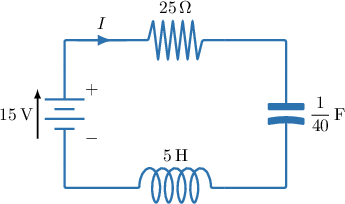
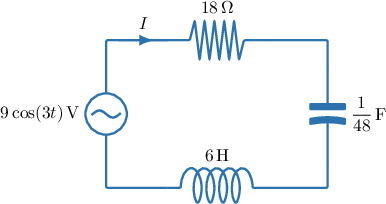
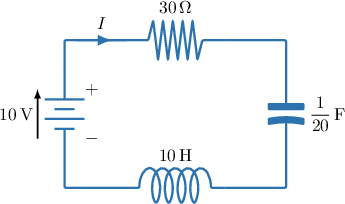
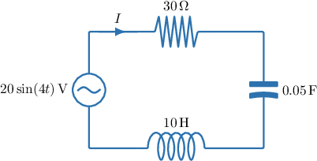

# Modeling Capacitor Charge in RCL Circuits With Second-Order ODEs

Source: https://www.mathacademy.com/topics/1845?courseId=154
Topic ID: 1845

## Prerequisites

- [Second-Order Inhomogeneous ODEs With Sinusoidal Forcing](./883-second-order-inhomogeneous-odes-with-sinusoidal-forcing.md)
- [Modeling RC Circuits With First-Order ODEs](./6701-modeling-rc-circuits-with-first-order-odes.md)

## Lesson

### Introduction

An **RCL circuit** is an electrical circuit that contains

- a resistor of resistance $R$, measured in ohms,

- a capacitor of capacitance $C$, measured in farads, and

- an inductor of inductance $L$, measured in henries.

These circuits are commonly studied in the *series* configuration shown below, with a source electromotive force (EMF) $E$, measured in volts.

In an RCL circuit, the current $I(t),$ measured in amperes, is the rate at which charge flows.

Therefore, if the capacitor charge is $q(t)$ (in coulombs), then the current is found by differentiating:

$$

I(t) = \dfrac{\mathrm{d}q}{\mathrm{d}t}

$$

For example, if

$$

q(t)=2e^{-3t}-5e^{-t}+\dfrac12,

$$

then

$$

I(t)=\dfrac{\mathrm{d}}{\mathrm{d}t}\left(2e^{-3t}-5e^{-t}+\dfrac12\right)=-6e^{-3t}+5e^{-t}.

$$

### Example: Finding an Expression for the Current

#### Question

The charge $q(t)$ on the capacitor, in coulombs, in a series RCL circuit at time $t$ seconds is

$$

q(t) = 4e^{-3t} - 2e^{-t} + \dfrac5{17}\cos(2t) + \dfrac3{17}\sin(2t).

$$

Find, in amperes, the exact amplitude of the steady-state **** $I$ in this circuit.

#### Explanation

The current $I$ measured in amperes, is defined as the rate of flow of charge $q$ measured in coulombs.

$$

I = \dfrac{\mathrm{d}q}{\mathrm{d}t}

$$

Differentiating the given expression for $q(t),$ we obtain the following expression for $I,$ in amperes:

$$

\begin{aligned}𝐼(𝑡) & =\frac{d}{d𝑡}(4𝑒^{−3𝑡}−2𝑒^{−𝑡}+\frac{5}{17}cos⁡(2𝑡)+\frac{3}{17}sin⁡(2𝑡)) \\ & =−12𝑒^{−3𝑡}+2𝑒^{−𝑡}−\frac{10}{17}sin⁡(2𝑡)+\frac{6}{17}cos⁡(2𝑡).\end{aligned}

$$

Note the following:

- The quantity $I_c(t) = -12e^{-3t} + 2e^{-t}$ is the **, since it goes to zero as $t \to \infty.$

- The function $I_p(t) = -\dfrac{10}{17}\sin(2t) + \dfrac{6}{17}\cos(2t)$ is the **. It governs the current's long-term behavior.

Therefore, as $t\to\infty,$ we have

$$

I(t)\approx I_p(t) = -\dfrac{10}{17}\sin(2t) + \dfrac{6}{17}\cos(2t).

$$

Finally, the amplitude of the steady-state current, in amperes, is given by

$$

\sqrt{\left(-\dfrac{10}{17}\right)^2 + \left(\dfrac{6}{17}\right)^2} = \sqrt{\dfrac{136}{289}} = \boxed{\dfrac{2\sqrt{34}}{17}}.

$$

### Finding an Equation Governing the Capacitor Charge

Suppose we have the following RCL circuit.

It is possible to write a differential equation that governs the capacitor charge $q(t)$ in a series RCL circuit.

We know that the voltage drops across the resistor, capacitor, and inductor, respectively, are

$$

V_R = RI, \qquad V_C = \dfrac{q}{C}, \qquad V_L = L\,\dfrac{\mathrm{d}I}{\mathrm{d}t},

$$

where $q(t)$ is the charge on the capacitor and $I(t)$ is the circuit current.

Also, recall that current is the rate at which charge flows, so

$$

I = \dfrac{\mathrm{d}q}{\mathrm{d}t} \qquad\Longrightarrow\qquad \dfrac{\mathrm{d}I}{\mathrm{d}t} = \dfrac{\mathrm{d}^2q}{\mathrm{d}t^2}.

$$

Kirchhoff's voltage law states that the source voltage equals the sum of the voltage drops:

$$

E = V_R + V_C + V_L

$$

So, substituting the expressions above gives an equation in $q{:}$

$$

E = R\,\dfrac{\mathrm{d}q}{\mathrm{d}t} + \dfrac{q}{C} + L\,\dfrac{\mathrm{d}^2q}{\mathrm{d}t^2}

$$

Finally, dividing both sides by $L$ yields the normalized second-order differential equation governing the charge:

$$

\dfrac{\mathrm{d}^2q}{\mathrm{d}t^2} + \dfrac{R}{L}\,\dfrac{\mathrm{d}q}{\mathrm{d}t} + \dfrac{1}{LC}\,q = \dfrac{E}{L}

$$

To determine a unique solution $q(t),$ we also need initial conditions, typically

$$

q(0)=q_0, \qquad \left.\dfrac{\mathrm{d}q}{\mathrm{d}t}\right|_{t=0}=I(0)=I_0.

$$

Let's now look at a concrete example.

### A Worked Example

In the circuit below, we will use Kirchhoff's voltage law to write a differential equation for the capacitor charge $q(t).$

The current $I,$ measured in amperes, is defined as the rate of flow of charge $q,$ measured in coulombs:

$$

I=\dfrac{\mathrm{d}q}{\mathrm{d}t}

$$

Kirchhoff's voltage law states that in a series circuit, the source voltage (EMF) equals the sum of the voltage drops.

In an RCL circuit, there are three voltage drops:

- The voltage drop across the resistor is proportional to the current, with a constant of proportionality $R=25\,\Omega.$ So,

- The voltage drop across the capacitor is related to its charge by $q = CV_C.$ Therefore,

- The voltage drop across the inductor is proportional to the rate of change of current, with a constant of proportionality $L = 5\,\textrm{H}.$ Hence,

Therefore, by Kirchhoff's voltage law ($E=V_R + V_C + V_L$), the differential equation governing the amount of charge $q$ on the capacitor is

$$

15 = 25\,\dfrac{\mathrm{d}q}{\mathrm{d}t} + 40q + 5\,\dfrac{\mathrm{d}^2q}{\mathrm{d}t^2}.

$$

Dividing both sides by $5,$ we obtain the final differential equation for charge:

$$

\dfrac{\mathrm{d}^2q}{\mathrm{d}t^2} + 5\,\dfrac{\mathrm{d}q}{\mathrm{d}t} + 8q = 3

$$

### Example: Constructing an Equation Governing the Charge in an RCL Circuit

#### Question

Find the differential equation governing the amount of charge $q$ (in coulombs) on the capacitor at time $t$ (in seconds) in the circuit shown in the diagram above.

**

#### Explanation

The diagram shows a series RCL circuit with a source electromotive force (EMF) of $9\cos(3t)\,\textrm{V},$ a resistor of resistance $18\,\Omega,$ a capacitor of capacitance $\dfrac1{48}\,\textrm{F},$ and an inductor of inductance $6\,\textrm{H}.$

The current $I,$ measured in amperes, is defined as the rate of flow of charge $q,$ measured in coulombs.

$$

I = \dfrac{\mathrm{d}q}{\mathrm{d}t}

$$

Kirchhoff's voltage law states that in a series circuit, the source voltage (EMF) equals the sum of the voltage drops.

In an RCL circuit, there are three voltage drops:

- The voltage drop across the resistor is proportional to the current, with a constant of proportionality $R=18\,\Omega.$ So,

- The voltage drop across the capacitor is related to its charge by $q = CV_C.$ Therefore,

- The voltage drop across the inductor is proportional to the rate of change of current, with a constant of proportionality $L = 6\,\textrm{H}.$ Hence,

Therefore, by Kirchhoff's voltage law, the differential equation governing the amount of charge $q$ on the capacitor is

$$

9\cos(3t) = 18\,\dfrac{\mathrm{d}q}{\mathrm{d}t} + 48q + 6\,\dfrac{\mathrm{d}^2q}{\mathrm{d}t^2}.

$$

Dividing both sides by $6,$ we obtain

$$

\dfrac{\mathrm{d}^2q}{\mathrm{d}t^2} + 3\,\dfrac{\mathrm{d}q}{\mathrm{d}t} + 8q = \dfrac32\cos(3t).

$$

### The Steady-State Capacitor Charge

For the RCL circuit analyzed previously, the charge $q(t)$ satisfies the differential equation

$$

\dfrac{\mathrm{d}^2q}{\mathrm{d}t^2} + 5\,\dfrac{\mathrm{d}q}{\mathrm{d}t} + 8q = 3.

$$

Recall that when we solve the differential equation governing the capacitor charge, the solution is often written in the form

$$

q(t)=q_c(t)+q_p(t),

$$

where

- $q_c(t)$ is the **transient charge**, which decays to $0$ as $t\to\infty,$ and

- $q_p(t)$ is the **steady-state charge**, which governs the long-term behavior of $q(t).$

In a stable RCL circuit with a *constant* electromotive force, the transient response eventually decays to zero, and the steady-state charge is the *constant value* the charge $q(t)$ approaches as $t \to \infty.$

When the system reaches steady state, the charge $q$ is constant. Consequently, the first and second derivatives of the charge with respect to time are zero:

$$

\dfrac{\mathrm{d}q}{\mathrm{d}t} = 0 \quad \text{and} \quad \dfrac{\mathrm{d}^2q}{\mathrm{d}t^2} = 0

$$

To find the steady-state charge, we substitute these conditions into the differential equation:

$$

0 + 5(0) + 8q = 3

$$

This simplifies to

$$

8q = 3 \quad\Longrightarrow\quad q = \dfrac{3}{8}.

$$

Physically, this represents the state in which the capacitor is fully charged and the current has ceased to flow. The voltage across the capacitor now exactly balances the source voltage.

Therefore, the steady-state charge is $q = \dfrac{3}{8}\,\textrm{C}.$

**Note**: In a stable RCL circuit with a *sinusoidal* electromotive force, the steady-state charge is also sinusoidal.

### Example: Finding the Steady-State Capacitor Charge in an RCL Circuit: Constant EMF

#### Question

A series RCL circuit has a source electromotive force (EMF) of $10\,\textrm{V},$ a resistance of $30\,\Omega,$ a capacitance of $\dfrac{1}{20}\,\textrm{F},$ and an inductance of $L=10\,\textrm{H}.$ Find the steady-state charge for this circuit.

**

#### Explanation

The diagram for our circuit is given below.

The current $I,$ measured in amperes, is defined as the rate of flow of charge $q,$ measured in coulombs.

$$

I = \dfrac{\mathrm{d}q}{\mathrm{d}t}

$$

Kirchhoff's voltage law states that in a series circuit, the source voltage (EMF) equals the sum of the voltage drops.

In an RCL circuit, there are three voltage drops:

- The voltage drop across the resistor is proportional to the current, with a constant of proportionality $R=30\,\Omega.$ So,

- The voltage drop across the capacitor is related to its charge by $q = CV_C.$ Therefore,

- The voltage drop across the inductor is proportional to the rate of change of current, with a constant of proportionality $L = 10\,\textrm{H}.$ Hence,

Therefore, by Kirchhoff's voltage law, the differential equation governing the amount of charge $q$ on the capacitor is

$$

10 = 30\,\dfrac{\mathrm{d}q}{\mathrm{d}t} + 20q + 10\,\dfrac{\mathrm{d}^2q}{\mathrm{d}t^2},

$$

which gives

$$

\dfrac{\mathrm{d}^2q}{\mathrm{d}t^2} + 3\,\dfrac{\mathrm{d}q}{\mathrm{d}t} + 2q = 1.

$$

The ** is the value that the charge $q(t)$ approaches as $t \to \infty.$ In a stable RCL circuit with a constant electromotive force, the transient response eventually decays to zero, leaving a constant charge.

When the system reaches steady state, the charge $q$ is constant. Consequently, the first and second derivatives of the charge with respect to time are zero:

$$

\dfrac{\mathrm{d}q}{\mathrm{d}t} = 0 \quad \text{and} \quad \dfrac{\mathrm{d}^2q}{\mathrm{d}t^2} = 0.

$$

Substituting these steady-state conditions into the differential equation gives

$$

(0)+ 3(0) + 2q = 1,

$$

which simplifies to

$$

2q = 1 \quad\Longrightarrow\quad q = \dfrac12

$$

Physically, this represents the state where the capacitor is fully charged, and the current has ceased to flow.

Therefore, the steady-state charge is $\dfrac12$ coulombs.

### Example: Solving an Equation Governing the Charge in an RCL Circuit: Sinusoidal EMF

#### Question

Find, in coulombs, the amplitude of the steady-state charge for the RCL circuit shown above, rounded to two decimal places.

**

#### Explanation

The diagram shows a series RCL circuit with a source electromotive force (EMF) of $20\sin(4t)\,\textrm{V},$ a resistor of resistance $30\,\Omega,$ a capacitor of capacitance $0.05\,\textrm{F},$ and an inductor of inductance $10\,\textrm{H}.$

The current $I,$ measured in amperes, is defined as the rate of flow of charge $q,$ measured in coulombs.

$$

I = \dfrac{\mathrm{d}q}{\mathrm{d}t}

$$

Kirchhoff's voltage law states that in a series circuit, the source voltage (EMF) equals the sum of the voltage drops.

In an RCL circuit, there are three voltage drops:

- The voltage drop across the resistor is proportional to the current, with a constant of proportionality $R=30\,\Omega.$ So,

- The voltage drop across the capacitor is related to its charge by $q = CV_C.$ Therefore,

- The voltage drop across the inductor is proportional to the rate of change of current, with a constant of proportionality $L = 10\,\textrm{H}.$ Hence,

Therefore, by Kirchhoff's voltage law, the differential equation governing the amount of charge $q$ on the capacitor is

$$

20\sin(4t) = 30\,\dfrac{\mathrm{d}q}{\mathrm{d}t} + 20q + 10\,\dfrac{\mathrm{d}^2q}{\mathrm{d}t^2},

$$

which gives

$$

\dfrac{\mathrm{d}^2q}{\mathrm{d}t^2} + 3\,\dfrac{\mathrm{d}q}{\mathrm{d}t} + 2q = 2\sin(4t).

$$

The given equation is a second-order linear equation with constant coefficients. To find the general solution, we must sum the complementary and particular solutions.

- To find the complementary solution $q_c,$ we solve the corresponding homogeneous equation, given by Solving using an integration technique, such as a trial solution, we obtain the complementary solution where $A$ and $B$ are constants.

- Next, we find the particular solution. Note that the right-hand side of the inhomogeneous equation is sinusoidal with argument $4t.$ So, we assume that the particular solution is also a sinusoidal with argument $4t,$ i.e., To find the values of $\alpha$ and $\beta,$ we substitute into the inhomogeneous equation and group like terms on the left-hand side: Equating the coefficients, we get the following system of equations: Solving this system gives $\alpha = -\dfrac{6}{85}$ and $\beta = -\dfrac{7}{85}.$ Therefore, the particular solution is

Now, since the general solution is given by the sum of the complementary solution and the particular solution, the general solution in our case is

$$

q(t) = q_c(t) + q_p(t) = Ae^{-t} + Be^{-2t} - \dfrac{6}{85}\cos(4t) - \dfrac{7}{85}\sin(4t).

$$

Note the following:

- The quantity $q_c(t) = Ae^{-t} + Be^{-2t}$ is the **, since it goes to zero as $t \to \infty.$

- The function $q_p(t) = -\dfrac{6}{85}\cos(4t) - \dfrac{7}{85}\sin(4t)$ is the **. It governs the charge's long-term behavior.

Therefore, as $t\to\infty,$ we have

$$

q(t)\approx q_p(t) = -\dfrac{6}{85}\cos(4t) - \dfrac{7}{85}\sin(4t).

$$

Finally, the amplitude of the steady-state charge, in coulombs, is given by

$$

\sqrt{\left(-\dfrac{6}{85}\right)^2 + \left(-\dfrac{7}{85}\right)^2} \approx 0.11,

$$

rounded to two decimal places.
