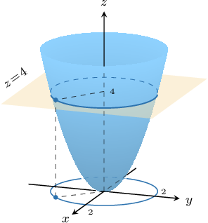
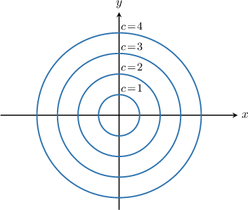
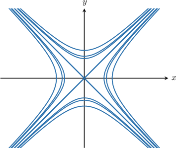

# Level Curves

Source: https://www.mathacademy.com/topics/1900?courseId=154
Topic ID: 1900

## Prerequisites

- [Equations of Hyperbolas Centered at the Origin](../../../high-school/integrated-math-honors/lessons/integrated-math-iii-honors/871-equations-of-hyperbolas-centered-at-the-origin.md)
- [The Cartesian Equation of a Plane](./1807-the-cartesian-equation-of-a-plane.md)
- [The Domain of a Multivariable Function](./1899-the-domain-of-a-multivariable-function.md)

## Lesson

### Introduction

Suppose we want to find the intersection of the surface $z = f(x,y) = x^2 + y^2$ with the plane $z=4.$

To find the intersection, we set both equations equal to each other:

$$

x^2 + y^2 = 4

$$

Graphing the above equation in the $xy$-plane, we get a circle $\color{black} C$ with center at $(0,0)$ and radius $2.$

The curve $\color{black} C$ is called a **level curve** of the surface $z = x^2 + y^2.$ The level curves of the form

$$

x^2 + y^2 = c

$$

for $c=1,2,3,4$ are shown in the diagram below.

The diagram above is called a **contour plot.** The level curves are sometimes called **contours.**

In general, a **level curve** $L_{c}(f)$ of a real-valued function of two variables $f(x,y)$ is any set of the form

$$

L_{c}(f) = \left\{(x,y) \, : \,f(x,y)=c\right\}

$$

where $c$ is a constant.

**Note:** In our example, $x^2 +y^2 \ge 0$ for all $(x,y),$ which means that the sets $L_{c}(f)$ are nonempty for $c \ge 0.$

### Example: Finding the Equation of a Level Curve

#### Question

Find the equation of the level curve that passes through the point $G\big(\sqrt{5}, 1\big)$ for the function $f(x,y) = \dfrac{12y}{x^2-y^2}.$

#### Explanation

First, we find the value of the function at $G$:

$$

\begin{aligned} f\big(\sqrt{5}, 1\big)&= \dfrac{12(1)}{\big(\sqrt{5}\big)^2 - 1^2} = 3\end{aligned}

$$

Hence, the level curve that passes through $G\big(\sqrt{5}, 1\big)$ is the $3$-level curve.

Recall that the level curves for the function $f(x,y)$ are given by the equation

$$

f(x,y) = c.

$$

In our case, we're interested in $c=3.$ So, we have:

$$

\begin{aligned}𝑓(𝑥,𝑦) & =𝑐 \\ \frac{12𝑦}{𝑥^{2}−𝑦^{2}} & =3 \\ 4𝑦 & =𝑥^{2}−𝑦^{2} \\ 𝑥^{2}−𝑦^{2}−4𝑦−4 & =−4 \\ 𝑥^{2}−(𝑦^{2}+4𝑦+4) & =−4 \\ 𝑥^{2}−(𝑦+2)^{2} & =−4\end{aligned}

$$

Therefore, the level curve that passes through $G\big(\sqrt{5}, 1\big)$ is the hyperbola $x^2 - (y+2)^2 = -4.$

### Example: Determining the Shape of a Level Curve

#### Question

The level curves of the function $f(x,y) = \dfrac{x^2+2y^2-2}{x^2}$ are given by $f(x,y) = c.$ Which of the following statements are true?

1. $c=1$ gives a circle

2. $c=0$ gives an ellipse

3. $c=2$ gives a hyperbola

#### Explanation

Setting $f(x,y) = c$ gives

$$

\begin{aligned}\frac{𝑥^{2}+2𝑦^{2}−2}{𝑥^{2}} & =𝑐 \\ 𝑥^{2}+2𝑦^{2}−2 & =𝑐𝑥^{2} \\ (1−𝑐)𝑥^{2}+2𝑦^{2} & =2.\end{aligned}

$$

Therefore:

- If $c = 1,$ then the level curve is $y^2 = 1,$ which consists of two lines.

- If $c = 0,$ then the level curve is $x^2+2y^2=2,$ which is an ellipse.

- If $c = 2,$ then the level curve is $2y^2-x^2=2$ which is a hyperbola.

So, only statements II and III are true.

### Example: Sketching Level Curves

#### Question

Sketch the level curves of the surface $z=e^{x^2-y^2}.$

#### Explanation

The level curves for the function $f(x,y)=e^{x^2-y^2}$ take the form

$$

e^{x^2-y^2} = c.

$$

Note that we must have the constraint $c\gt 0$ since $e^x \gt 0$ for all $x.$

Therefore, we have

$$

\begin{aligned}𝑒^{𝑥^{2}−𝑦^{2}}=𝑐 \\ ln⁡(𝑒^{𝑥^{2}−𝑦^{2}})=ln⁡𝑐 \\ 𝑥^{2}−𝑦^{2}=ln⁡𝑐.\end{aligned}

$$

We can split this into three cases, depending on the sign of $\ln c.$

- Case 1: $\ln c \gt 0.$ In this case, we have the family of hyperbolas $x^2-y^2 = \ln c.$

- Case 2: $\ln c = 0.$ In this case, we have the lines $y=\pm x.$

- Case 3: $\ln c < 0.$ In this case, we have the family of hyperbolas $y^2 - x^2 = -\ln c.$

Therefore, the level curves are as follows:

