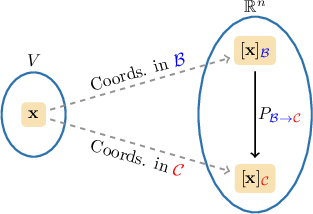

# The Change-of-Coordinates Matrix

Source: https://www.mathacademy.com/topics/1928?courseId=154
Topic ID: 1928

## Prerequisites

- [Inverses of 2x2 Matrices](../../../high-school/integrated-math-honors/lessons/integrated-math-iii-honors/864-inverses-of-2x2-matrices.md)
- [Multiplying a Matrix by a Column Vector](../../../high-school/integrated-math-honors/lessons/integrated-math-iii-honors/1195-multiplying-a-matrix-by-a-column-vector.md)
- [Finding the Inverse of a 2x2 Matrix Using Row Operations](./1728-finding-the-inverse-of-a-2x2-matrix-using-row-operations.md)
- [Writing Vectors in Different Bases](./1865-writing-vectors-in-different-bases.md)

## Lesson

### Introduction

Given two bases $\color{blue}\mathcal{B}$ and $\color{red}\mathcal{C}$ of a vector space $V,$ the **change-of-coordinates matrix from $\color{blue}\mathcal{B}$ to $\color{red}\mathcal{C}$** is the matrix $P_{\small{\color{blue}\mathcal{B}}\to{\color{red}\mathcal{C}}},$ whose columns are the coordinates of the vectors from $\color{blue}\mathcal{B}$ relative to the basis $\color{red}\mathcal{C}$.

In expanded form, the matrix looks as follows:

$$

\begin{aligned}| & | & & | \\ [𝐛_{1}]_{C} & [𝐛_{2}]_{C} & … & [𝐛_{𝑛}]_{C} \\ | & | & & |\end{aligned}

$$

For example, let's consider two bases $\mathcal B$ and $\mathcal C$ of $\mathbb{R}^2$ given by

$$

\mathcal{B}=\{\mathbf{b}_1,\mathbf{b}_2\}, \qquad\mathcal{C}=\{\mathbf{c}_1,\mathbf{c}_2\}.

$$

If we happen to know that

$$

[\begin{aligned}−12 \\ 11\end{aligned}]

$$

then the change-of-coordinates matrix from $\mathcal{B}$ to $\mathcal{C}$ is given by

$$

\begin{aligned}𝑃_{B→C}= & [\begin{matrix}−12 & 3 \\ 11 & 6\end{matrix}]. \\ & \,\underset{[𝐛_{1}]_{C}}{↑}\,\underset{[𝐛_{2}]_{C}}{↑}\end{aligned}

$$

The beauty of the change-of-coordinates matrix is that it allows us to express the vector $[\mathbf x]_{\mathcal B}$ in the basis $\mathcal C$ via the transformation

$$

[\mathbf x]_{\mathcal C} = P_{\small\mathcal{B}\to\mathcal{C}} \cdot [\mathbf x]_{\mathcal B}.

$$

This can be visualized as shown below.

### Example: Finding the Change-of-Coordinates Matrix Given a Linear Connection Between Two Bases

#### Question

Let $\mathcal{B}=\{\mathbf{b}_1,\mathbf{b}_2\}$ and $\mathcal{C}=\{\mathbf{c}_1,\mathbf{c}_2\}$ be bases of $\mathbb{R}^2.$ If $\mathbf{c}_1=\mathbf{b}_2-4\mathbf{b}_1$ and $\mathbf{c}_2=5\mathbf{b}_1+7\mathbf{b}_2,$ find the change-of-coordinates matrix $P_{\small\mathcal{C}\to\mathcal{B}}$ from $\mathcal{C}$ to $\mathcal{B}.$

#### Explanation

The coordinates of the vectors in $\mathcal{C}$ relative to the basis $\mathcal{B}$ are

$$

[\begin{aligned}−4 \\ 1\end{aligned}]

$$

The change-of-coordinates matrix from $\mathcal{C}$ to $\mathcal{B}$ is a matrix whose respective columns are the coordinates of the vectors of $\mathcal{C}$ relative to the basis $\mathcal{B}.$

Therefore, we obtain

$$

[\begin{aligned}−4 & 5 \\ 1 & 7\end{aligned}]

$$

### Example: Finding the Change-of-Coordinates Matrix When One of the Bases is the Standard Basis

#### Question

Let $\mathcal{B}=\{\mathbf{b}_1,\mathbf{b}_2,\mathbf{b}_3\}$ be a basis of $\mathbb{R}^3$ and let $\mathcal{S}$ be the standard basis of $\mathbb{R}^3.$ Find the values of $a,b,$ and $c$ if

$$

\begin{aligned}2 \\ −3 \\ 10\end{aligned}

$$

and the change-of-coordinates matrix from $\mathcal{B}$ to $\mathcal{S}$ is

$$

\begin{aligned}2 & 𝑎 & 2 \\ −3 & 7 & 𝑏 \\ 𝑐 & −4 & −1\end{aligned}

$$

#### Explanation

Recall that the standard basis of $\mathbb{R}^3$ consists of the vectors $\mathbf e_1, \mathbf e_2,$ and $\mathbf e_3,$ given by

$$

\begin{aligned}1 \\ 0 \\ 0\end{aligned}

$$

The components of the vectors in $\mathcal{B}$ are just the coordinates relative to the standard basis:

$$

\begin{aligned}2 \\ −3 \\ 10\end{aligned}

$$

The change-of-coordinates matrix from $\mathcal{B}$ to $\mathcal{S}$ is a matrix whose respective columns are the coordinates of the vectors of $\mathcal{B}$ relative to the basis $\mathcal{S}.$

Therefore, we obtain

$$

\begin{aligned}2 & 0 & 2 \\ −3 & 7 & 0 \\ 10 & −4 & −1\end{aligned}

$$

Finally, $a=0,$ $b=0,$ and $c=10.$

### The Inverse of a Change-of-Coordinates Matrix

Since the columns of a change-of-coordinates matrix are linearly independent, the matrix must be invertible.

In fact, the change-of-coordinates matrix from $\color{blue}\mathcal{B}$ to $\color{red}\mathcal{C}$ and the change-of-coordinates matrix from $\color{red}\mathcal{C}$ to $\color{blue}\mathcal{B}$ are the inverses of each other:

$$

P_{\small{\color{blue}\mathcal{B}}\to{\color{red}\mathcal{C}}}^{-1} = P_{\small{\color{red}\mathcal{C}}\to{\color{blue}\mathcal{B}}} \qquad\text{and}\qquad P_{\small{\color{red}\mathcal{C}}\to{\color{blue}\mathcal{B}}}^{-1} = P_{\small{\color{blue}\mathcal{B}}\to{\color{red}\mathcal{C}}}.

$$

### Example: Using the Invertibility Property of the Change-of-Coordinates Matrix

#### Question

The change-of-coordinates matrix from the basis $\mathcal{B}$ to the basis $\mathcal{C}$ is given by $[\begin{aligned}−4 & −6 \\ 3 & 5\end{aligned}]$ Find the change-of-coordinates matrix from $\mathcal{C}$ to $\mathcal{B}.$

#### Explanation

The change-of-coordinates matrix from $\mathcal{C}$ to $\mathcal{B}$ is the inverse of the change-of-coordinates matrix from $\mathcal{B}$ to $\mathcal{C}.$ Therefore, we simply need to find the inverse of the given matrix.

Computing the inverse of $P_{\small\mathcal{B}\to\mathcal{C}},$ we get

$$

\begin{aligned}𝑃_{C→B} & =𝑃_{−1B→C} \\ & =[\begin{matrix}−4 & −6 \\ 3 & 5\end{matrix}]^{−1} \\ & =\frac{1}{(−4)⋅5−(−6)⋅3}[\begin{matrix}5 & 6 \\ −3 & −4\end{matrix}] \\ & =(−\frac{1}{2})⋅[\begin{matrix}5 & 6 \\ −3 & −4\end{matrix}] \\ & =\begin{matrix}−\frac{5}{2} & −3 \\ \frac{3}{2} & 2\end{matrix}.\end{aligned}

$$

### Computing the Change-of-Coordinates Matrix Using Row-Reduction

Suppose that we have bases $\mathcal{B}=\{\mathbf{b}_1,\mathbf{b}_2 \}$ and $\mathcal{C}=\{\mathbf{c}_1,\mathbf{c}_2 \},$ and we want to find the change-of-coordinates matrix from $\mathcal{B}$ to $\mathcal{C},$ denoted $P_{\small\mathcal{B}\to\mathcal{C}}.$

Recall that the columns of $P_{\small\mathcal{B}\to\mathcal{C}}$ are the coordinates of the vectors of $\mathcal{B}$ relative to the basis $\mathcal{C},$ that is

$$

\begin{aligned}| & | \\ [𝐛_{1}]_{C} & [𝐛_{2}]_{C} \\ | & |\end{aligned}

$$

To compute $P_{\small{\color{black}\mathcal{B}}\to{\color{black}\mathcal{C}}},$ we need to find the coordinates of $\mathbf{b}_1$ and $\mathbf{b}_2$ relative to the basis $\mathcal{C}.$ We can do this simultaneously by considering the matrix

$$

\begin{aligned}| & | & | & | \\ 𝐜_{1} & 𝐜_{2} & 𝐛_{1} & 𝐛_{2} \\ | & | & | & |\end{aligned}

$$

If we reduce the left-hand side of $M$ to reduced row-echelon form using Gaussian elimination, $P_{\small\mathcal{B}\to\mathcal{C}}$ will emerge on the right-hand side:

$$

\begin{aligned}𝐼 & 𝑃_{B→C}\end{aligned}

$$

### Example: Finding the Change-of-Coordinates Matrix Between Two Bases

#### Question

Let $[\begin{aligned}2 \\ 7\end{aligned}]$ and $[\begin{aligned}1 \\ 3\end{aligned}]$ be bases of $\mathbb{R}^2.$ Find the change-of-coordinates matrix from $\mathcal{B}$ to $\mathcal{C}.$

#### Explanation

Let's denote the vectors of $\mathcal{B}$ and $\mathcal{C}$ as $\{\mathbf{b}_1,\mathbf{b}_2 \}$ and $\{\mathbf{c}_1,\mathbf{c}_2 \},$ respectively.

The change-of-coordinates matrix from $\mathcal{B}$ to $\mathcal{C}$ is a matrix whose columns are the coordinates of the vectors of $\mathcal{B}$ relative to the basis $\mathcal{C}.$

So, we need to find the coordinates of $\mathbf{b}_1$ and $\mathbf{b}_2$ relative to the basis $\mathcal{C}.$ We can do this simultaneously by considering the matrix

$$

\begin{aligned}| & | & | & | \\ 𝐜_{1} & 𝐜_{2} & 𝐛_{1} & 𝐛_{2} \\ | & | & | & |\end{aligned}

$$

Now, we simply reduce the left-hand side to reduced row-echelon form using Gaussian elimination:

$$

\begin{aligned}𝑀 & =[\begin{matrix}1 & −2 & 2 & −4 \\ 3 & −5 & 7 & 1\end{matrix}] & 𝑅_{2} & :=𝑅_{2}+(−3)𝑅_{1} \\ & ∼[\begin{matrix}1 & −2 & 2 & −4 \\ 0 & 1 & 1 & 13\end{matrix}] & 𝑅_{1} & :=𝑅_{1}+2𝑅_{2} \\ & ∼[\begin{matrix}1 & 0 & 4 & 22 \\ 0 & 1 & 1 & 13\end{matrix}] & & \end{aligned}

$$

On the right-hand side, we obtain the change-of-coordinates matrix from $\mathcal{B}$ to $\mathcal{C}.$ Therefore, we have

$$

\begin{aligned}𝑃_{B→C}= & [\begin{matrix}\,4 & 22 \\ \,1 & 13\end{matrix}].\end{aligned}

$$
