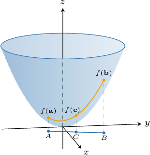

# The Multivariable Mean-Value Theorem

Source: https://www.mathacademy.com/topics/1941?courseId=154
Topic ID: 1941

## Prerequisites

- [The Mean Value Theorem](../../../ap-courses/lessons/ap-calculus-ab/288-the-mean-value-theorem.md)
- [The Gradient Vector](./1934-the-gradient-vector.md)

## Lesson

### Introduction

We can extend the mean value theorem from single-variable calculus to functions of multiple variables.

First, let's recall the mean value theorem from single-variable calculus.

*If $f(x)$ is a function that's continuous on $[a,b]$ and differentiable on $(a,b)$, then there exists a point $c\in (a,b)$ such that*

$$

f'(c) = \dfrac {f(b) - f(a)} {b-a}.

$$

Notice that we can rewrite the above equation as follows:

$$

f(b) - f(a) = f'(c) (b-a)

$$

Now, we're ready to present the **multivariable mean value theorem,** which states the following:

*If $f(x,y)$ is a function that's differentiable at each point on the line segment $\overline{AB},$ then there exists a point $C \in \overline{AB}$ with position vector $\mathbf{c}$ such that where $\mathbf{a}$ and $\mathbf{b}$ are the position vectors of $A$ and $B,$ respectively.*

The theorem naturally extends to functions of three variables.

As an example, let's consider the function

$$

f(x,y)= x^2 + y^2

$$

and the line segment $\overline{AB},$ where the position vectors of $A$ and $B$ are $\mathbf{a} = \langle 1,-1 \rangle$ and $\mathbf{b} = \langle 2,2 \rangle.$ A sketch of this situation is given below.

Since $f(x,y)$ is differentiable at each point on the line segment $\overline{AB},$ we can apply the mean value theorem. That is, there exists a point $C\in\overline{AB}$ with position vector $\mathbf{c}$ such that

$$

\begin{aligned}𝑓(𝐛)−𝑓(𝐚) & =∇𝑓(𝐜)⋅(𝐛−𝐚) \\ 𝑓(2,2)−𝑓(1,−1) & =∇𝑓(𝐜)⋅(⟨2,2⟩−⟨1,−1⟩) \\ (2^{2}+2^{2})−(1^{2}+(−1)^{2}) & =∇𝑓(𝐜)⋅⟨1,3⟩ \\ 6 & =∇𝑓(𝐜)⋅⟨1,3⟩.\end{aligned}

$$

Writing out the components of $\nabla f (\mathbf c)$ and expanding the dot product, we get

$$

\begin{aligned}∇𝑓(𝐜)⋅⟨1,3⟩ & =6 \\ ⟨𝑓_{𝑥}(𝐜),𝑓_{𝑦}(𝐜)⟩⋅⟨1,3⟩ & =6 \\ 𝑓_{𝑥}(𝐜)+3𝑓_{𝑦}(𝐜) & =6.\end{aligned}

$$

Therefore, the above equation *must* be satisfied by some point $\mathbf c$ that lies on $\overline{AB}.$

### Example: Finding an Equation Implied by the Mean Value Theorem

#### Question

Let $f(x,y)$ be a function that is differentiable at each point on the line segment $\overline{AB},$ where $\mathbf a=\langle 5,3\rangle$ and $\mathbf b=\langle 4,2\rangle$ are the position vectors of $A$ and $B,$ respectively. If $f(\mathbf a)= 5$ and $f(\mathbf b)=6,$ then according to the mean value theorem, which of the following must be true for some point $C\in \overline{AB}$ with position vector $\mathbf c?$

1. $f_x(\mathbf c) + f_y(\mathbf c) = -1$

2. $f_x(\mathbf c) + f_y(\mathbf c) = 1$

3. $f_x(\mathbf c) +f_y(\mathbf c) = 2$

#### Explanation

The mean value theorem states that if $f(x,y)$ is differentiable at each point on the line segment $\overline{AB},$ then there exists a point $C \in \overline{AB}$ with position vector $\mathbf c$ such that

$$

f (\mathbf b) − f (\mathbf a) = \nabla f (\mathbf c) · (\mathbf b − \mathbf a).

$$

In our case, we have

$$

\begin{aligned}𝑓(𝐛)−𝑓(𝐚) & =∇𝑓(𝐜)·(𝐛−𝐚) \\ 6−5 & =⟨𝑓_{𝑥}(𝐜),𝑓_{𝑦}(𝐜)⟩⋅(⟨4,2⟩−⟨5,3⟩) \\ 1 & =⟨𝑓_{𝑥}(𝐜),𝑓_{𝑦}(𝐜)⟩⋅⟨−1,−1⟩ \\ 1 & =−𝑓_{𝑥}(𝐜)−𝑓_{𝑦}(𝐜)\end{aligned}

$$

which we can write as

$$

f_x(\mathbf c) + f_y(\mathbf c) =-1.

$$

Therefore, the correct answer is "I only."

### Example: Finding Points That Satisfy the Mean Value Theorem for Two-Variable Functions

#### Question

Find a point that satisfies the mean value theorem for $f(x,y) = 9 - x^2 - y^2$ on the line segment $\overline {AB},$ where the position vectors of $A$ and $B$ are $\mathbf a = \langle 0, 0\rangle$ and $\mathbf b = \langle 2, 1\rangle,$ respectively.

#### Explanation

The mean value theorem states that if $f(x,y)$ is differentiable at each point on the line segment $\overline{AB},$ then there exists a point $C \in \overline{AB}$ with position vector $\mathbf c$ such that

$$

f (\mathbf b) − f (\mathbf a) = \nabla f (\mathbf c) · (\mathbf b − \mathbf a).

$$

Notice that the function $f(x, y) = 9 - x^2 - y^2$ is differentiable at each point on the line segment $\overline{AB}.$ So, we can apply the mean value theorem.

Substituting $\mathbf a = \langle 0, 0\rangle$ and $\mathbf b = \langle 2, 1\rangle$ into the above expression, we get

$$

\begin{aligned}𝑓(2,1)−𝑓(0,0) & =∇𝑓(𝐜)⋅(⟨2,1⟩−⟨0,0⟩) \\ (9−2^{2}−1^{2})−(9−0^{2}−0^{2}) & =∇𝑓(𝐜)⋅⟨2,1⟩ \\ −5 & =∇𝑓(𝐜)⋅⟨2,1⟩.\end{aligned}

$$

Computing $\nabla f$ and evaluating at $\mathbf c = \langle c_1, c_2\rangle,$ we get

$$

\begin{aligned}∇𝑓 & =⟨−2𝑥,−2𝑦⟩, \\ ∇𝑓(𝐜) & =⟨−2𝑐_{1},−2𝑐_{2}⟩.\end{aligned}

$$

Therefore,

$$

\begin{aligned}−5 & =∇𝑓⟨𝐜⟩⋅⟨2,1⟩ \\ −5 & =⟨−2𝑐_{1},−2𝑐_{2}⟩⋅⟨2,1⟩ \\ −5 & =−4𝑐_{1}−2𝑐_{2} \\ 5 & =4𝑐_{1}+2𝑐_{2}.\end{aligned}

$$

Now, we use the fact that $C$ lies on $\overline{AB}.$ So, let's first find the equation of the line:

$$

\begin{aligned}\frac{𝑦−𝑦_{𝑎}}{𝑦_{𝑏}−𝑦_{𝑎}} & =\frac{𝑥−𝑥_{𝑎}}{𝑥_{𝑏}−𝑥_{𝑎}} \\ \frac{𝑦−0}{1−0} & =\frac{𝑥−0}{2−0} \\ 𝑦 & =\frac{𝑥}{2}\end{aligned}

$$

Since $\mathbf c = \langle c_1,c_2\rangle$ satisfies the equation of the line, we have

$$

\begin{aligned}𝑐_{2} & =\frac{𝑐_{1}}{2}.\end{aligned}

$$

Substituting the above into the equation $4c_1 + 2c_2 = 5,$ we get

$$

\begin{aligned}4𝑐_{1}+2(\frac{𝑐_{1}}{2}) & =5 \\ 4𝑐_{1}+𝑐_{1} & =5 \\ 5𝑐_{1} & =5 \\ 𝑐_{1} & =1.\end{aligned}

$$

Finally, we find $c_2 = \dfrac{c_1}{2} = \dfrac{1}{2}.$ So, the point $C$ that satisfies the mean value theorem is $\left(1, \dfrac{1}{2} \right).$

### Example: Finding Points That Satisfy the Mean Value Theorem for Three-Variable Functions

#### Question

Find a point that satisfies the mean value theorem for $f(x,y,z) = x^2 + y - z^2$ on the line segment $\overline{AB},$ where the position vectors of $A$ and $B$ are $\mathbf a = \langle 0,0,1\rangle$ and $\mathbf b = \langle 2,3,0\rangle,$ respectively.

#### Explanation

The mean value theorem states that if $f(x,y, z)$ is differentiable at each point on the line segment $\overline{AB},$ then there exists a point $C \in \overline{AB}$ with position vector $\mathbf c$ such that

$$

f (\mathbf b) − f (\mathbf a) = \nabla f (\mathbf c) · (\mathbf b − \mathbf a).

$$

Notice that $f(x, y,z) = x^2 + y - z^2$ is differentiable at each point on the line segment $\overline{AB}.$ So, we can apply the mean value theorem.

Substituting $\mathbf a = \langle 0,0,1\rangle$ and $\mathbf b= \langle 2,3,0\rangle$ into the above expression, we get

$$

\begin{aligned}𝑓(2,3,0)−𝑓(0,0,1) & =∇𝑓(𝐜)⋅(⟨2,3,0⟩−⟨0,0,1⟩) \\ 7−(−1) & =∇𝑓(𝐜)⋅⟨2,3,−1⟩ \\ 8 & =∇𝑓(𝐜)⋅⟨2,3,−1⟩.\end{aligned}

$$

Computing $\nabla f$ and evaluating at $\mathbf c = \langle c_1, c_2, c_3\rangle,$ we get

$$

\begin{aligned}∇𝑓 & =⟨2𝑥,1,−2𝑧⟩, \\ ∇𝑓(𝐜) & =⟨2𝑐_{1},1,−2𝑐_{3}⟩.\end{aligned}

$$

Therefore, we get

$$

\begin{aligned}8 & =∇𝑓(𝐜)⋅⟨2,3,−1⟩ \\ 8 & =⟨2𝑐_{1},1,−2𝑐_{3}⟩⋅⟨2,3,−1⟩ \\ 8 & =4𝑐_{1}+3+2𝑐_{3} \\ 5 & =4𝑐_{1}+2𝑐_{3}.\end{aligned}

$$

Now, we use the fact that $C$ lies on $\overline{AB}.$ So, let's first find the equation of the line:

$$

\begin{aligned}\frac{𝑥−0}{2} & =\frac{𝑦−0}{3}=\frac{𝑧−1}{(−1)} \\ \frac{𝑥}{2} & =\frac{𝑦}{3}=1−𝑧\end{aligned}

$$

Parametrizing the line, we get

$$

x = 2t , \quad y= 3t, \quad z = 1-t, \quad 0 \leq t \leq 1.

$$

Since $\mathbf c= \langle c_1, c_2, c_3\rangle$ satisfies the equation of the line, we have

$$

c_1 = 2t , \quad c_2 = 3t , \quad c_3 = 1-t.

$$

Substituting the above in the equation $4c_1 + 2c_3 = 5,$ we get

$$

\begin{aligned}4(2𝑡)+2(1−𝑡) & =5 \\ 8𝑡+2−2𝑡 & =5 \\ 6𝑡 & =3 \\ 𝑡 & =\frac{1}{2}.\end{aligned}

$$

We can now find the values of $c_1,$ $c_2,$ and $c_3.$ This gives

$$

\begin{aligned}𝑐_{1} & =2(\frac{1}{2})=1, \\ 𝑐_{2} & =3(\frac{1}{2})=\frac{3}{2}, \\ 𝑐_{3} & =1−\frac{1}{2}=\frac{1}{2}.\end{aligned}

$$

Finally, the coordinates of $C$ are $\left(1, \dfrac{3}{2}, \dfrac{1}{2}\right).$
