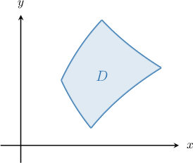
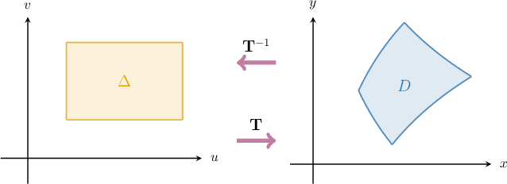
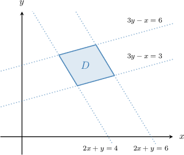
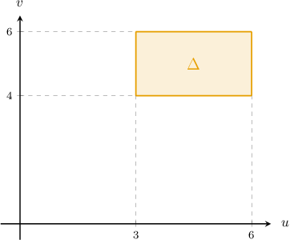
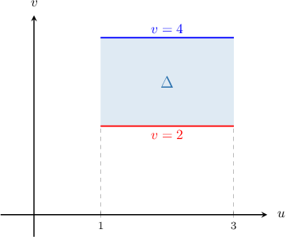
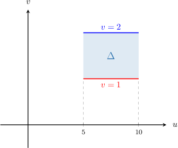
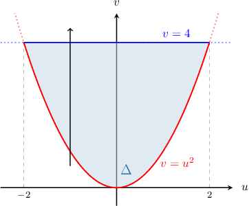

# Computing Areas Using a Change of Variables

Source: https://www.mathacademy.com/topics/1998?courseId=154
Topic ID: 1998

## Prerequisites

- [Double Integrals Over Type I Regions](./2151-double-integrals-over-type-i-regions.md)
- [Transformations of Regions Between Curves](./4134-transformations-of-regions-between-curves.md)

## Lesson

### Introduction

Given a real interval $D = (a,b)\subset \mathbb R,$ the length of this interval can be represented by the integral

$$

\textrm{Length}(D) = \int_a^b \,\textrm d x

$$

which we can also write as

$$

\textrm{Length}(D) = \int\limits_D \,\textrm d x.

$$

Suppose we define an invertible function $u = u(x).$ By the change of variables formula, the length of our interval can also be expressed as

$$

\textrm{Length}(D) = \int\limits_{\Delta} \dfrac{\textrm d x}{\textrm d u}\, \textrm d u.

$$

Note the following:

- Whenever we perform a change of variables, the domain of integration changes, too. This new integration domain is denoted $\Delta.$ More technically, $\Delta$ is the *image* of the $D$ under the action of $u(x).$

- If we think of $\dfrac{\textrm d x}{\textrm d u}$ as a fraction, the $\textrm d u$'s in our length formula appear to "cancel out," leaving only the original $\textrm d x.$ This makes the change of variables formula easy to remember.

So, to summarize,

$$

\textrm{Length}(D) = \int\limits_D \,\textrm d x = \int\limits_{\Delta} \dfrac{\textrm d x}{\textrm d u}\, \textrm d u.

$$

Since the length of our interval is simply $b-a,$ it's doubtful that we'll ever use this formula in practice! However, it does indicate how we might use a change of variables to find the *area* of a complex region in two-dimensional space. Let's explore this idea in more detail.

### The Change of Variables Formula

Consider the region $D$ in the $xy$-plane shown above. The area of this region is given by

$$

\iint\limits_{D} \mathrm d x\textrm d y

$$

where we'll use the convention $\textrm d A = \mathrm d x\textrm d y$ when referring to integration with respect to the Cartesian coordinates $x$ and $y.$

This region looks pretty complicated. In such cases, it's often easier to find an invertible transformation $\mathbf T$ (i.e., change of variables) whose inverse maps the region $D$ to simpler, preferably rectangular, region $\Delta$ in the $uv$-plane.

So, rather than computing the required area by integrating with respect to $x$ and $y,$ we can instead perform the transformation and integrate with respect to $u$ and $v.$

To carry out this process, we apply the **change of variables formula**

$$

\textrm{Area}(D) = \iint\limits_{D} \mathrm d x \mathrm d y = \iint\limits_{\Delta} \left| \dfrac{\partial (x, y)}{\partial (u, v)} \right| \ \mathrm d u \mathrm d v

$$

where $\dfrac{\partial (x, y)}{\partial (u, v)}$ is the Jacobian determinant corresponding to $\mathbf T.$

Notice that this formula is analogous to the one we saw earlier for computing the length of an interval. In particular:

- If we consider the Jacobian as a kind of fraction, the $\partial(u,v)$ and $\textrm d u\textrm d v$ parts appear to "cancel out," similar to the previous formula.

- Note that $\mathbf T$ could be orientation-reversing. We take the absolute value of the Jacobian to ensure that $D$ and $\Delta$ have the same orientation.

Finally, note that the change of variables formula assumes that $\mathbf T$ is a $C^1$ transformation and has no critical points in the interior of $\Delta.$

Often, the most challenging part is finding a suitable change of variables. The main idea is to get a nice rectangular shape with sides parallel to the axes in the $uv$-plane. In other words, we require a change of variables that reduces the equations of our curves to something like the following:

$$

u = \textrm{const}_1, \quad u = \textrm{const}_2, \quad v = \textrm{const}_3, \quad v = \textrm{const}_4

$$

Let's look at a concrete example of computing an area using the change of variables formula.

### A Worked Example

Consider the finite region $D$ in the first quadrant (shown above) bounded by the lines

$$

{\color{blue}{3y-x}} = 3, \qquad {\color{blue}{3y-x}} = 6, \qquad {\color{red}{2x+y}}=4, \qquad {\color{red}{2x+y}}=6.

$$

The area of the required region is given by

$$

\iint\limits_{D} \mathrm d x \mathrm d y.

$$

Let's define a transformation $\mathbf T$ as follows:

$$

[\begin{aligned}𝑢 \\ 𝑣\end{aligned}]

$$

This transformation maps some region $\Delta$ in the $uv$-plane to our region $D$ in the $xy$-plane.

To compute the required area, we will use the change of variables formula

$$

\iint\limits_{D} \mathrm d x \mathrm d y = \iint\limits_{\Delta} \left| \dfrac{\partial (x, y)}{\partial (u, v)} \right| \ \mathrm d u \mathrm d v

$$

where $\dfrac{\partial (x, y)}{\partial (u, v)}$ is the Jacobian determinant corresponding to $\mathbf T.$

Looking at the lines that bound our region, we consider the following change of variables:

$$

u = {\color{blue}{3y-x}}, \qquad v = {\color{red}{2x+y}}

$$

Note that this change of variables gives us the *inverse* function $\mathbf T^{-1},$ that is

$$

[\begin{aligned}𝑥 \\ 𝑦\end{aligned}]

$$

To compute the required area, we proceed in four steps:

**Step 1**: Find $\Delta,$ which is the image of $D$ under the action of $\mathbf{T}^{-1}.$

We substitute $u=3y-x$ into the equations of the first and second lines:

$$

\begin{aligned} & 3𝑦−𝑥=3 & ⟹\, & 𝑢=3 \\ & 3𝑦−𝑥=6 & ⟹\, & 𝑢=6\end{aligned}

$$

And we substitute $v = 2x+y$ into the equations of the third and fourth lines:

$$

\begin{aligned} & 2𝑥+𝑦=4 & ⟹\, & 𝑣=4 \\ & 2𝑥+𝑦=6 & ⟹\, & 𝑣=6\end{aligned}

$$

Therefore, our domain in the $uv$-plane is the following rectangle:

$$

\Delta = \big\{ (u,v) \: : \: 3 \leq u \leq 6, \quad 4 \leq v \leq 6\big\}

$$

**Step 2**: Compute the Jacobian determinant corresponding to $\mathbf T^{-1}.$

Our transformation $\mathbf T^{-1}$ is

$$

u = 3y-x, \qquad v = 2x+y.

$$

The Jacobian determinant corresponding to $\mathbf T^{-1}$ is

$$

\begin{aligned}\frac{𝜕(𝑢,𝑣)}{𝜕(𝑥,𝑦)} & =\begin{aligned}\frac{𝜕𝑢}{𝜕𝑥} & \frac{𝜕𝑢}{𝜕𝑦} \\ \frac{𝜕𝑣}{𝜕𝑥} & \frac{𝜕𝑣}{𝜕𝑦}\end{aligned} \\ & =\begin{aligned}−1 & 3 \\ 2 & 1\end{aligned} \\ & =−7.\end{aligned}

$$

**Step 3**: Compute the Jacobian determinant corresponding to $\mathbf T.$

The Jacobian determinant corresponding to $\mathbf T$ is

$$

\dfrac{\partial (x, y)}{\partial (u, v)} = \left( \dfrac{\partial (u, v)}{\partial (x, y)} \right)^{-1} = -\dfrac17.

$$

Note that $\dfrac{\partial (x, y)}{\partial (u, v)} \neq 0$ everywhere inside $\Delta.$ In other words, $\mathbf T$ has no critical points inside $\Delta.$

**Step 4**: Compute the required area.

We calculate the required area by performing the change of variables:

$$

\begin{aligned}\underset{𝐷}{∬}d𝑥d𝑦 & =\underset{Δ}{∬}\frac{𝜕(𝑥,𝑦)}{𝜕(𝑢,𝑣)}\,d𝑢d𝑣 \\ & =\underset{Δ}{∬}−\frac{1}{7}\,d𝑢d𝑣 \\ & =\frac{1}{7}\underset{Δ}{∬}\,d𝑢d𝑣 \\ & =\frac{1}{7}⋅Area(Δ) \\ & =\frac{1}{7}⋅(6−3)⋅(6−4) \\ & =\frac{1}{7}⋅3⋅2 \\ & =\frac{6}{7}\end{aligned}

$$

### Example: Mapping an Area to a Rectangular Region: Transformations Given

#### Question

Using the change of variables

$$

u = \dfrac{y^2}{x}, \qquad v= xy,

$$

calculate the area of the finite region $D$ in the first quadrant bounded by the curves

$$

x = {y^2}, \qquad x=\dfrac{y^2}3, \qquad y=\dfrac2x, \qquad y=\dfrac4x.

$$

#### Explanation

The area of the required region is given by

$$

\iint\limits_{D} \mathrm d x \mathrm d y.

$$

Let's define a transformation $\mathbf T$ as follows:

$$

[\begin{aligned}𝑢 \\ 𝑣\end{aligned}]

$$

This transformation maps some region $\Delta$ in the $uv$-plane to our region $D$ in the $xy$-plane.

To compute the required area, we will use the change of variables formula

$$

\iint\limits_{D} \mathrm d x \mathrm d y = \iint\limits_{\Delta} \left| \dfrac{\partial (x, y)}{\partial (u, v)} \right| \ \mathrm d u \mathrm d v

$$

where $\dfrac{\partial (x, y)}{\partial (u, v)}$ is the Jacobian determinant corresponding to $\mathbf T.$

Note that the changes of variables

$$

u = \dfrac{y^2}{x}, \qquad v= xy

$$

gives us the ** function $\mathbf T^{-1},$ that is

$$

[\begin{aligned}𝑥 \\ 𝑦\end{aligned}]

$$

To compute the required area, we proceed in four steps:

****: Find $\Delta,$ which is the image of $D$ under the action of $\mathbf{T}^{-1}.$

We substitute $u= \dfrac{y^2}{x}$ into the equations of the first and second curves:

$$

\begin{aligned} & 𝑥=𝑦^{2} & ⟹\, & \frac{𝑦^{2}}{𝑥}=1 & ⟹\, & 𝑢=1 \\ & 𝑥=\frac{𝑦^{2}}{3} & ⟹\, & \frac{𝑦^{2}}{𝑥}=3 & ⟹\, & 𝑢=3\end{aligned}

$$

And we substitute $v = xy$ into the equations of the third and fourth curves:

$$

\begin{aligned} & 𝑦=\frac{2}{𝑥} & ⟹\, & 𝑥𝑦=2 & ⟹\, & 𝑣=2 \\ & 𝑦=\frac{4}{𝑥} & ⟹\, & 𝑥𝑦=4 & ⟹\, & 𝑣=4\end{aligned}

$$

Therefore, our domain in the $uv$-plane is the following rectangle:

$$

\Delta = \big\{ (u,v) \: : \: 1 \leq u \leq 3, \quad 2 \leq v \leq 4\big\}

$$

****: Compute the Jacobian determinant corresponding to $\mathbf T^{-1}.$

The Jacobian determinant corresponding to $\mathbf T^{-1}$ is

$$

\begin{aligned}\frac{𝜕(𝑢,𝑣)}{𝜕(𝑥,𝑦)} & =\begin{aligned}\frac{𝜕𝑢}{𝜕𝑥} & \frac{𝜕𝑢}{𝜕𝑦} \\ \frac{𝜕𝑣}{𝜕𝑥} & \frac{𝜕𝑣}{𝜕𝑦}\end{aligned} \\ & =\begin{aligned}−\frac{𝑦^{2}}{𝑥^{2}} & \frac{2𝑦}{𝑥} \\ 𝑦 & 𝑥\end{aligned} \\ & =−\frac{3𝑦^{2}}{𝑥}.\end{aligned}

$$

****: Compute the Jacobian determinant corresponding to $\mathbf T.$

The Jacobian determinant corresponding to $\mathbf T$ is

$$

\dfrac{\partial (x, y)}{\partial (u, v)} = \left( \dfrac{\partial (u, v)}{\partial (x, y)} \right)^{-1} = -\dfrac{x}{3y^2} = -\dfrac{1}{3u}.

$$

Note that $\dfrac{\partial (x, y)}{\partial (u, v)} \neq 0$ everywhere inside $\Delta.$ In other words, $\mathbf T$ has no critical points inside $\Delta.$

****: Compute the required area.

We calculate the required area by performing the change of variables:

$$

\begin{aligned}\underset{𝐷}{∬}d𝑥d𝑦 & =\underset{Δ}{∬}\frac{𝜕(𝑥,𝑦)}{𝜕(𝑢,𝑣)}\,d𝑢d𝑣 \\ & =\underset{Δ}{∬}−\frac{1}{3𝑢}\,d𝑢d𝑣 \\ & =\frac{1}{3}∫_{31}^{}∫_{42}^{}\frac{1}{𝑢}\,d𝑢\,d𝑣 \\ & =\frac{1}{3}∫_{31}^{}\frac{1}{𝑢}\,d𝑢∫_{42}^{}\,d𝑣 \\ & =\frac{1}{3}⋅(ln⁡3−ln⁡1)⋅(4−2) \\ & =\frac{2}{3}ln⁡3.\end{aligned}

$$

### Example: Mapping an Area to a Rectangular Region: Transformations Not Given

#### Question

Use a change of variables to calculate the area of the finite region $D$ in the first quadrant bounded by the following curves.

$$

e^y = \dfrac{5}{e^x}, \qquad e^y=\dfrac{10}{e^x}, \qquad e^x=e^y, \qquad e^x=2e^y

$$

#### Explanation

The area of the required region is given by

$$

\iint\limits_{D} \mathrm d x \mathrm d y.

$$

Let's define a transformation $\mathbf T$ as follows:

$$

[\begin{aligned}𝑢 \\ 𝑣\end{aligned}]

$$

We'll assume this transformation maps some region $\Delta$ in the $uv$-plane to our region $D$ in the $xy$-plane.

To compute the required area, we will use the change of variables formula

$$

\iint\limits_{D} \mathrm d x \mathrm d y = \iint\limits_{\Delta} \left| \dfrac{\partial (x, y)}{\partial (u, v)} \right| \ \mathrm d u \mathrm d v,

$$

where $\dfrac{\partial (x, y)}{\partial (u, v)}$ is the Jacobian determinant corresponding to $\mathbf T.$

To compute the required area, we proceed in five steps:

****: Find a suitable change of variables.

Notice that we can rewrite the equations of our curves as follows:

$$

e^{x+y} = 5, \qquad e^{x+y}=10, \qquad e^{x-y} = 1, \qquad e^{x-y} = 2

$$

This suggests the following change of variables:

$$

u = e^{x+y}, \qquad v = e^{x-y}

$$

This change of variables gives us the ** function $\mathbf T^{-1},$ that is

$$

[\begin{aligned}𝑥 \\ 𝑦\end{aligned}]

$$

****: Find $\Delta,$ which is the image of $D$ under the action of $\mathbf{T}^{-1}.$

We substitute $u=e^{x+y}$ into the equations of the first and second curves:

$$

\begin{aligned} & 𝑒^{𝑥+𝑦}=5\,⟹\,𝑢=5 \\ & 𝑒^{𝑥+𝑦}=10\,⟹\,𝑢=10\end{aligned}

$$

And we substitute $v =e^{x-y}$ into the equations of the third and fourth curves:

$$

\begin{aligned} & 𝑒^{𝑥−𝑦}=1\,⟹\,𝑣=1 \\ & 𝑒^{𝑥−𝑦}=2\,⟹\,𝑣=2\end{aligned}

$$

Therefore, our domain in the $uv$-plane is the following rectangle:

$$

\Delta = \big\{ (u,v) \: : \: 5 \leq u \leq 10, \quad 1 \leq v \leq 2\big\}

$$

****: Compute the Jacobian determinant corresponding to $\mathbf T^{-1}.$

The Jacobian determinant corresponding to $\mathbf T^{-1}$ is

$$

\begin{aligned}\frac{𝜕(𝑢,𝑣)}{𝜕(𝑥,𝑦)} & =\begin{aligned}\frac{𝜕𝑢}{𝜕𝑥} & \frac{𝜕𝑢}{𝜕𝑦} \\ \frac{𝜕𝑣}{𝜕𝑥} & \frac{𝜕𝑣}{𝜕𝑦}\end{aligned} \\ & =\begin{aligned}𝑒^{𝑥+𝑦} & 𝑒^{𝑥+𝑦} \\ 𝑒^{𝑥−𝑦} & −𝑒^{𝑥−𝑦}\end{aligned} \\ & =−𝑒^{2𝑥}−𝑒^{2𝑥} \\ & =−2𝑒^{2𝑥}.\end{aligned}

$$

****: Compute the Jacobian determinant corresponding to $\mathbf T.$

The Jacobian determinant corresponding to $\mathbf T$ is

$$

\dfrac{\partial (x, y)}{\partial (u, v)} = \left( \dfrac{\partial (u, v)}{\partial (x, y)} \right)^{-1} = -\dfrac{1}{2}e^{-2x}=-\dfrac{1}{2uv}.

$$

Note that $\dfrac{\partial (u, v)}{\partial (x, y)}\neq 0$ everywhere inside $\Delta.$ In other words, $\mathbf T$ has no critical points inside $\Delta.$

****: Compute the required area.

We calculate the required area by performing the change of variables:

$$

\begin{aligned}\underset{𝐷}{∬}d𝑥d𝑦 & =\underset{Δ}{∬}\frac{𝜕(𝑥,𝑦)}{𝜕(𝑢,𝑣)}\,d𝑢d𝑣 \\ & =\underset{Δ}{∬}−\frac{1}{2𝑢𝑣}\,d𝑢d𝑣 \\ & =\frac{1}{2}\underset{Δ}{∬}\frac{1}{𝑢𝑣}\,d𝑢d𝑣 \\ & =\frac{1}{2}∫_{105}^{}\frac{1}{𝑢}\,d𝑢∫_{21}^{}\frac{1}{𝑣}\,d𝑣 \\ & =\frac{1}{2}⋅(ln⁡10−ln⁡5)⋅(ln⁡2−ln⁡1) \\ & =\frac{1}{2}(ln⁡2)^{2}\end{aligned}

$$

### Example: Finding an Area by Transforming to a Type I Region

#### Question

Using the change of variables

$$

u =3x-2y, \quad v=x+y,

$$

calculate the area of the finite region $D$ bounded by the curve $(3x-2y)^2 - y - x = 0$ and the line $x+y=4.$

#### Explanation

The area of the required region is given by

$$

\iint\limits_{D} \mathrm d x \mathrm d y.

$$

Let's define a transformation $\mathbf T$ as follows:

$$

[\begin{aligned}𝑢 \\ 𝑣\end{aligned}]

$$

This transformation maps some region $\Delta$ in the $uv$-plane to our region $D$ in the $xy$-plane.

To compute the required area, we will use the change of variables formula

$$

\iint\limits_{D} \mathrm d x \mathrm d y = \iint\limits_{\Delta} \left| \dfrac{\partial (x, y)}{\partial (u, v)} \right| \ \mathrm d u \mathrm d v

$$

where $\dfrac{\partial (x, y)}{\partial (u, v)}$ is the Jacobian determinant corresponding to $\mathbf T.$

Note that the changes of variables

$$

u = 3x-2y, \qquad v=x+y

$$

gives us the ** function $\mathbf T^{-1},$ that is

$$

[\begin{aligned}𝑥 \\ 𝑦\end{aligned}]

$$

To compute the required area, we proceed in four steps:

****: Find $\Delta,$ which is the image of $D$ under the action of $\mathbf{T}^{-1}.$

Substituting $3x-2y = u$ and $x+y = v$ into the equation of the first curve, we get

$$

\begin{aligned}(3𝑥−2𝑦)^{2}−𝑦−𝑥=0\,⟹\,𝑢^{2}−𝑣=0\,⟹\,𝑣=𝑢^{2},\end{aligned}

$$

while substituting $x + y = v$ into the equation of the second curve, we obtain

$$

\begin{aligned}𝑦+𝑥=4\,⟹\,𝑣=4.\end{aligned}

$$

To find the intersections of the curves in the $uv$-plane, we solve the following system:

$$

\begin{aligned}\begin{aligned}𝑣=𝑢^{2} \\ 𝑣=4\end{aligned}\,⟹\,\begin{aligned}𝑢=±2 \\ 𝑣=4.\end{aligned}\end{aligned}

$$

So, the intersection points are $(\pm 2, 4).$

Therefore, our domain in the $uv$-plane has the type I representation

$$

\Delta = \big\{ (u,v) \: : \: -2 \leq u \leq 2, \, u^2 \leq v \leq 4\big\},

$$

as shown below.

****: Compute the Jacobian determinant corresponding to $\mathbf T^{-1}{:}$

The Jacobian determinant corresponding to $\mathbf T^{-1}$ is

$$

\begin{aligned}\frac{𝜕(𝑢,𝑣)}{𝜕(𝑥,𝑦)} & =\begin{aligned}\frac{𝜕𝑢}{𝜕𝑥} & \frac{𝜕𝑢}{𝜕𝑦} \\ \frac{𝜕𝑣}{𝜕𝑥} & \frac{𝜕𝑣}{𝜕𝑦}\end{aligned} \\ & =\begin{aligned}3 & −2 \\ 1 & 1\end{aligned} \\ & =5.\end{aligned}

$$

****: Compute the Jacobian determinant corresponding to $\mathbf T{:}$

The Jacobian determinant corresponding to $\mathbf T$ is

$$

\dfrac{\partial (x, y)}{\partial (u, v)} = \left( \dfrac{\partial (u, v)}{\partial (x, y)} \right)^{-1} = (5)^{-1} = \dfrac 15.

$$

Note that $\dfrac{\partial (x, y)}{\partial (u, v)} \neq 0$ everywhere inside $\Delta.$ In other words, $\mathbf T$ has no critical points inside $\Delta.$

****: Compute the required area.

We calculate the required area by performing the change of variables:

$$

\begin{aligned}\underset{𝐷}{∬}d𝑥d𝑦 & =\underset{Δ}{∬}\frac{𝜕(𝑥,𝑦)}{𝜕(𝑢,𝑣)}\,d𝑢d𝑣 \\ & =\underset{Δ}{∬}\frac{1}{5}d𝑢d𝑣 \\ & =\frac{1}{5}∫_{2−2}^{}[∫_{4𝑢^{2}}^{}\,d𝑣]d𝑢 \\ & =\frac{1}{5}∫_{2−2}^{}[𝑣]_{4𝑢^{2}}^{}\,d𝑢 \\ & =\frac{1}{5}∫_{2−2}^{}(4−𝑢^{2})\,d𝑢 \\ & =\frac{1}{5}⋅2∫_{20}^{}(4−𝑢^{2})\,d𝑢 \\ & =\frac{2}{5}[4𝑢−\frac{𝑢^{3}}{3}]_{20}^{} \\ & =\frac{2}{5}(8−\frac{8}{3}) \\ & =\frac{2}{5}(\frac{16}{3}) \\ & =\frac{32}{15}\end{aligned}

$$
