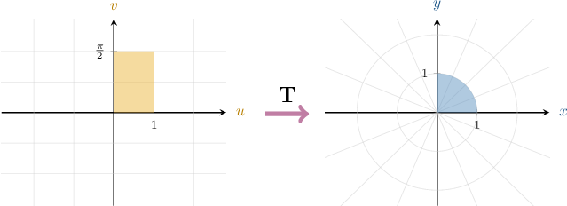
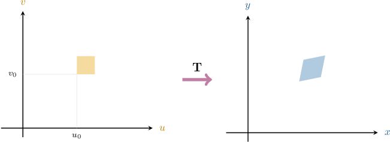
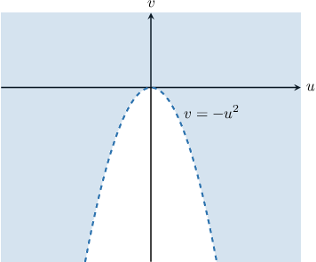

# The Jacobian

Source: https://www.mathacademy.com/topics/1999?courseId=154
Topic ID: 1999

## Prerequisites

- [The Image of an Affine Transformation](./3706-the-image-of-an-affine-transformation.md)
- [The Inverse of an Affine Transformation](./3707-the-inverse-of-an-affine-transformation.md)
- [Computing Partial Derivatives Using the Rules of Differentiation](./4096-computing-partial-derivatives-using-the-rules-of-differentiation.md)

## Lesson

### Introduction

We have explored linear and affine transformations in the plane. We'll now begin to explore nonlinear transformations of plane regions.

Let $\mathbf{T}: U \to \mathbb{R}^2$ be a **transformation** on an open set $U\subseteq \mathbb R^2.$ We write

$$

[\begin{aligned}𝑢 \\ 𝑣\end{aligned}]

$$

Recall that, under this notation,

- $[\begin{aligned}𝑢 \\ 𝑣\end{aligned}]$ represents vectors belonging to the input space (i.e., the $uv$-plane), and

- $[\begin{aligned}𝑥 \\ 𝑦\end{aligned}]$ represents vectors belonging to the output space (i.e., the $xy$-plane).

For example, consider the following transformation:

$$

[\begin{aligned}𝑥 \\ 𝑦\end{aligned}]

$$

Geometrically, this transformation maps the rectangular region in the $uv$-plane below to a circular sector in the $xy$-plane.

We'll explore how to compute the image of a nonlinear transformation in future lessons. But for now, it is sufficient to know that

- $\mathbf T$ takes points (or vectors) from the $uv$-plane as input and maps them to points (vectors) in the $xy$-plane, and

- rectangular regions in the $uv$-plane are mapped to regions in the $xy$-plane that are not necessarily parallelograms.

### The Jacobian Determinant

Suppose that $\mathbf{T}: U \to \mathbb{R}^2$ is a transformation given by

$$

[\begin{aligned}𝑢 \\ 𝑣\end{aligned}]

$$

We'll assume that $\mathbf T$ is a $\boldsymbol{C}^1$ **transformation**, which means that $x$ and $y$ have continuous first-order partial derivatives on an open set $U$ contained in $\Bbb R^2.$

The **Jacobian determinant** of $\mathbf T,$ denoted $\dfrac{\partial (x, y)}{\partial (u, v)},$ is defined as

$$

\begin{aligned}\frac{𝜕(𝑥,𝑦)}{𝜕(𝑢,𝑣)} & =\begin{aligned}\frac{𝜕𝑥}{𝜕𝑢} & \frac{𝜕𝑥}{𝜕𝑣} \\ \frac{𝜕𝑦}{𝜕𝑢} & \frac{𝜕𝑦}{𝜕𝑣}\end{aligned}=\frac{𝜕𝑥}{𝜕𝑢}⋅\frac{𝜕𝑦}{𝜕𝑣}−\frac{𝜕𝑥}{𝜕𝑣}⋅\frac{𝜕𝑦}{𝜕𝑢}\end{aligned}

$$

We sometimes refer to the Jacobian determinant simply as the **Jacobian.**

Let's compute the Jacobian determinant of the following transformation:

$$

[\begin{aligned}𝑥 \\ 𝑦\end{aligned}]

$$

To compute the Jacobian determinant of this function, we first calculate the required partial derivatives:

$$

\begin{aligned}\frac{𝜕𝑥}{𝜕𝑢} & =cos⁡𝑣 & \,\frac{𝜕𝑥}{𝜕𝑣} & =−𝑢sin⁡𝑣 \\ \frac{𝜕𝑦}{𝜕𝑢} & =sin⁡𝑣 & \,\frac{𝜕𝑦}{𝜕𝑣} & =𝑢cos⁡𝑣\end{aligned}

$$

Therefore, the corresponding Jacobian determinant is

$$

\begin{aligned}\frac{𝜕(𝑥,𝑦)}{𝜕(𝑢,𝑣)} & =\begin{aligned}cos⁡𝑣 & −𝑢sin⁡𝑣 \\ sin⁡𝑣 & 𝑢cos⁡𝑣\end{aligned} \\ & =cos⁡𝑣⋅(𝑢cos⁡𝑣)−(−𝑢sin⁡𝑣)⋅sin⁡𝑣 \\ & =𝑢cos^{2}⁡𝑣+𝑢sin^{2}⁡𝑣 \\ & =𝑢(cos^{2}⁡𝑣+sin^{2}⁡𝑣) \\ & =𝑢.\end{aligned}

$$

We'll spend some time discussing the meaning behind the Jacobian shortly. But for now, let's get some practice at computing it.

### Example: Finding the Jacobian Determinant of a Transformation

#### Question

Find the Jacobian determinant of the transformation $\mathbf{T},$ defined as

$$

[\begin{aligned}𝑢 \\ 𝑣\end{aligned}]

$$

#### Explanation

Given a transformation

$$

[\begin{aligned}𝑢 \\ 𝑣\end{aligned}]

$$

the Jacobian determinant of $\mathbf T,$ denoted $\dfrac{\partial (x, y)}{\partial (u, v)},$ is given by

$$

\begin{aligned}\frac{𝜕(𝑥,𝑦)}{𝜕(𝑢,𝑣)} & =\begin{aligned}\frac{𝜕𝑥}{𝜕𝑢} & \frac{𝜕𝑥}{𝜕𝑣} \\ \frac{𝜕𝑦}{𝜕𝑢} & \frac{𝜕𝑦}{𝜕𝑣}\end{aligned}.\end{aligned}

$$

Here, we have $x=(u+v)^3$ and $y=(u-v)^2.$

First, we find the partial derivatives:

$$

\begin{aligned}\frac{𝜕𝑥}{𝜕𝑢} & =3(𝑢+𝑣)^{2} & \,\frac{𝜕𝑥}{𝜕𝑣} & =3(𝑢+𝑣)^{2} \\ \frac{𝜕𝑦}{𝜕𝑢} & =2(𝑢−𝑣) & \,\frac{𝜕𝑦}{𝜕𝑣} & =−2(𝑢−𝑣)\end{aligned}

$$

Therefore, the corresponding Jacobian determinant is

$$

\begin{aligned}\frac{𝜕(𝑥,𝑦)}{𝜕(𝑢,𝑣)} & =\begin{aligned}\frac{𝜕𝑥}{𝜕𝑢} & \frac{𝜕𝑥}{𝜕𝑣} \\ \frac{𝜕𝑦}{𝜕𝑢} & \frac{𝜕𝑦}{𝜕𝑣}\end{aligned} \\ & =\begin{aligned}3(𝑢+𝑣)^{2} & 3(𝑢+𝑣)^{2} \\ 2(𝑢−𝑣) & −2(𝑢−𝑣)\end{aligned} \\ & =3(𝑢+𝑣)^{2}⋅(−2(𝑢−𝑣))−3(𝑢+𝑣)^{2}⋅2(𝑢−𝑣) \\ & =−12(𝑢+𝑣)^{2}(𝑢−𝑣).\end{aligned}

$$

### Example: Evaluating a Jacobian Determinant

#### Question

For the transformation $\mathbf{T},$ defined as

$$

[\begin{aligned}𝑢 \\ 𝑣\end{aligned}]

$$

compute the value of the Jacobian determinant at the point where $[\begin{aligned}𝑢 \\ 𝑣\end{aligned}]$

#### Explanation

Given a transformation

$$

[\begin{aligned}𝑢 \\ 𝑣\end{aligned}]

$$

the Jacobian determinant of $\mathbf T,$ denoted $\dfrac{\partial (x, y)}{\partial (u, v)},$ is given by

$$

\begin{aligned}\frac{𝜕(𝑥,𝑦)}{𝜕(𝑢,𝑣)} & =\begin{aligned}\frac{𝜕𝑥}{𝜕𝑢} & \frac{𝜕𝑥}{𝜕𝑣} \\ \frac{𝜕𝑦}{𝜕𝑢} & \frac{𝜕𝑦}{𝜕𝑣}\end{aligned}.\end{aligned}

$$

Here, we have $x(u,v) = 2v\cos{u}$ and $y(u,v) = v\sin{u}.$

First, we find the partial derivatives:

$$

\begin{aligned}\frac{𝜕𝑥}{𝜕𝑢} & =−2𝑣sin⁡𝑢 & \,\frac{𝜕𝑥}{𝜕𝑣} & =2cos⁡𝑢 \\ \frac{𝜕𝑦}{𝜕𝑢} & =𝑣cos⁡𝑢 & \,\frac{𝜕𝑦}{𝜕𝑣} & =sin⁡𝑢\end{aligned}

$$

Therefore, the corresponding Jacobian determinant is

$$

\begin{aligned}\frac{𝜕(𝑥,𝑦)}{𝜕(𝑢,𝑣)} & =\begin{aligned}\frac{𝜕𝑥}{𝜕𝑢} & \frac{𝜕𝑥}{𝜕𝑣} \\ \frac{𝜕𝑦}{𝜕𝑢} & \frac{𝜕𝑦}{𝜕𝑣}\end{aligned} \\ & =\begin{aligned}−2𝑣sin⁡𝑢 & 2cos⁡𝑢 \\ 𝑣cos⁡𝑢 & sin⁡𝑢\end{aligned} \\ & =−2𝑣sin⁡𝑢⋅sin⁡𝑢−2cos⁡𝑢⋅𝑣cos⁡𝑢 \\ & =−2𝑣(sin^{2}⁡𝑢+cos^{2}⁡𝑢) \\ & =−2𝑣.\end{aligned}

$$

Finally, when $[\begin{aligned}𝑢 \\ 𝑣\end{aligned}]$ the value of our Jacobian determinant is

$$

\left.\dfrac{\partial (x, y)}{\partial (u, v)}\right|_{(0,-1)} = -2(-1) = 2.

$$

### A Review of Affine Transformations

To understand what the Jacobian describes, we recall our knowledge of affine transformations.

Consider the affine transformation $\mathbf T:\Bbb R^2 \to \Bbb R^2,$ defined by the matrix equation

$$

\mathbf x = T\mathbf u + \mathbf b,

$$

where $\mathbf u, \mathbf b,$ and $\mathbf x$ are vectors from $\mathbb R^2,$ and $T$ is a $2\times 2$ matrix.

For an affine transformation, the determinant of $T$ gives us the following information:

- The *area scale factor* of the transformation: If a rectangle in the $uv$-plane has area $A,$ its image in the $xy$-plane is a parallelogram of area $|\det(T)|\cdot A.$

- Whether the transformation is *orientation-preserving* or *orientation-reversing:* If $\textrm{det}(T) > 0,$ the transformation is orientation-preserving. If $\textrm{det}(T) < 0,$ the transformation is orientation-reversing.

- Whether the transformation is *invertible* or *non-invertible:* If $\textrm{det}(T) \neq 0,$ the transformation is invertible. If $\textrm{det}(T) = 0,$ the transformation is non-invertible. In such cases, a rectangle in the $uv$-plane collapses to either a line segment or point in the $xy$-plane.

Affine transformations are special because these properties are *global*. In other words, they apply *everywhere* in the plane. So, for example, if $\textrm{det}(T) = 2$, then the image of *every* rectangle in the $uv$-plane is a parallelogram with double the area of its preimage.

### Intuition Behind the Jacobian

The Jacobian determinant gives information about nonlinear transformations similar to that described by the determinant properties of affine transformations.

The critical difference is that, in general, the Jacobian describes *local* effects, not global ones.

To understand what this means, suppose that $\mathbf{T}: U \to \mathbb{R}^2$ is a transformation, where

$$

[\begin{aligned}𝑢 \\ 𝑣\end{aligned}]

$$

and we assume that $x(u,v)$ and $y(u,v)$ have continuous first-order partial derivatives on $U.$

For ease of notation, let's introduce $J(u_0,v_0)$ to denote the Jacobian determinant of $\mathbf T$ evaluated at $(u_0, v_0){:}$

$$

J(u_0,v_0) = \left.\dfrac{\partial(x,y)}{\partial(u,v)}\right|_{(u_0,v_0)}

$$

Let's describe $\mathbf T$'s effect on a *tiny* rectangle in the $uv$-plane whose bottom-left corner is the point $(u_0,v_0).$

It's important to note that the image of our rectangle in the $xy$-plane is typically *not* a parallelogram! However, provided that our rectangle is very small, its image can be *approximated* by a parallelogram (we'll justify this in a future lesson).

The Jacobian determinant of $\mathbf T$ evaluated at $(u_0,v_0)$ describes the following key features between our tiny rectangle and its (approximate) image:

- The *local* area scale factor of $\mathbf T$. Suppose the length and width of our rectangle are $\delta u$ and $\delta v,$ so its area is $\delta A = \delta u\delta v.$ Then, it can be shown that the parallelogram in the $xy$-plane has an area equal to $\left|J(u_0,v_0)\right| \cdot \delta A.$ Note the similarity of this formula with that of affine transformations described earlier (we've simply replaced $\det(T)$ with the Jacobian).

- Whether the transformation is *locally* orientation-preserving or *locally* orientation-reversing. If $J(u_0,v_0)> 0,$ the transformation is (locally) orientation-preserving. If $J(u_0,v_0)< 0,$ the transformation is (locally) orientation-reversing.

- Whether the transformation is *locally* invertible or *locally* non-invertible. If $J(u_0,v_0)\neq 0,$ the transformation is (locally) invertible. If $J(u_0,v_0)= 0,$ the transformation is (locally) non-invertible. Points $(u_0,v_0)$ such that $J(u_0,v_0)=0$ are called **critical points.** Critical points are very important. We'll discuss these in more detail in future lessons.

We again stress that the Jacobian describes *local* properties, that is, local to the point $(u_0,v_0).$ The effect of a nonlinear transformation on an object varies as we move around the $uv$-plane, so its local properties also vary. So, for example, if a transformation is orientation-preserving at one point, it does *not* mean it's orientation-preserving everywhere!

### Example: Identifying the Local Area Scale Factor of a Transformation

#### Question

Consider a small rectangle $\Delta$ whose bottom-left corner is located at the point $(-1,2)$ with sides parallel to the coordinate axes in the $uv$-plane and whose area is $\delta{A}.$ Find an approximation for the area of the image of this rectangle under the action of the transformation $\mathbf T,$ given by

$$

[\begin{aligned}𝑢 \\ 𝑣\end{aligned}]

$$

#### Explanation

Recall that the absolute value of the Jacobian determinant gives the local area scale factor of the transformation at that point:

$$

\textrm{Area}\big(\mathbf{T}(\Delta)\big) \approx \left| \dfrac{\partial (x, y)}{\partial (u, v)} \right| \cdot \underbrace{\textrm{Area}(\Delta)}_{\large \delta{A}}

$$

Computing the corresponding Jacobian determinant, we obtain the following:

$$

\begin{aligned}\frac{𝜕(𝑥,𝑦)}{𝜕(𝑢,𝑣)} & =\begin{aligned}\frac{𝜕𝑥}{𝜕𝑢} & \frac{𝜕𝑥}{𝜕𝑣} \\ \frac{𝜕𝑦}{𝜕𝑢} & \frac{𝜕𝑦}{𝜕𝑣}\end{aligned} \\ & =\begin{aligned}𝑣^{3} & 3𝑢𝑣^{2} \\ 2𝑢 & 2𝑣\end{aligned} \\ & =𝑣^{3}⋅2𝑣−3𝑢𝑣^{2}⋅2𝑢 \\ & =2𝑣^{4}−6𝑢^{2}𝑣^{2} \\ \frac{𝜕(𝑥,𝑦)}{𝜕(𝑢,𝑣)}_{(−1,2)} & =(2𝑣^{4}−6𝑢^{2}𝑣^{2})\,_{𝑢=−1\,𝑣=2} \\ & =2(2)^{4}−6(−1)^{2}(2)^{2} \\ & =32−24 \\ & =8\end{aligned}

$$

Therefore, we have

$$

\begin{aligned}Area(𝐓(Δ)) & ≈|8|⋅𝛿𝐴 \\ & =8\,𝛿𝐴.\end{aligned}

$$

### Example: Finding Regions Where a Transformation is Orientation-Preserving or Reversing

#### Question

Sketch the region in the $uv$-plane where the transformation $\mathbf{T},$ given by

$$

[\begin{aligned}𝑢 \\ 𝑣\end{aligned}]

$$

is (locally) orientation-reversing.

#### Explanation

Recall that a transformation is (locally) orientation-reversing at the points where the Jacobian determinant is negative:

$$

\dfrac{\partial (x, y)}{\partial (u, v)} < 0

$$

We have

$$

[\begin{aligned}𝑢 \\ 𝑣\end{aligned}]

$$

Computing the corresponding Jacobian determinant, we obtain

$$

\begin{aligned}\frac{𝜕(𝑥,𝑦)}{𝜕(𝑢,𝑣)} & =\begin{aligned}\frac{𝜕𝑥}{𝜕𝑢} & \frac{𝜕𝑥}{𝜕𝑣} \\ \frac{𝜕𝑦}{𝜕𝑢} & \frac{𝜕𝑦}{𝜕𝑣}\end{aligned} \\ & =\begin{aligned}𝑒^{𝑣} & 𝑢𝑒^{𝑣} \\ 2𝑢 & −2𝑣\end{aligned} \\ & =𝑒^{𝑣}⋅(−2𝑣)−𝑢𝑒^{𝑣}⋅2𝑢 \\ & =−2𝑒^{𝑣}(𝑢^{2}+𝑣).\end{aligned}

$$

To find the required regions, we solve the following inequality:

$$

\begin{aligned}−2𝑒^{𝑣}(𝑢^{2}+𝑣) & <0 \\ 𝑢^{2}+𝑣 & >0 \\ 𝑣 & >−𝑢^{2}\end{aligned}

$$

Notice that the equation

$$

v=-u^2

$$

defines a downward-opening parabola, and the coordinates of, say, $(1,1)$ satisfy the inequality.

Therefore, the region where the transformation is (locally) orientation-reversing must be the following:

