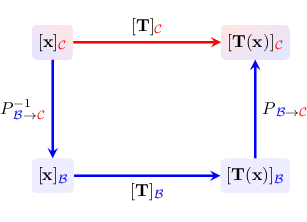
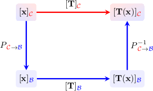
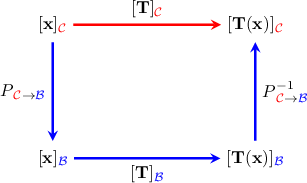
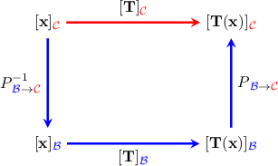
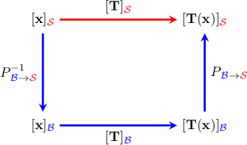

# Connections Between Matrix Representations of a Linear Transformation

Source: https://www.mathacademy.com/topics/2014?courseId=154
Topic ID: 2014

## Prerequisites

- [Multiplying Matrices](../../../high-school/integrated-math-honors/lessons/integrated-math-iii-honors/1196-multiplying-matrices.md)
- [The Change-of-Coordinates Matrix](./1928-the-change-of-coordinates-matrix.md)
- [The Matrix of a Linear Transformation Relative to a Basis](./1961-the-matrix-of-a-linear-transformation-relative-to-a-basis.md)

## Lesson

### Introduction

Recall that the matrices $[\mathbf{T}]_{\color{blue}\mathcal{B}}$ and $[\mathbf{T}]_{\color{red}\mathcal{C}}$ of a linear transformation $\mathbf{T}: V \to V$ relative to two bases $\color{blue}\mathcal{B}$ and $\color{red}\mathcal{C}$ of a vector space $V$ are different.

If we are given the matrix $[\mathbf{T}]_{\color{blue}\mathcal{B}},$ how do we find the matrix $[\mathbf{T}]_{\color{red}\mathcal{C}}?$ To find $[\mathbf{T}]_{\color{red}\mathcal{C}},$ we use the change-of-coordinates matrix $P_{\small {\color{blue}\mathcal{B}} \to {\color{red}\mathcal{C}}}$ from $\color{blue}\mathcal{B}$ to ${\color{red}\mathcal{C}}.$

The diagram below is a commutative diagram that shows how a change of basis works at each step.

Here, moving along an arrow means pre-multiplying by the corresponding matrix. So algebraically, we can write this as

$$

[\mathbf{T}]_{\color{red}\mathcal{C}} = P_{\small{\color{blue}\mathcal{B}}\to{\color{red}\mathcal{C}}} \cdot [\mathbf{T}]_{\color{blue}\mathcal{B}} \cdot P_{\small{\color{blue}\mathcal{B}}\to{\color{red}\mathcal{C}}}^{-1}.

$$

For instance, if $[\begin{aligned}1 & −2 \\ −1 & 1\end{aligned}]$ and $[\begin{aligned}−1 & −3 \\ 1 & 2\end{aligned}]$, we use this formula to obtain

$$

\begin{aligned}[𝐓]_{C} & =𝑃_{B→C}⋅[𝐓]_{B}⋅𝑃_{−1B→C} \\ & =[\begin{matrix}−1 & −3 \\ 1 & 2\end{matrix}][\begin{matrix}1 & −2 \\ −1 & 1\end{matrix}][\begin{matrix}−1 & −3 \\ 1 & 2\end{matrix}]^{−1} \\ & =[\begin{matrix}−1 & −3 \\ 1 & 2\end{matrix}][\begin{matrix}1 & −2 \\ −1 & 1\end{matrix}][\begin{matrix}2 & 3 \\ −1 & −1\end{matrix}] \\ & =[\begin{matrix}2 & −1 \\ −1 & 0\end{matrix}][\begin{matrix}2 & 3 \\ −1 & −1\end{matrix}] \\ & =[\begin{matrix}5 & 7 \\ −2 & −3\end{matrix}].\end{aligned}

$$

Solving the formula for $[\mathbf{T}]_{\color{blue}\mathcal{B}},$ we obtain the alternative formulation

$$

[\mathbf{T}]_{\color{blue}\mathcal{B}} = P_{\small{\color{blue}\mathcal{B}}\to{\color{red}\mathcal{C}}}^{-1} \cdot [\mathbf{T}]_{\color{red}\mathcal{C}} \cdot P_{\small{\color{blue}\mathcal{B}}\to{\color{red}\mathcal{C}}}.

$$

**Note:** Alternatively, if we know the change-of-coordinates matrix $P_{\small {\color{red}\mathcal{C}} \to {\color{blue}\mathcal{B}}}$ from $\color{red}\mathcal{C}$ to $\color{blue}\mathcal{B},$ we can construct a similar diagram:

From this, we can derive the equation

$$

[\mathbf{T}]_{\color{red}\mathcal{C}} = P_{\small{\color{red}\mathcal{C}}\to{\color{blue}\mathcal{B}}}^{-1} \cdot [\mathbf{T}]_{\color{blue}\mathcal{B}} \cdot P_{\small{\color{red}\mathcal{C}}\to{\color{blue}\mathcal{B}}}.

$$

Solving this equation for $[\mathbf{T}]_{\color{blue}\mathcal{B}},$ we obtain the alternative formulation

$$

[\mathbf{T}]_{\color{blue}\mathcal{B}} = P_{\small{\color{red}\mathcal{C}}\to{\color{blue}\mathcal{B}}} \cdot [\mathbf{T}]_{\color{red}\mathcal{C}} \cdot P_{\small{\color{red}\mathcal{C}}\to{\color{blue}\mathcal{B}}}^{-1}.

$$

### Example: Identifying Connections Between Matrices of a Linear Transformation Relative to Different Bases

#### Question

Let $[\mathbf{T}]_{\mathcal{B}}$ and $[\mathbf{T}]_{\mathcal{C}}$ be the matrices of a linear transformation $\mathbf{T}$ relative to the bases $\mathcal{B}$ and $\mathcal{C},$ respectively. If $P_{\small \mathcal{C} \to \mathcal{B}}$ is the change-of-coordinates matrix from basis $\mathcal{C}$ to basis $\mathcal{B},$ which of the following statements are true?

1. $[\mathbf{T}]_{\mathcal{B}} = P_{\small \mathcal{C} \to \mathcal{B}} \cdot [\mathbf{T}]_{\mathcal{C}}\cdot P_{\small \mathcal{C} \to \mathcal{B}}^{-1}$

2. $[\mathbf{T}]_{\mathcal{C}} = P_{\small \mathcal{C} \to \mathcal{B}}^{-1} \cdot [\mathbf{T}]_{\mathcal{B}} \cdot P_{\small \mathcal{C} \to \mathcal{B}}$

3. $[\mathbf{T}]_{\mathcal{C}} = P_{\small \mathcal{C} \to \mathcal{B}} \cdot [\mathbf{T}]_{\mathcal{B}} \cdot P_{\small \mathcal{B} \to \mathcal{C}}$

#### Explanation

The connection between the matrices of our linear transformation $\mathbf{T}$ relative to the bases $\mathcal{B}$ and $\mathcal{C}$ is given by the following diagram:

Here, moving along an arrow means pre-multiplying by the corresponding matrix. Algebraically, we can write this as

$$

[\mathbf{T}]_{\mathcal{C}} = P_{\small \mathcal{C} \to \mathcal{B}}^{-1} \cdot [\mathbf{T}]_{\mathcal{B}} \cdot P_{\small \mathcal{C} \to \mathcal{B}},

$$

where $P_{\small \mathcal{C} \to \mathcal{B}}$ is the change-of-coordinates matrix from $\mathcal{C}$ to $\mathcal{B}.$

Solving this equation for $[\mathbf{T}]_{\mathcal{B}},$ we obtain the alternative formulation

$$

[\mathbf{T}]_{\mathcal{B}} = P_{\small \mathcal{C} \to \mathcal{B}} \cdot [\mathbf{T}]_{\mathcal{C}} \cdot P_{\small \mathcal{C} \to \mathcal{B}}^{-1}.

$$

Therefore, the correct answer is "I and II only."

### Example: Finding the Matrix of a Linear Transformation Relative to a Basis Using a Change-of-Coordinates Matrix

#### Question

$$

[\begin{aligned}2 & −3 \\ 5 & 4\end{aligned}]

$$

Consider the matrix $[\mathbf{T}]_{\mathcal{B}}$ of a linear transformation $\mathbf{T}$ with respect to the basis $\mathcal{B}$ and the change-of-coordinates matrix $P_{\small \mathcal{B} \to \mathcal{C}}$ shown above. Find the matrix of $\mathbf{T}$ relative to the basis $\mathcal{C}.$

#### Explanation

The connection between the matrices of our linear transformation $\mathbf{T}$ relative to the bases $\mathcal{B}$ and $\mathcal{C}$ is given by the following diagram:

Here, moving along an arrow means pre-multiplying by the corresponding matrix. Algebraically, we can write this as

$$

[\mathbf{T}]_{\mathcal{C}} = P_{\small{\mathcal{B}}\to{\mathcal{C}}} \cdot [\mathbf{T}]_{\mathcal{B}} \cdot P_{\small{\mathcal{B}}\to{\mathcal{C}}}^{-1}\,,

$$

where $P_{\small{\mathcal{B}}\to{\mathcal{C}}}$ is the change-of-coordinates matrix from $\mathcal{B}$ to $\mathcal{C}.$

Our goal is to compute $[\mathbf{T}]_{\mathcal{C}}.$ First, we compute the inverse of $P_{\small{\mathcal{B}}\to{\mathcal{C}}} \mathbin{:}$

$$

\begin{aligned}𝑃_{−1B→C} & =[\begin{matrix}1 & −1 \\ 0 & 1\end{matrix}]^{−1} \\ & =\frac{1}{1⋅1−0⋅(−1)}[\begin{matrix}1 & 1 \\ 0 & 1\end{matrix}] \\ & =[\begin{matrix}1 & 1 \\ 0 & 1\end{matrix}]\end{aligned}

$$

Now, we can compute the matrix of $\mathbf{T}$ relative to the basis $\mathcal{C} \mathbin{:}$

$$

\begin{aligned}[𝐓]_{C} & =𝑃_{B→C}⋅[𝐓]_{B}⋅𝑃_{−1B→C} \\ & =[\begin{matrix}1 & −1 \\ 0 & 1\end{matrix}][\begin{matrix}2 & −3 \\ 5 & 4\end{matrix}][\begin{matrix}1 & 1 \\ 0 & 1\end{matrix}] \\ & =[\begin{matrix}−3 & −7 \\ 5 & 4\end{matrix}][\begin{matrix}1 & 1 \\ 0 & 1\end{matrix}] \\ & =[\begin{matrix}−3 & −10 \\ 5 & 9\end{matrix}]\end{aligned}

$$

### Example: Finding the Matrix of a Linear Transformation Relative to the Standard Basis

#### Question

$$

[\begin{aligned}3 \\ −2\end{aligned}]

$$

Consider the basis $\mathcal{B}$ of $\mathbb{R}^2$ and the matrix $[\mathbf{T}]_{\mathcal{B}}$ of a linear transformation $\mathbf{T}$ with respect to this basis. Find the matrix of $\mathbf{T}$ relative to the standard basis $\mathcal{S}.$

#### Explanation

The connection between the matrices of our linear transformation $\mathbf{T}$ relative to the basis $\mathcal{B}$ and standard basis $\mathcal{S}$ is given by the following diagram:

Here, moving along an arrow means pre-multiplying by the corresponding matrix. Algebraically, we can write this as

$$

[\mathbf{T}]_{\mathcal{S}} = P_{\small{\mathcal{B}}\to{\mathcal{S}}} \cdot [\mathbf{T}]_{\mathcal{B}} \cdot P_{\small{\mathcal{B}}\to{\mathcal{S}}}^{-1},

$$

and the change-of-coordinates matrix from $\mathcal{B}$ to $\mathcal{S}$ is

$$

[\begin{aligned}3 & −7 \\ −2 & 5\end{aligned}]

$$

First, we compute the inverse of $P_{\small{\mathcal{B}}\to{\mathcal{S}}} \mathbin{:}$

$$

\begin{aligned}𝑃_{−1B→S} & =[\begin{matrix}3 & −7 \\ −2 & 5\end{matrix}]^{−1} \\ & =\frac{1}{5⋅3−(−7)⋅(−2)}[\begin{matrix}5 & 7 \\ 2 & 3\end{matrix}] \\ & =[\begin{matrix}5 & 7 \\ 2 & 3\end{matrix}].\end{aligned}

$$

Now, we can compute the matrix of $\mathbf{T}$ relative to the standard basis $\mathcal{S} \mathbin{:}$

$$

\begin{aligned}[𝐓]_{S} & =𝑃_{B→S}⋅[𝐓]_{B}⋅𝑃_{−1B→S} \\ & =[\begin{matrix}3 & −7 \\ −2 & 5\end{matrix}][\begin{matrix}1 & 2 \\ 1 & −1\end{matrix}][\begin{matrix}5 & 7 \\ 2 & 3\end{matrix}] \\ & =[\begin{matrix}−4 & 13 \\ 3 & −9\end{matrix}][\begin{matrix}5 & 7 \\ 2 & 3\end{matrix}] \\ & =[\begin{matrix}6 & 11 \\ −3 & −6\end{matrix}]\end{aligned}

$$

### The Expanded Form of the Change of Basis

Consider the bases $\color{blue}\mathcal{B}=\{\mathbf{b}_1, \, \ldots, \, \mathbf{b}_n \}$ and $\color{red}\mathcal{C}=\{\mathbf{c}_1, \, \ldots, \, \mathbf{c}_n \}$ of a vector space $V,$ and the matrix $[\mathbf{T}]_{\color{blue}\mathcal{B}}$ of a linear transformation $\mathbf{T}$ with respect to the basis $\color{blue}\mathcal{B}.$ Then the matrix of $\mathbf{T}$ relative to the basis ${\color{red}\mathcal{C}}$ is given by

$$

[\mathbf{T}]_{\color{red}\mathcal{C}} =P_{\small {\color{blue}\mathcal{B}} \to {\color{red}\mathcal{C}}} \cdot [\mathbf{T}]_{\color{blue}\mathcal{B}} \cdot P_{\small {\color{blue}\mathcal{B}} \to {\color{red}\mathcal{C}}}^{-1},

$$

where $P_{\small {\color{blue}\mathcal{B}} \to {\color{red}\mathcal{C}}}$ is the change of basis matrix from ${\color{blue}\mathcal{B}}$ to ${\color{red}\mathcal{C}}.$

When written in expanded form, this formula becomes:

$$

\begin{aligned}| & & | \\ \,[𝐓(\,𝐜_{1}\,)]_{C} & \,\,\,\,⋯\,\,\,\, & [𝐓(\,𝐜_{𝑛}\,)]_{C}\, \\ | & & |\end{aligned}

$$

### Example: Finding the Matrix of a Linear Transformation Relative to a Given Basis

#### Question

$$

[\begin{aligned}1 \\ −1\end{aligned}]

$$

Consider the bases $\mathcal{B}$ and $\mathcal{C}$ of $\mathbb{R}^2,$ and the matrix $[\mathbf{T}]_{\mathcal{B}}$ of a linear transformation $\mathbf{T}$ with respect to the basis $\mathcal{B}$, shown above. Find the matrix of $\mathbf{T}$ relative to the basis $\mathcal{C}.$

#### Explanation

The connection between the matrices of our linear transformation $\mathbf{T}$ relative to the bases $\mathcal{B}$ and $\mathcal{C}$ is given by the following diagram:

Here, moving along an arrow means pre-multiplying by the corresponding matrix. Algebraically, we can write this as

$$

[\mathbf{T}]_{\mathcal{C}} = P_{\small{\mathcal{B}}\to{\mathcal{C}}} \cdot [\mathbf{T}]_{\mathcal{B}} \cdot P_{\small{\mathcal{B}}\to{\mathcal{C}}}^{-1},

$$

where $P_{\small{\mathcal{B}}\to{\mathcal{C}}}$ is the change-of-coordinates matrix from $\mathcal{B}$ to $\mathcal{C}.$

First, let's denote the vectors of $\mathcal{B}$ and $\mathcal{C}$ as $\{\mathbf{b}_1,\mathbf{b}_2 \}$ and $\{\mathbf{c}_1,\mathbf{c}_2 \}$, respectively.

The change-of-coordinates matrix from $\mathcal{B}$ to $\mathcal{C}$ is a matrix whose columns are the coordinates of vectors from $\mathcal{B}$ relative to the basis $\mathcal{C}.$

Hence, we need to find the coordinates of $\mathbf{b}_1$ and $\mathbf{b}_2$ relative to the basis $\mathcal{C}.$ To do this, we consider the matrix

$$

\begin{aligned}| & | & | & | \\ 𝐜_{1} & 𝐜_{2} & 𝐛_{1} & 𝐛_{2} \\ | & | & | & |\end{aligned}

$$

We reduce $M$ using Gaussian elimination until we get the identity matrix on the left. By doing this, we obtain the required change-of-coordinates matrix on the right.

$$

\begin{aligned}𝑀 & =[\begin{matrix}1 & 1 & 1 & 0 \\ −1 & 1 & −1 & 2\end{matrix}] & 𝑅_{2} & :=𝑅_{2}+𝑅_{1} \\ & ∼[\begin{matrix}1 & 1 & 1 & 0 \\ 0 & 2 & 0 & 2\end{matrix}] & 𝑅_{2} & :=\frac{1}{2}𝑅_{2} \\ & ∼[\begin{matrix}1 & 1 & 1 & 0 \\ 0 & 1 & 0 & 1\end{matrix}] & 𝑅_{1} & :=𝑅_{1}+(−1)𝑅_{2} \\ & ∼[\begin{matrix}1 & 0 & 1 & −1 \\ 0 & 1 & 0 & 1\end{matrix}] & & \end{aligned}

$$

Hence,

$$

[\begin{aligned}1 & −1 \\ 0 & 1\end{aligned}]

$$

Now, we compute the inverse of $P_{\small{\mathcal{B}}\to{\mathcal{C}}} \mathbin{:}$

$$

\begin{aligned}𝑃_{−1B→C} & =[\begin{matrix}1 & −1 \\ 0 & 1\end{matrix}]^{−1} \\ & =\frac{1}{1⋅1−0⋅(−1)}[\begin{matrix}1 & 1 \\ 0 & 1\end{matrix}] \\ & =[\begin{matrix}1 & 1 \\ 0 & 1\end{matrix}]\end{aligned}

$$

Finally, we can compute the matrix of $\mathbf{T}$ relative to the basis $\mathcal{C} \mathbin{:}$

$$

\begin{aligned}[𝐓]_{C} & =𝑃_{B→C}⋅[𝐓]_{B}⋅𝑃_{−1B→C} \\ & =[\begin{matrix}1 & −1 \\ 0 & 1\end{matrix}][\begin{matrix}4 & −3 \\ 2 & 6\end{matrix}][\begin{matrix}1 & 1 \\ 0 & 1\end{matrix}] \\ & =[\begin{matrix}2 & −9 \\ 2 & 6\end{matrix}][\begin{matrix}1 & 1 \\ 0 & 1\end{matrix}] \\ & =[\begin{matrix}2 & −7 \\ 2 & 8\end{matrix}]\end{aligned}

$$
