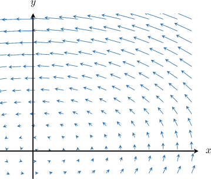
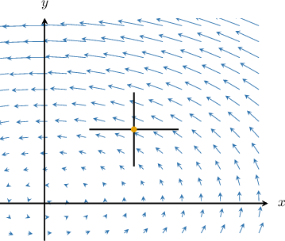
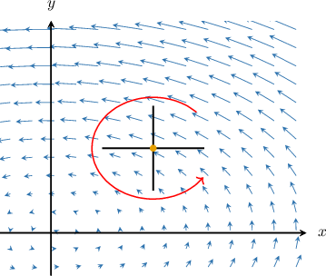
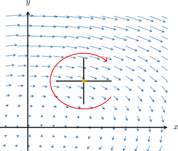
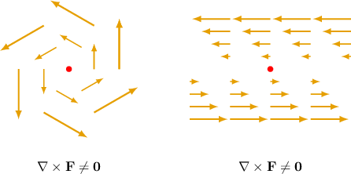
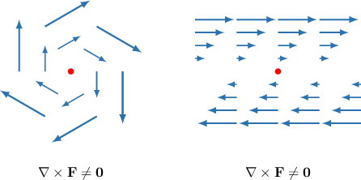
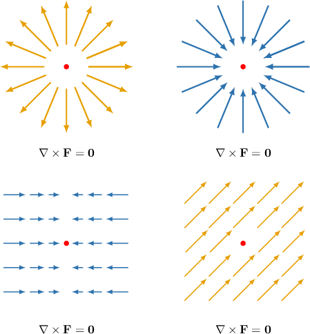
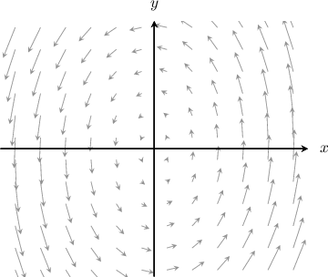
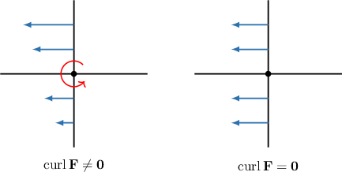

# The Curl of a Vector Field

Source: https://www.mathacademy.com/topics/2132?courseId=154
Topic ID: 2132

## Prerequisites

- [Calculating the Cross Product Using Determinants](../../../high-school/integrated-math-honors/lessons/integrated-math-iii-honors/245-calculating-the-cross-product-using-determinants.md)
- [Partial Differentiability of Multivariable Functions](./1932-partial-differentiability-of-multivariable-functions.md)
- [Visualizing Vector Fields](./3344-visualizing-vector-fields.md)

## Lesson

### Introduction

Suppose that $\mathbf F$ is a vector field on $\mathbb R^3,$ expressed in terms of its component functions as

$$

\mathbf F(x,y,z) = P(x,y,z)\,\mathbf i + Q(x,y,z)\,\mathbf j + R(x,y,z)\,\mathbf k.

$$

If the first partial derivatives of $P, Q,$ and $R$ all exist, then the **curl** of $\mathbf F,$ denoted $\textrm{curl}\,\mathbf F,$ is a vector field on $\mathbb R^3$ given by

$$

\textrm{curl}\,\mathbf F = \left(\dfrac{\partial R}{\partial y} - \dfrac{\partial Q}{\partial z} \right)\,\mathbf i + \left(\dfrac{\partial P}{\partial z} - \dfrac{\partial R}{\partial x}\right)\,\mathbf j + \left(\dfrac{\partial Q }{\partial x} - \dfrac{\partial P }{\partial y}\right)\,\mathbf k.

$$

The formula above is pretty tough to remember. Luckily, there is an easier way. If we define the differential operator $\nabla$ (a.k.a. the "del" operator) as

$$

\nabla = \mathbf i\,\dfrac{\partial }{\partial x} + \mathbf j\,\dfrac{\partial }{\partial y} + \mathbf k\,\dfrac{\partial }{\partial z}

$$

then the curl of $\mathbf F$ is given by the cross product

$$

\textrm{curl}\,\mathbf F = \nabla \times\mathbf F.

$$

Expressing the quantity on the right-hand side as a determinant, we have

$$

\begin{aligned}𝐢 & 𝐣 & 𝐤 \\ \frac{𝜕}{𝜕𝑥} & \frac{𝜕}{𝜕𝑦} & \frac{𝜕}{𝜕𝑧} \\ 𝑃 & 𝑄 & 𝑅\end{aligned}

$$

For example, suppose that the vector field $\mathbf F$ is given by

$$

\mathbf{F}(x,y,z)=xz\,\mathbf{i}+ xy\,\mathbf{j}+yz\,\mathbf{k}.

$$

Then we can calculate $\textrm{curl}\,\mathbf{F}$ using the determinant formula as follows:

$$

\begin{aligned}curl\,𝐅 & =\begin{aligned}𝐢 & 𝐣 & 𝐤 \\ \frac{𝜕}{𝜕𝑥} & \frac{𝜕}{𝜕𝑦} & \frac{𝜕}{𝜕𝑧} \\ 𝑥𝑧 & 𝑥𝑦 & 𝑦𝑧\end{aligned} \\ & =[\frac{𝜕}{𝜕𝑦}(𝑦𝑧)−\frac{𝜕}{𝜕𝑧}(𝑥𝑦)]𝐢−[\frac{𝜕}{𝜕𝑥}(𝑦𝑧)−\frac{𝜕}{𝜕𝑧}(𝑥𝑧)]𝐣+[\frac{𝜕}{𝜕𝑥}(𝑥𝑦)−\frac{𝜕}{𝜕𝑦}(𝑥𝑧)]𝐤 \\ & =(𝑧−0)\,𝐢−(0−𝑥)\,𝐣+(𝑦−0)\,𝐤 \\ & =𝑧\,𝐢+𝑥\,𝐣+𝑦\,𝐤\end{aligned}

$$

### Some Notes About the Curl of a Vector Field

We can only compute the curl of a *vector* field, and a vector field's curl is also a vector field. So if $\mathbf G = \textrm{curl}\,\mathbf F,$ then we have the following map:

$$

\underbrace{\,\,\,\mathbf F(x,y,z)\,\,\,}_{\textrm{vector field}} \mapsto\underbrace{\,\,\,\mathbf G(x,y,z)\,\,\,}_{\textrm{vector field}}

$$

In contrast, if $f(x,y, z)$ is a scalar field, then the statement $\textrm{curl}\, f$ has no meaning.

The curl of a vector field at a point $P$ gives us helpful information about the rotational behavior of the vector field at $P.$ We'll describe this in more detail shortly.

### Example: Calculating the Curl of a Vector Field

#### Question

Consider the vector field $\mathbf{F} = y\,\mathbf{i} + x^2\,\mathbf{j} - 2z\,\mathbf{k}.$ Evaluate $\textrm{curl}\,\mathbf{F}$ at the point $\left(-1,0,2\right).$

#### Explanation

If $\mathbf{F}=P\,\mathbf{i}+Q\,\mathbf{j}+R\,\mathbf{k}$ is a vector field on $\mathbb{R}^3$ and the partial derivatives of the components of $\mathbf F$ all exist, then the curl of $\mathbf F$ is the vector field given by

$$

\begin{aligned}𝐢 & 𝐣 & 𝐤 \\ \frac{𝜕}{𝜕𝑥} & \frac{𝜕}{𝜕𝑦} & \frac{𝜕}{𝜕𝑧} \\ 𝑃 & 𝑄 & 𝑅\end{aligned}

$$

Therefore, we have

$$

\begin{aligned}curl\,𝐅 & =\begin{aligned}𝐢 & 𝐣 & 𝐤 \\ \frac{𝜕}{𝜕𝑥} & \frac{𝜕}{𝜕𝑦} & \frac{𝜕}{𝜕𝑧} \\ 𝑦 & 𝑥^{2} & −2𝑧\end{aligned} \\ & =[\frac{𝜕}{𝜕𝑦}(−2𝑧)−\frac{𝜕}{𝜕𝑧}(𝑥^{2})]𝐢−[\frac{𝜕}{𝜕𝑥}(−2𝑧)−\frac{𝜕}{𝜕𝑧}(𝑦)]𝐣+[\frac{𝜕}{𝜕𝑥}(𝑥^{2})−\frac{𝜕}{𝜕𝑦}(𝑦)]𝐤 \\ & =(0−0)𝐢−(0−0)𝐣+(2𝑥−1)𝐤 \\ & =(2𝑥−1)\,𝐤.\end{aligned}

$$

Finally, we evaluate $\textrm {curl}\, \mathbf{F}$ at the point $\left(-1,0,2\right),$ and obtain

$$

\begin{aligned}(curl\,𝐅)(−1,0,2) & =(2(−1)−1)\,𝐤=−3\,𝐤.\end{aligned}

$$

### The Curl of a Two-Dimensional Vector Field

Technically, we can only find the curl of a vector field on $\mathbb R^3.$ If $\mathbf F$ is a vector field on $\mathbb R^2,$ then (strictly speaking) $\textrm{curl}\, \mathbf F$ has no meaning.

However, it's sometimes helpful to avoid this issue by considering $\mathbf F$ as a vector field on $\mathbb R^3$ whose $\mathbf k$ component is zero everywhere.

Assuming that the $\mathbf k$ component of $\mathbf F$ is zero everywhere, the curl must point in the $z$-direction perpendicular to your screen. To see why, note that if we start from

$$

\mathbf F(x,y,z) = P(x,y,z)\,\mathbf i + Q(x,y,z)\,\mathbf j + R(x,y,z)\,\mathbf k,

$$

then set

$$

R(x,y,z) = 0, \qquad \dfrac{\partial P}{\partial z}= \dfrac{\partial Q}{\partial z} = 0

$$

and, finally, substitute the above into our curl formula, then we get

$$

\textrm{curl}\,\mathbf F = \left(\dfrac{\partial Q }{\partial x} - \dfrac{\partial P }{\partial y}\right)\,\mathbf k.

$$

Note that the quantity

$$

\dfrac{\partial Q }{\partial x} - \dfrac{\partial P }{\partial y}

$$

is called the **scalar curl** of $\mathbf F.$ The scalar curl is associated with two-dimensional vector fields only.

### Example: Calculating the Scalar Curl of a Vector Field

#### Question

Consider the vector field $\mathbf{F}(x,y) = e^{x+y} \, \mathbf{i} + 3xy \, \mathbf{j}.$ Evaluate the scalar curl of $\mathbf{F}$ at the point $(-1,1).$

#### Explanation

If $\mathbf{F} = P\,\mathbf{i} + Q\,\mathbf{j}$ is a vector field on $\mathbb{R}^2$ and the partial derivatives of the components of $\mathbf F$ all exist, then the ** curl of $\mathbf{F}$ is given by

$$

\begin{aligned}\frac{𝜕𝑄}{𝜕𝑥}−\frac{𝜕𝑃}{𝜕𝑦} & =\frac{𝜕}{𝜕𝑥}(3𝑥𝑦)−\frac{𝜕}{𝜕𝑦}(𝑒^{𝑥+𝑦}) \\ & =3𝑦−𝑒^{𝑥+𝑦}.\end{aligned}

$$

Finally, we evaluate the scalar curl at the point $(-1,1),$ and obtain

$$

\begin{aligned}(\frac{𝜕𝑄}{𝜕𝑥}−\frac{𝜕𝑃}{𝜕𝑦})_{(−1,1)} & =3(1)−𝑒^{−1+1} \\ & =3−𝑒^{0} \\ & =3−1 \\ & =2.\end{aligned}

$$

### Physical Interpretation of the Curl

We know how to compute the curl of a vector field. Our goal now is to develop an intuitive understanding of what the curl of a vector field measures.

Consider the vector field $\mathbf F(x,y,z)$ shown below. Assume that $\mathbf F$ is independent of $z.$

It's helpful to imagine that this vector field represents the velocity field of a stream of flowing water.

Now, we pick an arbitrary point in the $xy$-plane and place a paddlewheel at our point with the axis of rotation pointing in the $z$-direction (the direction of the curl).

The curl of the vector field at our point measures how much the paddlewheel rotates due to the action of the water. There are two possible cases, illustrated below.

- If the paddlewheel is forced to rotate due to the action of the water, then the vector field has curl. In other words, $\textrm{curl}\,\mathbf F \neq \mathbf 0.$

- If the paddlewheel does not rotate due to the action of the water, then $\textrm{curl}\,\mathbf F = \mathbf 0.$ In this case, we say that $\mathbf F$ is **irrotational**.

For the particular point we've chosen in our example, we can see that the action of the water will cause the paddleboard to rotate counterclockwise.

Since the water causes the paddleboard to rotate, we must have $\textrm{curl}\,\mathbf F \neq \mathbf 0.$

Finally, note that if $\textrm{curl}\,\mathbf F =\mathbf 0,$ then it does not point in any particular direction.

### The Right-Hand Rule

In general, when we compute the curl of a vector field at a point, the result is a vector. This vector gives us two pieces of information about the rotation of a paddleboard placed at that point:

- The magnitude of the curl vector indicates the speed of the rotation of the paddleboard.

- The direction of the curl vector gives us the *axis of rotation* on which the paddlewheel should be placed for maximum rotation.

The orientation of the curl vector is determined by the so-called **right-hand rule**. To understand this, let's return to our example:

Using our right hand, if we wrap our fingers in the direction of rotation (counterclockwise), our thumb will point *away* from the screen. Therefore, $\textrm{curl}\,\mathbf F$ also points away from the screen, in the direction of increasing $z.$

The situation is reversed when the rotation of the vector field is clockwise:

Using our right hand, if we wrap our fingers in the direction of rotation (clockwise), our thumb will point *into* the screen. Therefore, $\textrm{curl}\,\mathbf F$ also points into from the screen, in the direction of decreasing $z.$

### Examples of Vector Fields With Curl and Irrotational Vector Fields

The following two vector fields would both cause a paddleboard to rotate counterclockwise. Therefore, their curl is nonzero.

The following two vector fields would both cause a paddleboard to rotate clockwise. Therefore, their curl is nonzero.

The following vector fields are irrotational (i.e., they each have zero curl).

### Example: Interpreting the Curl of a Vector Field

#### Question

Consider the vector field $\mathbf F(x,y,z),$ shown above. Given that $\mathbf F(x,y,z)$ is independent of $z,$ which of the following statements are true?

1. $\textrm{curl}\,\mathbf F = \mathbf 0$

2. $\textrm{curl}\, \mathbf F \neq \mathbf 0$

3. $\mathbf F$ is irrotational

4. $\textrm{curl}\, \mathbf F$ points in the positive $z$-direction.

#### Explanation

Recall that $\textrm{curl}\,\mathbf F$ denotes the curl of the vector field $\mathbf F.$

To understand intuitively whether a vector field has curl at a point $P$, imagine that our vector field $\mathbf F$ represents the velocity field of a stream of flowing water. We place a paddlewheel at $P$ with the axis of rotation pointing in the $z$-direction, and we note whether the paddlewheel rotates or not.

- If the paddlewheel is forced to rotate due to the action of the water, then the vector field has curl, i.e., $\textrm{curl}\,\mathbf F \neq \mathbf 0.$

- If the paddlewheel does not rotate due to the action of the water, then the velocity field has zero curl, i.e., $\textrm{curl}\,\mathbf F = \mathbf 0.$

If $\textrm{curl}\,\mathbf F = \mathbf 0$ everywhere in $\mathbb R^3$, we say that $\mathbf F$ is irrotational.

With that in mind, let's check each statement:

- Statement I is false, whereas statement II is true. If a paddlewheel were placed at any point $P$ in the manner described above, it would rotate counterclockwise. Therefore, $\textrm{curl}\,\mathbf F \neq \mathbf 0.$

- Statements III is false. Since $\textrm{curl}\,\mathbf F \neq \mathbf 0,$ the vector field $\mathbf F$ is not irrotational.

- Statement IV is true. Using our right hand, if we wrap our fingers in the direction of rotation (counterclockwise), our thumb will point upward. Therefore, $\textrm{curl}\,\mathbf F$ points upward, in the direction of increasing $z.$

Therefore, the correct answer is "II and IV only."
